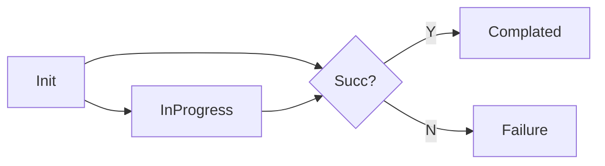
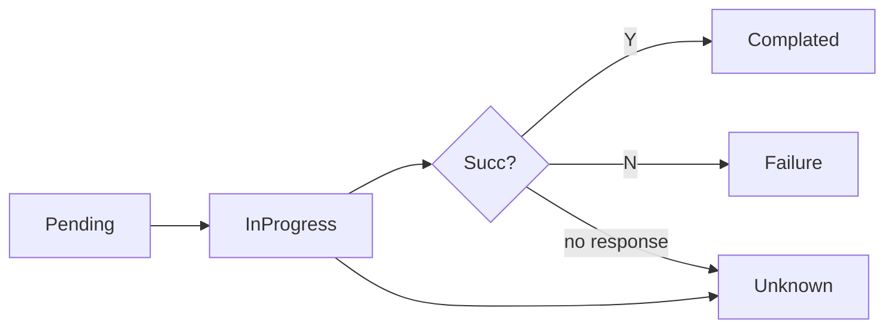
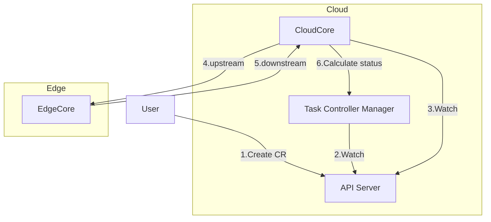
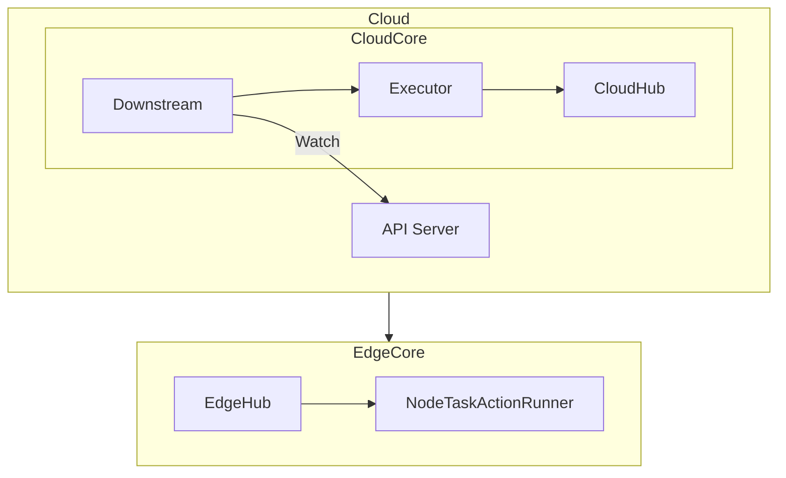
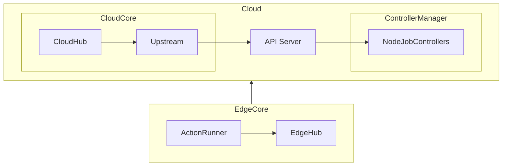

# Enhance The Status Structure Of Node Job
## Motivation

The current node job status consists of three elements: state, event, and action, which is too complicated. The node job status and node task status use the same type, these definitions make it look like the node job is waiting for all nodes to reach a stage before proceeding to the next stage.

In addition, there is another problem that some errors in the processing process will not be displayed to the status, especially errors in the previous process. This will result in no updates to the job status and it will appear as if it was not processed. The user has no way to know what happened except to look up the running logs of cloudcore and edgecore. This is not a very good user experience.

- More details refer to: [Issue #5999](https://github.com/kubeedge/kubeedge/issues/5999)
- Previous design refer to [Edge Node Tasks](edge-node-tasks-design.md)


### Goals

- Define a new node job status structure to make it easier for users and developers to understand.
- Track the error information of the whole process and write it to the status.
- Develop a more reasonable node task framework.


## Glossary

- Node Job: A CRD object, used to describe the task of a node.
- Node Task: Execute tasks in nodes according to the spec of node jobs and provide feedback on the execution results of tasks.


## Proposal
### Node Job Status

The node job status field is one of there values: Init, InProgress, Complated or Failure. 


```mermaid
graph LR
A[Init] --> B[InProgress]
A --> C{Succ?}
B --> C
C --> |Y| D[Complated]
C --> |N| E[Failure]
```

- When an error occurs during the initialization process, the node job status is set to "Failure" directly, and write the error message to the reason field.
- When a node starts executing a task, the node job status is set to "InProgress". 
- When the specified proportion of nodes fails, the node task is interrupted and the node job status is set to "Failure".
- When all node tasks are executed successfully or less than the specified proportion of nodes fails, the node job status is set to "Complated". 

When each node reports the execution results, the node job status is calculated and updated. 


### Node Task Status

The node task status consists of status, action, and reason. The status field is one of there values: Pending, InProgress, Successful, Failure and Unknown.

```mermaid
graph LR
A[Pending] --> B[InProgress]
B --> C{Succ?}
C --> |Y| D[Complated]
C --> |N| E[Failure]
C --> |no response| F[Unknown]
B --> F
```
- **Pending** - After the node job is initialized, all matching nodes status is set to "Pending".
- **InProgress** - When a edge node executes a task, the node task status is set to "InProgress".
- **Successful** - When a edge node executes all atcions successfully, the node task status is set to "Successful".
- **Failure** - When a edge node fails to execute the any action, the node task status is set to "Failure". And the error message will be written to the reason field.
- **Unknown** - When a edge node does not report the execution results for a long time, the node task status is set to "Unknown".

The action field is used to indicates the stage of node execution.
- The NodeUpgradeJob action flow is:
    ```mermaid
    graph LR
    A[Check] --> B{Need confirmation?}
    B --> |Y| C[Confirm]
    C --> D[WaitingConfirmation]
    D --> E[Backup]
    B --> |N| E
    E --> F[Upgrade]
    F -- Failure --> G[Rollback]
    ```
- The ImagePrePullJob action flow is:
    ```mermaid
    graph LR
    A[Check] --> B[Pull]
    ```

Each node has one or more image pull tasks, using the image name, status and reason fields to record the results of each image pull. Use metav1.ConditionStatus type to set whether the image pull is successful.


### Node Task Data Flow


```mermaid
flowchart TB
  A[User] --1.Create CR--> B[API Server]
  subgraph Cloud
    direction LR
    C[Task Controller Manager] --2.Watch--> B
    D[CloudCore] --3.Watch--> B
  end
  subgraph Edge
    D --4.upstream--> E[EdgeCore]
  end
  E --5.downstream--> D
  D --6.Calculate status--> C
```

CloudCore allows multiple instances to be deployed, which is likely to cause concurrent conflicts in node tasks updates. To avoid this, we need to put the matching node task initialization and node job status calculation in ControllerManager,because ControllerManager runs as a single instance.

1. User creates a CR for a node job.
1. ControllerManager watchs the created node job CRs and initializes the matching nodes to the state.
1. CloudCore watchs node job CRs and execute the initialized nodes.
1. CloudCore send the tasks to the edge nodes.
1. Edge nodes execute node tasks and report the results to CloudCore.
1. ControllerManager calculates the status of the node job.


## Design Details
### Node Job Definition

This enhancement will upgrade the CR version to v1alpha2, two versions (v1alpha1 and v1alpha2) will be defined in CRD, and storing v1alpah2, CRDs will retain some fields for backward compatibility in the v1alpha2 version.

The go file names are redefined as:
```text
v1alpha2
├── types_common.go
├── types_imageprepull.go
└── types_nodeupgrade.go
```


#### types_common.go

Defines the common structures for node tasks.

```golang
type JobState string

const (
    JobStateInit       JobState = "Init"
    JobStateInProgress JobState = "InProgress"
    JobStateComplated  JobState = "Complated"
    JobStateFailure    JobState = "Failure"
)

type NodeExecutionState string

const (
    NodeExecutionStateSuccessful NodeExecutionState = "Successful"
    NodeExecutionStateFailure    NodeExecutionState = "Failure"
)

// BasicNodeTaskStatus defines basic fields of node execution status.
// +kubebuilder:validation:Type=object
type BasicNodeTaskStatus struct {
    // NodeName is the name of edge node.
    NodeName string `json:"nodeName,omitempty"`
    // Status represents for the status of the NodeTask.
    Status metav1.ConditionStatus `json:"status,omitempty"`
    // Reason represents for the reason of the NodeTask.
    // +optional
    Reason string `json:"reason,omitempty"`
    // Time represents for the running time of the NodeTask.
    Time string `json:"time,omitempty"`
}
```


#### types_imageprepull.go

Defines the dedicated structures of ImagePrePullJob.

```golang
type ImagePrePullJobAction string

const (
    ImagePrePullJobActionInit  ImagePrePullJobAction = "Init"
    ImagePrePullJobActionCheck ImagePrePullJobAction = "Check"
    ImagePrePullJobActionPull  ImagePrePullJobAction = "Pull"
)

// ImagePrePullJobStatus stores the status of ImagePrePullJob.
// contains images prepull status on multiple edge nodes.
// +kubebuilder:validation:Type=object
type ImagePrePullJobStatus struct {
    // State represents for the state phase of the ImagePrePullJob.
    State JobState `json:"state,omitempty"`

    // Reason represents for the reason of the ImagePrePullJob.
    // +optional
    Reason string `json:"reason,omitempty"`

    // Time represents for the running time of the ImagePrePullJob.
    Time string `json:"time,omitempty"`

    // NodeStatus contains image prepull status for each edge node.
    NodeStatus []ImagePrePullNodeTaskStatus `json:"nodeStatus,omitempty"`
}

// ImagePrePullNodeTaskStatus stores image prepull status for each edge node.
// +kubebuilder:validation:Type=object
type ImagePrePullNodeTaskStatus struct {
    // Action represents for the action phase of the ImagePrePullJob
    Action ImagePrePullJobAction `json:"action,omitempty"`

    // ImageStatus represents the prepull status for each image
    ImageStatus []ImageStatus `json:"imageStatus,omitempty"`

    BasicNodeTaskStatus `json:",inline"`
}

// ImageStatus stores the prepull status for each image.
// +kubebuilder:validation:Type=object
type ImageStatus struct {
    // Image is the name of the image
    Image string `json:"image,omitempty"`

    // State represents for the state phase of this image pull on the edge node.
    State NodeExecutionState `json:"state,omitempty"`

    // Reason represents the fail reason if image pull failed
    // +optional
    Reason string `json:"reason,omitempty"`
}
```


#### types_nodeupgrade.go

Defines the dedicated structures of NodeUpgradeJob.

```golang
type NodeUpgradeJobAction string

const (
    NodeUpgradeJobActionInit                NodeUpgradeJobAction = "Init"
    NodeUpgradeJobActionCheck               NodeUpgradeJobAction = "Check"
    NodeUpgradeJobActionConfirm             NodeUpgradeJobAction = "Confirm"
    NodeUpgradeJobActionWaitingConfirmation NodeUpgradeJobAction = "WaitingConfirmation"
    NodeUpgradeJobActionBackUp              NodeUpgradeJobAction = "BackUp"
    NodeUpgradeJobActionUpgrade             NodeUpgradeJobAction = "Upgrade"
    NodeUpgradeJobActionRollBack            NodeUpgradeJobAction = "RollBack"
)

// NodeUpgradeJobStatus stores the status of NodeUpgradeJob.
// contains multiple edge nodes upgrade status.
// +kubebuilder:validation:Type=object
type NodeUpgradeJobStatus struct {
    // State represents for the state phase of the NodeUpgradeJob.
    State JobState `json:"state,omitempty"`

    // CurrentVersion represents for the current status of the EdgeCore.
    CurrentVersion string `json:"currentVersion,omitempty"`

    // HistoricVersion represents for the historic status of the EdgeCore.
    HistoricVersion string `json:"historicVersion,omitempty"`

    // Reason represents for the reason of the ImagePrePullJob.
    // +optional
    Reason string `json:"reason,omitempty"`

    // Time represents for the running time of the ImagePrePullJob.
    Time string `json:"time,omitempty"`

    // NodeStatus contains upgrade Status for each edge node.
    NodeStatus []NodeUpgradeJobNodeTaskStatus `json:"nodeStatus,omitempty"`
}

// NodeUpgradeJobNodeTaskStatus stores the status of Upgrade for each edge node.
// +kubebuilder:validation:Type=object
type NodeUpgradeJobNodeTaskStatus struct {
    // Action represents for the action phase of the NodeUpgradeJob
    Action NodeUpgradeJobAction `json:"action,omitempty"`

    BasicNodeTaskStatus `json:",inline"`
}
```


### Action Flow

Use a tree structure to represent the flow of actions. All node tasks need to define global variables of type Flow.

```golang
// Action defines the action of node task.
type Action struct {
    Name           string
    NextSuccessful *Action
    NextFailure    *Action
}

// Next returns the next action according to the success flag.
// success ? NextSuccessful : NextFailure.
func (a *Action) Next(success bool) *Action {}

// Final returns whether current action is the final action.
func (a *Action) Final() bool {}

// Flow defines the action flow of node task.
type Flow struct {
    First Action
}

// Find returns the found action by name.
// This method uses recursion to find successful or failure child action.
func (sf *Flow) Find(name string) *Action {}

var (
    FlowNodeUpgradeJob  = &Flow{...}
    FlowImagePrePullJob = &Flow{...}
    ...
)
```

### Controller Manager 

Add a new node job controller for the node job CR. The execution steps of Reconcile(..) function in the node job controller:
- If the node job CR is just created, initialize all matched nodes and set the job status to "Init".
- If the node job status is already the final status, it means that Reconcile(..) function is triggered by updating the final status, call return to interrupt the function.
- Calculates the node job status through the node task status on each node.
- Call kube-apiserver to update the node job status.

The node job controller processing cannot affect the v1alpha1 version, and a feature switch should be added for this. Add a feature-gates flag and convert it to kubernetes feature gate. ControllerManager has no configuration file, adding a flag is a relatively simple solution at this stage.
```golang
type ControllerManagerOptions struct {
    ...
    FeatureGates []string
}

func (o *ControllerManagerOptions) Flags() (fss cliflag.NamedFlagSets) {
    fs := fss.FlagSet("ControllerManager")
    ...
    fs.StringArrayVar(&o.FeatureGates, "feature-gates", o.FeatureGates, "Used to enable some features.")
}

func NewControllerManagerCommand(ctx context.Context) *cobra.Command {
    ...
    cmd := &cobra.Command{
        ...
        Run: func(cmd *cobra.Command, args []string) error {
            // Convert the feature gates flags to kubernetes feature gate.
            for _, fg := range opts.FeatureGates {
                if err := features.DefaultMutableFeatureGate.Set(fmt.Sprintf("%s=true", fg)); err != nil {
                    klog.Errorf("failed to set feature gate '%s', err: %v", fg, err)
                }
            }
        }
    }
}
```

Setup the node job controllers when the feature of node task v1alpha2 is enabled.
```golang
if features.DefaultFeatureGate.Enabled(features.NodeTaskV1alpha2) {
    // Setup node job controllers
}
```

Add args `--feature-gates=nodeTaskV1alpha2` in Deployment resource to support the feature of node task v1alpha2.
```yaml
spec:
  template:
    spec:
      containers:
      - name: controller-manager
        args:
        - --feature-gates=nodeTaskV1alpha2
        ...
```


---------
FIXME:
### Node Task Controller

The controller is not a traditional Kubernetes controller, it is used to process the resources upstream and downstream for cloud-edge collaboration. We create a new controller to watch the node tasks CRs of v1alpah2 version, which will not affect v1alpah1 version.

All node task types need to implement the Handler interface. The Manager framework calls these methods when processing upstream and downstream in the cloud/pkg/taskmanager/v1alpha2/controller/handlers package.

```golang
// Handler is the operation abstraction of the node task controller.
type Handler interface {
    // Name returns name of node task
    Name() string

    // Informer returns node task CR of informer for downstream.
    Informer() cache.SharedIndexInformer

    // UpdateNodeTaskStatus uses to update the status of node tasks when obtaining upstream message.
    UpdateNodeTaskStatus(ctx context.Context, msg model.Message) error

    // Handle notifications for events of node task CR, OnAdd, OnUpdate and OnDelete.
    cache.ResourceEventHandler
}
```
---------


#### Downstream


```mermaid
flowchart TB
  subgraph Cloud
    direction LR
    A[API Server]
    B[Downstream] --Watch--> A
    subgraph CloudCore
      B --> C[Executor]
      C --> D[CloudHub]
    end
  end
  subgraph EdgeCore
    E[EdgeHub] --> F[NodeTaskActionRunner]
  end
  Cloud --> EdgeCore
```

Downstream uses informer to watch resources changes of node job CRs. Define a common event handler for node job CRDs, and put the data to be processed through the channel. Downstream and NodeJobEventHandler implements the main logic of sending node tasks to edge nodes to execute tasks. 

```golang
// event_handler.go

type NodeJobEventHandler struct {
    downstream chan<- wrap.NodeJob
}

// OnAdd gets the watched node job addition event, and uses CanDownstreamStatus
// method to determine whether to send the node job wrap to downstream channel.
func (h *NodeJobEventHandler) OnAdd(obj any, isInInitialList bool) {
    ...
    if downstreamHandler.CanDownstreamStatus(obj, isInInitialList) {
        job, err := wrap.WithEventObj(obj)
        if err != nil {
            // handle error ...
        }
        h.downstream <- job
    }
}

// OnUpdate gets the watched node job update event, and uses CanDownstreamStatus
// method to determine whether to send the node job wrap to downstream channel.
func (h *NodeJobEventHandler) OnUpdate(_oldObj, newObj any) {
    ...
    if downstreamHandler.CanDownstreamStatus(obj, false) {
        job, err := wrap.WithEventObj(obj)
        if err != nil {
            // handle error ...
        }
        h.downstream <- job
    }
}

// OnDelete gets the watched node job deletion event, and uses InterruptExecutor
// method to interrupt the downstream executor.
func (h *NodeJobEventHandler) OnDelete(obj any) {
    downstreamHandler.InterruptExecutor(obj)
}
```

```golang
// downstream.go

// Start starts the downstream handlers.
func Start(ctx context.Context) {
    for _, handler := range downstreamHandlers {
        go watchJobDownstream(ctx, handler)
    }
}

// watchJobDownstream watches the downstream channel and executes the node tasks.
func watchJobDownstream(ctx context.Context, handler DownstreamHandler) {
    logger := handler.Logger()
    for {
        select {
        case <-ctx.Done():
            return
        case obj := <-handler.ExecutorChan():
            exec, loaded, err := executor.NewNodeTaskExecutor(ctx, obj)
            if err != nil {
                // handle error ...
            }
            if loaded {
                // handle error ...
            }
            sm, err := cloudhub.GetSessionManager()
            if err != nil {
                // handle error ...
            }
            go exec.Execute(ctx, nodes.GetManagedEdgeNodes(&sm.NodeSessions),
                handler.HandleNodeActionError)
        }
    }
}
```

The DownstreamHandler interface abstracts some of the processing steps. Node jobs need to implement the DownstreamHandler interface to complete the downstream capabilities.
```golang
type DownstreamHandler interface {
    // Logger returns the downstream handler logger.
    Logger() logr.Logger
    // CanDownstreamStatus returns the status of the node job and whether the node tasks can be executed.
    CanDownstreamStatus(obj any, isInInitialList bool) bool
    // ExecutorChan returns the channel of the node job. The channel data is generated by NodeJobEventHandler
    ExecutorChan() chan wrap.NodeJob
    // InterruptExecutor interrupts downstream executor if it is running.
    InterruptExecutor(obj any)
    // HandleNodeActionError updates the status of the node task.
    HandleNodeActionError(ctx context.Context, job wrap.NodeJob, errTask wrap.NodeJobTask, err error)
}
```

The wrap.NodeJob interface is used to shield the differences in node job definitions and abstract node jobs. The node job CR need to implements these interfaces.
```golang
type NodeJob interface {
    // Name returns the name of the node job.
    Name() string
    // ResourceType returns the resource type of the node job.
    ResourceType() string
    // Concurrency returns the concurrency in the node job spec.
    Concurrency() int
    // Spec returns the spec of the node job.
    Spec() any
    // Tasks returns the node tasks of the node job.
    Tasks() []NodeJobTask
    // GetObject returns the node job object.
    GetObject() any
}

type NodeJobTask interface {
    // NodeName returns the node name of the node task.
    NodeName() string
    // CanExecute returns whether the node job status can be executed.
    CanExecute() bool
    // Action returns the current action of the node task.
    Action() (string, error)
    // GetObject returns the node task object.
    GetObject() any
}
```

Executor is used to control the number of edge node execute task at same time. It uses a pool to control the number of nodes in the processing status. If cloudcore has multiple instances, each instance makes independent judgments (Actual Concurrency = spec.concurrency * CloudCore instances). Each node job CR needs to create a new Executor to use for sending messages to edge nodes when OnAdd or OnUpdate is trigger.
```golang
// nodeTaskExecutors is the map of node task executors.
// The running executor will be in the map until it is
// removed from the map after execution is completed.
var nodeTaskExecutors sync.Map

// NewNodeTaskExecutor create an executor and add to nodeTaskExecutors.
// If one already exists in nodeTaskExecutors, use it.
func NewNodeTaskExecutor(ctx context.Context, job wrap.NodeJob) (*NodeTaskExecutor, bool, error) {}

// GetExecutor returns the found executors from the nodeTaskExecutors,
// found by resource type and job name.
func GetExecutor(resourceType, jobName string) (*NodeTaskExecutor, error) {}

// RemoveExecutor removes the executor from the nodeTaskExecutors,
// found by resource type and job name.
func RemoveExecutor(resourceType, jobName string) {}

type NodeTaskExecutor struct {
    // job is the node job to be executed.
    job wrap.NodeJob
    // pool is the pool of concurrent resources.
    pool *Pool
    // interrupted indicates whether the executor is interrupted.
    interrupted atomic.Bool
    // messageLayer defines the message layer used to send edge nodes.
    messageLayer messagelayer.MessageLayer
    // logger is the logger for the executor.
    logger logr.Logger
}

// ErrorHandler defines the error handler function for the executor.
// This function is used to update the status of the node task when an error occurs in executor.
type ErrorHandler func(ctx context.Context, job wrap.NodeJob, errTask wrap.NodeJobTask, err error)

// Execute executes the node tasks. It uses a pool to control the number of concurrent executions of node tasks.
// The connectedNodes arg indicates the edge nodes that the current CloudCore is connected to. Only these nodes 
// will execute tasks.
func (executor *NodeTaskExecutor) Execute(ctx context.Context, connectedNodes []string, handleErr ErrorHandler) {
    defer RemoveExecutor(executor.job.ResourceType(), executor.job.Name())

    tasks := executor.job.Tasks()
    for i := range tasks {
        if executor.interrupted.Load() {
            return
        }
        task := tasks[i]
        if !slices.In(connectedNodes, task.NodeName()) {
            continue
        }
        if !task.CanExecute() {
            continue
        }
        executor.pool.Acquire()

        msgres := taskmsg.Resource{
            APIVersion:   operationsv1alpha2.SchemeGroupVersion.String(),
            ResourceType: executor.job.ResourceType(),
            JobName:      executor.job.Name(),
            NodeName:     task.NodeName(),
        }
        action, err := task.Action()
        if err != nil {
            handleErr(ctx, executor.job, task, fmt.Errorf("failed to get node task action, err: %v", err))
            return
        }
        msg := messagelayer.BuildNodeTaskRouter(msgres, action).
            FillBody(executor.job.Spec())
        if err := executor.messageLayer.Send(*msg); err != nil {
            handleErr(ctx, executor.job, task, fmt.Errorf("failed to send message to edge, err: %v", err))
            return
        }
    }
}

// ReleaseOne releases a concurrent resource
func (executor *NodeTaskExecutor) ReleaseOne() {
    executor.pool.Release()
}

// Interrupt interrupts the executor
func (executor *NodeTaskExecutor) Interrupt() {
    executor.interrupted.Store(true)
}
```

We define a general function to build the downstream node task message, and use a Resource structure to generate routing  resources, the message body is the spec of node job.

```golang
// BuildNodeTaskRouter builds the *model.Message of the node task
// and set the route and operation(action) in the message,
// which will be sent to the edge from the cloud.
func BuildNodeTaskRouter(r nodetaskmsg.Resource, opr string) *model.Message {
    return model.NewMessage("").
        SetRoute(modules.TaskManagerModuleName, modules.TaskManagerModuleGroup).
        SetResourceOperation(r.String(), opr)
}

// Resource defines the message resource of the node task.
type Resource struct {
    // APIVersion defines the group/version of the node task resource
    APIVersion string
    // ResourceType defines the node task resource of Kubernetes.(e.g., nodeupgradejob, imagepulljob, etc.)
    ResourceType string
    // TaskName defines the name of the node task resource.
    TaskName string
    // Node defines the name of the node.
    Node string
}

// Check checks the resource fields.
func (r Resource) Check() error {}

// String returns resource that satisfy the message resource format
// {apiversion}/{resource_type}/{task_name}/nodes/{node_name}.
// It is best to use Check method to verify fields first.
func (r Resource) String() string {}

// IsNodeTaskResource returns whether the resource is a node task resource.
func IsNodeTaskResource(r string) bool {}

// ParseResource parse the node task resource from the message resource.
// It is best to use IsResource function to judge first:
//
//  if IsNodeTaskResource(resstr) {
//      res := ParseResource(resstr)
//  }
func ParseResource(resource string) *Resource {}
```

In EdgeHub, we add a new message handler to route the node job spec of v1alpha2 version, find the ActionRunner corresponding to the node job and run the action flow.
```golang
type messageHandler struct{}

func NewMessageHandler() msghandler.Handler {
    actions.Init()
    return &messageHandler{}
}

func (h *messageHandler) Filter(msg *model.Message) bool {
    if msg.GetGroup() != modules.TaskManagerModuleName {
        return false
    }
    return nodetaskmsg.IsNodeJobResource(msg.GetResource())
}

// Process handles the node job message.
// These errors are returned due to code logic problems and will not affect business processes.
func (h *messageHandler) Process(msg *model.Message, _ clients.Adapter) error {
    msgres := nodetaskmsg.ParseResource(msg.GetResource())
    runner := actions.GetRunner(msgres.ResourceType)
    if runner == nil {
        return fmt.Errorf("invalid resource type %s", msgres.ResourceType)
    }
    data, err := msg.GetContentData()
    if err != nil {
        return fmt.Errorf("failed to get node job message content data: %v", err)
    }
    runner.RunAction(context.Background(), msgres.JobName, msgres.NodeName, msg.GetOperation(), data)
    return nil
}
```

The action runner runs actions according to the definition of action flow.
```golang
// runners is a global map variables,
// used to cache the implementation of the job action runner.
var runners = map[string]*ActionRunner{}

// Init registers the node job action runner.
func Init() {
    RegisterRunner(...)
}

// registerRunner registers the implementation of the job action runner.
func RegisterRunner(name string, runner *ActionRunner) {
    runners[name] = runner
}

// GetRunner returns the implementation of the job action runner.
func GetRunner(name string) *ActionRunner {
    return runners[name]
}

type ActionResponse interface {
    // Error returns an error if the task run fails, otherwise return nil
    Error() error
    // DoNext returns whether the action should continue.
    // If false, the action flow will be interrupted.
    DoNext() bool
}

// ActionFun defines the function type of the job action handler.
// The first return value defines whether the action should continue.
// In some scenarios, we want the flow to be paused and continue it
// when triggered elsewhere.
type ActionFun = func(ctx context.Context, specser SpecSerializer) ActionResponse

// baseActionRunner defines the abstruct of the job action runner.
// The implementation of ActionRunner must compose this structure.
type ActionRunner struct {
    // actions defines the function implementation of each action.
    Actions map[string]ActionFun
    // flow defines the action flow of node job.
    Flow *actionflow.Flow
    // ReportActionStatus uses to report status of node action. If the err is not nil,
    // the failure status needs to be reported.
    ReportActionStatus func(jobname, nodename, action string, resp ActionResponse)
    // GetSpecSerializer returns serializer for parse the spec data.
    GetSpecSerializer func(specData []byte) (SpecSerializer, error)
    // Logger define a logger in the specified format to print information.
    Logger logr.Logger
}

// RunAction runs the job action.
func (r *ActionRunner) RunAction(ctx context.Context, jobname, nodename, action string, specData []byte) {
    ser, err := r.GetSpecSerializer(specData)
    if err != nil {
        // handle error...
    }
    for act := r.Flow.Find(action); act != nil; {
        actionFn, err := r.mustGetAction(act.Name)
        if err != nil {
            // handle error...
        }
        resp := actionFn(ctx, ser)
        r.ReportActionStatus(jobname, nodename, act.Name, resp)
        if err := resp.Error(); err != nil {
            act = act.Next(false)
            continue
        }
        if !resp.DoNext() {
            break
        }
        if act.IsFinal() {
            break
        }
        act = act.Next(true)
    }
}
```


### FeatureGates of CloudCore

Cloud Core also uses featuregates to enable the v1alpha2 of node jobs. Since etcd can only store one CRD version, when v1alpha2 is enabled, the logic of v1alpha1 will no longer take effect.

Configuring feature gates via configuration files:
```yaml
featureGates:
  nodeTaskV1alpha2: true
```

Add logic in the task manager module:
```golang
if features.DefaultFeatureGate.Enabled(features.NodeTaskV1alpha2) {
    // Init and start v1alpha2 node job downstream and upstream
} else {
     // Init and start v1alpha1 node job downstream and upstream
}
```

### Upstream


```mermaid
flowchart BT
  subgraph EdgeCore
    direction LR
    A[ActionRunner] --> B[EdgeHub]
  end
  subgraph Cloud
    direction LR
    subgraph CloudCore
        C[CloudHub] --> D[Upstream]
    end
    D --> E[API Server]
    subgraph ControllerManager
        F[NodeJobControllers]
    end
    E --> F
  end
  EdgeCore --> Cloud
```

After the ActionRunner completes an action, whether it is successful or failure, it will report the result to the cloud.

The ReportActionStatus field of the ActionRunner is used to report the node status, the message body is UpstreamMessage.
```golang
// UpstreamMessage defines the upstream message content of the node job.
type UpstreamMessage struct {
    // Action defines the action of the node job.
    Action string `json:"action"`
    // Succ defines whether the action is successful.
    Succ bool `json:"succ"`
    // Reason defines error message.
    Reason string `json:"reason"`
    // Extend uses to stored serializable string. Some node actions may do multiple things,
    // this field can store the Extend infos for cloud parsing.
    Extend string `json:"extend"`
}
```

After the CloudCore receives the message, The upstream will unify the logic of processing node task status reporting and abstract the UpstreamHandler interface to handle differential operations. Node jobs need to implement the UpstreamHandler interface to complete the upstream capabilities.
```golang
type UpstreamHandler interface {
    // Logger returns the upstream handler logger.
    Logger() logr.Logger

    // ConvToNodeTask converts the upstream message to node task.
    ConvToNodeTask(nodename string, upmsg *taskmsg.UpstreamMessage) (any, error)

    // IsFinalAction returns true if the node task is the final action.
    IsFinalAction(nodetask any) (bool, error)

    // ReleaseExecutorConcurrent releases the executor concurrent when the node task is the final action.
    ReleaseExecutorConcurrent(res taskmsg.Resource) error

    // UpdateNodeActionStatus updates the status of node action when obtaining upstream message.
    // Parameters idx and nodetask are obtained through FindNodeTaskStatus(..)
    UpdateNodeActionStatus(jobname string, nodetask any) error
}

// Start starts the upstream handler.
func Start(ctx context.Context, statusChan <-chan model.Message) {
    go func() {
        for {
            select {
            case <-ctx.Done():
                return
            case msg, ok := <-statusChan:
                if !ok {
                    return
                }
                data, err := msg.GetContentData()
                if err != nil {
                    // handle error...
                }
                var upmsg taskmsg.UpstreamMessage
                if err := json.Unmarshal(data, &upmsg); err != nil {
                    // handle error...
                }
                res := taskmsg.ParseResource(msg.GetResource())
                handler, ok := upstreamHandlers[res.ResourceType]
                if !ok {
                    // handle error...
                }
                if err := updateNodeJobTaskStatus(res, upmsg, handler); err != nil {
                    // handle error...
                }
            }
        }
    }()
}

// updateNodeJobTaskStatus updates the status of node job task.
func updateNodeJobTaskStatus(res taskmsg.Resource,
    upmsg taskmsg.UpstreamMessage, handler UpstreamHandler,
) error {
    nodetask, err := handler.ConvToNodeTask(res.NodeName, &upmsg)
    if err != nil {
        // handle error...
    }
    final, err := handler.IsFinalAction(nodetask)
    if err != nil {
        // handle error...
    }
    if final {
        if err := handler.ReleaseExecutorConcurrent(res); err != nil {
            // handle error...
        }
    }
    if err := handler.UpdateNodeActionStatus(res.JobName, nodetask); err != nil {
        // handle error...
    }
    return nil
}
```

TODO: ... 串行更新状态


After the node task status change, ControllerManager calculates the node job status.
```golang
// CalculateStatusWithCounts calculates the node task status based on the statistics of
// the node atcion status.
func CalculateStatusWithCounts(total, proc, fail int64,
    failureTolerateSpec string,
) operationsv1alpha2.JobState {
    if total == 0 {
        klog.Error("node task status total is 0")
        return operationsv1alpha2.JobStateFailure
    }
    // As long as there are nodes being processed, the task status must be in-progress.
    if proc > 0 {
        return operationsv1alpha2.JobStateInProgress
    }
    // If failureTolerate is not specified, all node tasks must succeed.
    var failureTolerate float64 = 0
    if failureTolerateSpec != "" {
        parsed, err := strconv.ParseFloat(failureTolerateSpec, 64)
        if err != nil {
            klog.Errorf("failed to parse failureTolerate, use default value 1, err: %v", err)
        } else {
            failureTolerate = parsed
        }
    }
    // fail / total > failureTolerate
    if fail > 0 && decimal.NewFromInt(fail).
        Div(decimal.NewFromInt(total)).
        Round(2).
        Cmp(decimal.NewFromFloat(failureTolerate)) == 1 {
        return operationsv1alpha2.JobStateFailure
    }
    // succ == total || fail / total <= failureTolerate
    return operationsv1alpha2.JobStateComplated
}
```

## Drawbacks

TODO: ...
