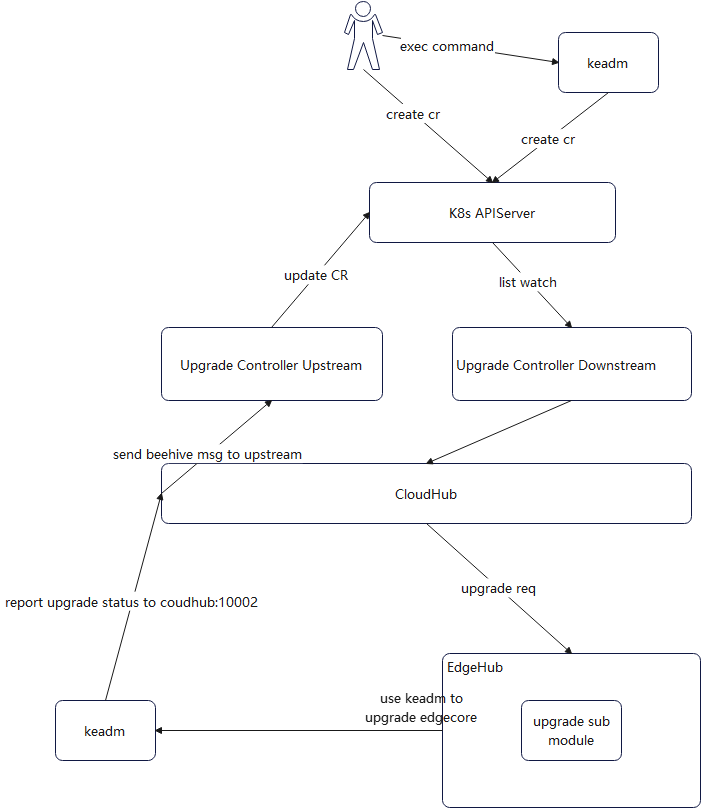

# Edge Node Upgrade

## Motivation

Edge node upgrade management is a key feature required for upgrading edge nodes from remote cloud side in edge computing.
This proposal addresses how can we upgrade edge nodes from the cloud, and synchronize the edge node upgrade result status between edge nodes and cloud.

### Goals

Edge node upgrade management must:
* provide APIs for upgrading edge nodes from the cloud.
* synchronize the edge node upgrade result between cloud and edge nodes.

## Proposal
We propose using Kubernetes [Custom Resource Definitions (CRDs)](https://kubernetes.io/docs/concepts/extend-kubernetes/api-extension/custom-resources/)
to describe Upgrade metadata/status and a controller to synchronize Upgrade between edge and cloud.

### Use Cases

* Describe upgrade properties.
  * Users can describe upgrade properties and access mechanisms to interact with / control the upgrade.
* Perform CRUD operations on upgrade from cloud.
  * Users can create, update and delete upgrade metadata from the cloud via the CRD APIs exposed by the Kubernetes API server.
* Report upgrade properties values.
  * Edge nodes can report upgrade result status.


## NodeUpgradeJob Controller Design
The NodeUpgradeJob controller starts two separate goroutines called  `upstream` controller and `downstream` controller.
These are not separate controllers as such but named here for clarity.
The job of the downstream controller is to synchronize the NodeUpgradeJob updates from the cloud to the edge node.
The job of the upstream controller is the reverse.


## Synchronizing NodeUpgradeJob

The below illustrations describe the flow of events that would occur when NodeUpgradeJob property values are updated from the cloud/edge.

Users create the NodeUpgradeJob CRs to trigger upgrade edge node jobs directly using `kubectl`, NodeUpgradeJob Controller watch the resource with List-Watch, and then send upgrade message to edge node. edgecore of edge node will use `keadm` to do the upgrade operation. keadm will report upgrade result to cloud. And then cloud will record upgrade result to NodeUpgradeJob status. Users can check whether upgrade is successful or not by looking into status field.

NodeUpgradeJob Controller Downstream will do:
- Use List-Watch mechanism to monitor NodeUpgradeJob CRD resouces, after receiving events from K8s APIServer, then store it in local cache using map.

- Check whether the upgrade job is completed(all or partial node upgrade state is completed).
  If so, we don't need to send upgrade message to edge node again. And only when the upgrade is not completed, we'll send upgrade message to edge node. This operation is to prevent cloudcore from repeating sending upgrade message to edge nodes, such as under circumstance when cloudcore restart.

- Use K8s informer to get node list according to NodeNames or LabelSelector specified in CR, and
  filter out nodes that don't meet upgrade requirements(1. edge node already on the desired upgrade version. 2. not edge node,
  without label `"node-role.kubernetes.io/edge": ""` 3. edge node is in Upgrading or NotReady state 4. remove duplicated nodes)

- For each compliant edge nodes, send upgrade beehive message to each edge node. Call k8s api to mark edge node unschedulable to avoid continuing to deploy applications on upgrading edge nodes. And start a Goroutine to process timeout if we don't receive edge node upgrade response, if not, will update NodeUpgradeJob status to timeout state. This operation is to deal with no responce circumstance.

CloudHub send upgrade request to EdgeHub of each edge node.

EdgeHub will do:
- Add an upgrade sub module to process upgrade message. This upgrade sub module will do some verifications to upgrade message: checks UpgradeID is null or not, edgecore is already on the version or not, etc.

- To improve adaptability, we will provide an upgrade provider interface. By default, we will use `KeadmUpgrade` to do upgrade operation. Users can set `UpgradeTool` field to choose other installers to finish upgrade jobs.

- KeadmUpgrade will download the keadm of the specified version. EdgeCore will pull `kubeedge/installation-package`
  image, and copy the keadm binary from container to host path. And then start a daemon progress to run `keadm upgrade` related command to do upgrade operation, but not run `keadm` command directly, this is based on the consideration that keadm will kill edgecore progress in upgrading.

Keadm will do:
- use `/etc/kubeedge/idempotency_record` file to district only one upgrade can be performed at a time.

- preprocess: keadm will do some preprocess work before starting upgrading edge node. Back up `edgecore.db edgecore.yaml edgecore` to backup path `/etc/kubeedge/backup/{From_Version}`,
  and pull `kubeedge/installation-package` image and copy the edgecore binary from container to host upgrade path:
  `/etc/kubeedge/upgrade/{To_Version}`

- process: stop the edgecore, and copy the new version edgecore to `/usr/local/bin` directory and start new edgecore.

- rollback: if upgrade failed, keadm will do some rollback operations to start the origin edgecore progress. 
  Stop the edgecore, rollback files, copy files of backup dir `/etc/kubeedge/backup/{From_Version}` to the origin path,
  and then start the origin edgecore.

- report upgrade result and failure reason(if failed) to CloudHub Http service regradless of the upgrade is successful or failed.

CloudHub will do:
- CloudHub Http service will add an interface `/nodeupgrade` to transform the upgrade response message to the NodeUpgradeJob Controller Upstream.

NodeUpgradeJob Controller Upstream will do:
- mark node schedulable, and patch upgrade status. And call k8s api to record upgrade in Node
  annotation like `"nodeupgradejob.operations.kubeedge.io/history": "v1.10.0->v1.11.0"` if the upgrade is successful, to help users check node upgrade history much more easilier.





## CRD Design Details

### CRD API Group and Version
The `NodeUpgradeJob` CRD will be cluster-scoped.
The tables below summarize the group, kind and API version details for the CRDs.

* NodeUpgradeJob

| Field                 | Description             |
|-----------------------|-------------------------|
|Group                  | operations.kubeedge.io  |
|APIVersion             | v1alpha1                |
|Kind                   | NodeUpgradeJob          |


### NodeUpgradeJob CRD
A `NodeUpgradeJob` describes the Upgrade properties exposed by the NodeUpgradeJob.
A NodeUpgradeJob is like a reusable template using which edge nodes can be upgraded to the specific version, easily operated from cloud side.

### NodeUpgradeJob Type Definition
```go
// NodeUpgradeJob is used to upgrade edge node from cloud side.
// +k8s:openapi-gen=true
// +kubebuilder:subresource:status
// +kubebuilder:resource:scope=Cluster
type NodeUpgradeJob struct {
	metav1.TypeMeta   `json:",inline"`
	metav1.ObjectMeta `json:"metadata,omitempty"`

	// Specification of the desired behavior of NodeUpgradeJob.
	// +optional
	Spec NodeUpgradeJobSpec `json:"spec,omitempty"`
	// Most recently observed status of the NodeUpgradeJob.
	// +optional
	Status NodeUpgradeJobStatus `json:"status,omitempty"`
}

// +k8s:deepcopy-gen:interfaces=k8s.io/apimachinery/pkg/runtime.Object

// NodeUpgradeJobList is a list of NodeUpgradeJob.
type NodeUpgradeJobList struct {
	// Standard type metadata.
	metav1.TypeMeta `json:",inline"`

	// Standard list metadata.
	metav1.ListMeta `json:"metadata,omitempty"`

	// List of NodeUpgradeJobs.
	Items []NodeUpgradeJob `json:"items"`
}

``// NodeUpgradeJobSpec is the specification of the desired behavior of the NodeUpgradeJob.
type NodeUpgradeJobSpec struct {
	// +Required: Version is the EdgeCore version to upgrade.
	Version string `json:"version,omitempty"`
	// UpgradeTool is a request to decide use which upgrade tool. If it is empty,
	// the upgrade job simply use default upgrade tool keadm to do upgrade operation.
	// +optional
	UpgradeTool string `json:"upgradeTool,omitempty"`
	// TimeoutSeconds limits the duration of the node upgrade job.
	// Default to 300.
	// If set to 0, we'll use the default value 300.
	// +optional
	TimeoutSeconds *uint32 `json:"timeoutSeconds,omitempty"`
	// NodeNames is a request to select some specific nodes. If it is non-empty,
	// the upgrade job simply select these edge nodes to do upgrade operation.
	// Please note that sets of NodeNames and LabelSelector are ORed.
	// Users must set one and can only set one.
	// +optional
	NodeNames []string `json:"nodeNames,omitempty"`
	// LabelSelector is a filter to select member clusters by labels.
	// It must match a node's labels for the NodeUpgradeJob to be operated on that node.
	// Please note that sets of NodeNames and LabelSelector are ORed.
	// Users must set one and can only set one.
	// +optional
	LabelSelector *metav1.LabelSelector `json:"labelSelector,omitempty"`
	// Image specifies a container image name, the image contains: keadm and edgecore.
	// keadm is used as upgradetool, to install the new version of edgecore.
	// The image name consists of registry hostname and repository name, but cannot includes the tag,
	// Version above will be used as the tag.
	// If the registry hostname is empty, docker.io will be used as default.
	// The default image name is: kubeedge/installation-package.
	// +optional
	Image string `json:"image,omitempty"`
}

// UpgradeResult describe the result status of upgrade operation on edge nodes.
// +kubebuilder:validation:Enum=upgrade_success;upgrade_failed_rollback_success;upgrade_failed_rollback_failed
type UpgradeResult string

// upgrade operation status
const (
	UpgradeSuccess               UpgradeResult = "upgrade_success"
	UpgradeFailedRollbackSuccess UpgradeResult = "upgrade_failed_rollback_success"
	UpgradeFailedRollbackFailed  UpgradeResult = "upgrade_failed_rollback_failed"
)

// UpgradeState describe the UpgradeState of upgrade operation on edge nodes.
// +kubebuilder:validation:Enum=upgrading;completed
type UpgradeState string

// Valid values of UpgradeState
const (
	InitialValue UpgradeState = ""
	Upgrading    UpgradeState = "upgrading"
	Completed    UpgradeState = "completed"
)

// NodeUpgradeJobStatus stores the status of NodeUpgradeJob.
// contains multiple edge nodes upgrade status.
// +kubebuilder:validation:Type=object
type NodeUpgradeJobStatus struct {
	// State represents for the state phase of the NodeUpgradeJob.
	// There are three possible state values: "", upgrading and completed.
	State UpgradeState `json:"state,omitempty"`
	// Status contains upgrade Status for each edge node.
	Status []UpgradeStatus `json:"status,omitempty"`
}

// UpgradeStatus stores the status of Upgrade for each edge node.
// +kubebuilder:validation:Type=object
type UpgradeStatus struct {
	// NodeName is the name of edge node.
	NodeName string `json:"nodeName,omitempty"`
	// State represents for the upgrade state phase of the edge node.
	// There are three possible state values: "", upgrading and completed.
	State UpgradeState `json:"state,omitempty"`
	// History is the last upgrade result of the edge node.
	History History `json:"history,omitempty"`
}

// History stores the information about upgrade history record.
// +kubebuilder:validation:Type=object
type History struct {
	// HistoryID is to uniquely identify an Upgrade Operation.
	HistoryID string `json:"historyID,omitempty"`
	// FromVersion is the version which the edge node is upgraded from.
	FromVersion string `json:"fromVersion,omitempty"`
	// ToVersion is the version which the edge node is upgraded to.
	ToVersion string `json:"toVersion,omitempty"`
	// Result represents the result of upgrade.
	Result UpgradeResult `json:"result,omitempty"`
	// Reason is the error reason of Upgrade failure.
	// If the upgrade is successful, this reason is an empty string.
	Reason string `json:"reason,omitempty"`
	// UpgradeTime is the time of this Upgrade.
	UpgradeTime string `json:"upgradeTime,omitempty"`
}
```

### NodeUpgradeJob sample
```yaml
apiVersion: operations.kubeedge.io/v1alpha1
kind: NodeUpgradeJob
metadata:
  name: upgrade-example
  labels:
    description: upgrade-label
spec:
  version: "v1.10.0"
  timeoutSeconds: 60
  labelSelector:
    matchLabels:
      "node-role.kubernetes.io/edge": ""
      node-role.kubernetes.io/agent: ""
```
Shown above is an example NodeUpgradeJob for upgrading edge node. It has the below properties:
- `version`: this property describes which version that we want to upgrade to.
- `nodeNames`: nodeNames is a request to select some specific nodes. If it is non-empty, the upgrade job simply select
  these edge nodes to do upgrade operation. Please note that sets of NodeNames and LabelSelector are ORed.
  Users must set one and can only set one.
- `labelSelector`: labelSelector is a filter to select member clusters by labels. It must match a node's labels for the
  NodeUpgradeJob to be operated on that node. Please note that sets of NodeNames and LabelSelector are ORed. 
  Users must set one and can only set one.
- `upgradeTool`: upgradeTool is a request to decide use which upgrade tool. If it is empty, the upgrade job simply use
  default upgrade tool `keadm` to do upgrade operation.
- `timeoutSeconds`: timeoutSeconds limits the duration of the node upgrade job.
  Default to 300. If users don't set it or set it to 0, we'll use the default value 300.
- `image`: Image specifies a container image name, the image contains: keadm and edgecore. keadm is used as upgradetool,
  to install the new version of edgecore. The image name consists of registry hostname and repository name,
  if it includes the tag or digest, the tag or digest will be overwritten by Version field above. 
  If the registry hostname is empty, docker.io will be used as default. The default image name is: `kubeedge/installation-package`.


  
### Validation
[Open API v3 Schema based validation](https://kubernetes.io/docs/tasks/access-kubernetes-api/custom-resources/custom-resource-definitions/#validation) can be used to guard against bad requests.
Invalid values for fields ( example string value for a boolean field etc) can be validated using this.
In some cases , we also need custom validations (e.g create an Upgrade instance which not specify nodes ) .
[Validation admission web hooks](https://kubernetes.io/docs/reference/access-authn-authz/admission-controllers/#validatingadmissionwebhook) can be used to implement such custom validation rules.

Here is a list of validations we need to support :

#### NodeUpgradeJob Validations
- Don't allow NodeUpgradeJob creation if any `Required` fields are missing ( like version etc.)
- nodeNames and labelSelector cannot be both empty. That means that we must specify at least one valid node. And users cannot set the two fields both either.
- Don't allow update CR spec fields once one NodeUpgradeJob CR is created.
- If the upgrade failed, users need to debug why it failed by themselves through K8s NodeUpgradeJob CR status fields. And maybe users
  also need to upgrade manually.
- NodeUpgradeJob status will only contain the last upgrade history record per node.
- We also use webhook to do some validations, for example, check whether version format is right.

