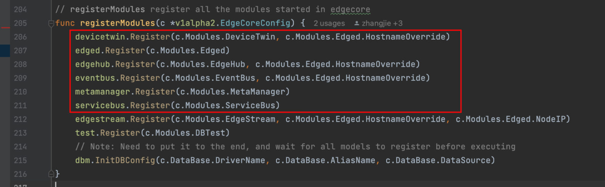
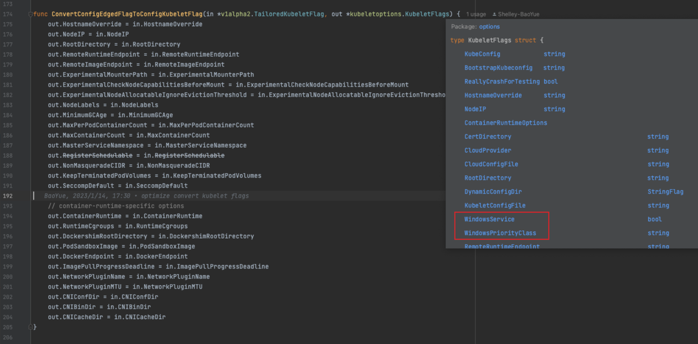
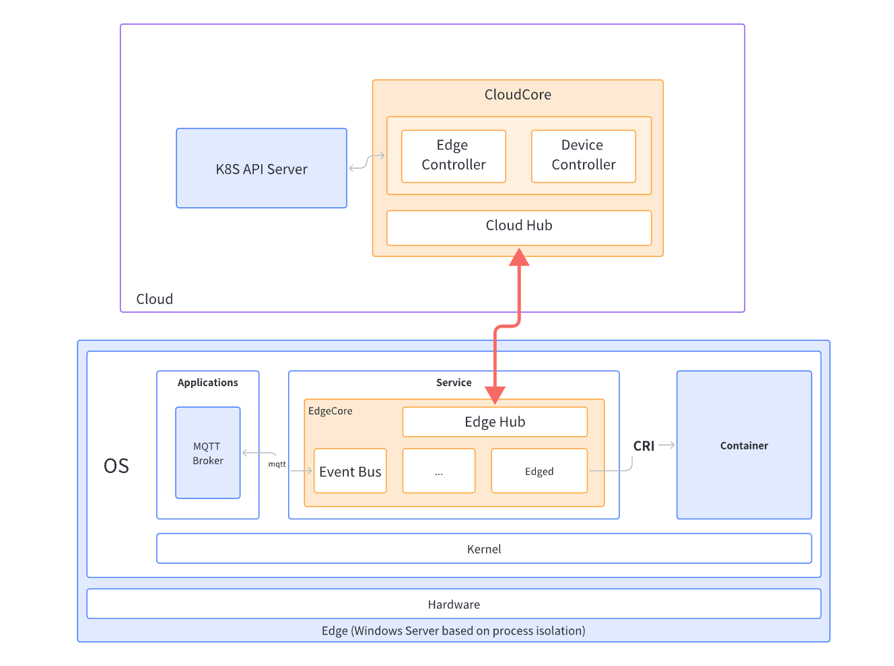

# Support KubeEdge edge node running on Windows

## Background

KubeEdge is used to extend the orchestration capabilities of containerized applications to Edge hosts. It is built upon kubernetes and provides fundamental infrastructure support for network, application deployment and metadata synchronization between cloud and edge. KubeEdge has been widely applied in industrial scenarios (edge computing) and has many successful use cases.

Although KubeEdge already supports operating systems like Linux and Android and has a wide range of applications, it does not currently support Windows Server, which limits its capabilities in certain potential edge computing scenarios. Edge computing involves various types of devices, including sensors, cameras, and industrial control devices, some of which may run on the Windows operating system. Therefore, in order to support these devices, KubeEdge needs to be able to run on Windows Server nodes. Additionally, many enterprises use Windows servers in their IT infrastructure and may have already deployed some applications and services. In this case, supporting Windows Server nodes is necessary to integrate edge computing with existing infrastructure. Furthermore, Windows is a widely used operating system, and many developers and vendors provide applications and tools based on Windows. Supporting Windows Server nodes is also essential to promote the development of edge computing and integrate with the existing ecosystem.

Currently, KubeEdge's cloud nodes can run as a Kubernetes pod, while edge-side nodes need to run on systems that support container technologies like Docker and containerd (without running Kubernetes). Microsoft has already provided containerization solutions based on process and Hyper-V, both of which can successfully run containerd, making it possible to run KubeEdge on Windows.

## Goals

This project aims to run KubeEdge's edge node on Windows Server, thereby extending KubeEdge to the Windows ecosystem and expanding its use cases and ecosystem in the IoT field.

## Proposals

### Analysis

KubeEdge is an open-source system that runs a localized Kubernetes cluster on edge computing nodes. Currently, KubeEdge does not support running on Windows, but why is that the case?

First, it is important to understand how KubeEdge works. KubeEdge consists of two main components: Cloud and Edge. The Cloud component runs in a Kubernetes environment on cloud servers, while the Edge component runs on edge devices. Both components need to run on supported operating systems.

CloudCore is an important component running in the cloud, responsible for managing edge nodes and applications, as well as communicating with edge nodes. It includes the following modules:
- CloudHub: Responsible for establishing a WebSocket connection with EdgeHub and forwarding messages from edge nodes.
- EdgeController: Responsible for synchronizing the resource status of the cloud to edge nodes, including nodes, pods, configmaps, secrets, etc.
- DeviceController: Responsible for managing the lifecycle of edge devices and synchronizing device status and device models.

EdgeCore is the core component running on edge nodes, responsible for running containers and devices, as well as communicating with the cloud. It includes the following important modules:
- DeviceTwin: Responsible for storing the state and properties of edge devices and synchronizing with DeviceController.
- Edged: Responsible for managing containers on edge nodes, including operations such as creation, start, stop, and delete. It has similar functionality to kubelet but is more lightweight.
- EdgeHub: Responsible for establishing a WebSocket connection with CloudHub and forwarding messages from the cloud.
- EventBus: Responsible for communicating with the MQTT server and providing pub/sub functionality.
- MetaManager: Responsible for managing metadata on edge nodes, including pods, configmaps, secrets, etc.
- ServiceBus: An HTTP client that interacts with an HTTP server (REST) to provide HTTP client functionality to cloud components for accessing HTTP servers running on the edge.

The main challenge in running edge nodes on Windows lies in running EdgeCore.

The six components of EdgeCore run as Goroutines, but even so, they depend on other external components. For example, EventBus depends on an external Mosquitto server. If Mosquitto does not support running on Windows, then EdgeCore with EventBus enabled will not be able to run.

To enable EdgeCore to run on Windows, we need to analyze the reasons why it cannot run on Windows and then address them.

First, we can attempt to compile a Windows version of EdgeCore, which can run but exits due to internal errors. Therefore, we need to analyze these components to see why they encounter errors during execution.

- DeviceTwin: Depends on Sqlite, but Sqlite should not have any issues due to system differences.
- Edged: It is a lightweight version of kubelet and needs to interact with the CRI and RuntimeCgroups in the system. If there is no container runtime and related Cgroups in the system, this module will not be able to run.
- EdgeHub: Communicates with the cloud and should not encounter any issues.
- EventBus: Depends on the Mosquitto service and uses the MQTT protocol for interaction, which is independent of the operating system.
- MetaManager: Depends on Sqlite and should not have any issues.
- ServiceBus: Does not depend on external components; it only requires the ability to send HTTP requests.
- Edgestream: A WebSocket Secure (WSS) tunnel that only needs to connect to Cloudstream.
- Test: A test HTTP server that depends on components like Edged.

So, overall, the problematic part is Edged. In kubelet, the configuration files for Linux and Windows have differences, primarily in the CRI address and resource isolation tool. 

## Solution

Edged is a trimmed version of Kubelet. Kubernetes supports using Windows as a node, and even added support for Windows Server 2019 in version 1.27. This means that Kubelet can run on the Windows side, so Edged should also be able to.

After comparing the code of Edged and Kubelet, it was found that Edged did not take into account the relevant configurations for Windows support in Kubelet (actually, they exist, but the windows-related fields were ignored during the transfer process to Kubelet). Specifically, Edged does not include the WindowsService and WindowsPriorityClass fields in the KubeletFlags structure. Therefore, theoretically, by modifying the code of Edged to add support for Windows configurations and then handing it over to `k8s.io/kubernetes/cmd/kubelet/app` to complete the remaining work, Edged can be run.

This is just a theoretical solution. In practice, there may be more details and dependencies involved. During the implementation process, it is necessary to delve into the code of Kubelet and Edged to ensure a comprehensive understanding of their overall architecture and implementation. In addition, it is necessary to test and validate the modified Edged code to ensure its stability and correctness in the actual environment.

## Design details

Task 1: Running Containerd on Windows Server
- Prepare the hardware environment: Windows Server 2019. It can also be Windows 10 or Windows 11, but it must be the Professional/Enterprise edition and have Hyper-V enabled. However, since the Kubernetes official documentation currently recommends Windows Server, Windows Server 2019 is the first consideration.
- Prepare the container runtime: Install the container runtime, containerd, on the Windows operating system.
- Test container runtime: Test that containerd is running correctly and launch any Hello-world container, such as nginx.

Task 2: Setting up the Cloudcore environment
To facilitate debugging and have a fully prepared environment, deploy the cloud node on another server:
- Install Kubernetes: Deploy a single-node cluster using Kubeadm.
- Install Cloudcode: Deploy Cloudcore on the machine with Kubernetes using Keadm, and securely store the token.

Task 3: Running Edgecore core components on Windows Server
- Modify the Edged source code to support Windows-related container runtime configurations and modify the relevant transfer code.
- Compile into binary.
- Test the operation of the Edged component.

Task 4: Integration testing
- Enable all edge node components and test if cloud-to-edge communication is functioning properly.
- Use Kubernetes to schedule a service to the edge node and run an edge application to test its availability.

Task 5: Updating Keadm code to support Windows Server
- Modify parts of the Keadm code to support one-click startup of edge nodes on Windows Server.

Task 6: Updating Github Action to make release for windows(keadm, edgecore)
- Modify release script.

Task 7: Further support
Experiment with using Windows Server 2022 to explore more possibilities of running Kubeedge in the Windows ecosystem.

## Roadmap

7.1-7.31 Preparation phase
- Review and submit proposal.
- Deploy KubeEdge services and set up a cluster with one master and one KubeEdge edge node (Linux) to become familiar with KubeEdge operations.
- Familiarize yourself with the Edged source code.
- Prepare resources for Windows Server 2019 and set up a remote development and debugging environment.

8.1-8.31 Development phase
- Develop on Windows Server and modify KubeEdge code to support successful operation of Edged.
- Debug cloud-to-edge communication to ensure smooth integration of Windows nodes into the cluster.
- Develop Keadm to enable starting KubeEdge on Windows nodes.

9.1-9.11 clean code
- Organize and optimize code, give necessary comments, delete debugging code

9.11-9.30 Summary phase
- Ensure that Edgecore runs smoothly on Windows Server 2019.
- Write project documentation, presentation materials, and submit code.