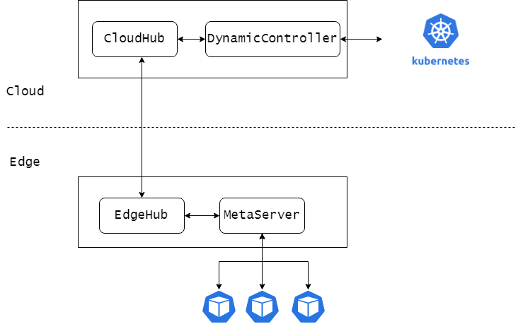
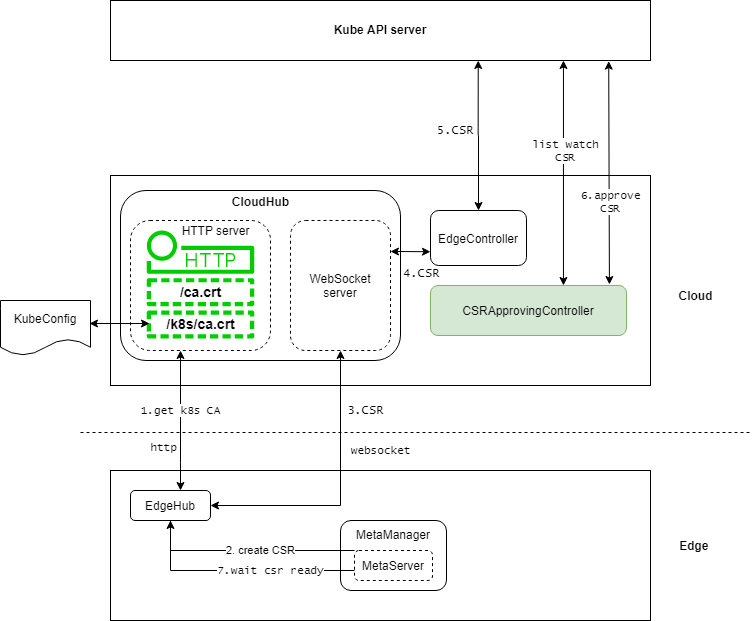
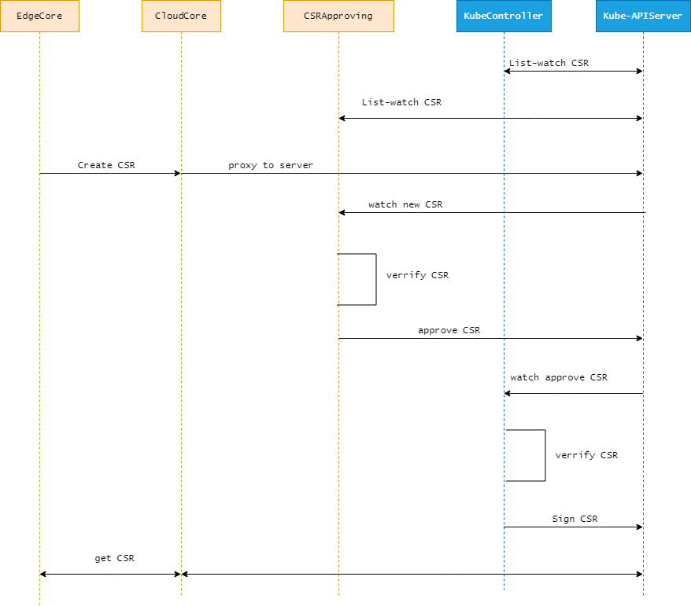

# Edge pods use `InClusterConfig` to access kube APIServer natively 


## Summary

In native Kubernetes cluster, the pod and Kube-APIServer are usually on the same network plane, and the network quality is good, so you can directly access the Kube-APIServer through InClusterConfig. In the edge computing scenario, the edge pod and the Kube-APIServer are in different network environment, there is no way to directly access. This proposal proposes an enhancement that will allow Edge pods use `InClusterConfig` to access Kube-APIServer natively.

## Motivation

At present, the request traffic for accessing Kube-APIServer is proxied through the `metaserver` on the edge node, But the user needs to manually modify the Kube-APIServer address to `metaserver` for edge pod, also If you use the HTTPS protocol to access, you need to set `InsecureSkipTLSVerify` to true. This is extremely inconvenient for deploying native applications, such as CNI plug-ins, CSI plug-ins, etc.  Therefore, we hope that native kubernetes applications can be deployed without modification.

### Goals

- Edge pods use `InClusterConfig` to access kube APIServer natively,  whether or not using hostNetwork.

### Non-Goals

- Edge pods that does not  use `InClusterConfig` to access kube APIServer natively

## Proposal

At present, the certificates on the edge side are issued by the Cloudhub certificate module, and metaserver and edgehub use the same certificate. This is However, the CA and related certificates used by edge pods are issued by kuberntes, These two certificate systems are currently unrelated. Therefore, the edge pod will report an authentication error when using the native certificate to access the metaserver.



### Issue native certificates for metaserver from kubernetes



1.  CloudHub http server adds interface `/k8s/ca.crt` for edge nodes to obtain kubernetes CA certificate. When edgeHub starts, it visits url `/k8s/ca.crt` to get the kubernetes CA certificate.

2. After EdgeHub successfully connects to Cloudhub, metaserver initiates a CSR request and send the message to EdgeHub.

   ```
   apiVersion: certificates.k8s.io/v1
   kind: CertificateSigningRequest
   metadata:
     name: metaserver-csr-edge-node
   spec:
     request: LS0tLS1CRUdJTiBDRVJUSUZJQ0FURSBSRVFVRVNULS0tLS0KTUlJQkdqQ0J3UUlCQURBM01SVXdFd1lEVlFRS0V3eHplWE4wWlcwNmJtOWtaWE14SGpBY0JnTlZCQU1URlhONQpjM1JsYlRwdWIyUmxPbVZrWjJVdGJtOWtaVEJaTUJNR0J5cUdTTTQ5QWdFR0NDcUdTTTQ5QXdFSEEwSUFCTHZSCkJLa3c0cVpMb216aXNGVDhsNmJaU0I1Qm9DV0o5ejMvcTc1WTJNVXl0QTl2K2dSRVlsNkt5d1ByaGREdU12WFIKOWFnMlpCUzF1NmVMY3NlQ0lXU2dLREFtQmdrcWhraUc5dzBCQ1E0eEdUQVhNQlVHQTFVZEVRUU9NQXlIQkg4QQpBQUdIQktuK0ZBb3dDZ1lJS29aSXpqMEVBd0lEU0FBd1JRSWdaSVhkNVQ5SUw3dDNjdDAxb3ArQ1U3Y2d5eFhZCitvZkxWK2lvSEZObk1rRUNJUURhUzZpdWpuVFdhZ3dkOVozVXMvRnU5WFVyYVo1N3BpY3puRGgwM0haUkxBPT0KLS0tLS1FTkQgQ0VSVElGSUNBVEUgUkVRVUVTVC0tLS0tCg==
     signerName: kubernetes.io/kubelet-serving
     usages:
     - digital signature
     - key encipherment
     - server auth
   ```

   The main content of the request is as follows:

   ```
   {
      "Subject":{
         "Organization":[
            "system:nodes"
         ],
         "CommonName":"system:node:nodeName",
      },
      "IPAddresses":[
         "127.0.0.1",
         "169.254.20.10"
      ],
   }
   ```


3. EdgeHub forwarded the  CSR request message to CloudHub through the websocket connection.

4. CloudHub forwards CSR request message to EdgeController.

5. EdgeController parses the CSR request message, reassemble into kubernetes request and forward it to Kube-APIServer.

6. Add `CSRApprovingController` component to auto-approve metaserver CSR.  `CSRApprovingController` list-watch CSR, when a new CSR was created, `CSRApprovingController` watch the event and it will first verify that the CSR is valid and whether it was initiated by the `metaserver`, and if the verification passes, it will auto-approve the CSR.

7. After the metaserver creates the CSR, it will wait for the CSR to be issued successfully, and then start the server.

### Non-hostNetwork edge pod access metaserver

The request traffic for accessing Kube-APIServer is proxied through the `metaserver` on the edge node, but `metaserver` is only listening on `127.0.0.1:10550` for proxying request traffic. so pods with hostNetwork=false can not access metaserver because of traffic from `container network namespace` to `127.0.0.1` can not route to edge node.

The metaserver startup will add a dummy network interface to the edge node, and the metaserver will listen on this dummy network interface at the same time, so pods with hostNetwork=false can access the metaserver through the dummy network interface.

- The interface name is: `edge-dummy0`

- The default ip address of new dummy interface is: `169.254.30.10`

### Master service env inject into edge pod

When Edge pods use `InClusterConfig` to access Kube-APIServer , It will assemble the URL address through the environment variables `KUBERNETES_SERVICE_HOST` and `KUBERNETES_SERVICE_PORT`. When EdgeCore starts the edge pod, it will intercept and inject the address of the metaserver listening on the dummy interface, so the traffic of the edge pod accessing Kube-APIServer can be proxyed to the metaserver without perception.

```
func InClusterConfig() (*Config, error) {
   const (
      tokenFile  = "/var/run/secrets/kubernetes.io/serviceaccount/token"
      rootCAFile = "/var/run/secrets/kubernetes.io/serviceaccount/ca.crt"
   )
   host, port := os.Getenv("KUBERNETES_SERVICE_HOST"), os.Getenv("KUBERNETES_SERVICE_PORT")
   if len(host) == 0 || len(port) == 0 {
      return nil, ErrNotInCluster
   }

   token, err := ioutil.ReadFile(tokenFile)
   if err != nil {
      return nil, err
   }

   tlsClientConfig := TLSClientConfig{}

   if _, err := certutil.NewPool(rootCAFile); err != nil {
      klog.Errorf("Expected to load root CA config from %s, but got err: %v", rootCAFile, err)
   } else {
      tlsClientConfig.CAFile = rootCAFile
   }

   return &Config{
      // TODO: switch to using cluster DNS.
      Host:            "https://" + net.JoinHostPort(host, port),
      TLSClientConfig: tlsClientConfig,
      BearerToken:     string(token),
      BearerTokenFile: tokenFile,
   }, nil
}
```

### CSRApprovingController

The process of certificate request and issuance is as follows:

