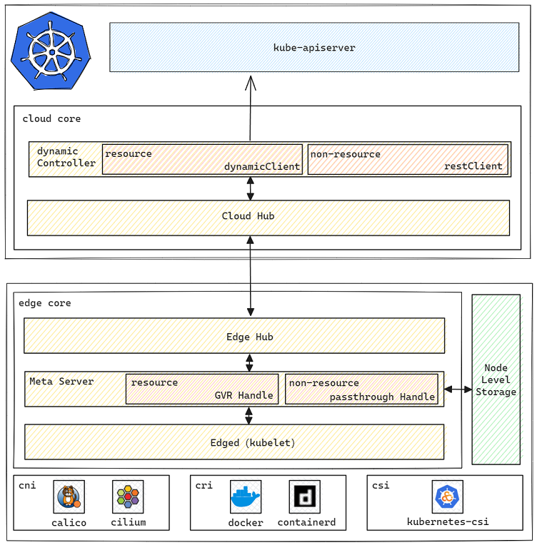

## Enabling request to version uri on the edge node

- [Summary](#summary)
- [Motivation](#motivation)
  - [Goals](#goals)
  - [Non-goals](#non-goals)
- [Design Details](#design-details)
  - [Architecture](#architecture)
- [Test Cases](#test-cases)
- [Enable more uris](#enable-more-uris)

### Summary

Currently, edge node services are unable to obtain the cluster's kubernetes version through MetaServer. This causes several applications are unable to launch normally. Like cilium, calico, and so on.  
This feature allows for the transparent forwarding of all non-resource uris. Not only may version uris be supported, but other non-resource uris can be developed.

### Motivation

To meet the user's installation requirements for more cni, the edge node should be able to acquire kubernetes version information.

The cni plugin will be able to get cluster version information through the MetaServer with this feature. Further development can be carried out if the user requires other non-resource uri response.

##### Goals

- MetaServer allows for the transparent transmission of non-resource URIs. And save the results in the sqlite database.
- If the connection between the edge node and the cluster is lost, MetaServer can get the cache from sqlite to avoid an error return.

##### Non-goals

- Transmit uris other than /version in MetaServer.

### Design Details

#### Architecture



##### On the cloud：

- Verify non-resource requests using the uri+verb whitelist.
- Non-resource requests are routed through restClient without regard for the verb of the request.


##### On the edge

- Verify non-resource requests using the uri+verb whitelist.
- Regardless of the selected verb, the non-resource request is sent a message to cloudhub with uri as the key.
- The key for storage and querying in the local database is uri.

##### Before using

- Enable `dynamicController`

Dynamic modules is set to false by default; modify it to true as shown below.

cloudcore.yaml:
```
      dynamicController: 
        enable: true      
```

Enable `MetaServer`

edgecore.yaml:
```
  metaManager:
    metaServer:
      enable: true
```

### Test Cases

1. The application on the edge node connects to the /version interface via MetaServer's port.
2. Disconnect the network connection between cloud and edge，and try the /version request.

### Enable more uris

1、You can add uri to passThroughMap in the form "[path]::[verb]", which achieves the pass through purpose. Like "/healthz::get":

```
type passRequest string

const (
	versionRequest passRequest = "/version::get"
+	healthzRequest passRequest = "/healthz::get"
)

var passThroughMap = map[passRequest]bool{
	versionRequest: true,
+	healthzRequest: true,
}
```

2、Rebuild and upgrade the cloudcore and edgecore.