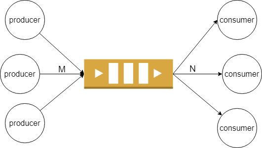
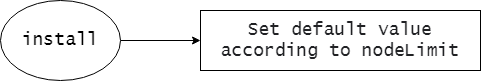
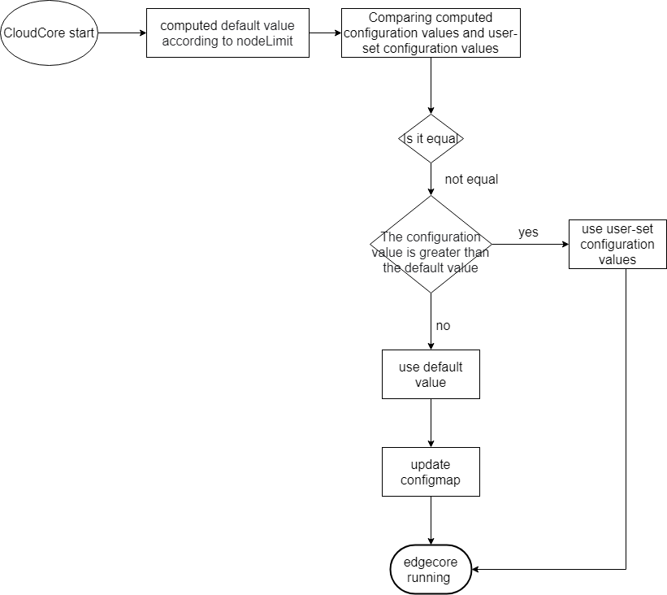

## Background

In EdgeController, we use a typical producer-consumer pattern to process upstream and downstream messages, for example:

Downstream message (cloud->edge): EdgeController will watch kube-apiserver to monitor resource changes. If a resource update event arrives, it will add the corresponding event to the channel for processing. This step can be considered as a producer in producing data, events added to the channel will have corresponding workers, which will be taken out from the channel one by one, and then sent to the edge side.This step can be considered as the consumer consuming data.


Upstream message (edge -> cloud): The edge node component EdgeCore will periodically report the status (such as node lease) or listen to the corresponding event to trigger the update of the status (such as pod status). After the status message is sent to the cloud, it will be added to the process channel, this step can be considered as the producer is producing data, and the event added to the channel will have a corresponding number of workers, which will be taken out from the channel one by one, and then updated to the kube-apiserver. This step can be considered as Consumers are consuming data.



Therefore, the size of the processing queue and the number of processing workers are critical. EdgeController configuration has two parameters, buffer and load. The buffer defines the channel size of various resources, and the load parameter defines the number of worker goroutines for processing each resource. If the configuration of these two parameters is not reasonable, the message queue will accumulate, messages will be lost, and the system will crash.


## Problem

At present, there are two problems to be solved in the configuration of these two parameters in EdgeController:

1. There are too many configuration items, which are difficult for users to understand and cumbersome to configure.
2. The default configuration is unreasonable. As the user's nodes increase, the problem becomes more obvious.

```
// EdgeControllerBuffer indicates the EdgeController buffer
type EdgeControllerBuffer struct {
	// UpdatePodStatus indicates the buffer of pod status
	// default 1024
	UpdatePodStatus int32 `json:"updatePodStatus,omitempty"`
	// UpdateNodeStatus indicates the buffer of update node status
	// default 1024
	UpdateNodeStatus int32 `json:"updateNodeStatus,omitempty"`
	// QueryConfigMap indicates the buffer of query configMap
	// default 1024
	QueryConfigMap int32 `json:"queryConfigMap,omitempty"`
	// QuerySecret indicates the buffer of query secret
	// default 1024
	QuerySecret int32 `json:"querySecret,omitempty"`
	// PodEvent indicates the buffer of pod event
	// default 1
	PodEvent int32 `json:"podEvent,omitempty"`
	// ConfigMapEvent indicates the buffer of configMap event
	// default 1
	ConfigMapEvent int32 `json:"configMapEvent,omitempty"`
	// SecretEvent indicates the buffer of secret event
	// default 1
	SecretEvent int32 `json:"secretEvent,omitempty"`
	// RulesEvent indicates the buffer of rule event
	// default 1
	RulesEvent int32 `json:"rulesEvent,omitempty"`
	// RuleEndpointsEvent indicates the buffer of endpoint event
	// default 1
	RuleEndpointsEvent int32 `json:"ruleEndpointsEvent,omitempty"`
	// QueryPersistentVolume indicates the buffer of query persistent volume
	// default 1024
	QueryPersistentVolume int32 `json:"queryPersistentVolume,omitempty"`
	// QueryPersistentVolumeClaim indicates the buffer of query persistent volume claim
	// default 1024
	QueryPersistentVolumeClaim int32 `json:"queryPersistentVolumeClaim,omitempty"`
	// QueryVolumeAttachment indicates the buffer of query volume attachment
	// default 1024
	QueryVolumeAttachment int32 `json:"queryVolumeAttachment,omitempty"`
	// CreateNode indicates the buffer of create node
	// default 1024
	CreateNode int32 `json:"createNode,omitempty"`
	// PatchNode indicates the buffer of patch node
	// default 1024
	PatchNode int32 `json:"patchNode,omitempty"`
	// QueryNode indicates the buffer of query node
	// default 1024
	QueryNode int32 `json:"queryNode,omitempty"`
	// UpdateNode indicates the buffer of update node
	// default 1024
	UpdateNode int32 `json:"updateNode,omitempty"`
	// PatchPod indicates the buffer of patch pod
	// default 1024
	PatchPod int32 `json:"patchPod,omitempty"`
	// DeletePod indicates the buffer of delete pod message from edge
	// default 1024
	DeletePod int32 `json:"deletePod,omitempty"`
	// CreateLease indicates the buffer of create lease message from edge
	// default 1024
	CreateLease int32 `json:"createLease,omitempty"`
	// QueryLease indicates the buffer of query lease message from edge
	// default 1024
	QueryLease int32 `json:"queryLease,omitempty"`
	// ServiceAccount indicates the buffer of service account token
	// default 1024
	ServiceAccountToken int32 `json:"serviceAccountToken,omitempty"`
}
```

```
// EdgeControllerLoad indicates the EdgeController load
type EdgeControllerLoad struct {
	// UpdatePodStatusWorkers indicates the load of update pod status workers
	// default 1
	UpdatePodStatusWorkers int32 `json:"updatePodStatusWorkers,omitempty"`
	// UpdateNodeStatusWorkers indicates the load of update node status workers
	// default 1
	UpdateNodeStatusWorkers int32 `json:"updateNodeStatusWorkers,omitempty"`
	// QueryConfigMapWorkers indicates the load of query config map workers
	// default 4
	QueryConfigMapWorkers int32 `json:"queryConfigMapWorkers,omitempty"`
	// QuerySecretWorkers indicates the load of query secret workers
	// default 4
	QuerySecretWorkers int32 `json:"querySecretWorkers,omitempty"`
	// QueryPersistentVolumeWorkers indicates the load of query persistent volume workers
	// default 4
	QueryPersistentVolumeWorkers int32 `json:"queryPersistentVolumeWorkers,omitempty"`
	// QueryPersistentVolumeClaimWorkers indicates the load of query persistent volume claim workers
	// default 4
	QueryPersistentVolumeClaimWorkers int32 `json:"queryPersistentVolumeClaimWorkers,omitempty"`
	// QueryVolumeAttachmentWorkers indicates the load of query volume attachment workers
	// default 4
	QueryVolumeAttachmentWorkers int32 `json:"queryVolumeAttachmentWorkers,omitempty"`
	// CreateNodeWorkers indicates the load of create node workers
	// default 4
	CreateNodeWorkers int32 `json:"createNodeWorkers,omitempty"`
	// PatchNodeWorkers indicates the load of patch node workers
	// default 4
	PatchNodeWorkers int32 `json:"patchNodeWorkers,omitempty"`
	// QueryNodeWorkers indicates the load of query node workers
	// default 4
	QueryNodeWorkers int32 `json:"queryNodeWorkers,omitempty"`
	// UpdateNodeWorkers indicates the load of update node workers
	// default 4
	UpdateNodeWorkers int32 `json:"updateNodeWorkers,omitempty"`
	// PatchPodWorkers indicates the load of patch pod workers
	// default 4
	PatchPodWorkers int32 `json:"patchPodWorkers,omitempty"`
	// DeletePodWorkers indicates the load of delete pod workers
	// default 4
	DeletePodWorkers int32 `json:"deletePodWorkers,omitempty"`
	// CreateLeaseWorkers indicates the load of create lease workers
	// default 4
	CreateLeaseWorkers int32 `json:"createLeaseWorkers,omitempty"`
	// QueryLeaseWorkers indicates the load of query lease workers
	// default 4
	QueryLeaseWorkers int32 `json:"queryLeaseWorkers,omitempty"`
	// UpdateRuleStatusWorkers indicates the load of update rule status
	// default 4
	UpdateRuleStatusWorkers int32 `json:"UpdateRuleStatusWorkers,omitempty"`
	// ServiceAccountTokenWorkers indicates the load of service account token
	// default 4
	ServiceAccountTokenWorkers int32 `json:"ServiceAccountTokenWorkers,omitempty"`
}
```

## Optimization

| resource operation         | request frequency                                            | processing mechanism                         | number of workers     | buffer size         |
| -------------------------- | ------------------------------------------------------------ | -------------------------------------------- | --------------------- | ------------------- |
| UpdatePodStatus            | Deprecated                                                   | -                                            | -                     | -                   |
| UpdateNodeStatus           | Deprecated                                                   | -                                            | -                     | -                   |
| QueryConfigMap             | When deploy the pod and the secret not exist in the edgecore | Query from informer cache                    | Default value, 200    | Default value, 1024 |
| QuerySecret                | When deploy the pod and the secret not exist in the edgecore | Query from informer cache                    | Default value, 200    | Default value, 1024 |
| QueryPersistentVolume      | 启when enable CSI                                            | Query from informer cache                    | keep Default value, 4 | Default value, 1024 |
| QueryPersistentVolumeClaim | when enable CSI                                              | Query from informer cache                    | keep Default value, 4 | Default value, 1024 |
| QueryVolumeAttachment      | when enable CSI                                              | 从informer 缓存查询Query from informer cache | keep Default value, 4 | Default value, 1024 |
| CreateNode                 | Executed when registering a node                             | request API server                           | Default value, 200    | Default value, 1024 |
| PatchNode                  | It is detected once every 5 minutes, and it will be triggered if the node status changes | request API server                           | 100+ nodeLimit/20     | 1024+nodelimit /2   |
| QueryNode                  | A single node executed about 1s once                         | Query from informer cache                    | nodeLimit*1.2         | 1024 + nodeLimit    |
| UpdateNode                 | Executed when registering a node                             | request API server                           | Default value, 200    | Default value, 1024 |
| PatchPod                   | Pod status changes on the node                               | request API server                           | 100+ nodeLimit/20     | Default value, 1024 |
| DeletePod                  | When the user upgrades the application or deletes the application | request API server                           | Default value, 100    | Default value, 1024 |
| CreateLease                | Executed  when the node is registered, and then update the lease of a single node every 10s | request API server                           | 默认nodeLimit         | 1024 + nodeLimit    |
| QueryLease                 | Executed when registering a node                             | Query from informer cache                    | Default value, 100    | Default value, 1024 |
| UpdateRuleStatus           | when enable message routing                                  | -                                            | Default value, 4      | Default value, 1024 |
| ServiceAccountToken        | Executed when the sa token is about to expire                | Query from informer cache                    | Default value, 100    | Default value, 1024 |


Auto-tuning configuration flow chart:





