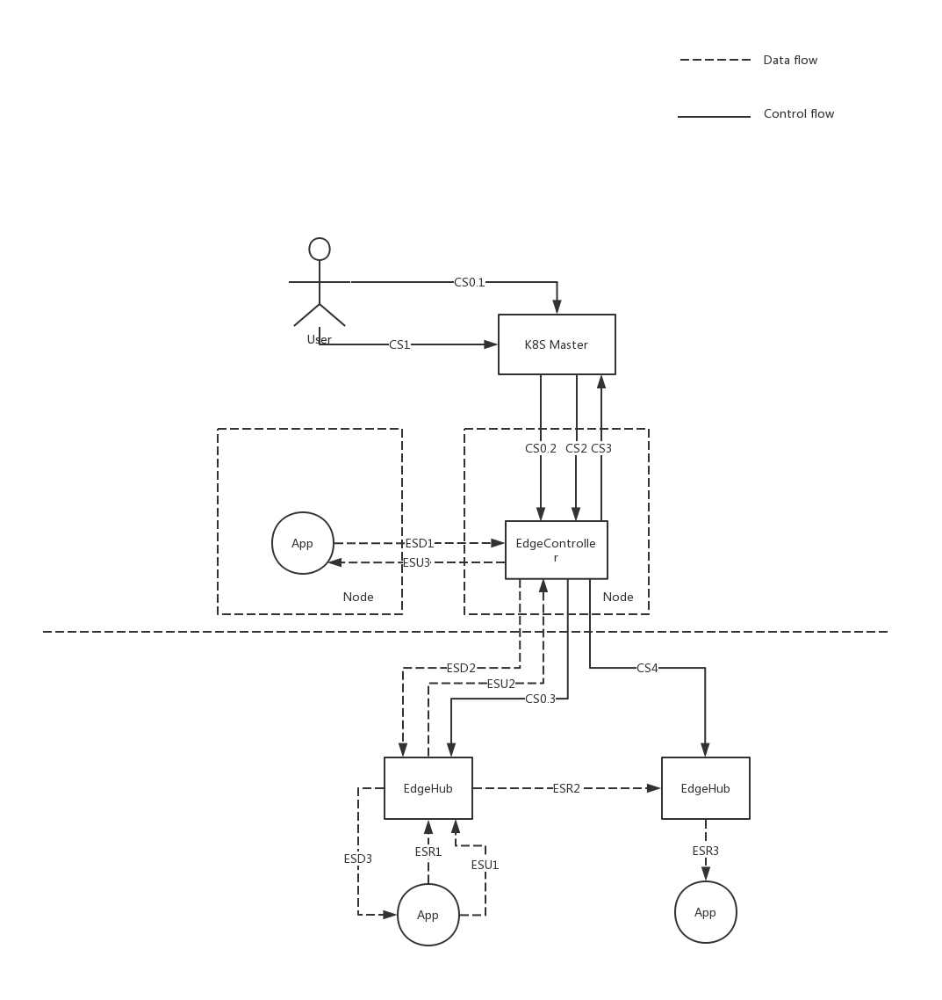
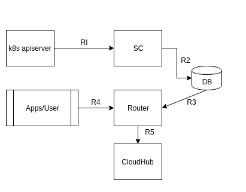
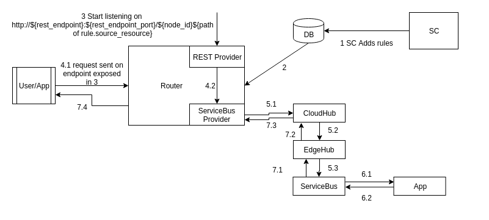

# Edge Mesh on edge

## Abstract
To support service mesh capabilities on edge to support microservice communication cross cloud and edge.
The service discovery, communication should be considered in this feature.
Developers can define services on top of the deployments deployed on the cloud or edges in a unified manner without caring about their location. The service name is the only thing they need to know to do the communication. For example, the following address can be used for a REST request:
`http://{service_name}/resources`

## Motivation
The cloud native and microservice architecture is becoming more and more popular and the edge node is becoming more and more powerful. The user want to decompose their application into multiple microservices. Some of those microservices need to be deployed in edge node to get close to the data generated by devices. By simplify the development, the user need to use the same mechanism to do the service discovery and communication with what they are doing on cloud.

## Constraints and Assumptions
1. No DNS services available for edge.
2. The identification and authentication should be handled by microservices.
3. When service communication between edge to edge, they may work offline. With the purpose to deliver a "expected result" to the user system, the service definition should be push down to the edge right after the definition operation. That is to say, the istio model may not be suitable for edge, in istio model, the service definition is pull from K8S master when the service is invoked.
4. Only support HTTP communication in the first step
5. All edge nodes are in the same sub-network and they have the network reachability.

## Use cases


### Register the service located on cloud
* CS0.1: User create service(type ClusterIP) in K8S API Server
* CS0.2: ServiceController get the service definition and create router rules with the edge ServiceBus as source and service clusterIP as target.
* CS0.3: Send the service definition to edge

### Register the service located on edge
* CS1: User create service(headless service without ClusterIP) in K8S API Server
* CS2, CS3: ServiceController get the service definition and update the service ClusterIP to itself. Then create router rule with the EC(Router) address as the source and edge ServiceBus as target.
* CS4: Send the service definition to edge

### Service discovery on cloud
* Application access service with the same mechanism no matter it located on cloud or edge

### Service discovery on edge
* Use iptables to redirect inbound and outbound traffic to the EdgeHub/ServiceBus. Then do service discovery in EdgeHub/ServiceBus by pick up the right POD from the service definition. The idea is similar with what istio is doing in the init_container: https://github.com/istio/istio/blob/master/tools/packaging/common/istio-iptables.sh

### Service communication from cloud to edge
* ESD1: Application on cloud visit service with clusterIP and request goes to EC(refer to step CS2, CS3)
* ESD2: Router find out the PODs in this service and pick one with some kind of load balance mechanism. Then send the request to the choosen edge with the router rule set in CS3.
* ESD3: EdgeHub/ServiceBus get the request and redirect to the POD

### Service communication between edges
* ESR1: Application send the request to ServiceBus(refer to the "Service discovery on edge")
* ESR2: ServiceBus pick one POD in this service with some kind of load balance mechanism. If the target is in the same node, just forward the request. If not, edgehub wrapper the request and send to the target.
* ESR3: EdgeHub open the wrapped package and forward to the POD

### Service communication from edge to cloud
* ESU1: Application send the request to ServiceBus(refer to the "Service discovery on edge")
* ESU2: ServiceBus pick one POD in this service with some kind of load balance mechanism. The target is on cloud, EdgeHub send the request to cloud.
* ESU3: Router send the request to the corresponding POD on cloud following the rule created in CS0.2

## Proposal Changes
### Add servicebus on Edge to handle request proxy
ServiceBus is in the same process with EdgeHub as a module

### Router
Add two endpoints definition:

|Endpoint|Type|Capability|
|---|---|---|
|ClusterIP|Target|Request Forward|
|ServiceBus|Source|Request Forward, Service Discovery, Load Balance|
|ServiceBus|Target|Request Forward|
|Router|Source|Request Forward, Service Discovery, Load Balance|



* R1: ServiceController(SC) watches on k8s apiserver for Services/Endpoints.
* R2: SC get the service definition and create router rule definition and save in DB(ETCD).
* R3: Router gets the rule definition from DB and initializes the listeners/handlers for source and target.
* R4: Users/Applications create a request.
* R5: Router receives the request and forwards it to the target based on rule.

Since Router fetches rules from DB, in later versions it can be started as a different process than edge-controller. Also it enables router to retrieve all the rules after process restarts.
### Router Low-level Design

### Providers
Providers are plugins to reach a service running on edge or on cloud. For example (ServiceBus, EventBus running in edge_core) 
Providers can be classified into two types
1) Source
2) Target

In Alpha only ServiceBus, REST and EventBus providers will be supported.

Providers in router work in following way.



1) Router rule is added by SC say REST as source and ServiceBus at edge as target.
2) Router receives the rule and registers a listener in the source which is REST in this case.
3) REST provider starts listening on the path mentioned in the SourceResource of the rule.
for eg: http://${rest_endpoint}:${rest_endpoint_port}/${node_id}${path of rule.source_resource}
4) 4.1 User/App make a request to the endpoint in 3.

   4.2 REST provider forwards the request to ServiceBus provider.
5) 5.1 ServiceBus provider then creates a beehive message and sends it to CloudHub.

   5.2 CloudHub then forwards the message to edgeHub.

   5.3 EdgeHub send the message to ServiceBus module.
6) 6.1 ServiceBus at edge receives the message, makes the http request to applications running at edge.

   6.2  Receives the response back from the application.
7) 7.1 ServiceBus at Edge sends the response in beehive message back to EdgeHub.

   7.2 EdgeHub forwards the message to CloudHub.

   7.3 CloudHub sends the message back to router.

   7.4 The message is then converted to http response and sent to the user/application which made the request in step 4.1

### Source Interfaces

Each provider that wants to register as a Source should implement following interfaces.

```go
type Source interface {
	// Name Returns name of the provider
	Name() string
	// RegisterListener is used to register listener for a rule with this source type
	RegisterListener(rule model.Rule, res model.Map, handler func(interface{})) error
	// UnregisterListener is used to unregister a listener when rule is deleted
	UnregisterListener(rule model.Rule, res map[string]interface{})
	// Callback is function for sending response/ACK if required for a request 
	Callback(map[string]interface{})
}
```

```go
type SourceFactory interface {
	// Type returns type of the source
	Type() string
	// GetSource returns Source implementation
	GetSource(ep *model.Endpoint) Source
}
```

### Target Interfaces

Each provider that wants to register as a Target should implement following interfaces.

```go
type Target interface {
	// Name returns name of the provider
	Name() string
	// Forward is used to forward the request to target 
	Forward(map[string]interface{}, interface{}, func(map[string]interface{})) error
}
```

```go
type TargetFactory interface {
	// Type returns type of the target
	Type() string
	// GetTarget returns Target implementation
	GetTarget(ep *model.Endpoint) Target
}
```

### Rule Definition

```go
// Rule define message translate from Endpoint to Endpoint
type Rule struct {
	// ID is unique id of rule
	ID              string    `orm:"column(id); size(36); pk" json:"id" yaml:"id"`
	// Name is the name of the Rule
	Name            string    `orm:"column(name); size(64)" json:"name" yaml:"name"`
	// ProjectID can be used to differentiate rules across projects
	ProjectID       string    `orm:"column(project_id); size(36); index" json:"project_id" yaml:"project_id"`
	// DomainID is the domain from where the source is accessed
	DomainID        string    `orm:"column(domain_id); size(36); index" json:"domain_id" yaml:"domain_id"`
	// Source is the source Endpoint
	Source          *Endpoint `orm:"column(source); rel(fk)" json:"source" yaml:"source"`
	// SourceResource is a map used to store resources required for source
	SourceResource  Map       `orm:"column(source_resource); size(1024)" json:"source_resource" yaml:"source_resource"`
	// Target is target endpoint
	Target          *Endpoint `orm:"column(target); rel(fk)" json:"target" yaml:"target"`
	// TargetResource is a map used to store resources required for target
	TargetResource  Map       `orm:"column(target_resource); size(1024)" json:"target_resource" yaml:"target_resource"`
	// InUse is flag to check if rule is in use
	InUse           bool      `orm:"column(in_use); default(true)" json:"in_use" yaml:"in_use"`
	// IsDeleted is flag to check if rule is deleted
	IsDeleted       bool      `orm:"column(is_deleted); default(false)" json:"is_deleted" `
	// CreatedAt is rule creation timestamp
	CreatedAt       time.Time `orm:"column(created_at); auto_now_add; type(datetime)" json:"created_at" `
	// UpdatedAt is last rule updation timestamp
	UpdatedAt       time.Time `orm:"column(updated_at); auto_now; type(datetime)" json:"updated_at" `
	// SuccessMessages is the number of success messages for this rule
	SuccessMessages uint64    `orm:"column(success_messages); default(0)" json:"success_messages" `
	// FailMessages in the number of fail messages for this rule
	FailMessages    uint64    `orm:"column(fail_messages); default(0)" json:"fail_messages" `
	// Error is reverse maping of error messages for this rule
	Error           []*Error  `orm:"reverse(many)" json:"-"`
}
```


### Endpoint Definition

```go
// Endpoint define how to access external service
type Endpoint struct {
	// ID is the ID of the endpoint
	ID         string    `orm:"column(id); size(36); pk" json:"id" yaml:"id"`
	// Type is type of the endpoint
	Type       string    `orm:"column(type); size(64)" json:"type" yaml:"type"`
	// Name is name of the endpoint
	Name       string    `orm:"column(name); size(64)" json:"name" yaml:"name"`
	// ProjectID can be used to differentiate endpoints across projects
	ProjectID  string    `orm:"column(project_id); size(36); index; null" json:"project_id" yaml:"project_id"`
	// IsShared is flag to check if endpoint is shared
	IsShared   bool      `orm:"column(is_shared); default(false)" json:"is_shared" `
	// URI is unique resource identifier of the endpoint
	URI        string    `orm:"column(uri); size(256)" json:"uri" yaml:"uri"`
	// Properties is map used to store properties of an Endpoint
	Properties Map       `orm:"column(properties); size(10240)" json:"properties" yaml:"properties"`
	// CreatedAt is endpoint creation timestamp
	CreatedAt  time.Time `orm:"column(created_at); auto_now_add; type(datetime)" json:"created_at" `
	// UpdatedAt is last endpoint updation timestamp
	UpdatedAt  time.Time `orm:"column(updated_at); auto_now; type(datetime)" json:"updated_at" `
	// Rule is reverse mapping of Rules of this endpoint
	Rule       []*Rule   `orm:"reverse(many)" json:"-"`
}
```
### EdgeHub
* Listen to the edge communication
* Package the message and send to the target

### EdgeController
* Listen the service definition and create routing rule
* Listen the service definition to PODs deployed on edge and update the ClusterIP