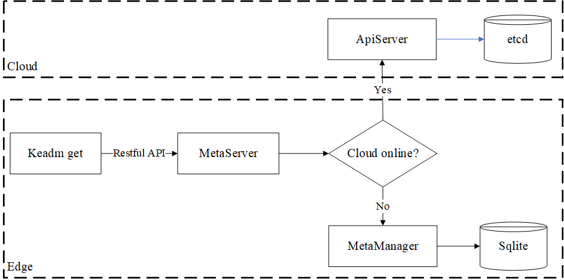
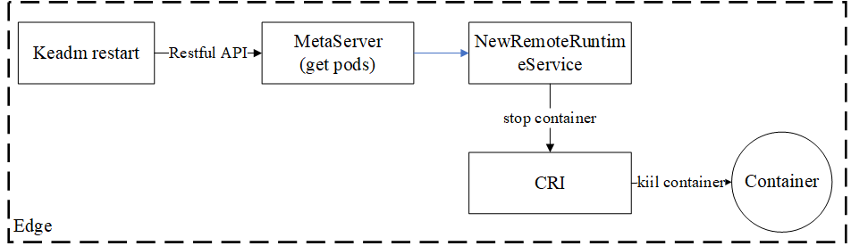
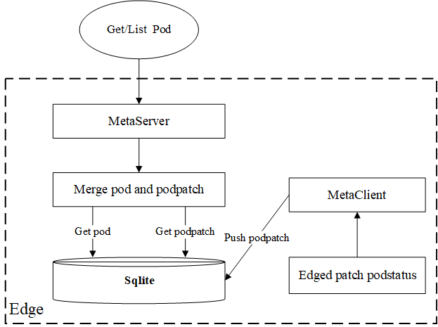

# Add pod restart and status query functions for the edge node 


## Motivation 

When the edge node is offline, it is not possible to query the status of the edge node pod and restart the pod of the edge node through kubectl in the cloud. This feature provides support for querying and restarting the pod status of the edge node.

### Goals

- By using the `keadm ctl get pod [flags]` command on edge nodes, the status of pod can be queried.
- By using the `keadm ctl restart pod [flags]` command on edge nodes, pod can be restarted.

## Background and challenges

- In edge computing, the network environment is usually poor, and edge nodes are offline most of the time. Now kubeedge does not support querying the status of pod when cloud edge is offline.
- When the edge node goes offline, the patch of the pod state of the edge node to the apiserver will fail. However, if the patch update is not done at the edge, the pod state in the edge node's metabase sqlite will not be updated. Even if kubedge has provided a metaserver and considered edge autonomy, the obtained pod state is still the state before going offline. Therefore, it is necessary to consider the patch update of the pod state of the edge node when it goes offline.
- When the edge node goes offline, users cannot restart the pod of the edge node. In many scenarios, users expect kubedge to support pod restart of the edge node. Here, we do not recommend deleting the pod at the edge node. Considering excessive permissions, edge pod restart only stops the containers in the pod, rather than killing the podsandbox.

## Design Details

### Keadm ctl get pod design.

1. Add the ctl get pod subcommand to keadm:

    ```
    "keadm ctl get pod" command get pods in edge node
    
    Usage:
      keadm ctl get pod [flags]
    
    Flags:
      -A, --all-namespaces     If present, list the requested object(s) across all namespaces. Namespace in current context is ignored even if specified with --namespace
      -h, --help               help for pod
      -n, --namespace string   Specify a namespace (default "default")
      -o, --output string      Output format. One of: (json, yaml, name, go-template, go-template-file, template, templatefile, jsonpath, jsonpath-as-json, jsonpath-file, custom-columns, custom-columns-file, wide)
      -l, --selector string    Selector (label query) to filter on, supports '=', '==', and '!='.(e.g. -l key1=value1,key2=value2)
    ```
2. Get pod scheme design

   

  - When the `keadm ctl get pod [flags]` command is executed, a Restful request will be issued to MetaServer.
  - MetaServer determines whether edge and cloud are online on the network.
  - If the edge and cloud networks are connected, MetaServer will forward the restful request through a proxy to ApiServer, and then request a return result from ApiServer.
  - If the edge node goes offline, MetaServer will retrieve pod data from the edge metabase sqlite.
  - After obtaining the results, install the print format of kubectl and input it into the console.

3. example

    ```
    [root@centos-edgenode1 kubeedge]# keadm ctl get pod 
    NAME                                READY   STATUS             RESTARTS       AGE
    mysql-0                             0/1     CrashLoopBackOff   47 (55s ago)   140m
    nginx-deployment-7b79f6fd7f-wpm62   1/1     Running            0              139m
   
    [root@centos-edgenode1 kubeedge]# keadm ctl get pod -owide -A
    NAMESPACE                      NAME                                READY   STATUS             RESTARTS         AGE     IP               NODE               NOMINATED NODE   READINESS GATES
    default                        mysql-0                             0/1     CrashLoopBackOff   43 (2m55s ago)   138m    10.88.0.2        centos-edgenode1   <none>           <none>
    default                        nginx-deployment-7b79f6fd7f-wpm62   1/1     Running            0                137m    10.88.0.3        centos-edgenode1   <none>           <none>
    kube-system                    kube-proxy-lrhf2                    1/1     Running            0                6h27m   192.168.52.100   centos-edgenode1   <none>           <none>
    kubeedge                       edge-eclipse-mosquitto-4p96z        1/1     Running            0                6h42m   192.168.52.100   centos-edgenode1   <none>           <none>
    kubeedge                       edgemesh-agent-rtwr2                1/1     Running            0                5h43m   192.168.52.100   centos-edgenode1   <none>           <none>
    kubesphere-monitoring-system   node-exporter-pwcfm                 2/2     Running            0                128m    192.168.52.100   centos-edgenode1   <none>           <none>
   
   [root@centos-edgenode1 kubeedge]# keadm ctl get pod -n kubeedge -l k8s-app=kubeedge,kubeedge=edgemesh-agent -owide
   NAME                   READY   STATUS    RESTARTS   AGE     IP               NODE               NOMINATED NODE   READINESS GATES
   edgemesh-agent-rtwr2   1/1     Running   0          5h49m   192.168.52.100   centos-edgenode1   <none>           <none>
   ```

### Keadm ctl restart pod design.

1. Add the ctl restart pod subcommand to keadm:

    ```
    "keadm ctl restart pod" command delete pods in edge node
    
    Usage:
      keadm ctl restart pod [flags]
    
    Flags:
      -h, --help               help for pod
      -n, --namespace string   Specify a namespace (default "default")
    ```

2. Restart pod scheme design
   
   
  
  - After executing `keadm ctl restart pod [flags]`, initiate a Restful API request to MetaServer to retrieve pod data.
  - Create an `internalapi.RuntimeService` through `remote.NewRemoteRuntimeService`.
  - Use the `io.kubernetes.pod.name` and `io.kubernetes.pod.namespace` tag selectors to filter the containers in the `remoteRuntimeService` interface that need to be restarted in the pod.
  - After obtaining the container list, using `remoteRuntimeService.StopContainer` to stop containers.

3. example

   ```
   [root@centos-edgenode1 kubeedge]# keadm ctl restart pod -n kubeedge edge-eclipse-mosquitto-j2db9
   4b9efa598c80ffc59705a1e49aeba0b5fec2db6513905c1cceb8aee7a2ae453d
   b63fa1d05f0163b5556663c33827e8df673d8c8c386da49c3b3ddf3ccd7efb84
   [root@centos-edgenode1 kubeedge]# keadm ctl get pod -n kubeedge edge-eclipse-mosquitto-j2db9 
   kubeedge                       edge-eclipse-mosquitto-j2db9              1/1     Running             2 (1m ago)   11d

   [root@centos-edgenode1 kubeedge]# keadm ctl get pod  -l k8s-app=kubeedge,kubeedge=edgemesh-agent -owide -A
   NAMESPACE   NAME                   READY   STATUS    RESTARTS   AGE     IP               NODE               NOMINATED NODE   READINESS GATES
   kubeedge    edgemesh-agent-rtwr2   1/1     Running   0          5h52m   192.168.52.100   centos-edgenode1   <none>           <none>
   [root@centos-edgenode1 kubeedge]# keadm ctl restart pod -n kubeedge    edgemesh-agent-rtwr2 
   689c25f7ca270b539dd4ae9288ba101ab5ca341140d09ee6497385446bac6f30
   [root@centos-edgenode1 kubeedge]# keadm ctl get pod  -l k8s-app=kubeedge,kubeedge=edgemesh-agent -owide -A
   NAMESPACE   NAME                   READY   STATUS    RESTARTS     AGE     IP               NODE               NOMINATED NODE   READINESS GATES
   kubeedge    edgemesh-agent-rtwr2   1/1     Running   1 (7s ago)   5h52m   192.168.52.100   centos-edgenode1   <none>           <none>

   [root@centos-edgenode1 kubeedge]# keadm ctl restart pod -n kubeedge    edgemesh-agent-rtwr2 
   4d6c7f11c98bc44902b87268b87a2a2091c3389eb1fa4f58325fb001ff655924
   [root@centos-edgenode1 kubeedge]# keadm ctl get pod  -l k8s-app=kubeedge,kubeedge=edgemesh-agent -owide -A
   NAMESPACE   NAME                   READY   STATUS    RESTARTS      AGE     IP               NODE               NOMINATED NODE   READINESS GATES
   kubeedge    edgemesh-agent-rtwr2   1/1     Running   2 (14s ago)   5h54m   192.168.52.100   centos-edgenode1   <none>           <none>
   ```

### Design of pod's status patch when edge nodes are offline.

The design of obtaining pods at edge nodes when they are offline is as follows:

   

When the edge node is offline, we get the pod from the edge node. In the `metaserver`, we get the data of the `pod` and `podpatch` from SQLite, merge them into the latest pod, and then return it to the request because `podpatch` is the status data of the latest pod.
`podpatch` is the pod status reported by `StatusManger` from `edged`. MetaManager will persist `podpatch`to SQLite and save it to SQLite regardless of whether the edge node is online or offline.