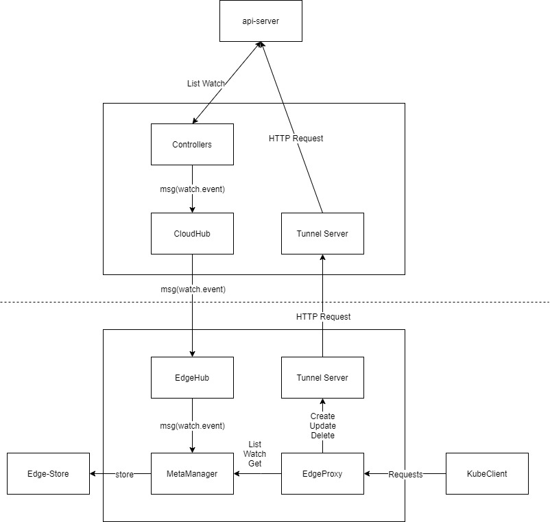
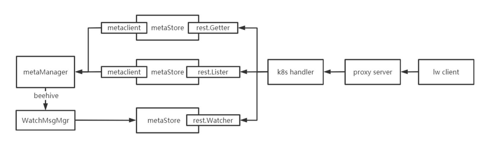
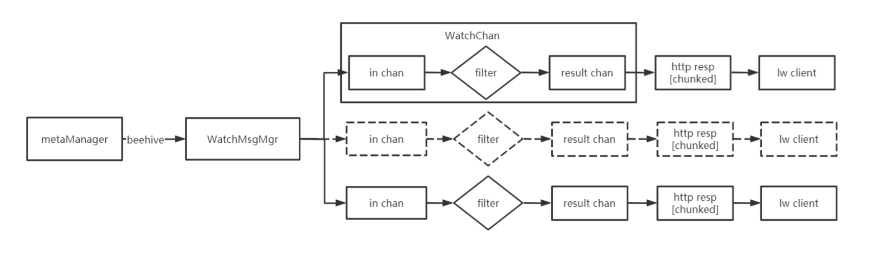

# EdgeProxy for ListWatch Design
## Motivation
Before describing the design motivation of the **EdgeProxy** for ListWatch client on edgenode.
Let us reflect on a question: why EdgeComputing framework not use kubelet directly connect to api-server?
Take KubeEdge for instance, we deploy cloudcore on cloud to capture the crud event of k8s resource,
encapsulate it as message and finally delivery it to edgenode in a reliable way.
In OpenYurt, they deploy yurthub on edge to proxy all request sent to api-sever from edge,
persist response locally while forwarding response to client, 
use data in local to construct response when cloud-edge network breaks and client still sends request to proxy.
In K3S, they even deploy a mini-apiserver at edge.

In general, no one use kubelet to directly connect to api-server. The reason behind this is the communication machanism in k8s , which called listwatch, is not fit the scenery of EdgeComputing. ListWatch has some flaws : 
1. Event transport has no ACK-like validation mechanism and relies on a stable network like data centers.
2. Each time the network is disconnectted, listwatch client will resend List request to retrive full data from api-server. In case of fluctuating network, it adds intense pressue to both network and api-server.

Although edgecore has ways to retrive data reliably from api-server through cloudcore, for applications over kubeedge, we now do not support a reliable connection between api-server and them. It makes sense.

#### Goal
- Alpha

Support accessing CoreV1-api(focus on list watch get) from edgecore for applications on the edge.

|  resource/verbs   | List  | Watch | Get | Create etc.|
|  ----  | ----  | ---- | ---- | ---- |
|  pod | ? | ? | ? | √|
|  svc  | √ | √ | √ | √|
|  endpoint| √ | √ | √ | √|
|  configmap|-|-|√|√|√|
|  secret|-|-|√|√|√|
|  crd-api(in Beta)| √ | √ | √ | √ | 
|  other-api(in Beta)|||||

? means neet to discuss
- Beta

Support accessing CRD-api.

## Design detail for alpha
### Architecture
   
   
   **EdgeProxy**:Module which receives client requests directly,
   dispatchs request by request type
   
   **TunnelServer**: Tunnel for HTTP req/resp, since cloud-edge network may span public networks. 
   Beside It is high-risk if we expose api-sever directly to public. 
   
   **MetaManager**:  Edge-Store Entry, and notify EdgeProxy if data changes.
   
   **Edge-Store**:  There are several types of data available in edge-store, reusing them is our preferred goal.
   If the data type kubeclient listwatches is not contained in the following, may we need to figure out a way to initiativly trigger 
   data sending from cloud.
   - secret
   - configmap
   - service
   - podlist
   - endpoints
   - node
   - podstatus
   - servicelist
   - pod
   - nodestatus
   
### Inner EdgeProxy
#### How to process list/watch/get request
   
   - **proxy server**: Proxy server, which mainly completes the start of the http server and the routing registration function.
   - **k8s handler**: for the request of lw client, complete the processing of http service, replace the internal api server
    handlers.GetResource, handlers.ListResource, handlers.WatchResource logic.
   - **metaStore**: resource object adapter, complete the objects in metaManager to
   rest.Getter/rest.Lister/rest.Watcher conversion, adapt handlers.XXXResource logic call
   - **WatchMsgMgr**: watch request message management center, complete metaManager push message through beehive, according to
   
   **Steps**:
   
   1. lw client(kubeclient) initiates the request, and proxyserver routes the request to the k8s handler
   2. The k8s handler obtains the specified metaStore based on the requested operation type and resource object
   3. MetaStore internally completes the information query through metaclient, and then converts it to the target type
   4. handler.XXXResouce can complete the request response according to the corresponding interface.
#### Specical design for the watch
    
   
   The watch request is a process of long connection and the server pushes messages. The detailed operation diagram of the push message is as above
   
   **Steps**:
   
   1. The metaManager pushes messages to the WatchMsgMgr through beehive
   2. WatchMsgMgr will distribute msgs to channels according to the resource type
   3. The messages in chan are filtered by the filter function to determine whether they meet their own selector option. 
   If the condition is met, the message is encapsulated into a watch.Event structure and pushed to the result chan
   4. From result chan retrieve watch.Event, and hand it over to watch.Interface and handlers.WatchResouce, finally the watch event is pushed into the http stream,
   5. lw client traverses http resp.
#### WatchMsgMgr Cache
   Cache each resource object type in WatchMsgMgr (provisional capacity 100), avoid some messages were not pushed into lw cleint through WatchMsgMgr,between list request and watch request, causing message loss.
   The main logic of this part is as follows:
   Traverse all data in the cache according to the resumeversion when the lw client initiates the watch request
   1. If all the data releaseversion is less than the target resourceversion, then directly start the quasi Ready to receive WatchMsgMgr message distribution
   2. If all the data's resultversion is greater than the target's resultversion, an exception is thrown, lw
    The client performs a list watch operation again
   3. If the resultversion of the nth object is equal to the target resultversion, then 
   push all events after nth(include) to the watch request, and then start to receive WatchMsgMgr watch.Event
### Queries

