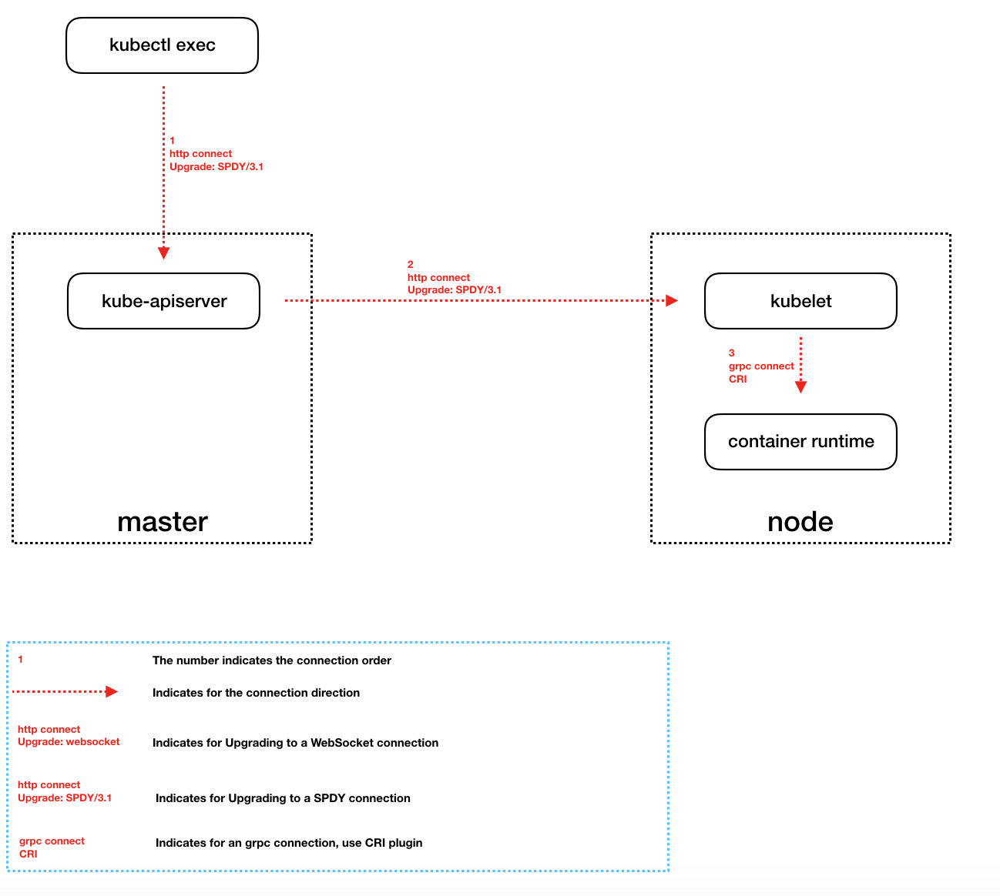
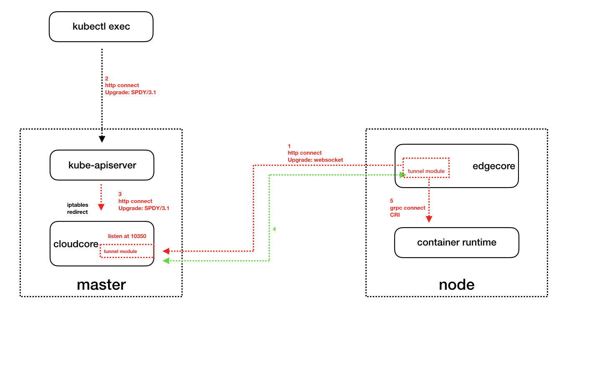
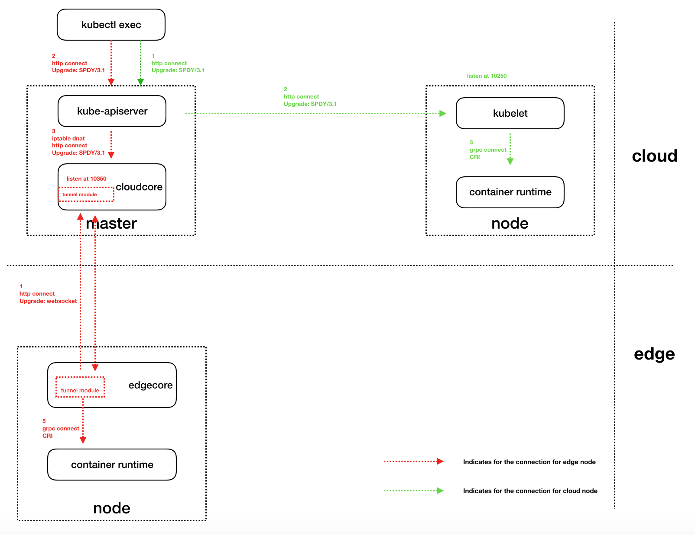

# KubeEdge Support Logs Exec Proposal 

## Abstract

Currently, in a native kubernetes cluster, `kubectl exec` command can execute a command in a container. `kubectl logs` command can print the logs for a container in a pod . 

Users can execute these commands in the cloud and do not need to operate on the nodes.

In this proposal, we plan to implement `kubectl exec` and `kubectl logs` feature based on edge computing scenarios

## Motivation

For `kubectl exec` commands, kube-apiserver will establish a long connection with kubelet.

The native kubernetes cluster is set up in data center, so kube-apiserver can directly access kubelet.

However, in edge computing scenarios, edge nodes are mostly in private network environments, and kube-apiserver cannot directly access edge nodes, so the native `kubectl exec` and `kubectl logs` commands can not be executed.

Therefore, we need to establish a data tunnel to forward data requestes between the cloud and the node.

## Goals

1. Support 'kubectl exec' and 'kubectl logs' in edge computing scenarios.
2. Ensure the security of data transmission in the tunnel.
3. Do not modify the code of kube-apiserver.


## Architecture Design

In kubernetes, take `kubectl exec` as an example. After kubectl exec, there will be a new process to establish an http connection with kube-apiserver, then the connection will be upgraded to [SPDY protocol](https://www.chromium.org/spdy/spdy-whitepaper) by default.

```
POST https://{kube-apiserver ip}:6443/api/v1/namespaces/default/pods/nginx-8698df6f97-b52l6/exec?command=bash&container=nginx&stdin=true&stdout=true&tty=true
Request Headers:
     X-Stream-Protocol-Version: v4.channel.k8s.io
     X-Stream-Protocol-Version: v3.channel.k8s.io
     X-Stream-Protocol-Version: v2.channel.k8s.io
     X-Stream-Protocol-Version: channel.k8s.io
     User-Agent: kubectl/v1.15.3 (linux/amd64) kubernetes/2d3c76f
Response Headers:
     Connection: Upgrade
     Upgrade: SPDY/3.1
     X-Stream-Protocol-Version: v4.channel.k8s.io

```

After this, kube-apiserver will initiate SPDY connection with the kubernetes node.

```
Connecting to backend proxy (intercepting redirects) https://{node ip}:10250/exec/default/nginx-8698df6f97-b52l6/nginx?command=bash&input=1&output=1&tty=1
Headers: 
	Connection:Upgrade 
	Upgrade:SPDY/3.1 
	User-Agent:kubectl/v1.15.3 (linux/amd64) kubernetes/2d3c76f
```

The flowchart is as follows:



In the edge computing scenarios, kube-apiserver cannot directly access the node and cannot initiate a connection,so we need to do something:

1. Using a websocket-based tunnel between cloud and edge side and forward kube-apiserver connection requests. This channel can be used as a transmission channel for `/metric` data in the future.

	For the tunnel channel, we have two options:

	+ 1-1 We can use (cloudhub <-> edgehub) tunnel, but now cloudhub and edgehub are mainly used to transfer kubernetes resource data (pod, node, configmap, service ...), which is not very suitable for `exec and logs` streaming data transmission.
	+ 1-2 Re-establish a websocket tunnel between cloudcore and edgecore and supports TLS authentication.
		
	This proposal chooses the second solution. The new tunnel is specifically responsible for the forwarding of streaming data, which can be used as `/metric` data transmission tunnel without affecting the logic of cloudhub and edgehub. 

	In most cases, we consider users to use `exec and logs` commands for debugging purposes. In edge computing scenarios, disconnection due to network instability is considered acceptable. Therefore, in the first stage, we do not support the reliable transmission of messages in this tunnel. 
	
	For cloudcore, we need to add a tunnel module, which listens on port 10350 by default (different from 10250), and needs to support websocket and spdy protocols. Both websocket connection requests from edgecore and apiserver connection requests must be supported.
	
	For edgecore, we need to add a tunnel module to initiate a websocket connection to the cloud tunnel. After receiving the data from the cloud, the tunnel calls the CRI interface to communicate with the container runtime.

The process is as follows:
	


For the data transmission in the tunnel proxy, there are several considerations:

- In order to distinguish the data of `logs, exec, /metric` connection types, we need to add type definition to distinguish these data.
- Distinguish which connection the data belongs to. We need to use a session-like definition.
- cloudcore tunnel needs to support SPDY and websocket protocols.
- Supports TLS authentication.

The message structure is as follows (working in process ...)：

```
type TunnelMsg struct {
	ID          int64
	ConnID      int64
	messageType int 
	data		[]byte
}
```


2.	Redirect requests made by kube-apiserver to the cloud tunnel service

	We will not modify the code of kube-apiserver, so the connection request address initiated by kube-apiserver is {edgenodeip}:10250, and the 10250 port is getted by (`node.Status.DaemonEndpoints.KubeletEndpoint.Port`), so we need DNAT.

```
 kubectl get node {nodename} -o=jsonpath="{.status.daemonEndpoints.kubeletEndpoint['Port']}"
```

    First of all, we need to modify the logic of edged module. When updating the node status, set the `Status.DaemonEndpoints.KubeletEndpoint.Port` to 10350 by default, so for all edge nodes, kube-apiserver will request 10350 port, which can distinguish the connection of cloud node (10250 port).

On all hosts where kube-apiserver is running, we need to execute the following command:

```shell

iptables -t nat -A OUTPUT -p tcp  --dport 10350 -j DNAT --to {cloudcoreip}:10350

```

The flowchart is as follows:



## Detail Design

working in process ...
