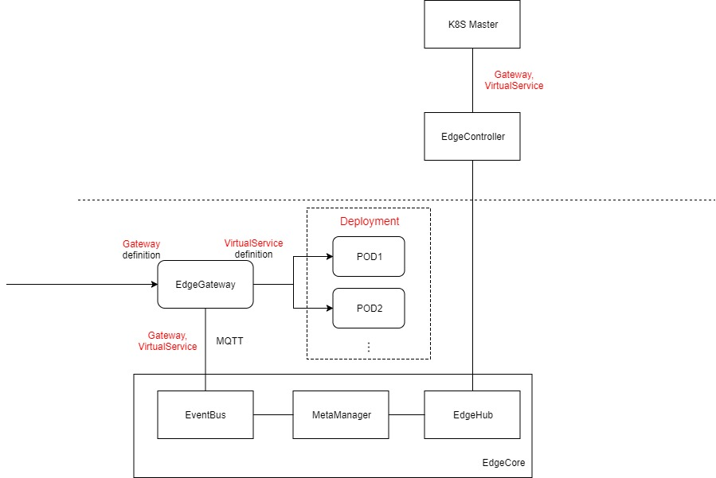

# Gateway support at edge


## Abstract

Gateway or edge service in a microservice system provide entry point for the entire application so that external applications can visit this application.

In the native kubernetes, [ingress](https://kubernetes.io/docs/concepts/services-networking/ingress/) is provided to achieve the purpose. [Gateway](https://istio.io/docs/reference/config/networking/gateway/) is another object designed in istio as another solution. They provide different capabilities with different designs for the cloud-grade gateway/edge service solution.

In this proposal, we present a design for the gateway/edge service support at edge which is suitable for the edge computing scenario.


## Motivation

There is an existing proposal named [Ingress support at edge](https://docs.google.com/document/d/1n4rp3NUkoo0epIyr_Z8895PBGrp2-6XC2x4h2sHsKos/edit#). However,the concept ingress is not suitable in Edge Computing scenario because of the following reasons:

1. The ingress controller is designed to server as a global service in a kubernetes cluster to forward requests to multiple backends cross nodes. That works on cloud because multiple backends are connected by the container network regardless of whether they are in the same node. But things is different at Edge because those edge node and deployments may be separated by locations. The POD-POD communication is high cost cross the edge locations since the network connection may not be available. So, the gateway itself can not be a global service and should be deployed on each different edge locations.

2. Ingress object itself does not support advanced traffic governance capabilities such as canary release and circuit breaker.

Because of the above reasons,  Ingress object is not suitable to work at Edge. Instead, the Gateway object defined in istio is perfectly fit the edge scenario. In Gateway definition, it is more like a set of router rule definitions upon a specific deployment which are located on different edge locations. That is to say, with the Gateway definition, the user is able to control each gateways working on different edge location.


## Goals

1. Provide Gateway component as a container, user can deploy it wherever they want.
2. Support HTTP/HTTPS/TCP as the external request.
3. Provide external access to a deployment which include multiple pods within one edge location(means network connection available). The access router rule can be configured with Gateway/VirtualService definition.


## Non-Goals

1. The HA capability for the gateway itself. 


## Design Details

The idea is to reuse the [Gateway](https://istio.io/docs/reference/config/networking/gateway/)  and [VirtualService](https://istio.io/docs/reference/config/networking/virtual-service/) definition in istio to represent a ingress gateway. A new gateway component is introduced and work like a Envoy(work in istio-ingressgateway mode) to dispatch the external requests to internal PODs.



The working flow is as below:

1. User deploy EdgeGateway as a normal kubernetes deployment. Then the EdgeGateway can be deployed to the right place with those kubernetes scheduling strategy like node-affinity and pod-affinity. Note that the EdgeGateway component should expose itself to the node wherever it is deployed by mapping the port to the host so that applications/users outside of the cluster can access. For example:

```yaml
apiVersion: apps/v1
kind: Deployment
metadata:
  name: edgegateway
  namespace: default
  labels:
    istio: edgegateway
spec:
  replicas: 1
  template:
    metadata:
      labels:
        istio: edgegateway
      annotations:
        scheduler.alpha.kubernetes.io/critical-pod: ""
    spec:
      containers:
        - name: istio-proxy
          image: "swr.cn-east-2.myhuaweicloud.com/kubeedge/edgegateway:0.1"
          imagePullPolicy: IfNotPresent
          ports:
            - containerPort: 80
            - containerPort: 443
          args:
          - proxy
          - router
          - -v
          - "2"
          - --discoveryRefreshDelay
          - '1s' #discoveryRefreshDelay
          - --drainDuration
          - '45s' #drainDuration
          - --parentShutdownDuration
          - '1m0s' #parentShutdownDuration
          - --connectTimeout
          - '10s' #connectTimeout
          - --serviceCluster
          - edgegateway
          - --proxyAdminPort
          - "15000"
          resources:
            requests:
              cpu: 10m
          env:
          - name: POD_NAME
            valueFrom:
              fieldRef:
                apiVersion: v1
                fieldPath: metadata.name
          - name: POD_NAMESPACE
            valueFrom:
              fieldRef:
                apiVersion: v1
                fieldPath: metadata.namespace
          - name: INSTANCE_IP
            valueFrom:
              fieldRef:
                apiVersion: v1
                fieldPath: status.podIP
          - name: ISTIO_META_POD_NAME
            valueFrom:
              fieldRef:
                fieldPath: metadata.name
          volumeMounts:
          - name: kubeedge-certs
            mountPath: /etc/certs
            readOnly: true
          - name: edgegateway-certs
            mountPath: "/etc/kubeedge/edgegateway-certs"
            readOnly: true
          - name: edgegateway-ca-certs
            mountPath: "/etc/kubeedge/edgegateway-ca-certs"
            readOnly: true
      volumes:
      - name: edgegateway-certs
        secret:
          secretName: "istio-edgegateway-certs"
          optional: true
      - name: edgegateway-ca-certs
        secret:
          secretName: "istio-edgegateway-ca-certs"
          optional: true
      affinity:
        nodeAffinity:
          requiredDuringSchedulingIgnoredDuringExecution:
            nodeSelectorTerms:
            - matchExpressions:
              - key: beta.kubernetes.io/arch
                operator: In
                values:
                - amd64
                - ppc64le
                - s390x
          preferredDuringSchedulingIgnoredDuringExecution:
          - weight: 2
            preference:
              matchExpressions:
              - key: beta.kubernetes.io/arch
                operator: In
                values:
                - amd64
          - weight: 2
            preference:
              matchExpressions:
              - key: beta.kubernetes.io/arch
                operator: In
                values:
                - ppc64le
          - weight: 2
            preference:
              matchExpressions:
              - key: beta.kubernetes.io/arch
                operator: In
                values:
                - s390x
```


2. User define Gateway to represent an ingress router rule to the selected EdgeGateway as well as VirtualService to represent a backend service dispatching rule. For example:

```yaml
apiVersion: networking.istio.io/v1alpha3
kind: Gateway
metadata:
  name: bookinfo-gateway
spec:
  selector:
    istio: edgegateway
  servers:
  - port:
      number: 80
      name: http
      protocol: HTTP
    hosts:
    - "*"
---
apiVersion: networking.istio.io/v1alpha3
kind: VirtualService
metadata:
  name: bookinfo
spec:
  hosts:
  - "*"
  gateways:
  - bookinfo-gateway
  http:
  - match:
    - uri:
        exact: /productpage
    - uri:
        exact: /login
    - uri:
        exact: /logout
    - uri:
        prefix: /api/v1/products
    route:
    - destination:
        host: productpage
        port:
          number: 9080
```


3. EdgeController get the definition of Gateway and VirtualService by list/watching the K8S master.

4. Sending the definition to edge and stored in metaManager in EdgeCore.

5. EdgeGateway get the definition from EventBus via MQTT and apply them without rebooting


