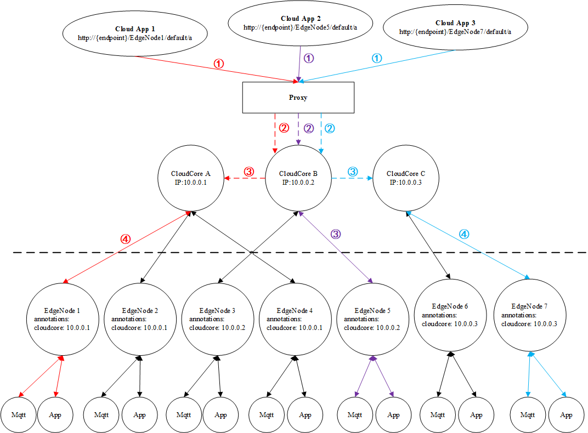

# Add router message high availability.

## Motivation

When the cloudcore adopts a high availability deployment and multiple cloudcores are running simultaneously, when sending user-defined messages from the cloud to the edge, there is a problem of not knowing which cloudcore to send the message from to the corresponding edge core. Users may not be able to send messages correctly to the corresponding edgecore through VIP or a specific cloudcore's IP.

### Goals

- When the cloudcore adopts high availability deployment, users can ensure that messages are correctly sent to the edge core from VIP or a specific cloudcore's IP.

## Background and challenges

- When deploying a cloudcore with high availability, each edgecore will only be successfully connected to one cloudcore at the same time. The specific cloudcore is uncertain because deploying a cloudcore with high availability will consider load balancing. For example, by deploying haproxy, all cloudcores will accept edgecore connections and work.
- When user-defined messages are sent to the edge end through VIP or a specific cloud core IP, they can be forwarded to the corresponding edge core connected to the cloud core for processing.

## Design Details

### Router message high availability design.

   

There are [3](../images/proposals/router.PNG) types of user-defined messages: `cloud app ->edge app, cloud app ->edge mqtt, edge mqtt ->cloud app`. Among them, edge mqtt ->cloud path is not a problem in the case of multiple cloudcores, because each edgecore will only connect to one cloudcore, and the message will be sent to the corresponding connected cloudcore through the edgecore, and then forwarded to the cloud app on the cloud. Therefore, only `cloud app ->edge app` and `cloud app ->edge mqtt` need to be considered here.

1. When the edge node is added to the cluster, the cloudcore will create a node resource for Api-server in upstream. Before creating the node, add an annotation for the node: `cloudcore: {cloudcore-ip}`, where `{cloudcore-ip}` is the IP address where the edge node is connected to the current cloudcore.
2. After creating a session for the ege node in the cloudhub, obtain the resource information of the edge node through Api-server, obtain the value corresponding to the annotation with key of cloudcore, and determine whether the value is the same as the IP of the currently connected cloudcore. If the IP changes, update the value corresponding to the annotation of cloudcore to the IP of the current cloudcore and update it to Api-Server.
3. When a cloud app sends a request to an edge node's app or mqtt, it is forwarded by a highly available component to one of multiple cloudcores. The cloudcore extracts the nodeName from the URL, requests the Api-server based on the nodeName, obtains the node's annotation, and reads the value of the cloudcore field to determine whether the value is the same as the current cloudcore's IP. If it is different, the request is forwarded to the corresponding cloudcore. If it is the same, it is not processed.
