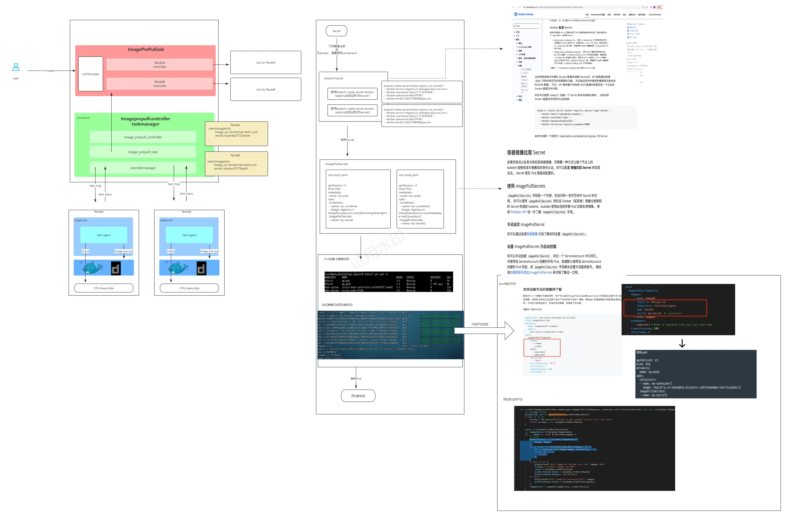

# Image PrePulling Feature Enhancement

## Motivation

### Goals

In the previous version, each task execution currently only supports images from the same image warehouse, and only supports the configuration of one secret. Now, we will enhance this function, which will support covering images and secrets, and can configure multiple secrets to pull images from multiple warehouses.


## Design details

### Architecture




### Ideas

After generating Secrets for different warehouses in advance through Kubectl secret, use the Secret and Image correspondence directly in the API. The Job will perform an apply operation on the edge, pull the image to generate a Pod; after the previous step is completed, delete the generated Pod, that is This ensures that images from different image warehouses are loaded into corresponding nodes.


### Image PrePullController

`ImagePrePullController` is responsible for dealing with ImagePrePullJob, watches the resource with list-watch and sends image prepull message to edgenodes.

- Use List-Watch mechanism to monitor ImagePrePullJob CRD resources, after receiving events from K8s APIServer, then store it in local cache using map.
- Use K8s informer to get node list according to NodeNames or LabelSelector specified in CR, and filter out nodes that don't meet image prepull requirements(1. not edge node, without label "node-role.kubernetes.io/edge": "" 2. edge node is in NotReady state 3. remove duplicated nodes)
- Deal with the status reported from edge nodes and update the ImagePrePullJob.


### override manager

```yaml
NodeA
metchlmanageInfo:
    image_url:dockerhub-test1.com
    secret:kjsahdka7723sdkah
     
```

Kubectl Secret 

Use Kubectl create secret docker-registry to generate secret1 of warehouse 1

```yaml 
Kubectl create secret docker-registry my-secret2 \
 --docker-server=registry.cn-shanghai.aliyuncs.com \
 --docker-username=aliyun7113***** \
 --docker-password=****** \
 --docker-email=2302*****@qq.com
```


### Image PrePull API

```yaml
// ImagePrePullJob is the Schema for the imagePrePullJob API
type ImagePrePullJob struct {
  metav1.TypeMeta   `json:",inline"`
  metav1.ObjectMeta `json:"metadata,omitempty"`

  // Spec represents the specification of the desired behavior of ImagePrePullJob.
  // +required
  Spec ImagePrePullSpec `json:"spec"`

  // Status represents the status of ImagePrePullJob.
  // +optional
  Status ImagePrePullJobStatus `json:"status,omitempty"`
}
  
// ImagePrePullSpec represents the specification of the desired behavior of ImagePrePullJob.
type ImagePrePullSpec struct {
  // ImagePrePullTemplate represents original templates of imagePrePull
  ImagePrePullTemplate ImagePrePullTemplate `json:"imagePrePullTemplate,omitempty"`
  
  // ImagePrePullScope represents the override rules that would apply on imagePrePull job.
  // Will support in next version, more details in [Plan](#Plan) 
  //ImagePrePullScope []ImagePrePullOverrider `json:"imagePrepullScope,omitempty"`
}

  // ImagePrePullTemplate represents original templates of imagePrepull
type ImagePrePullTemplate struct {
  // Images is the image list to be prepull
  Images []string `json:"images`
  
  // NodeNames is a request to select some specific nodes. If it is non-empty,
  // the upgrade job simply select these edge nodes to do upgrade operation.
  // Please note that sets of NodeNames and LabelSelector are ORed.
  // Users must set one and can only set one.
  // +optional
  NodeNames []string `json:"nodeNames,omitempty"`
  // LabelSelector is a filter to select member clusters by labels.
  // It must match a node's labels for the NodeUpgradeJob to be operated on that node.
  // Please note that sets of NodeNames and LabelSelector are ORed.
  // Users must set one and can only set one.
  // +optional
  LabelSelector *metav1.LabelSelector `json:"labelSelector,omitempty"`

  // CheckItems specifies the items need to be checked before the task is executed.
  // The default CheckItems value is disk.
  // +optional
  CheckItems []string `json:"checkItems,omitempty"`

  // FailureTolerate specifies the task tolerance failure ratio.
  // The default FailureTolerate value is 0.1.
  // +optional
  FailureTolerate string `json:"failureTolerate,omitempty"`

  // Concurrency specifies the maximum number of edge nodes that can pull images at the same time.
  // The default Concurrency value is 1.
  // +optional
  Concurrency int32 `json:"concurrency,omitempty"`
  

  // TimeoutSeconds limits the duration of the image prepull job on each edgenode.
  // Default to 300.
  // If set to 0, we'll use the default value 300.
  // +optional
  TimeoutSeconds *uint32 `json:"timeoutSeconds,omitempty"`
  
  // RetryTimes specifies the retry times if image pull failed on each edgenode.
  // Default to 0
  // +optional
  RetryTimes int32 `json:"retryTimes,omitempty"`
}

// ImagePrePullJobStatus stores the status of ImagePrePullJob.
// contains images prepull status on multiple edge nodes.
type ImagePrePullJobStatus struct {
  // State represents for the state phase of the ImagePrePullJob.
  // There are five possible state values: "", checking, pulling, successful, failed.
  State api.State `json:"state,omitempty"`

  // Event represents for the event of the ImagePrePullJob.
  // There are four possible event values: Init, Check, Pull, TimeOut.
  Event string `json:"event,omitempty"`

  // Action represents for the action of the ImagePrePullJob.
  // There are two possible action values: Success, Failure.
  Action api.Action `json:"action,omitempty"`

  // Reason represents for the reason of the ImagePrePullJob.
  Reason string `json:"reason,omitempty"`

  // Time represents for the running time of the ImagePrePullJob.
  Time string `json:"time,omitempty"`

  // Status contains image prepull status for each edge node.
  Status []ImagePrePullStatus `json:"status,omitempty"`
}

// ImagePrePullStatus stores image prepull status for each edge node.
type ImagePrepullStatus struct {
  // TaskStatus represents the status for each node
  *TaskStatus `json:"nodeStatus,omitempty"`

  // ImageStatus represents the prepull status for each image
  ImageStatus []ImageStatus `json:"imageStatus,omitempty"`
}

// TaskStatus stores the status of Upgrade for each edge node.
// +kubebuilder:validation:Type=object
type TaskStatus struct {
  // NodeName is the name of edge node.
  NodeName string `json:"nodeName,omitempty"`
  
  // State represents for the upgrade state phase of the edge node.
  // There are several possible state values: "", Upgrading, BackingUp, RollingBack and Checking.
  State api.State `json:"state,omitempty"`
  
  // Event represents for the event of the ImagePrePullJob.
  // There are three possible event values: Init, Check, Pull.
  Event string `json:"event,omitempty"`
  
  // Action represents for the action of the ImagePrePullJob.
  // There are three possible action values: Success, Failure, TimeOut.
  Action api.Action `json:"action,omitempty"`
  
  // Reason represents for the reason of the ImagePrePullJob.
  Reason string `json:"reason,omitempty"`
  
  // Time represents for the running time of the ImagePrePullJob.
  Time string `json:"time,omitempty"`
}

// ImageStatus represents the image pull status on the edge node
type ImageStatus struct {
  // Image is the name of the image
  Image string `json:"image,omitempty"`

  // State represents for the state phase of this image pull on the edge node.
  // There are two possible state values: successful and failed.
  State api.State `json:"state,omitempty"`
  
  // Reason represents the fail reason if image pull failed
  // +optional
  Reason string `json:"reason,omitempty"`
}

```


#### ImagePrepullJob Sample

```yaml

apiVersion: operations.kubeedge.io/v1alpha1
kind: ImagePrePullJob
metadata:
  name: ImagePrepullExample
  labels:
    description: ImagePrepullLabel
spec:
  imagePrePullTemplate:  
    images: 
      name: image1
      registry: harbor.docker.hub
      respo: jili
      tag: example:v1.0.0
      imageSecret: default/secret
    nodes: 
      - node1
      - node2
    #labelSelector:
    #  matchLabels:
    #    "node-role.kubernetes.io/edge": ""
    #    node-role.kubernetes.io/agent: ""
    
    timeoutSeconds: 300
    retryTimes: 1
  imagePrePullOverriders: 
    - imagePrePullOverrider:
        nodeLabel: "labelexample"
        overriders:
          imageOverriders:
            - component: "Registry"
              operator: "replace"
              value: "hangzhou.registry.io"
          secretOverriders: 
            - component: "SecretName"
              operator: "replace"
              value: "hangzhou-secret"              

 
 
```
