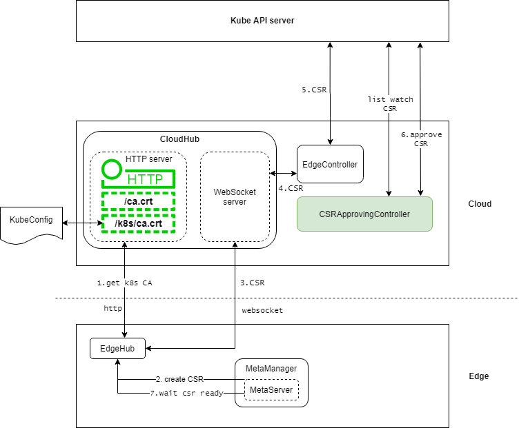

# Support Edge Pods Using InClusterConfig to Access Kube-APIServer 

## Motivation 

In native Kubernetes cluster, pods and Kube-APIServer are usually on the same network plane, and the network quality is good, so pods can directly access the Kube-APIServer through InClusterConfig mode. However, in edge scenario, edge pods and Kube-APIServer are in different network environment, there is no way to directly access using `KUBERNETES_SERVICE_HOST` and `KUBERNETES_SERVICE_PORT`. This proposal proposes an enhancement that will support edge pods using `InClusterConfig` to access Kube-APIServer natively. 

```go
func InClusterConfig() (*Config, error) {
    const (
        tokenFile = "/var/run/secrets/kubernetes.io/serviceaccount/token"
        rootCAFile = "/var/run/secrets/kubernetes.io/serviceaccount/ca.crt"
    )
    host, port := os.Getenv("KUBERNETES_SERVICE_HOST"), os.Getenv("KUBERNETES_SERVICE_PORT")
    if len(host) == 0 || len(port) == 0 {
        return nil, ErrNotInCluster
    }
...
}
```

### Goals

- Edge pods use `InClusterConfig` to access Kube-APIServer natively whether using hostNetworking.

## Background and challenges 

- In KubeEdge, the request traffic for accessing Kube-APIServer is proxied through the MetaServer at edge. Users need to manually modify the Kube-APIServer address to MetaServer for edge pods. This is extremely inconvenient and we hope native Kubernetes applications can be deployed without modifications.
- The certificates on the edge side are issued by CloudHub certificate module, while the CA and related certificates used by edge pods are issued by Kubernetes. Therefore, edge pods will report an authentication error when using the native certificate to access the MetaServer.

## Design Details

This proposal will be divided into three parts of the implementation to introduce the enhancement.

### Issue native certificates for MetaServer from Kubernetes



1. CloudHub http server adds interface `/k8s/ca.crt` for edge nodes to obtain Kubernetes CA certificate. When EdgeHub starts, it will visit this interface.

2. After EdgeHub successfully connects to CloudHub, MetaServer initiates a CSR request and send the message to EdgeHub.

```yaml
apiVersion: certificates.k8s.io/v1
kind: CertificateSigningRequest
metadata:
  name: metaserver-csr-edge-node
spec:
  request: LS0tLS1CRUdJTiBDRVJUSUZJQ0FURSBSRVFVRVNULS0tLS0KTUlJQkdqQ0J3UUlCQURBM01SVXdFd1lEVlFRS0V3eHplWE4wWlcwNmJtOWtaWE14SGpBY0JnTlZCQU1URlhONQpjM1JsYlRwdWIyUmxPbVZrWjJVdGJtOWtaVEJaTUJNR0J5cUdTTTQ5QWdFR0NDcUdTTTQ5QXdFSEEwSUFCTHZSCkJLa3c0cVpMb216aXNGVDhsNmJaU0I1Qm9DV0o5ejMvcTc1WTJNVXl0QTl2K2dSRVlsNkt5d1ByaGREdU12WFIKOWFnMlpCUzF1NmVMY3NlQ0lXU2dLREFtQmdrcWhraUc5dzBCQ1E0eEdUQVhNQlVHQTFVZEVRUU9NQXlIQkg4QQpBQUdIQktuK0ZBb3dDZ1lJS29aSXpqMEVBd0lEU0FBd1JRSWdaSVhkNVQ5SUw3dDNjdDAxb3ArQ1U3Y2d5eFhZCitvZkxWK2lvSEZObk1rRUNJUURhUzZpdWpuVFdhZ3dkOVozVXMvRnU5WFVyYVo1N3BpY3puRGgwM0haUkxBPT0KLS0tLS1FTkQgQ0VSVElGSUNBVEUgUkVRVUVTVC0tLS0tCg==
  signerName: kubernetes.io/kubelet-serving
  usages:
  - digital signature
  - key encipherment
  - server auth
```

The main content of the request is as follows: 
```json
{
  "Subject":{
    "Organization":[
      "system:nodes"
    ],
    "CommonName":"system:node:nodeName",
  },
  "IPAddresses":[
    "127.0.0.1",
    "169.254.30.10"
  ],
}
```

3. EdgeHub forwards CSR request message to CloudHub through the websocket connection.

4. CloudHub forwards CSR request message to EdgeController.

5. EdgeController parsed CSR request message, reassemble into Kubernetes request and forward it to Kube-APIServer. 

6. Add `CSRApprovingController` component to auto-approve MetaServer CSR. More details are described in [CSRApprovingController](#CSRApprovingController). 

7. At the same time, after MetaServer creates CSR, it will wait for the CSR to be issued successfully. And then starts the server with the certificate Kubernetes issued.

#### CSRApprovingController

`CSRApprovingController` is responsible for dealing with CSR. When a new CSR was created, `CSRApprovingController` watch the event and first verify the CSR is valid and whether it was initiated by MetaServer. If the verification passes, it will auto-approve the CSR.


### Non-hostNetwork edge pods access MetaServer

MetaServer only listens on `127.0.0.1:10550` for proxying request, so pods with hostWork=false can not access MetaServer because traffic from `container network namespace` to `127.0.0.1` can not route to edge nodes.

In this feature, MetaServer startup will add a dummy network interface to edge node and listen on this dummy network interface at the same time, so pods with hostWork=false can access MetaServer through this dummy interface.

The default IP address of the dummy network interface is: `169.254.30.10`.

### MetaServer env inject into edge pods. 

When Edge pods use `InClusterConfig` to access Kube-APIServer , It will assemble the URL address through the environment variables `KUBERNETES_SERVICE_HOST` and `KUBERNETES_SERVICE_PORT`. When EdgeCore starts edge pods, it will intercept and inject the address of the MetaServer listening on the dummy interface, so the traffic of the edge pod accessing Kube-APIServer can be proxyed to the MetaServer without perception.

```go
// add env for master service
result = append(result, kubecontainer.EnvVar{Name: "KUBERNETES_SERVICE_HOST", Value: os.Getenv("METASERVER_DUMMY_IP")})
result = append(result, kubecontainer.EnvVar{Name: "KUBERNETES_SERVICE_PORT", Value: os.Getenv("METASERVER_DUMMY_PORT")})
```