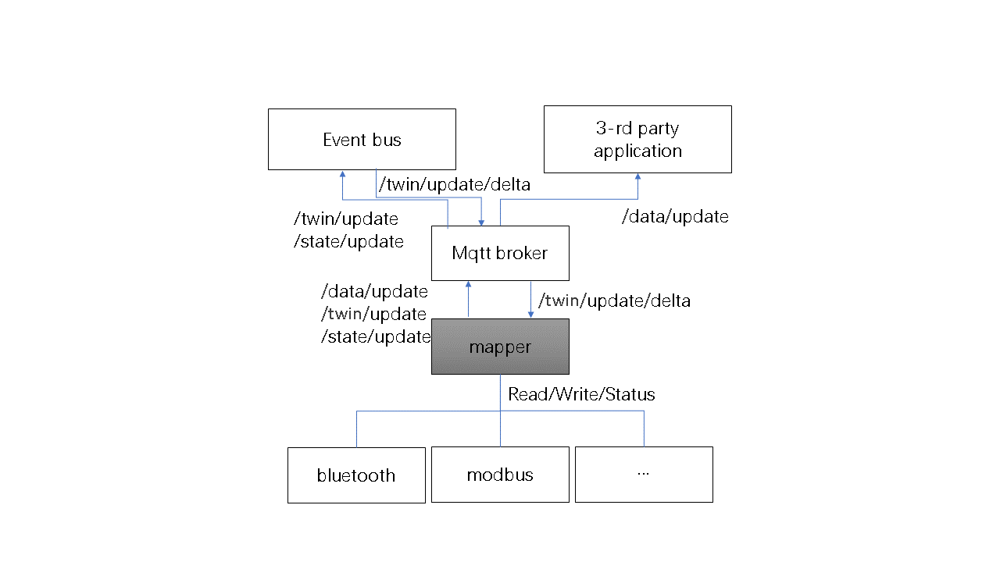

# Mapper Design V2
## Introduction

The original description could refer to the doc [mapper-design.md](https://github.com/kubeedge/kubeedge/blob/master/docs/proposals/mapper-design.md "mapper-design.md").

Mapper is an interface between KubeEdge and devices. It could set/get device data, get and report the device status.
KubeEdge uses device controller, device twin and mapper to control the devices. 
The device controller is on the cloud side, it uses [CRD](https://github.com/kubeedge/kubeedge/blob/master/docs/proposals/device-crd.md "device crd") to define and control devices.
The device twin is on the edge side, it stores the value/status from the mapper and transfers the messages with device controller and mapper.

One mapper is for one type of device and could control multiple devices simultaneously.

The first step to control a device is to configure the device model and device instance. After that, a configmap is generated([configmap example](https://github.com/kubeedge/kubeedge/blob/master/docs/proposals/device-management-enhance.md)). Mapper will parse the configmap when starting.
At run time, the configuration could be changed and the configmap will follow the change, device twin will also send out changing messages.

About the device control/data, there're three types:

1. Twin value. 
```json
"twins":[{
    "propertyName":"io-data",
    "desired":{
        "value":"1",
        "metadata":{
            "type":"int"
        }
    },
    "reported":{
        "value":"unknown"
    }
}]
```
The desired value will be set to the device, the reported value is from device and sent to the device controller. User could define the collect/report cycle and times.

2. Data.
```json
"data":{
    "dataProperties":[
    {
        "metadata":{
            "type":"string"
        },
            "propertyName":"temperature"
    }
    ],
    "dataTopic":"$ke/events/device/+/customized/update"
}
```
The data is from the device and sent to the mqtt server. 3-rd application could subscribe this topic and get the data. 
Users could define the collect/report cycle and times.

3. Device status.
Device status will be collected periodically and sent to device controller.

## Motivation
Simplify the function and extract the common code to SDK. The action & scheduler manager is a little complex and would be removed in this version.

## Goals
* Simplify the structure
* Extract SDK

## Non-goals
* Stream/big package data transportation

## Proposal
### Assumption
The configmap is supposed to be static and only be read when the mapper starts. The reason is:
1. The process to track the change of configmap is complex. Either device twin or mapper has to deal with this configmap change. 
Device twin will also send many changing messages to the mapper. 
Mapper has to receive these messages and also the messages are not enough to get all information and will read the configmap file for more info. 
The process above makes the routine complex.
2. For one node, devices combined to it are almost stable, the change should be minor, so the device configmap is almost unchangeable. The value to deal with this change is minor.
3. Furthermore, we could process the configmap change with K8S style method: restart the container which is easy and simple.

### Architecture
Components are as below:


* Configmap parser: parse the configmap
* Driver: device visit (init, read, write, healthy status or connection status)
* Event process: subscribe, publish Mqtt, message receive and process
* Timer: call the function periodically

***The configmap parser, event process, and timer could be extracted as SDK.***

Other two parts are:
* Flags: configurations including mqtt user/password/Certification
* Makefile: unified compile all mappers or compile one mapper, it should be within the main makefile

### Routine
The main routine is as:


The message interaction among event bus, mqtt broker, mapper, and 3-rd applications is as:


### Topics
| Topic  | Publisher  | Subscriber  | Description  | Requirement  |
| ------------ | ------------ | ------------ | ------------ | ------------ |
|$hw/events/device/+/twin/update/delta   |edgecore   |mapper   |Notify that the expected value changed   |Yes   |
|$hw/events/device/+/twin/update   |mapper   |edgecore   |Update the expected value to cloud  |Yes   |
|$hw/events/device/+/twin/update/result   |edgecore   |mapper   |If edgecore receive the update result   |Optional   |
|$ke/events/device/+/data/update   |mapper   |3-rd application   |Update data required by 3-rd   |Yes   |
|$hw/events/device/+/state/update  |mapper   |edgecore   |Update device status   |Yes   |
|$hw/events/node/+/membership/updated   |edgecore   |mapper   |Notify  device add/remove   |Optional   |
|$hw/events/node/+/membership/get   |mapper   |edgecore   |Query device list   |Optional   |
|$hw/events/node/+/membership/get/result   |edgecore   |mapper   |Result of querying device list   |Optional   |
|SYS/dis/upload_records   |mapper/applications   |cloud   |Upload records to the cloud   |Reserved   |

### Security
Mqtt connection supports both user/password and certification mode.

In the user/password mode, the user/password should be stored in a configuration file.

In the certification mode, we will use one side authentication. The certification of mqtt client is issued by your own CA. The mqtt broker will validate the certification of mqtt client with the CA.

### Miscellaneous
#### Device status definition
```go
type DevStatus int32
const (
    DEVSTOK        DevStatus = 0
    DEVSTERR       DevStatus = 1 /*Expected value is not equal as setting*/
    DEVSTDISCONN   DevStatus = 2 
    DEVSTUNHEALTHY DevStatus = 3 /*Unhealthy status from device*/
)
```
