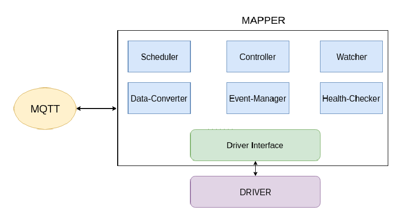

# Mapper Design

## Table of Contents

* [Introduction](#introduction)
* [Motivation](#motivation)
  * [Goals](#goals)
  * [Non\-goals](#non-goals)
  * [User cases](#user-cases)
* [Proposal](#proposal)

## Introduction
Mapper is an application that is used to connect and and control devices. Following are the responsibilities of mapper:
1) Scan and connect to the device.
2) Report the actual state of twin-attributes of device.
3) Map the expected state of device-twin to actual state of device-twin.
4) Collect telemetry data from device.
5) Convert readings from device to format accepted by KubeEdge.
6) Schedule actions on the device.
7) Check health of the device.

Mapper can be specific to a protocol where standards are defined i.e Bluetooth, Zigbee, etc or specific to a device if it a custom protocol.

## Motivation
All devices can be connected and controller by drivers provided by drivers provided by their vendor.
But the message from the device need to be translated into a format understood by KubeEdge.
Also there should be a way to control the devices from the platform. Mapper is the application that interfaces between KubeEdge and devices.
There should be a standard design for mappers supported by KubeEdge for keeping them generic and easy to use. 

### Goals
* A generic way to support multiple devices of different protocols by having a standard design for mappers provided by KubeEdge.
* Easy to use Mapper design.
* Open-up the possibility of having mapper SDK in future which can generate mapper based of configurable inputs.

### Non-goals
* Impose restriction on users to follow this design while writing applications for their device.
* Have a single application that supports multiple devices of different protocols. 

### User cases
1) Manage expected/actual state of a device.
2) Collect telemetry data from devices.
3) Schedule actions and check health of the device.

## Proposal


Please find below the detailed explanation of each component of the mapper.

**1) Action-Manager**: A device can be controlled by setting a specific value in physical register(s) of a device and readings can be acquired by getting the value from specific register(s).
We can define an Action as a group of read/write operations on a device. A device may support multiple such actions. Each of these actions should be supplied through config-file to action manager.
An Operation can be defined using below defined structure
```go
// Operation is structure to define device operation
type Operation struct {
	// Action can be one of read/write corresponding to get/set respectively
	Action string
	// AttributeName is the name of the attribute where action is to be performed.
	// for eg uuid in BLE, holding register in modbus
	AttributeName string
	// AttributeValue is the value of the Attribute.
	AttributeValue string
	// Value is the value to be written in case of write action
	Value string
}
```
An Action is a set of operation(s) and can be defined using below structure
```go
// Action is structure to define a device action
type Action struct {
	// Name is the name of the action
	Name string
	// Operations is the list of operations to be performed for performing this action
	Operations []Operation
}
```
**2) Scheduler**: Scheduler is used to perform action(s) after defined intervals. Schedule can be defined using below structure
```go
// Schedule is structure to define a schedule
type Schedule struct{
	// Name is name of the schedule. It should be unique so that a stop-chan
	// can be made corresponding to name to stop the schedule.
	Name string
	// Frequency is the time in milliseconds after which this actions are to be performed
	Frequency int 
	// Actions is list of Actions to be performed in this schedule
	Actions []Action
}
```

**3) Watcher**: Watcher has 3 responsibilities: 

a) To scan devices(wireless)/wait for device to turn on(wired) and connect to the correct device once it is Online/In-Range. It can use MAC address or any unique address provided by devices. In case of wired devices, GPIO can be an option.

b) Keep a watch on the expected state of the twin-attributes of the device and perform the action(s) to make actual state equal to expected.

c) To report the actual state of twin attributes.

**4) Data-Converter**: Data received from the devices can be in complex formats. eg: HexDecimal with bytes shuffled. This data cannot be directly understood by KubeEdge.
The responsibility of data-converter is the convert the readings into a format understood by KubeEdge.
Many protocols have a standard defined for the reading returned by the device. Hence a common/configurable logic can be used. 

**5) Health-Checker**: Health-Checker can be used to periodically report the state of the device to KubeEdge.
This can be an optional component as not all devices support health-checking. In-future can be extended to report battery-state, malfunctioning when kubeedge supports these attributes.

**6) Controller**: Controller should expose API's for CRUD operations for managing Actions, Schedules, Watchers, Data-Converters, Health-Checkers.

**7) Driver Interface**: Driver Interface is responsible for talking to the the actual device driver while performing an Action. Device drivers can be protocol specific or device specific depending on the type of the device. A corresponding interface should be present in the mapper to talk to the actual driver.
