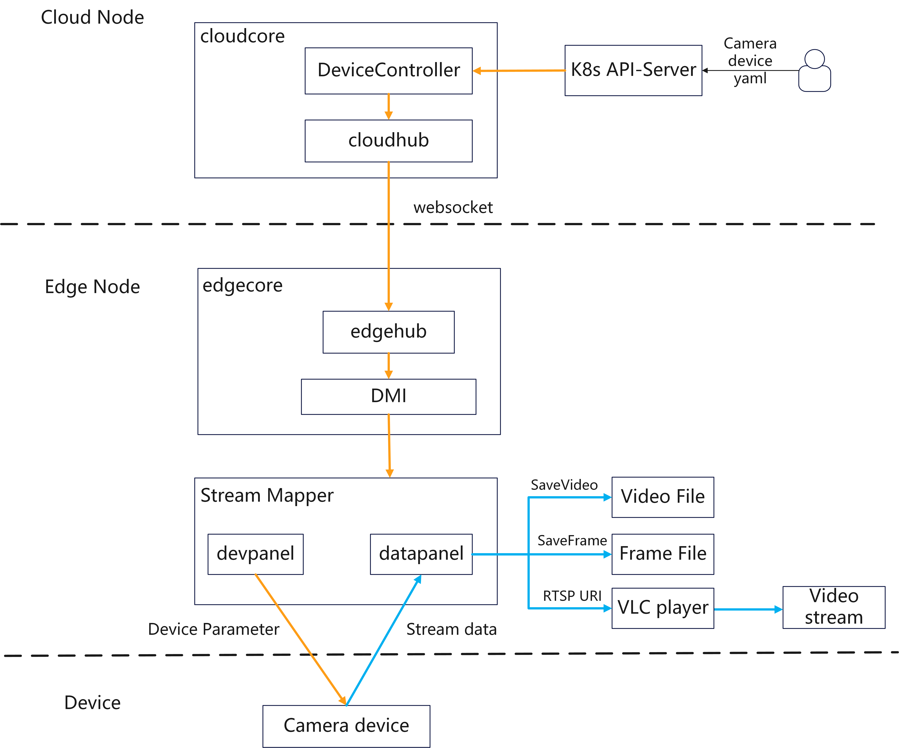

# Mapper Support Video Streaming Data

## Motivation

The data types currently collected by Mapper are discrete, such as `int`,`float` and other data types. 
However, edge devices that collect data in the form of streaming data are also common, such as surveillance cameras in cities. 
Mapper should enhance the management capabilities of streaming data devices.

## Goals

- Mapper can manage camera devices of edge nodes.
- Mapper is able to obtain video streams from camera devices in edge nodes.
- Add streaming data processing capabilities to the Mapper-Framework data plane.
- Mapper is able to forward video streams from edge to the cloud. (still in planning, may support in future)

## Design Details

### Architecture



### Camera Device Management Protocol

Mapper-Framework can generate Mapper of multiple protocols. We need to select the appropriate communication protocol for the video 
streaming device and generate the corresponding Mapper project.

In the field of camera management, `ONVIF` is a commonly used protocol. `ONVIF` is a global and open industry forum, created a standard 
for how IP products within video surveillance and other physical security areas can communicate with each other. For example,
We can use the `ONVIF` protocol to complete features such as camera control and video analysis. The fields of the `ONVIF` protocol can be defined as

```yaml
protocol:
  customizedProtocol:
    protocolName: onvif
    configData:
      url: 192.168.168.64:80
      userName: admin
      password:  # passed by kubernetes secret form
```

In order to adapt to onvif device yaml, the corresponding structure needs to be added to the Mapper device driver.

```go
type ProtocolConfig struct {
    ProtocolName string `json:"protocolName"`
    ConfigData   `json:"configData"`
}

type ConfigData struct {
    URL      string `json:"url,omitempty"` // the url of onvif device
    UserName string `json:"userName"`      // the username of onvif device
    Password string `json:"password"`      // the password of device user
}
```

We can define the IP address and port number of the edge camera device, and also need to define the username and password to access the camera device 
(the password can be mounted in the form of Kubernetes secret to avoid clear text storage)

### Get Device Stream Data

According to the device management protocol, Mapper are able to connect and manage camera devices through third-party dependencies.
After that, Mapper can connect to the device based on the username and password, and obtain the camera `profileToken` and `RTSP` stream URI.
Generally, cameras use `RTSP` stream to provide video streaming services. Therefore, after obtaining the `RTSP` stream URI by Mapper, 
the video collected by the camera can be played through the video player on the edge node like VLC. 

### Process Video Stream

The function of video stream processing is added to the data panel of Mapper-Framework. At the same time, add the data type of `stream` data to the device API.

```go
type ModelProperty struct {
    // Required: The device property name.
    Name string `json:"name,omitempty"`
    // The device property description.
    // +optional
    Description string `json:"description,omitempty"`
    // Required: Type of device property, ENUM: INT,FLOAT,DOUBLE,STRING,BOOLEAN,BYTES,STREAM
    Type PropertyType `json:"type,omitempty"`
}
```

The current version implements the functions of saving RTSP video streams as video files and intercepting video stream frame files. Users can 
use the streaming data processing function implemented in the current version by setting the device-instance configuration file. It also 
supports implementing the user's own streaming data processing function. The relevant field definitions of the yaml file and corresponding 
structures are as follows:

```yaml
- name: saveFrame
  visitors:
    protocolName: onvif
    configData:
      format: jpg             # Video frame file format
      outputDir: /tmp/case/   # Output path of video frame file
      frameCount: 30          # Number of output frame files
      frameInterval: 1000000  # interval between frames, the unit is nanoseconds
      dataType: stream        

- name: saveVideo
  visitors:
    protocolName: onvif
    configData:
      frameCount: 1000        # The number of frames the video clip contains
      format: mp4             # Video file format
      outputDir: /tmp/case/   # Output path of video file
      videoNum: 2             # Number of output video files
      dataType: stream
```
```go
type StreamConfig struct {
    Format        string `json:"format"`
    OutputDir     string `json:"outputDir"`
    FrameCount    int    `json:"frameCount"`
    FrameInterval int    `json:"frameInterval"`
    VideoNum      int    `json:"videoNum"`
}
```

## Plan

In version 1.17
- Enhance Mapper-Framework stream data processing features
- Provide a built-in Mapper of the onvif protocol based on Mapper-Framework

In version 1.18
- Allow the cloud to obtain video streams collected by edge devices
- Allow device control through Mapper (such as camera position information)
