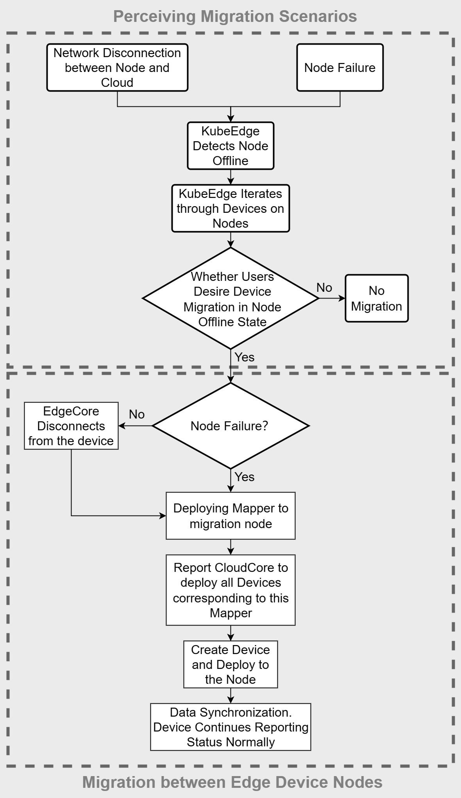
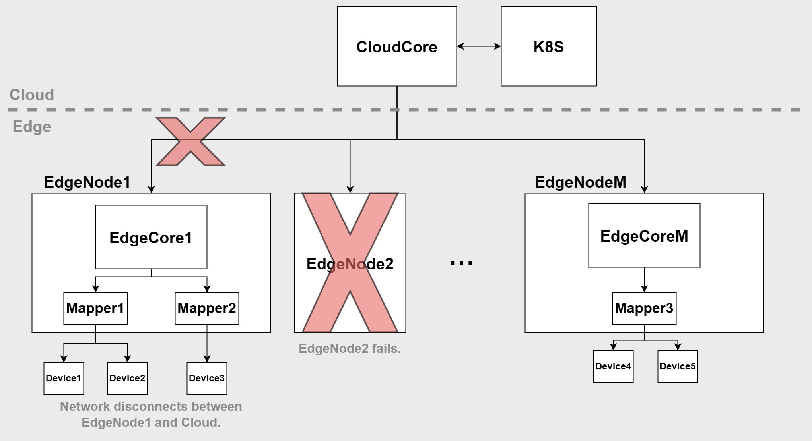
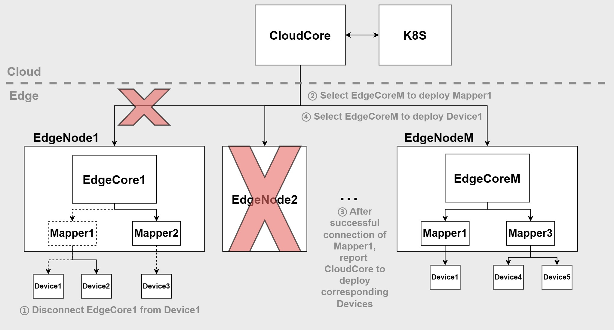

# Migration Solution for Edge Devices among Multi-nodes
* [Migration Solution for Edge Devices among Multi-nodes](#migration-solution-for-edge-devices-among-multi-nodes)
  * [Motivation](#motivation)
    * [Goals](#goals)
    * [Non-goals](#non-goals)
  * [Proposal](#proposal)
    * [User Story](#user-story)
      * [Mapper](#mapper)
      * [Device](#device)
  * [Design Details](#design-details)
    * [Specify multi-node deployment](#specify-multi-node-deployment)
      * [Configure Device and Mapper](#configure-device-and-mapper)
        * [Specify the deployment node group range](#specify-the-deployment-node-group-range)
        * [Bind the Device to the Mapper](#bind-the-device-to-the-mapper)
    * [Implementation of the migration process](#implementation-of-the-migration-process)
      * [Migration scenario awareness](#migration-scenario-awareness)
      * [Migration among nodes](#migration-among-nodes)
        * [Disconnect the Devices to be migrated from the offline node](#disconnect-the-devices-to-be-migrated-from-the-offline-node)
        * [Updates the "currentNode" field of Device CRD](#updates-the-currentnode-field-of-device-crd)
      * [Scenario example](#scenario-example)
  * [Roadmap](#roadmap)
## Motivation
KubeEdge manages the lifecycle of edge devices in a cloud-native manner. In the existing KubeEdge framework, each edge device is bound to a specific edge node. However, when the edge node goes offline, the edge device loses connectivity with KubeEdge. This limitation restricts the connectivity and availability of devices in the edge environment.

This project proposes a solution based on the KubeEdge DMI framework, which selectively migrates devices when an edge node goes offline, improving the high availability of device.
### Goals
* Specify deployable node groups in Mapper to implement the deployment of Mapper through native capabilities of K8S.
* Add the following fields to the Device CRD:
  * "mapperRef" field: This field records the Mapper specified by the user for binding with the Device. KubeEdge queries this field to find the Node where the Mapper is deployed and deploys the Device to that Node. The Device's entire lifecycle is then bound to the specified Mapper.
  * "migrateOnOffline" field: This field records the user's intention for device migration and is used to design a mechanism for determining when to perform device migration operations. It selectively migrates devices on offline nodes based on the user's intention.
  * "currentNode" field: This field records the Node information where the Device is located, facilitating KubeEdge in managing the entire lifecycle of the Device.
* Perceive migration scenario and implement migration process:
  * When a node goes offline, migrate the Mapper on that node.
  * After the Mapper is deployed on the new node, report CloudCore to deploy the corresponding Devices that need to be migrated to the new node.
  * Determine if the user wants the Devices to be migrated when the node is offline. If migration is not desired, no action is taken. If migration is desired, deploy the Devices.
  * After the Devices are connected to the Mapper, they will report data back to the cloud.
### Non-goals
* This solution does not include scenarios where devices are directly connected to nodes via wired connections. Manual intervention is required when switching in such scenarios, making automatic switching less meaningful.
* This solution does not include scenarios where the Mapper is deployed in binary form. Binary deployment cannot leverage the native workload orchestration capabilities of K8S.
## Proposal
### User Story
#### Mapper
Before deploying the Device, users need to deploy the corresponding Mapper based on the native workload of K8S and specify the deployable node groups, such as Deployment, in the Mapper.
* "nodeSelector" field: Users label the nodes in the candidate node groups and add the corresponding label to the "nodeSelector" field in the Mapper. This implicitly indicates the range of candidate node groups, i.e., the nodes with the specified label.
  ```yaml
  apiVersion: v1
  kind: Node
  metadata:
    name: node1
    labels:
      example-mapper-deployable: true
  spec:
    ...
  ```
  ```yaml
  ...
  metadata:
    name: example-mapper
  spec:
    ...
    template:
      ...
      spec:
        nodeSelector:
          example-mapper-deployable: true
        ...
  ```
* "affinity" field: Users explicitly indicate all the nodes in the candidate node groups by providing information that uniquely identifies the nodes, such as listing the nodename.
  ```yaml
  ...
  metadata:
    name: example-mapper
  spec:
    ...
    template:
      ...
      spec:
        affinity:
          nodeAffinity:
            requiredDuringSchedulingIgnoredDuringExecution:
              nodeSelectorTerms:
              - matchExpressions:
                - key: kubernetes.io/hostname
                  operator: In
                  values:
                  - node1
                  - node2
        ...
  ```
* "nodeName" field: If there is only one node in the candidate node group, users specify the unique value for deploying the Mapper in the candidate node group by filling in this field.
  ```yaml
  ...
  metadata:
    name: example-mapper
  spec:
    ...
    template:
      ...
      spec:
        nodeName: node1
        ...
  ```
#### Device
When deploying the Device, users can achieve consistency in the deployment node domain, the node where it resides, and the entire lifecycle by filling in the "mapperRef" field to bind the Device with the Mapper. Additionally, users can use the newly added "currentNode" field to view the node where the device is located and get its real-time status.
1. Bind Mapper
* "mapperRef" field: Users indicate the binding of the entire lifecycle of the device with the specified Mapper by filling in the "mapperRef" field in the Device.
  ```yaml
  apiVersion: devices.kubeedge.io/v1alpha2
  kind: Device
  metadata:
    name: example-device
    ...
  spec:
    mapperRef:
      type: Deployment
      name: example-mapper
  ...
  ```
2. User migration intention
* "migrateOnOffline" field: Users indicate whether the device needs to be migrated when the node is offline by filling in this field.
  ```yaml
  apiVersion: devices.kubeedge.io/v1alpha2
  kind: Device
  metadata:
    name: example-device
  spec:
    ...
    migrateOnOffline: false
  status:
    ...
  ```
3. Display the current node
* "currentNode" field: Users can determine the current node where the device is located by viewing the value of this field.
  ```yaml
  apiVersion: devices.kubeedge.io/v1alpha2
  kind: Device
  metadata:
    name: example-device
  spec:
    ...
  status:
    boundNode: "node1"
  ```
## Design Details
### Specify multi-node deployment
In the previous design of KubeEdge, there was a direct binding relationship between Device and Node, where Device scheduling and deployment were directly selected on a Node. However, there was still a need for a Mapper to bridge the gap between them. Considering only the scheduling of Devices without simultaneously handling the Mapper would limit the significance of such scheduling and impact the user experience.

To improve this, in the new design, we have added a "mapperRef" field in the Device CRD. This allows the direct binding relationship between Device and Node to be decomposed into a second-order binding relationship between Device and Mapper, and Mapper and Node. This enables consistent deployment of Devices and Mappers. Even if a Node goes offline, it can still solve the problem of jointly scheduling and migrating both, maintaining the consistency of the lifecycle of Devices and Mappers.
#### Configure Device and Mapper
The process of binding devices to multiple nodes for deployment is as follows:
1. Specify the deployment node group range in the Mapper.
2. Bind the Device to the Mapper.
##### Specify the deployment node group range
Specify the deployment node group range for the Mapper and the bound Device by filling in fields in the Mapper.spec.template. This can be done by referring to the nodeSelector, Affinity, and nodeName fields similar to how it is done for pods. KubeEdge considers various factors such as node load and hardware configuration, among others, to schedule the Mapper on the most optimal node from the specified candidate node groups.
##### Bind the Device to the Mapper
Bind the corresponding Mapper to the Device by filling in the "mapperRef" field in the Device.spec. This implicitly indicates the deployment range for the Device. After deploying the Device, KubeEdge searches for the node where the Mapper is located and brings the Device to that node. The Device is then connected to the Mapper and reports information to the cloud.

### Implementation of the migration process
#### Migration scenario awareness
The primary determining factor for KubeEdge to decide whether to perform device migration is user intention. Therefore, a boolean field called "migrateOnOffline" is added to the Device CRD to indicate whether the user wants the device to be migrated when the node is offline.

KubeEdge considers a node offline if it cannot establish communication with it, which can occur due to two reasons:
1. Network disconnection between the node and the cloud.
2. Node failure.

When a node goes offline, KubeEdge evaluates the migration requirements for devices on that node. If the user has specified that a device should be migrated when the node is offline, KubeEdge initiates the migration process for that device. If migration is not required, no action is taken.
#### Migration among nodes
The steps for KubeEdge to execute the migration process are as follows:
1. The EdgeCore on the offline node disconnects from the Device using the DMI interface.
2. KubeEdge redeploys the Mapper to the new Node.
3. After the successful deployment of the Mapper, it reports the CloudCore to deploy the corresponding Device to the new node where the Mapper is located.
4. Once the Device successfully connects to the Mapper, it updates the Device.status.currentNode field and continues to report its status to the cloud as usual.
##### Disconnect the Devices to be migrated from the offline node
In the event of a network disconnection between the node and the cloud, Edgecore detects the disconnection and disconnects all devices connected to it. 

In the case of node failure, the node automatically disconnects from the devices. This operation avoids the possibility of devices remaining connected to the original node and causing subsequent migration nodes to be unable to connect to the devices properly.
##### Updates the "currentNode" field of Device CRD
Add the currentNode field to the Device CRD, which indicates the current node where the device is located.

1. When the device is initially deployed by CloudCore, the Device.status.currentNode field in the cloud storage is set to "". After the device successfully connects to the corresponding Mapper on the node, it reports to the cloud, and the cloud updates the Device.status.currentNode field accordingly.

2. When CloudCore detects a node going offline, it sets the device.status.currentNode field to "" for all devices on that offline node. After the devices that need to be migrated are connected to the Mapper on the migration node, the Mapper reports to the Edgecore and the cloud, and the cloud updates the corresponding device.status.currentNode information. The currentNode field presents the information about the node where the device is located, facilitating the management and maintenance of the device lifecycle and enabling better implementation of multi-node migration for edge devices.



#### Scenario example




## Roadmap
* July 21, 2023: Design the multi-node migration solution for edge devices, undergo community review, and submit a proposal to the KubeEdge community.
* July 28, 2023: Select Mapper and devices, familiarize oneself with the use of the simulator.
* August 23, 2023: Modify Device CRD to implement migration scenario awareness.
* September 6, 2023: Implement the process of multi-node device migration.
* September 20, 2023: Improve and enhance the functionality.
* October 18, 2023: Modify and test the code based on community review feedback, perform code integration and organization.
* October 30, 2023: Write test cases, prepare comprehensive documentation, write the final report, and submit it.