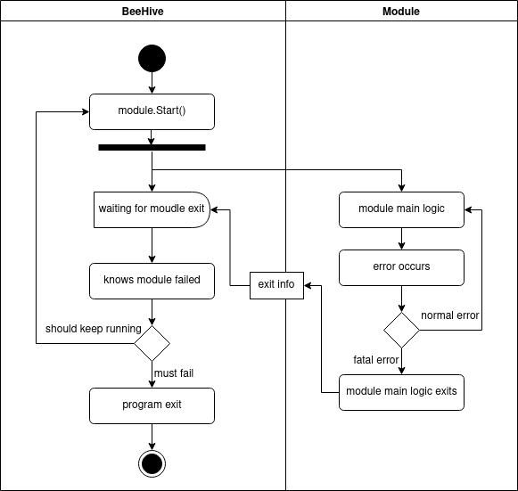

# Module Restarting

## Motivation

Edgecore modules could fail to start due to non-configurable and recoverable matters such as process starting order. For example, if edgecore starts before containerd.socket is ready, edged fails to run kubelet and edgecore exits.

In fact, it costs a lot if a program alway exits for matters outside the program itself. And delay of restarting the program is unbearable in some time-sensitive situations. For errors outside KubeEdge, it would be better if we could only retry the failing modules after some interval.

## Goals

- Improve BeeHive framework to support restarting modules.

## Scenarios

This proposal is for Kubeedge in industrial production. Every product runs edgecore as an edge-site node. 

We use the term `user` to indicate consumers who have bought products which are developed based on Kubeedge. And the term `developer` indicates those who have knowledge of `cloudcore`, `edgecore` and `keadm`, etc.

Users are not able to handle problems of products except rebooting. And Developers cannot directly operate products delivered to users.

Then, here comes two facts:

- Edge-site devices can be powered down and up frequently e.g. vehicles, smart home devices. They could be powered up at any time.
- Edge-site devices are operated by users with no knowledge of Kubeedge. Once some module works incorrectly, edgecore exits and the users treat it as the device fails completely. Users would reboot devices again and again.

## Design Details

If a module is enabled in configuration files, neither users or developers want the module fail to work properly.

Modules are started by BeeHive, so apparently BeeHive is responsible for modules' lifecycle. BeeHive is the communication framework of KubeEdge but works not only for communication. If a module fails, BeeHive should decide what to do next. Modules can tell BeeHive to keep module running or to exit the program, but modules should not exit the program directly to ruin other modules' normal procedure, causing potential data loss. 

In `module.Start()`, errors are variant. Semantically, for some module `m`, it's `m`'s own job to handle errors occured in `m`'s main logic. If `m` doesn't have ability to handle the error, `m` should inform BeeHive that `m` failed in its main loop. After `m`'s failure infomation, BeeHive knows `m` has failed, and retries `m.Start()` to keep it working or exits.

Activity diagram for module restarting: 



## Plan

The alpha feature will be implemented in version 1.17. In alpha implement, we will use `featureGate` to enable the feature manually.

With `moduleRestart` feature enabled, if some module's `Start()` returns, BeeHive will call `Start()` again to keep the module running.

The alpha implement will try keeping modules running forever with backoff time like how Kubelet keep pods running on edge site only. And edge-site modules should not exit by non-configuration errors during running. If registration error occurs, it's ok to exit because with failure of registration a module could never starts.

Procedure for restarting modules(alpha ver.):

```text
//  procedure: start/restart a module(alpha)
1.  m := some module enabled
2.  maxBackoffDuration := some specific time configured or embedded
3.  backoffDuration := some specific time as initial
4.
5.  begin loop:
6.    start module m
7.    wait until m exits
8.    wait for backoffDuration
9.    backoffDuration *= 2
10.   if backoffDuration > maxBackoffDuration:
11.     backoffDuration = maxBackoffDuration
12. end loop;
```

Here are some issues not completely considered in alpha version(==1.17). In the future(>1.17), we should discuss and consider further about:

- When a started module is working properly.
- What a recoverable error is in each module.
- Whether restarting loop backoff should have limit.
- Whether error messages inside a module should be exposed to BeeHive.
- Where this feature should be configured. Globally or within modules.
- Difference between Research&Development and Industrial Production to make the feature more suitable to different use cases.
