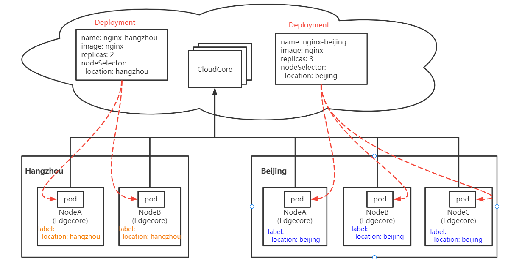
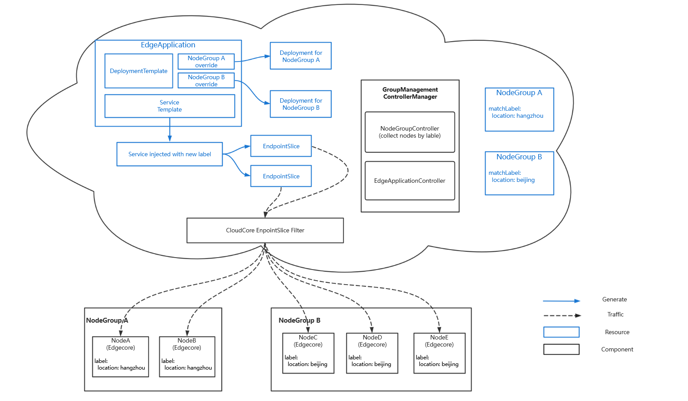

# Node Group Management

- [Node Group Management](#node-group-management)
	- [Summary](#summary)
	- [Motivation](#motivation)
		- [Goals](#goals)
		- [Non-goals](#non-goals)
	- [Design Details](#design-details)
		- [Architecture](#architecture)
		- [GroupManagementControllerManager](#groupmanagementcontrollermanager)
			- [NodeGroupController](#nodegroupcontroller)
			- [EdgeApplicationController](#edgeapplicationcontroller)
		- [EndpointSlice Filter in CloudCore](#endpointslice-filter-in-cloudcore)
		- [NodeGroup API](#nodegroup-api)
		- [EdgeApplication API](#edgeapplication-api)
	- [Use Cases](#use-cases)
		- [Example](#example)
	- [Plan](#plan)
		- [Develop Plan](#develop-plan)

## Summary
In some scenarios, we may want to deploy an application among several locations. In this case, the typical practice is to write a deployment for each location, which means we have to manage several deployments for one application. With the number of applications and their required locations continuously increasing, it will be more and more complicated to manage.  
The node group management feature will help users to manage nodes in groups, and also provide a way to control how to spread pods among node groups and how to run different editions of pod instances in different node groups.

## Motivation
In edge computing scenarios, nodes are geographically distributed. The same application may be deployed on nodes at different locations.

Taking Deployment as an example, the traditional practice is to set the same label for edge nodes in the same location, and then create Deployment per location. Different deployments will deploy applications at different locations specified by their NodeSelector.



However, with the number of locations increasing, operation and maintenance of applications become more and more complex. 

### Goals
* Use a single resource to manage an application deployed at different locations.
* Users can specify the number of pods and the differences of pod instances running in each node group.
* Non-intrusive for kubernetes native control plane
* Limit service endpoints in the same location as the client pod, called service scope feature below.

### Non-goals
* Create another systematic machanism to take over the work of application lifetime management, such as rolling update which is the responsibility of deployment.
* Create a new CRD for each kind of application.

## Design Details
### Architecture


The implementation consists of two components. a new `GroupManagementControllerManager` and the endpointslice filter in the `cloudcore`. The `GroupManagementControllerManager` contains controllers of new CRDs, including `NodeGroupController` and `EdgeApplicationController`. The endpointslice filter is used to filter endpoints in endpointslices before sending them to the edgecore so as to make edgecore only aware of the endpoints in the same node group.

NodeGroup will organize nodes according to their labels which should be set based on their locations in advance, `location: hangzhou` and `location: beijing` in this case. After applying the NodeGroup resource, nodes will be grouped in `hangzhou` and `beijing` logically.

The EdgeApplication resource contains the template of the application to deploy.Through EdgeApplication API, users can apply the different editions of the application template for each node group, such as specifying the image registry for each node group. After applying the EdgeApplication resource, the EdgeApplication controller will take the application template and override it generating serval different editions according to the specification. And then these applications will run in their nodegroups respectively.

### GroupManagementControllerManager 
`GroupManagementControllerManager` contains two controllers, called `NodeGroupController`, and `EdgeApplicationController`, which take over the lifetime mangement of EdgeApplication and NodeGroup respectively.

#### NodeGroupController
`NodeGroupController` is responsible for collecting nodes belonging to the NodeGroup according to node names or labels and filling the status field. `NodeGroupController` watches the nodegroup resource and node resource. When nodes are added, deleted or their labels are updated, it will add/remove these nodes in/from the relative node groups.

#### EdgeApplicationController
`EdgeApplicationController` is responsible for creating, updating and deleting the subresources manifested in the EdgeApplication.
1. When EdgeApplication has been created, it will create and override the subresource for each specified node group.
2. When EdgeApplication has been updated, it will update relative fields of subresources.
3. When EdgeApplication has been deleted, it will delete all manifested subresources.  

### EndpointSlice Filter in CloudCore
The endpointslice filter in cloudcore takes the responsibility of filtering out endpoints in the endpointslice before sending them to the edge. Clients, possibly kube-proxy, at edge which ask for the endpointslice from the cloudcore will only get endpointslice containing endpoints in their node groups. Thus, the pod, for example running in the node group A, can only reach endpoints in node group A.

### NodeGroup API
NodeGroup represents a group of nodes that have the same labels.
```go
// NodeGroup is the Schema for the nodegroups API
type NodeGroup struct {
	metav1.TypeMeta   `json:",inline"`
	metav1.ObjectMeta `json:"metadata,omitempty"`

	// Spec represents the specification of the desired behavior of member nodegroup.
	// +required
	Spec NodeGroupSpec `json:"spec"`

	// Status represents the status of member nodegroup.
	// +optional
	Status NodeGroupStatus `json:"status,omitempty"`
}

// NodeGroupSpec defines the desired state of NodeGroup
type NodeGroupSpec struct {
	// Nodes contains names of all the nodes in the nodegroup.
	// +optional
	Nodes []string `json:"nodes,omitempty"`

	// MatchLabels match the nodes that have the labels
	// +optional
	MatchLabels map[string]string `json:"matchLabels,omitempty"`
}

// NodeGroupStatus defines the observed state of NodeGroup
type NodeGroupStatus struct {
	// ContainedNodes represents names of all nodes the nodegroup contains.
	// +optional
	ContainedNodes []string `json:"containedNodes,omitempty"`
}
```

### EdgeApplication API
EdgeApplication contains the template of the application orgainzed by node groups. It also contains the information of how to deploy different editions of the application to different node groups.

```go
// EdgeApplication defines a list of resources to be deployed on the node groups.
type EdgeApplication struct {
	metav1.TypeMeta   `json:",inline"`
	metav1.ObjectMeta `json:"metadata,omitempty"`

	// Spec represents the desired behavior of EdgeApplication.
	Spec EdgeAppSpec `json:"spec"`

	// Status represents the status of PropagationStatus.
	// +optional
	Status EdgeAppStatus `json:"status,omitempty"`
}

// EdgeAppSpec defines the desired state of EdgeApplication.
type EdgeAppSpec struct {
	// WorkloadTemplate represents original templates of manifested resources to be deployed in node groups.
	WorkloadTemplate ResourceTemplate `json:"workloadTemplate,omitempty"`
	// WorkloadScope represents which node groups the workload will be deployed in.
	WorkloadScope WorkloadScope `json:"workloadScope"`
}

// WorkloadScope represents which node groups the workload to be deployed in.
type WorkloadScope struct {
	// TargetNodeGroups represents the target node groups of workload to be deployed.
	// +optional
	TargetNodeGroups []TargetNodeGroups `json:"targetNodeGroups,omitempty"`
}

// TargetNodeGroups represents the target node groups of workload to be deployed, including
// override rules to apply for this node group.
type TargetNodeGroups struct {
	// Name represents the name of target node group
	Name string `json:"name"`
    // Overriders represents the override rules that would apply on resources.
	Overriders Overriders `json:"overriders,omitempty"`
}

// ResourceTemplate represents original templates of manifested resources to be deployed in node groups.
type ResourceTemplate struct {
	// Manifests represents a list of Kubernetes resources to be deployed on the managed node groups.
	// +optional
	Manifests []Manifest `json:"manifests,omitempty"`
}

// Overriders represents the override rules that would apply on resources.
type Overriders struct {
	// Replicas will override the replicas field of deployment
	// +optional
	Replicas int `json:"replicas,omitempty"`
	// ImageOverriders represents the rules dedicated to handling image overrides.
	// +optional
	ImageOverrider []ImageOverrider `json:"imageOverriders,omitempty"`
}

// ImageOverrider represents the rules dedicated to handling image overrides.
type ImageOverrider struct {
	// Predicate filters images before applying the rule.
	//
	// Defaults to nil, in that case, the system will automatically detect image fields if the resource type is
	// Pod, ReplicaSet, Deployment or StatefulSet by following rule:
	//   - Pod: spec/containers/<N>/image
	//   - ReplicaSet: spec/template/spec/containers/<N>/image
	//   - Deployment: spec/template/spec/containers/<N>/image
	//   - StatefulSet: spec/template/spec/containers/<N>/image
	// In addition, all images will be processed if the resource object has more than one containers.
	//
	// If not nil, only images matches the filters will be processed.
	// +optional
	Predicate *ImagePredicate `json:"predicate,omitempty"`

	// Component is part of image name.
	// Basically we presume an image can be made of '[registry/]repository[:tag]'.
	// The registry could be:
	// - k8s.gcr.io
	// - fictional.registry.example:10443
	// The repository could be:
	// - kube-apiserver
	// - fictional/nginx
	// The tag cloud be:
	// - latest
	// - v1.19.1
	// - @sha256:dbcc1c35ac38df41fd2f5e4130b32ffdb93ebae8b3dbe638c23575912276fc9c
	//
	// +kubebuilder:validation:Enum=Registry;Repository;Tag
	// +required
	Component ImageComponent `json:"component"`

	// Operator represents the operator which will apply on the image.
	// +kubebuilder:validation:Enum=add;remove;replace
	// +required
	Operator OverriderOperator `json:"operator"`

	// Value to be applied to image.
	// Must not be empty when operator is 'add' or 'replace'.
	// Defaults to empty and ignored when operator is 'remove'.
	// +optional
	Value string `json:"value,omitempty"`
}

// ImagePredicate describes images filter.
type ImagePredicate struct {
	// Path indicates the path of target field
	// +required
	Path string `json:"path"`
}

// ImageComponent indicates the components for image.
type ImageComponent string

// OverriderOperator is the set of operators that can be used in an overrider.
type OverriderOperator string

// These are valid overrider operators.
const (
	OverriderOpAdd     OverriderOperator = "add"
	OverriderOpRemove  OverriderOperator = "remove"
	OverriderOpReplace OverriderOperator = "replace"
)

// Manifest represents a resource to be deployed on managed node groups.
type Manifest struct {
	// +kubebuilder:pruning:PreserveUnknownFields
	runtime.RawExtension `json:",inline"`
}

// EdgeAppStatus defines the observed status of workloads.
type EdgeAppStatus struct {
	// ManifestStatuses contains a list of running statuses of generated workloads.
	// +optional
	ManifestStatuses []ManifestStatus `json:"manifestStatuses,omitempty"`
}

// ManifestStatus contains running status of a specific manifest in spec.
type ManifestStatus struct {
	// Identifier represents the identity of a resource linking to manifests in spec.
	// +required
	Identifier ResourceIdentifier `json:"identifier"`

	// Conditions contain the different condition statuses for this manifest.
	// Valid condition types are:
	// 1. Processing: this workload is under processing and the current state of manifest does not match the desired. 
	// 2. Available: the current status of this workload matches the desired.
	// +optional
	Conditions metav1.Condition `json:"conditions,omitempty"`
}

// ResourceIdentifier provides the identifiers needed to interact with any arbitrary object.
type ResourceIdentifier struct {
	// Ordinal represents an index in manifests list, so the condition can still be linked
	// to a manifest even though manifest cannot be parsed successfully.
	Ordinal int `json:"ordinal"`

	// Group is the group of the resource.
	Group string `json:"group,omitempty"`

	// Version is the version of the resource.
	Version string `json:"version"`

	// Kind is the kind of the resource.
	Kind string `json:"kind"`

	// Resource is the resource type of the resource
	Resource string `json:"resource"`

	// Namespace is the namespace of the resource
	Namespace string `json:"namespace"`

	// Name is the name of the resource
	Name string `json:"name"`
}

const (
	// EdgeAppProcessing represents that the workload is under processing and currently
	// the status of the workload does not match the desired.
	EdgeAppProcessing string = "Processing"
	// EdgeAppAvailable represents that the workload has been applied successfully and the current
	// status matches the desired.
	EdgeAppAvailable string = "Available"
)
```

## Use Cases
* Create NodeGroup CRs to specify some node groups and nodes belonging to them.
* Fill the `EdgeAppSpec.WorkloadTemplate` field of EdgeApplication with the application you want to deploy.
* Fill the `EdgeAppSpec.WorkloadScope` field of EdgeApplication to specify the instance numbers or other differences for each node group where you want to deploy the application.
* Apply the EdgeApplication resource and check its status. 

### Example
We give an example of how to use NodeGroup and PropagationPolicy APIs. 

Assuming that we have 5 nodes at edge, 2 in Hangzhou and 3 in Beijing, called NodeA, NodeB, NodeC, NodeD and NodeE respectively. NodeA and NodeB, which are located in Hangzhou, have the label `location: hangzhou`. NodeC, NodeD and NodeE, which are located in Beijing, have the label `location: beijing`. We want to apply a deployment called nginx, having 2 instances in Hangzhou and 3 instances in Beijing. And we want to use the service scope feature making them can only be reached when clients are in the same node group as the pod instance.

First, we create nodegroups called beijing and hangzhou. The yaml is as follows:

```yaml
apiVersion: apps.kubeedge.io/v1alpha1
kind: NodeGroup
metadata:
  name: hangzhou
spec:
  matchLabels:
    location: hangzhou
---
apiVersion: apps.kubeedge.io/v1alpha1
kind: NodeGroup
metadata:
  name: beijing 
spec:
  matchLabels:
    location: beijing
```

Second, create the EdgeApplication resource. In this case, we want 2 pods to run in Hangzhou and 3 pods to run in Beijing. Also, we want these pods to use their local image registry and enable the service scope feature. Thus, we can apply the EdgeApplication like this:

```yaml
apiVersion: apps.kubeedge.io/v1alpha1
kind: EdgeApplication
metadata:
  name: nginx-app 
spec:
  workloadTemplate:
    manifests:
    - apiVersion: apps/v1
      kind: Deployment
      metadata:
        name: nginx
      spec:
        selector:
          matchLabels:
            app: nginx
        template:
          metadata:
            labels:
              app: nginx
          spec:
            containers:
            - name: nginx
              image: nginx:latest
            ports:
            - containerPort: 80
    - apiVersion: v1
      kind: Service
      metadata:
        name: nginx-service
      spec:
        selector:
          app: nginx
        ports:
        - name: http
          protocol: TCP
          port: 80
          targetPort: 8080
        type: LoadBalancer
  workloadScope:
    targetNodeGroups:
      - name: hangzhou
        overriders:
          replicas: 2
          imageOverriders:
            - component: "registry"
              operator: "replace"
              value: "hangzhou.registry.io"
      - name: beijing
        overriders:
          replicas: 3
          imageOverriders:
            - component: "registry"
              operator: "replace"
              value: "beijing.registry.io"
```
Then two deployments called `nginx-hangzhou` and `nginx-beijing` will be created for hangzhou nodegroup and beijing nodegroup with `replicas: 2` and `replicas: 3` respectively. Pods running in hangzhou nodegroup will use the image `hangzhou.registry.io/nginx:latest` and pods running in beijing nodegroup will use the image `beijing.resistry.io/nginx.latest`. 

The service in the EdgeApplication will also be created and injected with label `groupmanagement.kubeedge.io/edgeapplication-name: nginx-app`. The endpointslice filter in the cloudcore will check the relative EdgeApplication when sending the endpointslice to the edgecore in some nodegroup. It will filter out endpoints not in that nodegroup. Then, clients running in hangzhou node group can only reach the 2 pod instances that are also running in hangzhou node group. The situation of beijing node group is the same.

## Plan
### Develop Plan
- alpha
  - [ ] Support Deployment
  - [ ] Support override of replicas and image field
  - [ ] Collect status of manifested subresource of EdgeApplication
- beta
  - [ ] Support service scope feature
  - [ ] Support ingress
