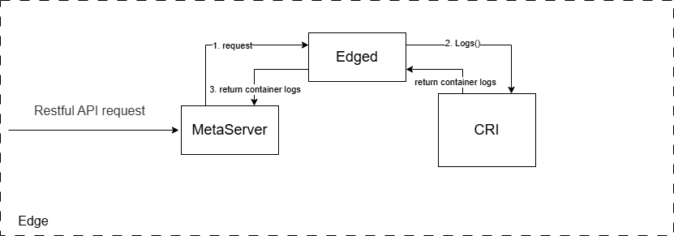
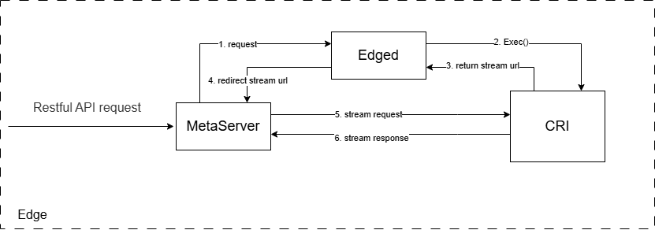
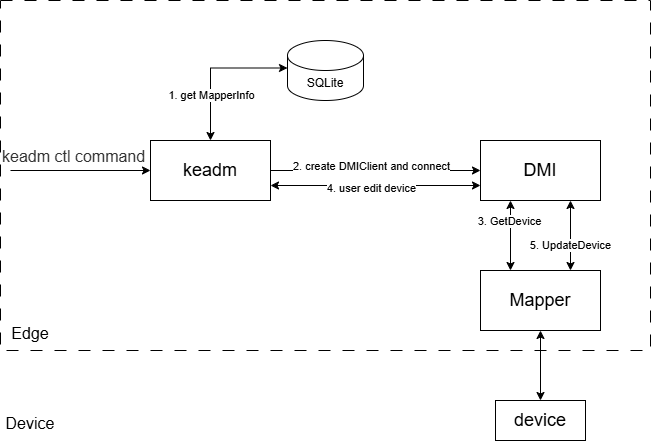

# Support the operation of data surface resources in offline scenarios of edge nodes
## Abstract

Supports the use of the `keadm ctl` command to manipulate data within a edge node while offline.

## Motivations

In edge computing scenarios, edge nodes are usually under different networks from the cloud and are often offline due to network fluctuations and other issues. If the edge node is offline, users can only wait for the edge node to come online to perform operations from the cloud if they find any abnormality in the pod or device.

However, the data related to pods and devices are stored locally on the edge nodes, and due to the existence of edged, it is feasible in principle to obtain the data and operate the resources on the edge nodes. The support of this feature will reduce the network resource consumption of the edge node for debugging and resource adjustment, and avoid the situation that some functions of the KubeEdge platform are not available when the edge node is offline.

## Goals

1. Supports logs/exec/describe operations on pods when the edge node is offline:
   - Implement the corresponding Restful API interface;
   - Complete the command line tool;
2. Supports get/describe/edit operations on devices when the edge node is offline:
   - Implement the corresponding Restful API interface;
   - Complete the command line tool;

## Design Details 

The project as a whole can be divided into two parts: Restful API implementation, command line function implementation.

Command line function implementation can be carried out on the basis of Restful API implementation.

### Restful API

- `describe pod`: Uses `MetaServer` existing API interface;
- `get/describe device`: Uses `MetaServer` existing API interface;
- `logs/exec pod`: Need to use the `CRI` to interact with the container to get the relevant information; Implement this interface in`MetaServer` ;
- `edit device`: Modifications to device are made directly by the command line tool calling the DMI interface , no need to implement the interface.

#### **logs pod**

Process Design: 



- Interface Implementation:
  1. `MetaServer` gets the `pod` information for the desired operation, generates a request, and calls the `Edged` interface: GET /containerLogs/{podNamespace}/{podID}/{containerName};
  2. `Edged` calls the `CRI` interface and requests the relevant container logs;
  3. Write back the log message to print the container log.

#### **exec pod**

Process Design: 



- Interface Implementation:
  1. `MetaServer` gets the `pod` information for the desired operation, generates a request, and calls the `Edged` interface: GET /exec/{podNamespace}/{podID}/{containerName}
  2. `Edged` calls the `CRI` to request the streaming endpoint url needed for exec;
  3. `CRI` returns the corresponding stream url;
  4. `edged` returns the url as `Redirect`;
  5. Request redirected to `StreamingServer` of `CRI Shim`;
  6. Maintains a long connection to the `StreamingServer`.

#### **describe pod** 

- The corresponding interfaces are already implemented on MetaServer, just build the corresponding API requests: `GET /api/v1/namespaces/{namespace}/pods/{podName}`, `GET /apis/events.k8s.io/v1/namespaces/{namespace}/events` to get `corev1.Pod/PodList` and `corev1.EventList` (current edge does not report events, reserved interface).

#### **get device**

- The interface is implemented on MetaServer and stores `Device` information in sqlite, just build the API request to get `v1beta1.Device` or `v1beta1.DeviceList`.

#### **describe device**

- The corresponding interface has been implemented on MetaServer, when it receives Restful API request, it builds the corresponding API request to get `v1beta1.Device/DeviceList` and `corev1.EventList` (the current edge node can't report event, and the edge sqlite doesn't store the event data, reserving the interface).

### Command Line Tools Implementation

The aforementioned work implements the Restful API interface of MetaServer, so it is possible to perform relevant operations on resources by calling the corresponding API exposed by MetaServer.

#### keadm ctl describe/logs/exec pod

The code modules involved are: `kubeedge/keadm/cmd/keadm/app/cmd/ctl/`

- `client/` is used to generate a `ClientSet` that implements methods to perform various operations on the Pod;
- `logs/`, `describe/`, `exec/` add subcommands ctl logs pod, ctl describe pod, ctl exec pod respectively to keadm commands, which implement the function to call the corresponding interface directly.
  
   ```
   "keadm ctl describe pod" command describe pods in edge node
    
    Usage:
      keadm ctl describe pod [flags]
    
    Flags:
      -h, --help               help for pod
      -n, --namespace string   Specify a namespace (default "default")
      -l, --selector string    Selector (label query) to filter on, supports '=', '==', and '!='.(e.g. -l key1=value1,key2=value2)
      --show-events=false:     If true, display events related to the described object.
   ```
   ```
   "keadm ctl logs pod" command logs pods in edge node
    
    Usage:
      keadm ctl logs pod [flags]
    
    Flags:
      -h, --help               help for pod
      --all-containers=false:  Get all containers' logs in the pod(s).
      -c, --container='':      Print the logs of this container
      -f, --follow=false:      Specify if the logs should be streamed.
      -n, --namespace string   Specify a namespace (default "default")
      -l, --selector string    Selector (label query) to filter on, supports '=', '==', and '!='.(e.g. -l key1=value1,key2=value2)
   ```
   ```
   "keadm ctl exec pod" command exec pods in edge node
    
    Usage:
      keadm ctl exec pod [flags] -- COMMAND
    
    Flags:
      -h, --help               help for pod
      -c, --container='':      Print the logs of this container
      -n, --namespace string   Specify a namespace (default "default")
      -i, --stdin=false:       Pass stdin to the container
      -t, --tty=false:         Stdin is a TTY
   ```

#### keadm ctl get/describe/edit device

With `DynamicClient`, perform operations on device resources.
- `get/`, `describe/` add subcommands ctl get device, ctl describe device, ctl edit device to keadm command respectively. 

  Example of command line tools:
  
   ```
   "keadm ctl get device" command get devices in edge node
    
    Usage:
      keadm ctl get device [flags]
    
    Flags:
      -h, --help               help for device
      -n, --namespace string   Specify a namespace (default "default")
      -o, --output string      Output format. One of: (json, yaml, name, go-template, go-template-file, template, templatefile, jsonpath, jsonpath-as-json, jsonpath-file, custom-columns, custom-columns-file, wide)
      -l, --selector string    Selector (label query) to filter on, supports '=', '==', and '!='.(e.g. -l key1=value1,key2=value2)
   ```
   ```
   "keadm ctl describe device" command describe devices in edge node
    
    Usage:
      keadm ctl describe device [flags]
    
    Flags:
      -h, --help               help for device
      -n, --namespace string   Specify a namespace (default "default")
      -l, --selector string    Selector (label query) to filter on, supports '=', '==', and '!='.(e.g. -l key1=value1,key2=value2)
      --show-events=false:     If true, display events related to the described object.
   ```
  
- `edit/` requires a call to DMI to modify the device directly:

  

  1. Get `MapperInfo` from SQLite (Filter corresponding Mapper by `device.Spec.Protocol.ProtocolName`);
  2. Use `MapperInfo.Protocol` and `MapperInfo.Address` to create DMIClient and connect to get the `dmiapi.DeviceMapperServiceClient`;
  3. Call `DeviceMapperServiceClient.GetDevice` to get the Devices information for user to modify;
  4. User modify the Devices information, and generate new `v1beta1.Device` or `v1beta1.DeviceList`;
  5. Call `DeviceMapperServiceClient.UpdateDevice` to apply the update to device through Mapper, and return the modified devices information.
  
  Example of the command line tool:
   ```
   "keadm ctl edit device" command edit devices in edge node
    
    Usage:
      keadm ctl edit device [flags]
    
    Flags:
      -h, --help               help for device
      -n, --namespace string   Specify a namespace (default "default")
   ```

## Road map

### API Interface Implementation

- Pod related API development: exec/logs.

### Command Line Tool Development

- Pod related command-line tool development;
  - describe/logs/exec ;
- Device related command line tool development.
  - get/describe/edit.

### Testing and Documentation

- Write test cases to test the functional performance of the code;
- Complete the Demo presentation;
- Organize relevant design documents and improve the documentation of instructions for use. 

## Future development tasks

1. When edge nodes can report events, the `describe pods/devices` interfaces need to receive events information reported by edge nodes.
2. At present, the operation of edit devices in edge nodes will not write the modification into the edge metabase and does not consider the synchronization with the cloud, and the subsequent consideration can be made to improve the edge-cloud data synchronization logic.