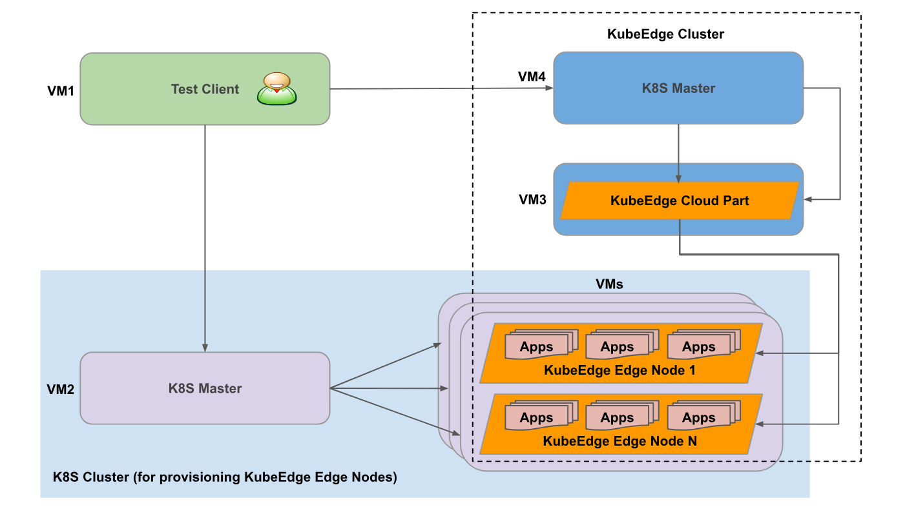
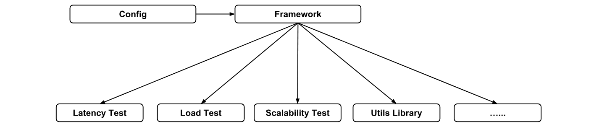
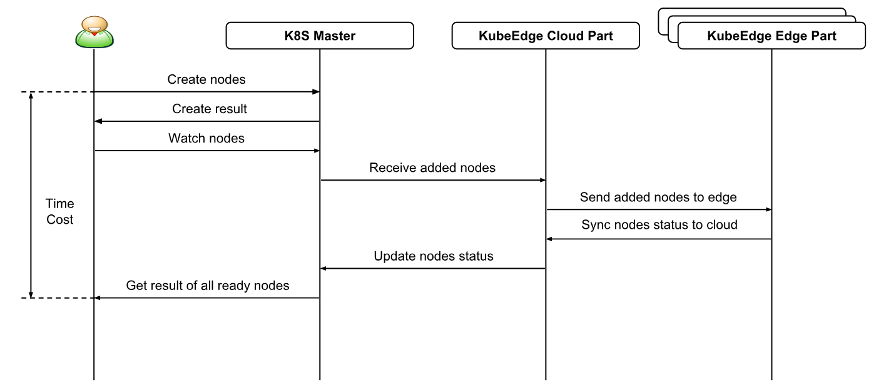
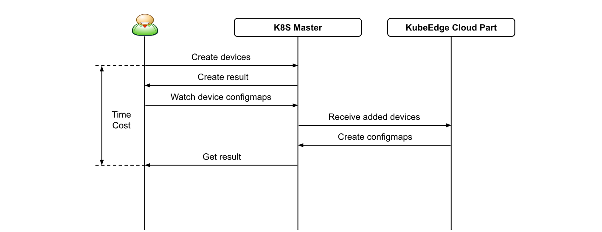
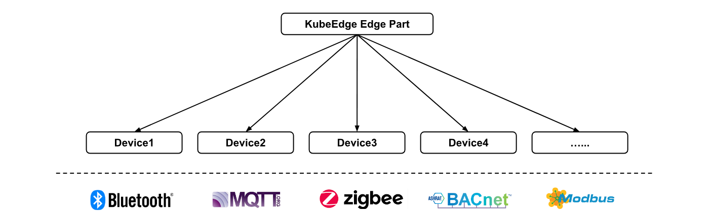
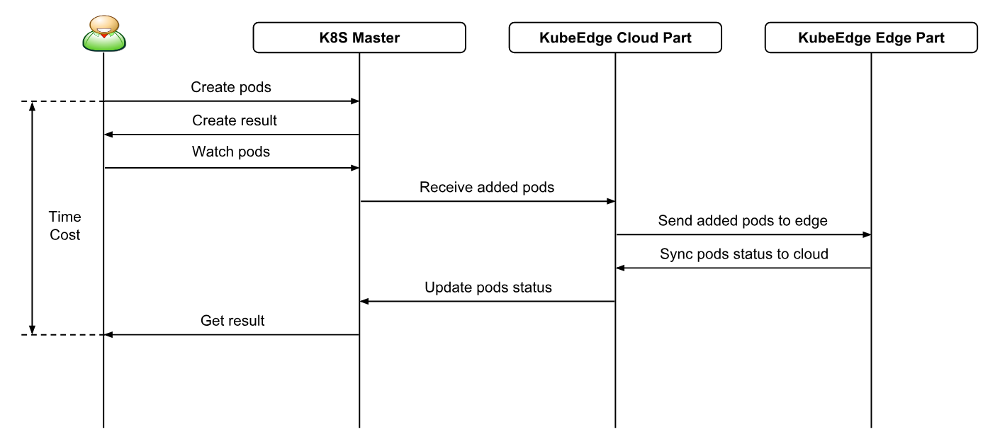
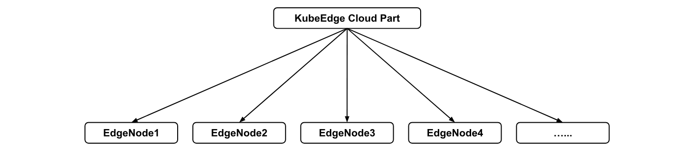
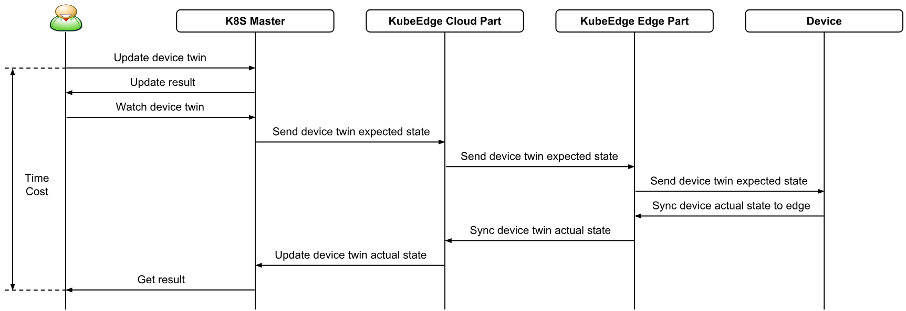
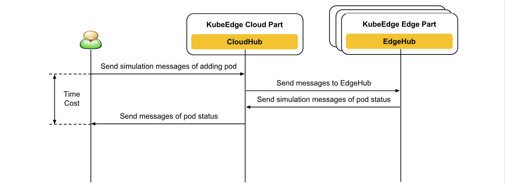

# Performance Test Proposal

* [Performance Test Proposal](#performance-test-proposal)
  * [Motivation](#motivation)
    * [Goals](#goals)
    * [Non\-goals](#non-goals)
  * [Proposal](#proposal)
    * [Performance Test Deployment](#performance-test-deployment)
    * [Performance Test Framework](#performance-test-framework)
    * [Performance Test Metrics Tools](#performance-test-metrics-tools)
    * [Performance Test Scenarios](#performance-test-scenarios)
  * [Thresholds](#thresholds)

## Motivation

Currently KubeEdge test is focused on automated test suites for unit, integration and E2E test and validation.
KubeEdge allows the users to manage large scale of edge nodes, devices from cloud.
A set of tests specifically performance tests can be used to determine the non-functional
characteristics of KubeEdge such as latency, throughput, cpu usage, memory usage and so on.
As a result, we can also evaluate the future improvement items for KubeEdge.

This proposal lists the possible performance test scenarios and test cases for KubeEdge.

### Goals

* Benchmark the performance against the following Service Level Objectives:
  * Latency: time cost from the moment when the server gets the request to last byte of response sent to the users.
  * Throughput: measure how many requests can be served within given time.
  * Scalability: potential scaling capacity (including number of nodes, pods, devices etc. at the edge) under different load conditions.
  * CPU Usage: measure the cpu usage of KubeEdge under different load conditions.
  * Memory Usage: measure the memory usage of KubeEdge under different load conditions.
* Performance test should be able to run against both containerized and un-containerized version of KubeEdge.

### Non-goals

* To design the specific implementation details of any single performance test.

## Proposal

### Performance Test Deployment


Every running KubeEdge Performance Test setup looks like the following:

1. A real K8S Cluster that has K8S Master and Nodes as **K8S Cluster** including **VM2** and other **VMs** shown in the above figure.
This Cluster is used to provision KubeEdge Edge Nodes.
2. A Cluster that has K8S Master and Nodes as **KubeEdge Cluster** including **VM3** and **VM4** shown in the above figure.
The KubeEdge Cloud Part and KubeEdge Edge Nodes are also including in this Cluster.
This Cluster is used to deploy the KubeEdge Cloud Part pod and performance test.
3. KubeEdge Cloud Part image and KubeEdge Edge Node image are built and put into any reachable container image registry.
4. Test Client as **VM1** shown in the above figure uses the deployment controller
to deploy KubeEdge Cloud Part pod in **KubeEdge Cluster**
and KubeEdge Edge Node pods in **K8S Cluster** respectively,
and then launches performance test against **KubeEdge Cluster** for KubeEdge.

Before runing the KubeEdge Performance Test, the developer is responsible for creating 1~3 above.
Test Client uses the deployment object to deploy KubeEdge Cloud Part pod in **KubeEdge Cluster**
and KubeEdge Edge Node pods in **K8S Cluster**,
and waits until all the pods come up and **Running**.
The KubeEdge Cloud Part pod will be running in the independent VM as **VM3** shown in the above figure.
The KubeEdge Edge Node pods will be running in **K8S Cluster**.
Once the KubeEdge Cloud Part and KubeEdge Edge Nodes are running,
KubeEdge Cloud Part will try to connect with K8S Master as **VM4** shown in the above figure,
and KubeEdge Edge Nodes will try to connect with KubeEdge Cloud Part.
At last, another Cluster is made up as **KubeEdge Cluster** shown in the above figure.

#### Test Client
| Subject                        | Description                                  |
|--------------------------------|----------------------------------------------|
| OS                             |  Ubuntu 18.04 server 64bit                   |
| CPU                            |  4vCPUs                                      |
| RAM                            |  8GB                                         |
| Disk Size                      |  40GB                                        |
| Count                          |  1                                           |

This VM is used to deploy KubeEdge and run the performance test for KubeEdge.

#### K8S Masters
| Subject                        | Description                                  |
|--------------------------------|----------------------------------------------|
| OS                             |  Ubuntu 18.04 server 64bit                   |
| K8S Version                    |  v1.13.5                                     |
| Docker Version                 |  v17.09                                      |
| CPU                            |  32vCPUs                                     |
| RAM                            |  128GB                                       |
| Disk Size                      |  40GB                                        |
| Count                          |  2                                           |

These two VMs are used to run K8S Master Services including K8S API Server and K8S Scheduler and so on.
One of them is used to deploy KubeEdge Edge Node pods.
The other one is used to deploy KubeEdge Cloud Part pod and run the performance test for KubeEdge.

#### K8S Nodes
| Subject                        | Description                                  |
|--------------------------------|----------------------------------------------|
| OS                             |  Ubuntu 18.04 server 64bit                   |
| K8S Version                    |  v1.13.5                                     |
| Docker Version                 |  v17.09                                      |
| CPU                            |  32vCPUs                                     |
| RAM                            |  128GB                                       |
| Disk Size                      |  40GB                                        |
| Count                          |  2...N                                       |

One of these VMs is used to run KubeEdge Cloud Part pod which is running EdgeController and CloudHub and so on.
The other VMs are used to run numbers of KubeEdge Edge Node pods which are running Edged and EdgeHub and so on.
We will adjust the Count of VMs based on the KubeEdge Edge Nodes numbers.

KubeEdge Performance Test setup is similar with K8S KubeMark setup,
where they simulate numbers of hollow-node pods and deploy on K8S Cluster.
In KubeEdge we also do the similar kind of simulation for creating KubeEdge Edge Node pods
and deploy the pods through deployment, the difference is that we use docker in docker for KubeEdge Edge Nodes.
That means the applications deployed by KubeEdge will be running in the KubeEdge Edge Node pods.
Our pod takes up resources as below:
- 1 pod : 0.10 vCPU & 250MB RAM

With KubeEdge pod deployment we can accomodate 10 pods/1vCPU approximately.
Base on the above K8S Nodes flavor, the CPU and RAM are 32vCPU and 128GB respectively.
Per K8S Node we should be able to deploy 320 pods(KubeEdge Edge Nodes)/32vCPU
and RAM consumption would be around 80GB. If we have 5 K8S Nodes with the similar flavor,
on a whole we should be able to deploy 1500 pods(KubeEdge Edge Nodes)/5 K8S Nodes.

### Performance Test Framework


KubeEdge Performance Test Framework will be designed based on the **Gomega** and **Ginkgo**.

The Performance Test Framework mainly relates to Utils Library and different types of tests:
- E2E Test
- Latency Test
- Load Test
- Scalability Test
- ...

E2E Test Sample:

```
It("E2E_Test_1: Create deployment and check the pods are coming up correctly", func() {
			var deploymentList v1.DeploymentList
			var podlist metav1.PodList
			replica := 1
			//Generate the random string and assign as a UID
			UID = "deployment-app-" + utils.GetRandomString(5)
			IsAppDeployed := utils.HandleDeployment(http.MethodPost, ctx.Cfg.ApiServer+DeploymentHandler, UID, ctx.Cfg.AppImageUrl[1], nodeSelector, replica)
			Expect(IsAppDeployed).Should(BeTrue())
			err := utils.GetDeployments(&deploymentList, ctx.Cfg.ApiServer+DeploymentHandler)
			Expect(err).To(BeNil())
			for _, deployment := range deploymentList.Items {
				if deployment.Name == UID {
					label := nodeName
					podlist, err = utils.GetPods(ctx.Cfg.ApiServer+AppHandler, label)
					Expect(err).To(BeNil())
					break
				}
			}
			utils.CheckPodRunningState(ctx.Cfg.ApiServer+AppHandler, podlist)
		})
```

By default Performance Test Framework will run all tests when the users run the **perf.sh** script.
Also the users can also provide the specific tests to run as a command line input to the **perf.sh** script.

Performance Test Framework also has the support of a command line interface with plenty of handy command line arguments
for running your tests and generating test files. Here is a choice example:

    - Ex:   perf.test -focus="LoadTest" and perf.test -skip="ScalabilityTest"

Performance Test Framework features include:

- A comprehensive test runner.
- Built-in support for testing asynchronicity.
- Modular and easy to customize.
- Logging and Reporting.
- Scalable to add more features.
- Built-in support of command line interface.
- ...

### Performance Test Metrics Tools
* [Prometheus](https://github.com/prometheus/prometheus)
* [Grafana](https://github.com/grafana/grafana)

### Performance Test Scenarios

#### 1. Edge Nodes join in K8S Cluster


Different numbers of Edge Nodes need be tested.
* Edge Nodes numbers are one of `[1, 10, 20, 50, 100, 200...]`.

Test Cases:
* Measure Edge Nodes join in K8S Cluster startup time.

  This test case ends with all Edge Nodes are in `Ready` status.

* Measure CPU and Memory Usage of KubeEdge Cloud Part.

* Measure CPU and Memory Usage of KubeEdge Edge Part.

#### 2. Create Devices from Cloud


This scenario is expected to measure the northbound API of KubeEdge.

Test Cases:
* Measure the latency between K8S Master and KubeEdge Cloud Part.

* Measure the throughput between K8S Master and KubeEdge Cloud Part.

* Measure CPU and Memory Usage of KubeEdge Cloud Part.

#### 3. Report Device Status to Edge


This scenario is expected to measure the southbound API of KubeEdge.

Different numbers of Devices need be tested.
* Devices numbers per Edge Node are one of `[1, 10, 20, 50, 100, 200...]`.

Test Cases:
* Measure the latency between KubeEdge Edge Part and device.

* Measure the throughput between KubeEdge Edge Part and device.

* Measure CPU and Memory Usage of KubeEdge Edge Part.

As the result of the latency and throughput with different device numbers,
we can evaluate scalability of devices for KubeEdge Edge Part.
Measure how many devices can be handled per Edge Node.


Different protocols are considered to test between KubeEdge Edge Part and devices.
E.g. Bluetooth, MQTT, ZigBee, BACnet and Modbus and so on.
Currenly less than 20ms latency can be accepted in Edge IoT scenario.
Two kinds of test cases can be adopted: emulators of different devices and actual devices.

#### 4. Application Deployment from Cloud to Edge


This scenario is expected to measure the performance of KubeEdge from Cloud to Edge.
The docker image download latency is not included in this scenario.
In the following test cases, we need to make sure that docker images are already downloaded on the Edge Nodes.

Different numbers of Edge Nodes and Pods need be tested.
* Edge Nodes numbers are one of `[1, 10, 20, 50, 100, 200...]`.

* Pods numbers per Edge Node are one of `[1, 2, 5, 10, 20...]`.

Test Cases:
* Measure the pod startup time.

  This test case ends with all pods are in `Ready` status.

* Measure CPU and Memory Usage of KubeEdge Cloud Part.

* Measure CPU and Memory Usage of KubeEdge Edge Part.

As the result of the pod startup time, we can evaluate scalability of KubeEdge Edge Nodes.
Measure how many Edge Nodes can be handled by KubeEdge Cloud Part.
Measure how many pods can be handled per Edge Node.



#### 5. Update Device Twin State from Cloud to Device


This scenario is expected to measure the E2E performance of KubeEdge.

Different numbers of Edge Nodes and Devices need be tested.
* Edge Nodes numbers are one of `[1, 10, 20, 50, 100, 200...]`.

* Devices numbers per Edge Node are one of `[1, 10, 20, 50, 100, 200...]`.

Test Cases:
* Measure E2E latency.

* Measure CPU and Memory Usage of KubeEdge Cloud Part.

* Measure CPU and Memory Usage of KubeEdge Edge Part.

These test cases should be run in both system idle and under heavy load.

#### 6. Add Pod from CloudHub to EdgeHub


This scenario is expected to measure the performance of KubeEdge between CloudHub to EdgeHub.
Actually this is not an E2E Test scenario for KubeEdge,
but the message delivery channel between CloudHub to EdgeHub may be our bottleneck.
Currently we are using web socket as the communication protocal between Cloud and Edge.
In the following test cases, we need to mock the behaviors of CloudHub and EdgeHub,
and the simulation messages of adding pod will be sent to EdgeHub,
and the simulation messages of pod status will be sent back to CloudHub.
so that we can get the exact latency and throughput between CloudHub and EdgeHub.

Different numbers of Edge Nodes and Pods need be tested.
* Edge Nodes numbers are one of `[1, 10, 20, 50, 100, 200...]`.

* Pods numbers per Edge Node are one of `[1, 2, 5, 10, 20...]`.

Test Cases:
* Measure the latency between KubeEdge CloudHub and KubeEdge EdgeHub.

* Measure the throughput between KubeEdge CloudHub and KubeEdge EdgeHub.

* Measure CPU and Memory Usage of KubeEdge Cloud Part.

* Measure CPU and Memory Usage of KubeEdge Edge Part.

As the result of the latency and throughput, we can evaluate scalability of KubeEdge EdgeHubs also the same with KubeEdge Edge Nodes.

## Thresholds

As the result of Performance Test, we expect to determine the performance and scalability for KubeEdge.
This is critical to make some improvement items for KubeEdge.
On the other hand, it will give the users recommended setup and user guides on KubeEdge.

As [this K8S document](https://github.com/kubernetes/community/blob/master/sig-scalability/configs-and-limits/thresholds.md) mentions,
since 1.6 release K8S can support 5000 Nodes and 150000 Pods in single cluster.
KubeEdge is based on K8S Master, the difference between K8S Nodes and KubeEdge Edge Nodes
is that KubeEdge Edge Nodes are not directly connected with the K8S Master like the K8S Nodes do.
The KubeEdge Cloud Part connects K8S Master with KubeEdge Edge Nodes.
Certainly the KubeEdge Edge Nodes are light weight and making use of less resources like CPU, Memory.

Currently about KubeEdge we have no performance data which can make comparison with the other systems.
But we can measure the performance and scalability for KubeEdge using the Performance Test data.
We can get the original test data from KubeEdge 0.3 release, and also make Performance Test for the follow up releases.
We define the following thresholds which will be based on the Performance Test data for KubeEdge.
In most cases, exceeding these thresholds do not mean KubeEdge fails over,
it just means its overall performance degrades.

| Quantity                            | 0.3 Release    | 1.0 Release | Long Term Goal |
|-------------------------------------|----------------|-------------|----------------|
| Edge Nodes numbers                  |                |             |                |
| Pods numbers                        |                |             |                |
| Pods numbers per Edge Node          |                |             |                |
| Device numbers                      |                |             |                |
| Device numbers per Edge Node        |                |             |                |

The KubeEdge Performance Test Cases will exceed 5000 Edge Nodes and 150000 Pods,
so that we can make comparison with K8S Cluster.
The form will be filled with the first round of Performance Test data.
