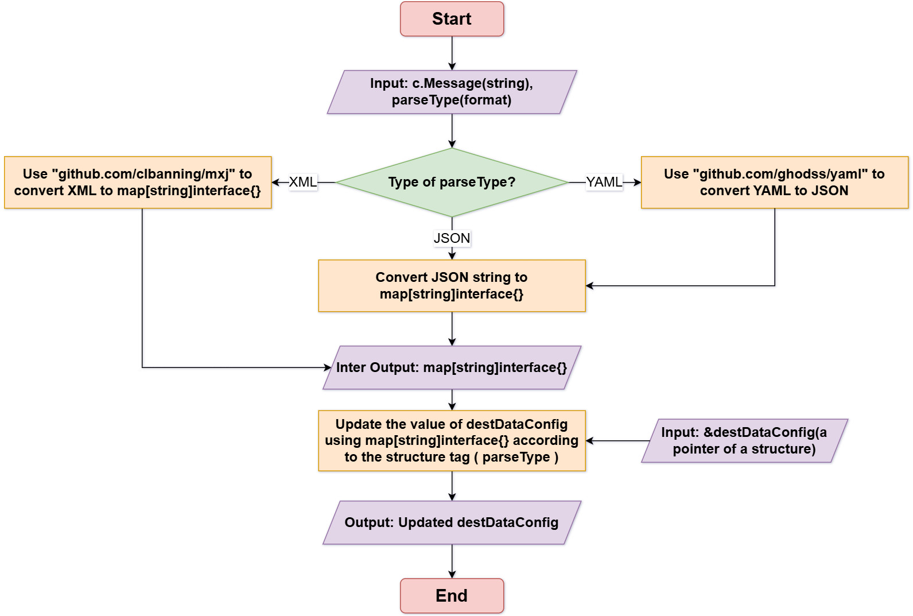

# The proposal about Provide A Common MQTT Mapper

### Provide A Common MQTT Mapper

In the current hardware device market, the MQTT (Message Queuing Telemetry Transport) protocol has become a widely adopted standard. Known for its lightweight and efficient characteristics, it is particularly suitable for communication between IoT (Internet of Things) devices. However, as the types of devices and application scenarios diversify, developers face several challenges and pain points.

Firstly, different device manufacturers may implement customizations and extensions to the MQTT protocol, leading to interoperability issues between devices. Secondly, the diversity of serialization formats presents another challenge when handling device data. JSON, YAML, and XML are common serialization methods, each with its unique advantages and application scenarios.

Therefore, developing a universal MQTT can help developers simplify the device integration process, improve system flexibility and reliability.

### Goals

For developers or end users of a common MQTT mapper solutions, the goals of a common MQTT mapper are:

- Add a new Mapper for the MQTT protocol to the kubeedge/mappers-go project using the latest mapper-framework.

- Mapper can get the message from the specified MQTT service's topic, and can parse the attribute values from the message using common serialization methods(JSON, YAML, XML).

- Provide a more scalable solution for parsing attribute values from more customized messages wherever possible.

### Proposal

Providing a common MQTT mapper using the latest mapper-framework aims to help developers easily make use of mapper to solve MQTT communication, in order to simplify the device integration process, improve system flexibility and reliability.

##### Scope

- Development of the MQTT Mapper: Utilize the latest Mapper-Framework to add an MQTT protocol Mapper to the kubeedge/mappers-go project. Ensure the Mapper can subscribe to specified MQTT topics, receive messages, and parse them.

- Message Parsing and Serialization Support: functionality to retrieve messages from MQTT service topics. Support parsing messages using JSON, YAML and XML formats to extract attribute values.

##### User

- Developers: Developers are needed to implement and test the MQTT Mapper.

- IoT Device Manufacturers and Operators: IoT device manufacturers and operators can use this universal MQTT Mapper to manage device communications.

### Design Details

##### Architecture and Modules

The architecture for providing a common Mapper will be modular to ensure scalability and maintainability. The main components include:

- Base Environment Setup: Utilizes the latest mapper-framework to create a MQTT mapper for standardized operatons and interactions.

- Main algorithm design: Parses the attribute values from the message using common serialization methods(JSON, YAML, XML).

The architectures and related concepts are shown in the below figure. In the figure, we assume that in the cloud-side-end scenario, device state modifications can be initiated by the cloud.


##### Base Environment Setup

1. Generate Mapper files through the Mapper-Framework framework

   1)Download kubeedge-master.zip from the official website, take the mapper-framewokr under the staging folder in it, and transfer it to the VM master node.

   2)Execute a command:

   Here we use Kubeedge v1.17.0 as the base environment to generate the mapper, or you can clone the latest version of the mapper directly from the repository ( [<u>https://github.com/kubeedge/mapper-framework)</u>](https://github.com/kubeedge/mapper-framework).

   ```go
   make generate
   ```

   3)Enter the project name of the Mapper: mqtt

   

2. 1)Device model: A device model describes the device properties exposed by the device . A device model is a Physical model which constrains the properties and parameters of physical devices.

   ```
   apiVersion: devices.kubeedge.io/v1beta1
   kind: DeviceModel
   metadata:
     name: temperture-model
     namespace: default
   spec:
     properties:
       - name: temperture
         description: Temperture sensor model
         type: INT
         accessMode: ReadWrite
         maximum: "100"
         minimum: "1"
         unit: "Celsius"
     protocol: mqtt
   ```

   2)Device instance: A device instance represents an actual device object. The device spec is static, including device properties list, it describes the details of each property, including its name, type, access method. The device status contains dynamically changing data like the desired state of a device property and the state reported by the device.

   ```
   apiVersion: devices.kubeedge.io/v1beta1
   kind: Device
   metadata:
     name: beta1-device
   spec:
     deviceModelRef:
       name: temperture-model
     nodeName: k8s-worker1
     properties:
       - name: temperature
         collectCycle: 10000000000  # The frequency of reporting data to the cloud, once every 10 seconds
         reportCycle: 10000000000   # The frequency of data push to user applications or databases, once every 10 seconds
         reportToCloud: true
         desired:
           value: "30"
         pushMethod:
           mqtt:
             address: tcp://101.133.150.110:1883
             topic: temperture/update/json
             qos: 0
             retained: false
           dbMethod:
             influxdb2:
               influxdb2ClientConfig:
                 url: http://127.0.0.1:8086
                 org: test-org
                 bucket: test-bucket
               influxdb2DataConfig:
                 measurement: temperture_stats
                 tag:
                   unit: temperature
                 fieldKey: temperture_value
         visitors:
           protocolName: mqtt
           configData:
               topic: "sensor/data"
               qos: 1
               retain: false
               clientId: "client123"
               username: "user"
               password: "pass"
               cleanSession: true
               keepAlive: 60
   
     protocol:
       protocolName: mqtt
       configData:
         ip: 101.133.150.110
         port: 1883
   ```

3. Configure the generated Mapper file

1）In the devicetype.go file, the ProtocolConfig and VisitorConfig structure information needs to be filled in as defined in the device instance yaml file so that Mapper can parse the configuration information correctly.

2）In the driver.go file, you need to customize the methods for initializing the device and obtaining device data, and standardize the data collected by Mapper.

3）In config.yaml, the protocol name of the Mapper needs to be defined.

4. Deploy Mapper

After generating the Mapper project and populating the Driver folder, users can make their own Mapper image based on the Dockerfile file, and subsequently deploy the Mapper in the cluster via Deployment, etc.

```
docker build -t [YOUR MAPPER IMAGE NAME]
### Deploying Mapper with Kubernetes natively
kubectl apply -f <path to mapper yaml>
### For local debugging, you can also compile and run the Mapper code directly
go run cmd/main.go --v <log level,like 3> --config-file <path to config yaml>
```

##### Main algorithm design

The main algorithm aims to parsing the attribute values from the message using common serialization methods(JSON, YAML, XML).

The flow of the parser algorithm is as follows:  Implement a parser, it can be wrapped by type abstract interface interface{}, internal according to each serialization type to perform parsing (in practice, the need for serialization type first judgment), parsing the use of JSONPath. In the JSONPath before the need to do a brief processing of the serialization format:

- For JSON types, directly convert the string to interface{};

- For YAML types, use the package (github.com/ghodss/yaml) to convert to JSON and then just follow the JSON processing;

- For XML types, use the package (github.com/clbanning/mxj) to parse it to map[string]interface{}, then further convert it to JSON, and then follow the JSON processing.

After performing parsing on the serialized data, you can query it using the JSONPath syntax.




### Plan

In version 1.18

- In drivertype.go, add the corresponding data fields for the MQTT protocol, such as topic, message, qos, etc;

- In driver.go, improve the necessary functions(InitDevice, GetDeviceData , etc), add the writing of functions for parsing different serialized messages for the MQTT protocol;


- In the resource folder, add Device Model and Device Instance files for MQTT.