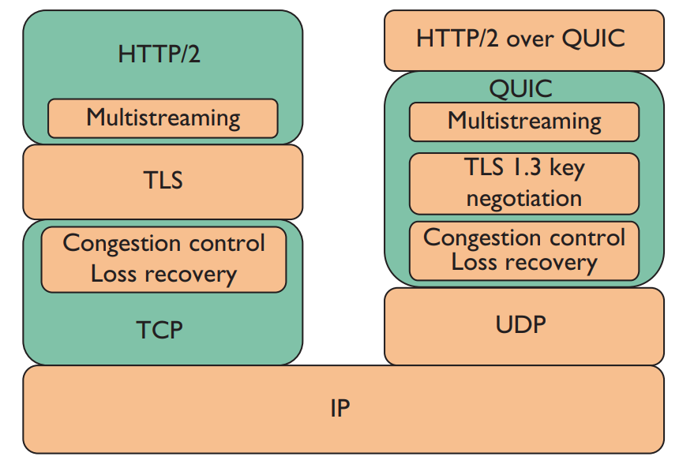
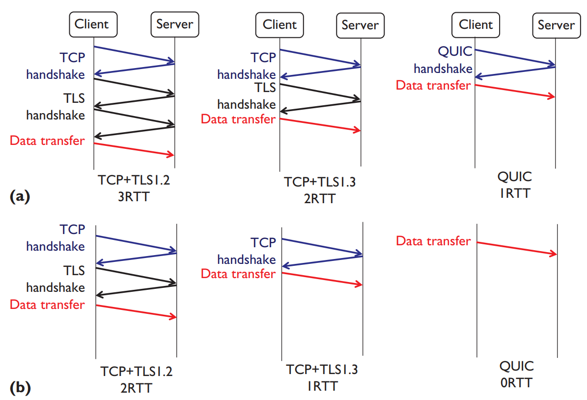
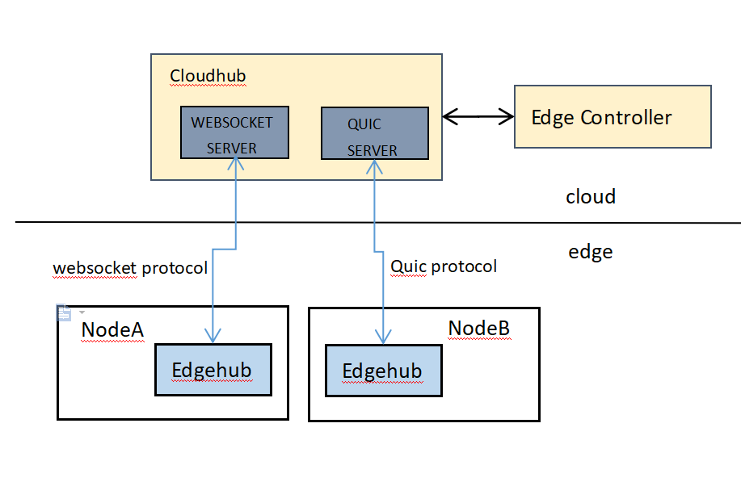

# Enhanced Cloud/Edge Communication

## Abstract
In order to enhance cloud and edge communication efficiency, we introduced the [QUIC](https://quicwg.org/ops-drafts/draft-ietf-quic-applicability.html) protocol for cloudhub and edgehub.
It is suggested that cloudHub should support both websocket and QUIC protocol access at the same time. And the edgehub can choose one of the protocols to access to the cloudhub.
QUIC is a new transport which reduces latency compared to that of TCP. On the surface, QUIC is very similar to TCP+[TLS](http://technet.microsoft.com/en-us/library/cc785811.aspx)+HTTP/2 implemented on [UDP](http://c3lab.poliba.it/images/3/3b/QUIC_SAC15.pdf). Because TCP is implemented in operating system kernels, and middlebox firmware, making significant changes to TCP is next to impossible. However, since QUIC is built on top of UDP, it suffers from no such limitations.
Key features of QUIC:

1. [Dramatically reduced connection establishment time](https://ieeexplore.ieee.org/stamp/stamp.jsp?tp=&arnumber=7867726)
2. Improved congestion control
3. [Multiplexing without head of line blocking](https://docs.google.com/document/d/1RNHkx_VvKWyWg6Lr8SZ-saqsQx7rFV-ev2jRFUoVD34/mobilebasic?pli=1)
4. Forward error correction
5. Connection migiation




## Motivation
In edge scenarios, network connectivity could be unstable. With TCP + TLS, it becomes an overhead to establish / re-establish connections frequently due to intermittent networks. In such scenarios, QUIC with its zero RTT can help reduce this overhead and re-establish broken connections faster.

## Architecture


## Configuration of kubeedge with websocket/quic
### Start the websocket server only
1. User edit controller.yaml  
```yaml
  cloudhub:
  protocol_websocket: true # enable websocket protocol
  port: 10000 # open port for websocket server
  protocol_quic: false # enable quic protocol
  quic_port: 10001 # open prot for quic server
  max_incomingstreams: # the max incoming stream for quic server
  address: 0.0.0.0
  ca: /etc/kubeedge/ca/rootCA.crt
  cert: /etc/kubeedge/certs/edge.crt
  key: /etc/kubeedge/certs/edge.key
  keepalive-interval: 30
  write-timeout: 30
  node-limit: 10
  ```

2. Running the cloudhub, and start the websocket server.
3. Waiting for client access through websocket protocol.

### Start the quic server only
1. User edit controller.yaml
```yaml
  cloudhub:
  protocol_websocket: false # enable websocket protocol
  port: 10000 # open port for websocket server
  protocol_quic: true # enable quic protocol
  quic_port: 10001 # open prot for quic server
  max_incomingstreams: # the max incoming stream for quic server
  address: 0.0.0.0
  ca: /etc/kubeedge/ca/rootCA.crt
  cert: /etc/kubeedge/certs/edge.crt
  key: /etc/kubeedge/certs/edge.key
  keepalive-interval: 30
  write-timeout: 30
  node-limit: 10
  ```

2. Running the cloudhub, and start the quic server.
3. Waiting for client access through quic protocol.

### Start the websocket and quic server at the same time
1. User edit controller.yaml
```yaml
  cloudhub:
  protocol_websocket: true # enable websocket protocol
  port: 10000 # open port for websocket server
  protocol_quic: true # enable quic protocol
  quic_port: 10001 # open prot for quic server
  max_incomingstreams: # the max incoming stream for quic server
  address: 0.0.0.0
  ca: /etc/kubeedge/ca/rootCA.crt
  cert: /etc/kubeedge/certs/edge.crt
  key: /etc/kubeedge/certs/edge.key
  keepalive-interval: 30
  write-timeout: 30
  node-limit: 10
  ```
2. Running the cloudhub, and start the quic and websocket server.
3. Waiting for client access through quic and websocket protocol.

### edgehub connect to cloudhub through websocket protocol
1. User edit edge.yaml
```yaml
    websocket:
        url: wss://0.0.0.0:10000/e632aba927ea4ac2b575ec1603d56f10/fb4ebb70-2783-42b8-b3ef-63e2fd6d242e/events
        certfile: /etc/kubeedge/certs/edge.crt
        keyfile: /etc/kubeedge/certs/edge.key
        handshake-timeout: 30 #second
        write-deadline: 15 # second
        read-deadline: 15 # second
    controller:
        protocol: websocket # websocket, quic
        placement: false
        heartbeat: 15  # second
        refresh-ak-sk-interval: 10 # minute
        auth-info-files-path: /var/IEF/secret
        placement-url: https://x.x.x.x:7444/v1/placement_external/message_queue
        project-id: e632aba927ea4ac2b575ec1603d56f10
        node-id: fb4ebb70-2783-42b8-b3ef-63e2fd6d242e
  ```
2. Running the edgecore, and start to connect to cloudhub through websocket protocol.

### edgehub connect to cloudhub through quic 
1. User edit edge.yaml
```yaml
    quic:
        url: 127.0.0.1:10001
        cafile: /etc/kubeedge/ca/rootCA.crt
        certfile: /etc/kubeedge/certs/edge.crt
        keyfile: /etc/kubeedge/certs/edge.key
        handshake-timeout: 30 #second
        write-deadline: 15 # second
        read-deadline: 15 # second
    controller:
        protocol: quic # websocket, quic
        placement: false
        heartbeat: 15  # second
        refresh-ak-sk-interval: 10 # minute
        auth-info-files-path: /var/IEF/secret
        placement-url: https://x.x.x.x:7444/v1/placement_external/message_queue
        project-id: e632aba927ea4ac2b575ec1603d56f10
        node-id: fb4ebb70-2783-42b8-b3ef-63e2fd6d242e
  ```
    
2. Run the edgecore, and start to connect to cloudhub through quic protocol.
