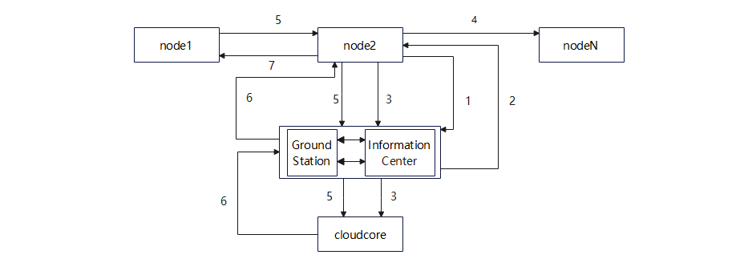
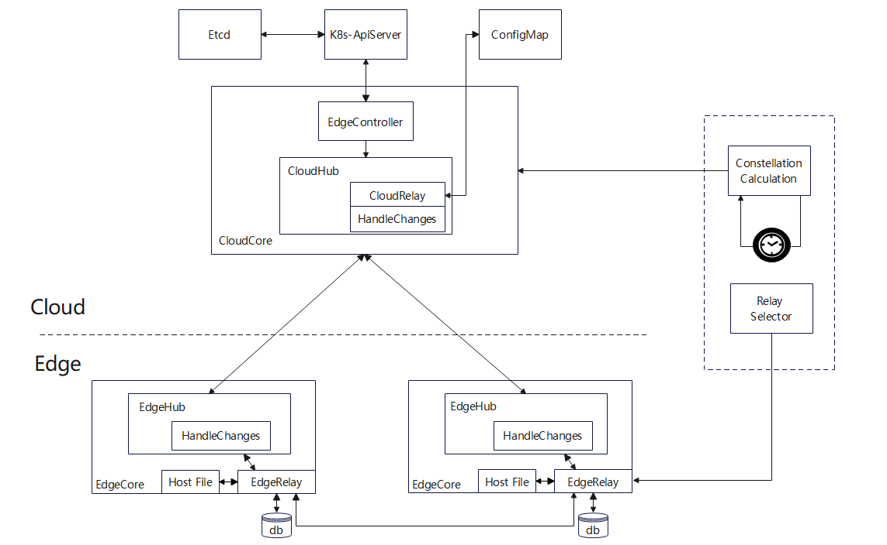
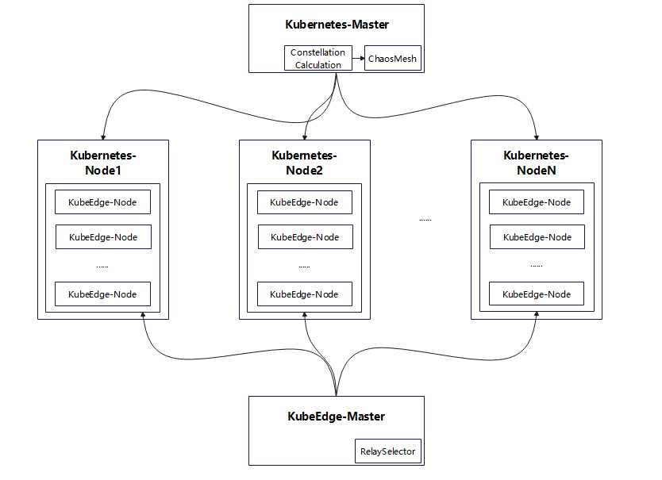

# Relay Mode Design

## Background

In some scenarios, cloud-edge communication may be blocked, and the cloud can only intermittently communicate with some edge ends, but the edge ends can communicate with each other. In this case, a solution is required to ensure that the Cloud can control the entire cluster.

For example, with the increasing computing capability of satellite constellation deployment, edge computing of LEO satellites is on the agenda. KubeEdge, as a tool for managing computing resources on the platform, can play a role in this scenario. The wide-area distribution of satellites, especially low-orbit satellites, is fast. When the ground station at a fixed point on the fixed ground is managed, different from each node on the ground that can maintain direct and stable communication with the master node, the connection between any satellite and the ground station is intermittent. Difficult to manage. The following uses the satellite scenario as an example.

## Objectives

It is proposed to use the relay mode to virtualize a stable communication link between the edge node and the central node, so that the central node can sense the status of the entire cluster during each interaction and manage the entire cluster.

## Solution Design

### Process Design



#### Module Introduction

node1...nodeN: satellite node

GroundStation: It is used to transmit satellite-to-ground information.

Information Center: Ground Computing Module

#### Process

1. The information center other than the cluster is responsible for selecting the relay node. There are multiple criteria for selecting the relay node, including the best channel condition, the longest connection time, and the lightest load. Currently, the maximum connection time is used as the standard.
2. Mark the relay node. Mark the selected relay node.
3. Create a cloud-edge channel and notify the relay node of information. After the relay node receives the marked information, the node edgecore first applies to the ground cloudcore to establish a channel, and then notifies the cloudcore node information (name).
4. Notify other nodes of relay node information. After the relay node ensures that the communication link has been established, the other non-relay nodes are notified.
5. The non-relay node reports the node status. After learning the relay node information, all non-relay nodes send information to the relay node. In addition to the conventional information to be sent, node resource information, including I/O and CPU usage, may be sent.
6. The CloudCore manages the cluster. After receiving all node information, CloudCore can analyze the information, adjust the cluster, and manage the cluster.
7. Forward the scheduling information to the non-relay node. If some scheduling information needs to be delivered, the relay node forwards the information.

#### Architecture Design



#### Module Introduction

##### Cloud end

CloudRelay: a module that is added to the CloudCore to handle trunk-related problems.

HandleChanges: changes made on CloudHub to adapt to the trunk mode.

##### Edge end

EdgeRelay: A module added to EdgeCore to handle relay-related issues.

HandleChanges: Some changes made on EdgeHub to adapt to the relay mode.

HostFile: stores the key-value pair of the IP address and satellite address for auxiliary addressing.

##### External end

ConstellationCalculation: a computing module outside the cluster, which can calculate information such as constellation parameters.

RelaySelector: relay satellite selection module, which sends the relay satellite selection result to the target satellite.

### Solution Design

#### Relay Environment Message Format

##### Cloud Edge Relay Message Format

Encapsulates original messages based on the unified message format of beehive.

```
type Message struct {
	Header  MessageHeader `json:"header"`
	Router  MessageRoute  `json:"route,omitempty"`
	Content interface{}   `json:"content"`
}

type MessageRoute struct {
	Source string `json:"source,omitempty"`
	Destination string `json:"destination,omitempty"`
	Group string `json:"group,omitempty"`
	Operation string `json:"operation,omitempty"`
	Resource string `json:"resource,omitempty"`
}

type MessageHeader struct {
	ID string `json:"msg_id"`
	ParentID string `json:"parent_msg_id,omitempty"`
	Timestamp int64 `json:"timestamp"`
	ResourceVersion string `json:"resourceversion,omitempty"`
	Sync bool `json:"sync,omitempty"`
	MessageType string `json:"type,omitempty"`
}
```

##### Edge Message Format

If a non-relay node does not directly communicate with the CloudCore, the node ID and project ID of the node need to be stored and forwarded to the CloudCore through the relay node. The mux.MessageContainer is reused here.

```
type MessageContainer struct {
	Header     http.Header
	Message    *model.Message
	parameters map[string]string
}
```

#### Cloud end

The design idea of the Cloud is to register the CloudRelay sub-module in the CloudHub module and use the ConfigMap to persistently store relay node information.

The submodule uses the singleton mode, and the startup point is on the CloudHub server. The hubconfig.Config.CloudRelay.Enable is verified during startup, and the node ID of the relay node is read once.

##### Some new const fields are added

```
//Indicates node tag information.
OpMarkRelay = "markrelay"

//Indicates the uplink information of cloud-edge interaction relay information.
OpUploadRelayMessage = "uploadrelay"

//Indicates the downlink information of the cloud-edge interaction relay.
RelayGroupName = "relay"
```

##### Key Contents of the CloudRelay Module

The following figure shows the CloudRelay architecture.

```
type CloudRelay struct {
	enable
	relayID
	... ...
}
```

The following is an example of the main method.

```
//Parse the information from the Edge.
UnsealMessage(container *mux.MessageContainer) *mux.MessageContainer

//Pack the information sent to the edge end. Route.Group=RelayGroupName
SealMessage(msg *beehiveModel.Message)(*beehiveModel.Message, err)

//Store the relay node information NodeID to the single instance field of the CloudRelay and to the ConfigMap.
SaveRelayMark(container *mux.MessageContainer)

//Read the NodeID from the ConfigMap.
LoadRelayID()
```

#### Edge end

A new module named EdgeRelay is registered on the Edge to process cloud-edge and edge-edge messages. Information that needs to be persisted is stored in the SQLite. EdgeHub processes messages including routeToEdge, routeToCloud, and keepalive. You need to modify them respectively and ensure that non-relay nodes cannot directly communicate with the Cloud. (There are multiple satellites in the communication range at the same time.)

```
type Module interface {
	Name() string
	Group() string
	Start()
	Enable() bool
}
```

##### Some new const fields are added

```
// EdgeHub identifies the information type based on the Group field.
RelayGroupName = "relay"

//Module name, which is used for message distribution.
EdgeRelayModuleName = "edgerelay"

//Indicates node tag information.
OpMarkRelay = "markrelay"

//Indicates the uplink information of cloud-edge interaction relay information.
OpUploadRelayMessage = "uploadrelay"
```

##### Key Contents of the EdgeRelay Module

The following figure shows the Configure structure of the EdgeRelay module.

```
// config使用Once.Do初始化
type Configure struct {
	v1alpha1.EdgeRelay
	relayID string
	nodeID string
}
```

##### The following is an example of the main method

```
//Process the trunk tag information of the earth station.
HandleRelayMark(relayID string)

//Save the relay ID and update the configuration and database.
SaveRelayID(relayID string)

//Read the relay ID.
LoadRelayID()

//Receive information about other nodes.
MsgFromOtherEdge()

//Process the received information about other nodes.
HandleMsgFromOtherEdge(container *mux.MessageContainer)

//Receiving information from EdgeHub
MsgFromEdgeHub()

//Process the received EdgeHub information.
HandleMsgFromEdgeHub(msg *beehiveModel.Message)

//Send information to other EdgeCores.
MsgToOtherEdge(msg *beehiveModel.Message)

//Send the information to EdgeHub.
MsgToEdgeHub(msg *beehiveModel.Message)

//Obtain the address of the target node from the HostFile file. nodeID: Address
GetAddressThroughFile(nodeID string) string()
```

##### Partial function pseudocode

*HandleRelayMark*

```
Invoke SaveRelayID().
    if nodeID==relayID {
    Enabling Direct Communication Between EdgeHub and CloudHub
    Invoke the MsgToEdgeHub interface to send a message whose Operation is OpMarkRelay.
    Create a container of the MessageContainer type and insert relayID to the head.
    for all nodes {
    Invoking MsgToOtherEdge
    }
}
```

*HandleMsgFromOtherEdge*

```
//Relay node notification information
if container.head has relayID {
    Invoke SaveRelayID.
    Disabling Direct Communication Between EdgeHub and CloudHub
    Send a notification to notify the establishment of a link.
    Notifies the edgehub that the link has been established and that each component can be activated to publish messages.
} else {
	//If the local node is a relay node, the message is in the Edge->Cloud direction. Encapsulates the message from other non-relay nodes and sends the message to the EdgeHub. Then, the EdgeHub sends the message to the Cloud.
    if nodeID==relayID {
        The message container is encapsulated as Message and Operation is set to OpUploadRelayMessage.
    	Invoking the MsgToEdgeHub
    } else {
    //If the local node is not a relay node, the message is in the Cloud->Edge direction. The message sent from the relay node is sent to the EdgeHub module for processing.
    	Disassemble the container message and invoke the MsgToEdgeHub interface.
    }
}
```

*HandleMsgFromEdgeHub*

```
//Only relay messages are sent by the EdgeHub to the EdgeRelay for processing.

//If the local node is a relay node, the message is in the Cloud->Edge direction and forwards the information from the Cloud to the non-relay node.
if nodeID==relayID {
    Obtain the target ID and invoke GetAddressThroughFile to obtain the target address.
    Encapsulates msg messages into mux.MessageContainer format.
    Invoking MsgToOtherEdge
} else {
	//If the local node is not a relay node, the message is in the Edge->Cloud direction and needs to be forwarded to the relay node.
    Encapsulate the msg message in mux.MessageContainer format and add the nodeID and projectID of the local node to the head.
    The address is obtained through GetAddressThroughFile(relayID).
    Invoking MsgToOtherEdge
}
```

## Experimental scheme design

### Introduction to the Cluster Experiment Environment

In the background of the case, because (1) the scale of edge nodes to be managed is large and (2) the network of nodes needs to be controlled in real time, the Kubernetes mode is used to manage the KubeEdge cluster. Use at the Kubernetes level for quantitative control and use the control plug-in to accomplish the experimental objectives.

Deploy the KubeEdge cluster as shown in the following figure. Kubernetes manages the number of KubeEdge clusters and network status, and uses pods to simulate edge nodes. The active KubeEdge node is independently deployed. The RelaySelector selects the relay node. The current policy is to select the node with the longest connection time at the cloud edge.



#### Module Introduction

Kubernetes cluster: controls the number of KubeEdge clusters and network status.

KubeEdge Cluster: Test Platform for Trunk Features

RelaySelector: indicates the relay selection module that exists in pod mode.

ConstellationCalculation: Constellation-related information is calculated and sent to ChaosMesh for delivery to KubeEdge nodes, such as the network status between nodes.

### Solution Process

0. Simulate satellite constellations on the ground and deploy KubeEdge for computing resource management.

1. Use the satellite constellation simulation tool to simulate the input file of satellite constellation and ground station information, such as the real-time inter-satellite topology, delay on each link, and communication between satellites and ground stations.

2. Design the relay satellite solution according to the satellite-to-ground connection. The longest connection time is selected as the criterion in the current simulation scenario.

3. Analyze the differences from traditional networks. Encapsulate Messages and develop relay adaptations for Cloud and Edge respectively.

4. Import the data related to constellations and ground stations into the KubeEdge system at a certain frequency to build connections between nodes.

5. Run the cluster.

6. Adjust the system based on the communication delay and the percentage of satellite nodes that can be connected through relays.

### Satellite Constellation Network Simulation Part

Using stk and matlab joint programming in advance, using the constellation network state according to "+Grid connection mode" and Dijstra algorithm as the default method, calculate the inter-satellite connection and satellite-ground connection information in unit of one cycle, as the input of the simulation system. Wait for Constellation Calculation to use.

### Constellation Calculation

This component is responsible for the overall clock. The unit of satellite motion changes is one cycle. Therefore, this component is responsible for the overall cluster clock and sets the network status information for each node. Both the cloud end and edge end need to receive configuration data. It is currently planned to use Chaos Mesh for configuration.

### RelaySelector

Selects relay satellites. When the relay node is selected, the relay satellite is selected according to the preset rules and communicates with the RealayServer at the Edge end to identify the relay node.

## Future

In the first phase, it is set that the CloudCore is installed on the same ground station, and the number of relay nodes is set to one satellite that can directly interact with the ground station where the CloudCore is located.

Considering the impact of a large number of satellites on the load of relay satellites and the impact of a small number of satellites on the connected frequency, a multi-relay satellite solution can be proposed later. In the multi-relay solution, the satellite clustering problem needs to be considered. In this case, multiple ground stations and ground networks are fully used to form a space network and finally communicate with the CloudCore.

The autonomous selection of relay nodes can be extended to consider the autonomous selection of satellites in the reachable range of ground stations.