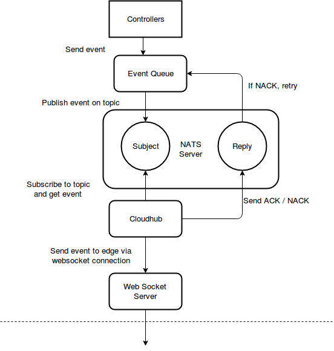
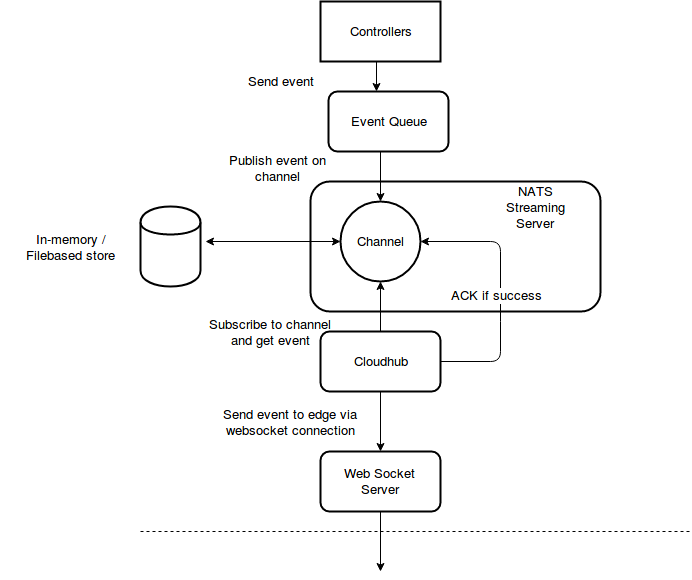

# Reliable message delivery

* [Reliable message delivery](#reliable-message-delivery)
  * [Motivation](#motivation)
    * [Goals](#goals)
    * [Non\-goals](#non-goals)
  * [Proposal](#proposal)
    * [Use Cases](#use-cases)
  * [Design Details](#design-details)  
    * [Choosing a message broker](#choosing-a-message-broker)
    * [Message Delivery Mechanisms](#message-delivery-mechanisms)
    * [At-Most-Once Delivery](#at-most-once-delivery)
    * [Limitations with Atmost-Once Delivery](#limitations-with-atmost-once-delivery)
    * [At-Least-Once Delivery](#at-least-once-delivery)
    * [Performance](#performance)

## Motivation

There is no reliable mechanism to exchange messages between the cloud and the edge nodes.
The current approach uses a fire-and-forget approach where messages are sent to edge nodes and there is no way to confirm if
those messages were actually received by the edge node. Unstable networks can result in frequent disconnection of edge nodes and
this can result in loss of messages sent to edge nodes which can’t be temporarily reached. This proposal addresses this problem
thus ensuring reliable message delivery.

### Goals

- Provide a reliable message delivery mechanism between cloud and edge.

### Non-goals

- To implement a new messaging technology like NATS / RabbitMQ / Kafka.
- To address HA / failover of message brokers via clustering techniques.
- To address secure communication with message brokers.
- To address encryption of data stored within message brokers.

## Proposal

Currently all the messages from the controllers go via the channel queue (which uses beehive context for message passing) to the
cloudhub. The cloudhub then uses the configured protocol server (websocket/quic) to send the data to the edge node.
The idea is to introduce as additional message processing layer for storing the messages in a high-performance message broker
(NATS / RabbitMQ / Kafka etc.) and use the broker’s capabilities to deliver these messages to CloudHub in a reliable fashion.

### Use Cases

We should be able to deploy applications to edge nodes in offline scenarios. Whenever the node is back online, pending application
deployment requests need to be processed. Similar scenarios apply for other resources like devices, config maps, secrets etc.

## Design Details

### Choosing a message broker
A message broker provides OOTB message delivery mechanims (atleast once, atmost once, exactly once), failover, HA support via clustering,
durable subscriptions, persistence of messages in a file or database etc. A message broker decouples senders and receivers and thus
allows servers and clients to work and scale independently. There are multiple popular message brokers like Apache Kafka, NATS,
RabbitMQ etc which provide these features. As per some [statistics](https://bravenewgeek.com/dissecting-message-queues/),
[NATS](https://nats-io.github.io/docs/) performs better than RabbitMQ or Kafka, so we propose using NATS as the message broker.

### Message Delivery Mechanisms

There are three types of message delivery mechanisms:
- Exactly-once
- At-Most-Once
- At-Least-Once

More details can be found here : https://doc.akka.io/docs/akka/current/general/message-delivery-reliability.html.
The first approach is very expensive and exhibits worst performance although it exhibits guaranteed delivery with no message loss
or duplication. We discuss the other two approaches below.

### At-Most-Once Delivery
In the At-Most-Once message delivery approach , when sending a message from a sender to a receiver, there is no guarantee that a given
message will be delivered. Any given message may be delivered once or it may not be delivered at all. It is up to the application to
ensure data has been delivered, resending messages if necessary. In order to avoid message loss with this delivery mechanism,
NATS suggests the use of acknowledgements or ACKS. The request-reply mechanism relies on the application to have the logic of using
timeouts to handle any network or application failures.

Shown below is a design using ACKs to ensure that a message is delivered from the cloud to the edge.



- Controller sends an event to an Event Queue via beehive.
- The event is stored in an in-memory work queue by the Event Queue.
- The Event Queue picks up the event from the work queue and publishes it on a NATS "Subject" (i.e topic) along with a "Reply" topic 
  for sending back the response.
- Cloudhub subscribes to the Subject and gets the published event.
  Cloudhub sends the event to the edge node via the underlying protocol (WebSocket in this case).
- If there is an error while sending the event to the edge, CloudHub replies with a "NACK" message on the Reply topic.
  The event queue retries the whole process until a configurable retry timeout occurs.
- If event is sent successfully, CloudHub sends an "ACK" response on the Reply topic and the event queue discards the message from 
  the work queue.

#### Limitations with Atmost-Once Delivery
If any of the cloud components crash, in-flight events will be lost.
Messages stored by the Event Queue in-memory would be destroyed.
The core NATS server doesn’t provide persistence as it is designed for At-Most-Once delivery systems.
Messages published on the NATS subjects and not received by CloudHub are lost.

### At-Least-Once Delivery
At-Least-once delivery means that for each message, potentially multiple attempts are made at delivering it, such that at least 
one succeeds. This means that messages may be duplicated but not lost. There are [performance considerations]
(https://nats-io.github.io/docs/developer/streaming/#deciding-to-use-at-least-once-delivery) one needs to consider
when choosing this delivery mechanism.

[NATS Streaming](https://nats-io.github.io/docs/nats_streaming/intro.html) provides At-Least-Once delivery guarantees.
Streaming is implemented as a request-reply service on top of NATS. Streaming messages are encoded as protocol buffers,
the streaming clients use NATS to talk to the streaming server. NATS Streaming offers configurable message persistence: in-memory, 
flat files or database. The storage subsystem uses a [public interface](https://nats-io.github.io/docs/nats_streaming/store-interface.html)
which can be used to develop our own custom database implementation. ACKs are used to ensure delivery in both directions.

NATS streaming uses the concept of a channel to represent an ordered collection of messages. Clients send to and receive from
channels instead of subjects. A channel is actually a First In First Out (FIFO) queue. Messages are added until the configured
limit is reached. Old messages are cleaned up based on configurable expiration policy so that new messages can be processed.

Shown below is a design using ACKs to ensure that a message is delivered from the cloud to the edge.



- Controller sends an event to an Event Queue.
- The Event Queue publishes the event on a NATS "Channel" (i.e queue of messages).
- Cloudhub subscribes to the Channel and gets the published event.
- Cloudhub sends the event to the edge node via the underlying protocol.
- If there is an error while sending the event to the edge, no ACK is sent to the channel.
  NATS streaming server retries sending the message until it receives an ACK from CloudHub.
- If event is sent successfully, CloudHub sends an ACK back to the channel.
  After receiving the ACK for the message, the server doesn't immediately delete the message from the channel.
  There are [options](https://github.com/nats-io/nats-streaming-server#configuring) which can be passed to the NATS streaming server
  for configuring the number of messages to be stored in a channel and how long a message can be stored in a channel:
  ```sh
    -mm,  --max_msgs <int>               Max number of messages per channel (0 for unlimited)
    -ma,  --max_age <duration>           Max duration a message can be stored ("0s" for unlimited)
  ```

### Message Queue Interface
Cloudhub talks to the event queue which is currently a beehive-context based channel queue.

```go
func (a *cloudHub) Start(c *context.Context) {
	a.context = c
    ....................
    eventq := channelq.NewChannelEventQueue(c)
    ......................
}
```

We will define an interface for the event queue

```go
    // EventQueue connects to a backend message broker, allowing to publish and
    // consume message from the broker and sending those to the edge node.
    type EventQueue interface {
        // Connect to the event queue and obtain a channel for a given project and edge node.
        Connect(info *emodel.HubInfo) error
        // Disconnect (unsubscribe) from the event queue
        Close(info *emodel.HubInfo) error
        // Sends (publishes) the event/message via the event queue to the backend
        Publish(info *emodel.HubInfo, event *emodel.Event) error
        // Consume messages from the event queue for sending to the edge node
        Consume(info *emodel.HubInfo) (EventSet, error)
}
```

The backend queue implementation can be NATS, Kafka, RabbitMQ or any other messaging technology. But it needs to implement this
interface in order to be plugged into the platform. Cloudhub needs to have a configurable option to set the backend for the corresponding
backend implementation.
 ## Performance
Core NATS provides [benchmarking tool](https://nats-io.github.io/docs/nats_tools/natsbench.html) to measure publisher/subscriber
throughput performance.(approx. 16MB/s).
Core NATS exhibits low latency of 3ms for a payload of 512B. (https://github.com/nats-io/latency-tests), while NATS streaming
exhibits a latency of 5-6ms.

With Core NATS and atmost-once delivery, we need to maintain an in-memory queue which can possibly grow with unacknowledged messages
from the edge. Similar to the NATS approach, we can have configurable options for max messages that can be kept in memory with defaults.
Maintaining an in-memory queue is an overhead but gives tighter control over message processing, deleting acknowledged messages from
the queue as soon as they are ACKed. But this approach can't provided persistence and suffers from limitations described earlier.

With Streaming NATS and atleast-once delivery, we don't need to worry about redelivery of unacknowledged messages as the server takes
care of it. With file-backed persistence, server can restart processing of messages right from where it left before the crash.
As mentioned earlier, performance can be impacted if we choose this delivery option.

We need to run performance tests after introducing the brokered approach and publish the difference in the results. Reliability is
associated with a cost which a user needs to bear.
