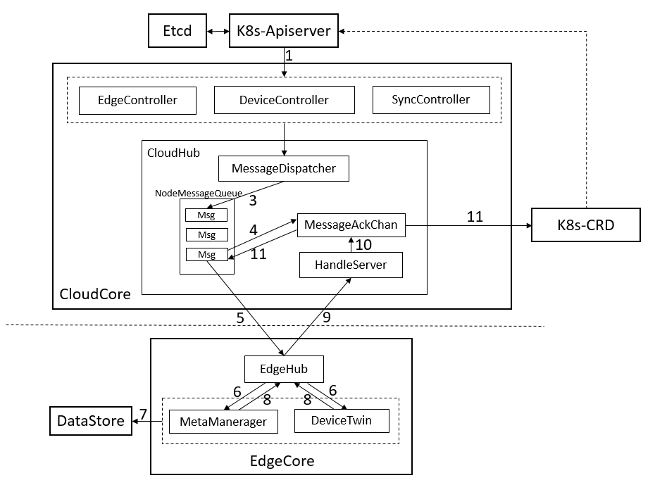

# Reliable message delivery

## Motivation

There is no reliable mechanism to exchange messages between the cloud and the edge nodes. The current 
approach uses a fire-and-forget approach where messages are sent to edge nodes. And there is
no way to confirm if those messages were actually received by the edge node. 
Unstable networks between cloud and edge can result in frequent disconnection of edge nodes and 
this can result in loss of messages sent to edge nodes which can’t be temporarily reached. 
This proposal addresses this problem thus ensuring reliable message delivery.

### Goals

- Provide a reliable message delivery mechanism between cloud and edge.

### Non-goals
- To provide HA / failover mechanism for cloudhub.
- To address secure communication.
- To address encryption of data stored.

## Proposal

Currently all the messages from the controllers go via the channel queue (which uses beehive context for messaging) 
to the cloudhub. The cloudhub then uses the configured protocol server (websocket/quic) to send the data to edge nodes. 
The proposal is to introduce the node level sending message queues in cloudhub, and use the ACK message 
returned from edge nodes to ensure the message delivery is in a reliable fashion.

### Use Cases

- If cloudcore being restarted or offline for a while, whenever the cloudcore is back online, 
send the latest event to the edge node (if there is any update to be sent).
- If edgenode being restarted or offline for a while, whenever the node is back online, 
cloudcore will sent the latest event to make it up to date.

## Design Details

### Message Delivery Mechanisms

There are three types of message delivery mechanisms:

- At-Most-Once
- Exactly-Once
- At-Least-Once

The existing implementation (without this proposal) in KubeEdge is 
the first approach “At-Most-Once”, which is unreliable.

The second approach “Exactly-Once” is very expensive and exhibits worst performance 
although it provides guaranteed delivery with no message loss or duplication. 
Since KubeEdge follows Kubernetes’ eventual consistency design principles, 
it is not a problem for the edge to receive the same message repeatedly, as long as message is the latest one.

In this proposal, “At-Least-Once” is the proposed mechanism.

### At-Least-Once Delivery

Shown below is a design using MessageQueue and ACKs to ensure that 
the messages are delivered from the cloud to the edge.



- We use K8s CRD stores the latest resourceVersion of resource that has been sent
 successfully to edge. When cloudcore restarts or starts normally, 
 it will check the resourceVersion to avoid sending old messages.
 
- EdgeController and devicecontroller send the messages to the Cloudhub, and MessageDispatcher will send messages 
to corresponding NodeMessageQueue according to the node name in message.

- CloudHub will sequentially send data from the NodeMessageQueue to the corresponding edge node,
 and will also store the message ID in an ACK channel. When the ACK message from the edge node received,
 ACK channel will trigger to save the message resourceVersion to K8s as CRD, and send the next message.
 
- When the edgecore receives the message, it will first save the message to the local datastore and 
then return an ACK message to the cloud.

- If cloudhub does not receive an ACK message within the interval, it will keep resending the message 5 times. 
If all 5 retries fail, cloudhub will discard the event. SyncController will handling these failed events.

- Even if the edge node receives the message, the returned ACK message may lost during transmission.
 In this case, cloudhub will send the message again and the edge can handle the duplicate message.

### SyncController

SyncController will periodically compare the saved objects resourceVersion with the objects in K8s, 
and then trigger the events such as retry and deletion.

When cloudhub add events to nodeMessageQueue, it will be compared with the corresponding object in nodeMessageQueue.
If the object in nodeMessageQueue is newer, it will directly discard these events.


### Message Queue

When each edge node successfully connects to the cloud, a message queue will be created, 
which will cache all the messages sent to the edge node.

We use the [workQueue](https://github.com/kubernetes/client-go/blob/master/util/workqueue/rate_limiting_queue.go) and
 [cacheStore](https://github.com/kubernetes/client-go/blob/master/tools/cache/store.go) from [kubernetes/client-go](https://github.com/kubernetes/client-go) 
to implement the message queue and object storage. With Kubernetes workQueue, 
duplicate events will be merged to improve the transmission efficiency.

- Add message to the queue:

```go
key,_:=getMsgKey(&message)
nodeQueue.Add(message)
nodeStore.Add(message)
````

- Get the message from the queue:

```go
key,_:=nodeQueue.Get()
msg,_,_:=nodeStore.GetByKey(key.(string))
```

- Structure of the message key:

```go
Key = resourceType/resourceNamespace/resourceName
```

### ACK message Format

We will construct the following ACK message format:

```go
AckMessage.ParentID = receivedMessage.ID
AckMessage.Operation = "ack"
```

### ReliableSync CRD

We use K8s CRD to save the resourceVersion of objects that have been successfully persisted to the edge.

We designed two types of CRD to save the resourceVersion. ClusterObjectSync is used to save the cluster
scoped object and ObjectSync is used to save the namesapce scoped object. 
Their names consist of the related node name and object UUID.

#### The ClusterObjectSync

```go
type ClusterObjectSync struct {
	metav1.TypeMeta   `json:",inline"`
	metav1.ObjectMeta `json:"metadata,omitempty"`

	Spec   ClusterObjectSyncSpec   `json:"spec,omitempty"`
	Status ClusterObjectSyncStatus `json:"spec,omitempty"`
}

// ClusterObjectSyncSpec stores the details of objects that sent to the edge.
type ClusterObjectSyncSpec struct {
    // Required: ObjectGroupVerion is the group and version of the object
    // that was successfully sent to the edge node.
    ObjectGroupVerion string `json:"objectGroupVerion,omitempty"`
	// Required: ObjectKind is the type of the object
	// that was successfully sent to the edge node.
	ObjectKind string `json:"objectKind,omitempty"`
	// Required: ObjectName is the name of the object
	// that was successfully sent to the edge node.
	ObjectName string `json:"objectName,omitempty"`
}

// ClusterObjectSyncSpec stores the resourceversion of objects that sent to the edge.
type ClusterObjectSyncStatus struct {
	// Required: ObjectResourceVersion is the resourceversion of the object
	// that was successfully sent to the edge node.
	ObjectResourceVersion string `json:"objectResourceVersion,omitempty"`
}
```

#### The ObjectSync

```go
type ClusterObjectSync struct {
	metav1.TypeMeta   `json:",inline"`
	metav1.ObjectMeta `json:"metadata,omitempty"`

	Spec   ObjectSyncSpec   `json:"spec,omitempty"`
	Status ObjectSyncStatus `json:"spec,omitempty"`
}

// ObjectSyncSpec stores the details of objects that sent to the edge.
type ObjectSyncSpec struct {
    // Required: ObjectGroupVerion is the group and version of the object 
    // that was successfully sent to the edge node. 
    ObjectGroupVerion string `json:"objectGroupVerion,omitempty"`
	// Required: ObjectKind is the type of the object
	// that was successfully sent to the edge node.
	ObjectKind string `json:"objectKind,omitempty"`
	// Required: ObjectName is the name of the object
	// that was successfully sent to the edge node.
	ObjectName string `json:"objectName,omitempty"`
}

// ClusterObjectSyncSpec stores the resourceversion of objects that sent to the edge.
type ObjectSyncStatus struct {
	// Required: ObjectResourceVersion is the resourceversion of the object
	// that was successfully sent to the edge node.
	ObjectResourceVersion string `json:"objectResourceVersion,omitempty"`
}
```

## Exception scenarios/Corner cases handling

### CloudCore restart

- When cloudcore restarts or starts normally, it will check the resourceVersion to avoid sending old messages.

- During cloudcore restart, if some objects are deleted, the delete event may lost at this time. 
The SyncController will handle this situation. The object GC mechanism is needed here to ensure the deletion: 
compare whether the objects stored in CRD exist in K8s. If not, then SyncController will generate & send a delete event
to the edge and delete the object in CRD when ACK received.

### EdgeCore restart

- When edgecore restarts or offline for a while, the node message queue will cache all the messages, 
whenever the node is back online, the messages will be sent.

- When the edge node is offline, cloudhub will stop sending messages and not retry until 
the edge node is back online.

### EdgeNode deleted

- When an edgenode is deleted from cloud, cloudcore will remove the corresponding message queue and store.

## Performance

We need to run performance tests after introducing the reliability feature and publish the difference 
in the results. Reliability is associated with a cost which a user needs to bear.

The following are the optimizations already considered.

### Message queuing and merging duplicated ones

As we propose to use Kubernetes workQueue to implement NodeMessageQueue: only message key will be queued.
The message data is fetched only when it’s ready to be sent.

When a message is already queued (with its index), follow-up same message (updates on a same k8s object, e.g. pod) 
will only refresh the message body in cache. Thus, when cloudcore proceed the sending, the latest message data is 
sent (no duplicated sending operations on a same message).

### Lazy creation of NodeMessageQueues

The NodeMessageQueue will only be created when an edge node is first connected to cloudcore to save memory.

### Stop sending and retries when node disconnected

When an edge node is offline, cloudcore will stop meaningless sending and retires, 
cache the message and wait for resume when the node is back.

In long term, we may release NodeMessageQueues that have been holding for a period
of time (edge node kept offline long time)

## Implementation plan

- Alpha: v1.2
- Beta: TBD
- GA: TBD

Checkout the tracking issue for latest implementation details.
