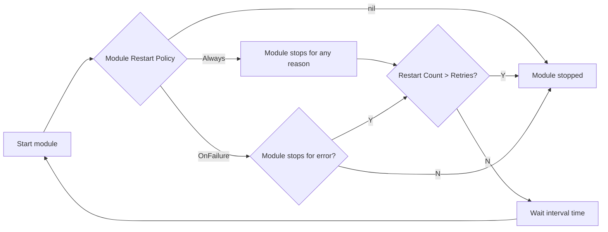

# Enhance The Error Handling of Beehive Modules

## Motivation

The Start() function of module in the Beehive framework doesn't return an error. This results in a variety of error handling in the Start() function of each KubeEdge module. Some print the error and interrupt the function with the return keyword, some use panic(), and some use Exit(). Both panic() and Exit() pose risks to the program. We need to implement a standardized error handling method in the Start() function of the Beehive module.

In addition, there was a requirement for the Beehive module to be restartable. We previously used global configuration to set the restart of all edge modules ([#5134](https://github.com/kubeedge/kubeedge/issues/5134)). This is also related to error handling, so we took this opportunity to optimize it to a module-level restart setting.


## Goals

- Define the error handling specification of the Beehive module's Start() function.
- Beehive module can set restart policy individually.
- Define a common Beehive module to reduce redundant code in development modules.
- Add unit tests for new content.


## Proposal

### Start() Error Handling Specification

Considering backward compatibility with the Start() function, we're not adding an error return value for it.
Furthermore, analyzing the original design reveals that this might not be appropriate.
Start() is a runtime function of the module, representing the module running lifecycle.
It's best for the developer to define how to handle errors that occur during Start().
For example:
- If a single module fails and you don't want to affect the program progress, you can only print the error and call return.
- If a single module fails and you want to terminate the program progress, you can call klog.Exit() or panic(). However, you need to use klog.OnExit() and recover() to catch the error at the top-level call site to prevent affecting the release of resources.

The Beehive framework will provide the setting of module restart policy.
If you use it to restart a module that fails to start, you need to pass the error through panic(). Refer to the [Restart Policy](#restart-policy).


### Restart Policy

The restart policy is used to set how the module restarts, the number of restarts, and the restart interval time.
When the module uses the restart policy, **the Start() function must be blocking**.
If the Start() function is non-blocking, the module will be restarted after the Start() function returns.

Since the Start() function has no return value, passing the error through panic() is the best option in the golang system.
The Beehive framework will use recover() to catch the error panicked in the Start() function.

```golang
const (
    // RestartPolicyAlways always restart
    RestartTypeAlways RestartType = "Always"
    // RestartPolicyOnFailure on failure restart
    RestartTypeOnFailure RestartType = "OnFailure"
)

type ModuleRestartPolicy struct {
    // RestartType is the type of restart policy
    RestartType RestartType
    // Retries indicates the number of restarts. If the value is 0, will always restart.
    Retries int32
    // IntervalSecond is the interval seconds between each restart. Default is 1 second.
    IntervalSecond int32
    // IntervalTimeGrowthRate is the growth rate of the time interval between restarts.
    // The value must be greater than 1, otherwise it will be ignored.
    // The interval between each restart is: IntervalTime * IntervalTimeGrowthRate.
    IntervalTimeGrowthRate float64
    // RestartIntervalLimit is the maximum time interval between restarts. Default is 30 seconds.
    RestartIntervalLimit time.Duration
    // ErrorHandler if the Retries is set and reaches the maximum, this method is used to customize error handling.
    // The default handling is to print the error log.
    ErrorHandler func(err error)
}
```

Add a function to the module interface that returns the module's restart policy, return nil to disable restart module.
```diff
type Module interface {
    Name() string
    Group() string
    Enable() bool
    Start()
+   RestartPolicy() *ModuleRestartPolicy
}
```

Modify the localModuleKeeper() function based on the original restart capability.


The interval between each restart can be gradually increased by setting.
```golang
const DefaultRestartIntervalLimit = 30 * time.Second

policy := module.RestartPolicy()
intervalTime := time.Duration(policy.IntervalSecond) * time.Second
if policy.IntervalTimeGrowthRate > 1 {
    limit := policy.RestartIntervalLimit
    if limit == 0 {
        limit = DefaultRestartIntervalLimit
    }
    intervalTime = time.Duration(float64(intervalTime) * policy.IntervalTimeGrowthRate)
    if intervalTime >limit {
        intervalTime = limit
    }
}
```

Compatibility with existing KubeEdge modules:
- Add RestartPolicy() function that returns a nil for existing modules in the cloud.
    ```golang
    func (m *CloudModule) RestartPolicy() *core.ModuleRestartPolicy {
        return nil
    }
    ```
- Add RestartPolicy() function that returns the originally defined restart settings for existing modules in the edge.
    ```golang
    func (m *EdgeModule) RestartPolicy() *core.ModuleRestartPolicy {
        if !features.DefaultFeatureGate.Enabled(features.ModuleRestart) {
            return nil
        }
        return &core.ModuleRestartPolicy{
            RestartType: RestartTypeOnFailure,
            IntervalTimeGrowthRate: 2.0,
        }
    }
    ```

### Common Beehive Module

Usually, developers only focus on the module startup function. 
But every time a new Beehive module is developed, a structure needs to be written to implement the interface, which is very redundant.
So we provide a common Beehive module structure to reduce redundant code in development modules, and two start functions `func()` and `func() error` are provided for developers to choose.

```golang
type SimpleModule struct {
    // name indicates the module name.
    name string
    // group indicates the module group.
    group string
    // enable indicates whether the module is enabled, default is true.
    enable bool
    // restartPolicy indicates the module restart policy.
    restartPolicy *ModuleRestartPolicy
    // StartFunc indicates the module start function.
    StartFunc func()
    // StartEFunc indicates the module start function that can return an error.
    // The module will panic the error if the function returns an error.
    StartEFunc func() error
}

func NewSimpleModule(name, group string, opts ...SimpleModuleOption) *SimpleModule {
    // new default
    m := &SimpleModule{name: name, group: group, enable: true}
    // Set options
    for _, opt := range opts {
        opt(m)
    }
    return m
}

func (m SimpleModule) Name() string {
    return m.name
}

func (m SimpleModule) Group() string {
    return m.group
}

func (m SimpleModule) Enable() bool {
    return m.enable
}

func (m SimpleModule) Start() {
    switch {
    case m.StartFunc != nil:
        m.StartFunc()
    case m.StartEFunc != nil:
        if err := m.StartEFunc(); err != nil {
            panic(err)
        }
    default:
        klog.Warnf("SimpleModule %s - %s has no start function", m.group, m.name)
    }
}

func (m SimpleModule) RestartPolicy() *ModuleRestartPolicy {
    return m.restartPolicy
}
```

Examples of using SimpleModule:
```golang
import "github.com/kubeedge/beehive/pkg/core"

func main() {
    testModule := core.NewSimpleModule("test", "test-group", core.WithRestartPolicy(&core.ModuleRestartPolicy{
        RestartType: core.RestartTypeOnFailure,
    }))
    testModule.StartEFunc = func() error {
        // Your module startup logic here.
        // If an error occurs, return it to trigger the restart policy.
        return nil
    }
    core.Register(testModule)
}
```
