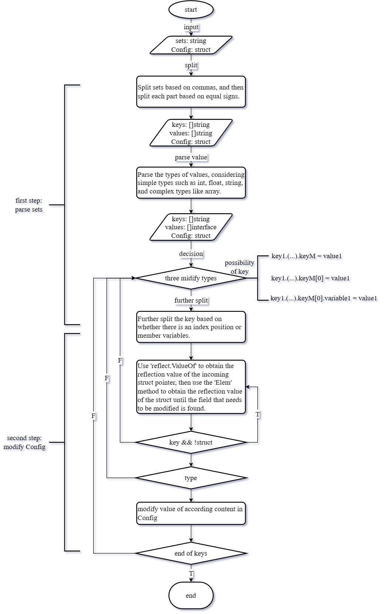

# Keadm Tool Enhancement

## Motivation

Keadm(KubeEdge installation tool) now only supports configuring a subset of parameters during EdgeCore installation.

We would like to support specifying parameters using `--set` or directly using an existing local configuration file to achieve full parameter configuration and meet the users' requirements. 

## Goals

- Use '--set' or local configuration file to set parameters

## Design Details

### The frame design drawing is as follows

#### Frame design 



1. **Start** - The entry point of the program which takes in two inputs：
   - `sets`:A string containing multiple key-value pairs separated by commas.
   - `Config`:A structure meant to hold the parsed configuration data.
2. **Split** - The `sets` string is split by commas into individual settings, and each setting is further split by the equal sign to separate keys from values.
3. **Parse Value** - Parses the type of each value, considering basic types such as integer (int), floating-point (float), string, and complex types like arrays.
4. **Decision** - Different processing is applied depending on the form of the key. There are three possible key types:
   - `key[...]` - The key indicates an index in an array.
   - `key[...].key[M]` - The key indicates a specific field within an element of the array.
   - `key[...].key[M].variable1` - The key indicates a variable within a specific field of an element in the array.
5. **Further Split** - The key is further split based on whether there is an index position or member variables.
6. **Use `reflect.ValueOf`** - Reflection is used to obtain the reflection value of the incoming structure pointer, then the `Elem` method is utilized to recursively find the reflection value of the field that needs modification.
7. **Key and Structure Type Check (`key && tStruct`)** - It determines if the key matches the fields in the structure.
8. **Modify Config** - The `Config` structure is modified according to the parsed content.
9. **End of Keys** - All keys have been processed.
10. **End** - The process ends.

#### Ways of setting different types of values

1.Basic type：`--set name=value`

2.An element in an array:`--set outer.inner=value`

3.The array itself:`--set name={1,2,3}`

4.Map type:`-- set map={"name":value,"name":value1}`

5.Embed Structure Fields：`--set servers[0].port=80`

 ###  Design contents about how to add a flag `set` 

1.Add `Sets` slices to the `JoinOptions` structure in the `common/type.go` file

2.Distributed in `edge/join_windows.go` and `edge/join_others.go` files, the `cmd.Flags.StringVar` function is called in the `AddJoinOtherFlags` function to add the command line parameter settings of keadm

3.Distributed in `edge/join_windows.go` and `edge/join_others.go` files, the `createEdgeConfigFiles` function calls the `ParseSet `function in the `util/set.go` file, and sets the parameters set by the user to the `edgeCoreConfig` instance.

### Some Example for `keadm join --set`

1.Enable flow debugging capability

```bash
keadm join --set modules.edgeStream.enable=true,modules.edgeStream.server=<CLOUDCORE_IP>:<TUNNEL_PORT>
```

2.Start MetaServer

```bash
keadm join --set modules.metaManager.enable=true,modules.metaManager.metaServer.enable=true,modules.metaManager.metaServer.serviceAccountIssuers={xx,xx},modules.metaManager.remoteQueryTimeout=32
```

3.Turn on ServiceBus

```bash
keadm join --set modules.serviceBus.enable=true
```

4.Set FeatureGates

```bash
keadm join --set featureGates={"xxx":true,"xxx":false}
```

