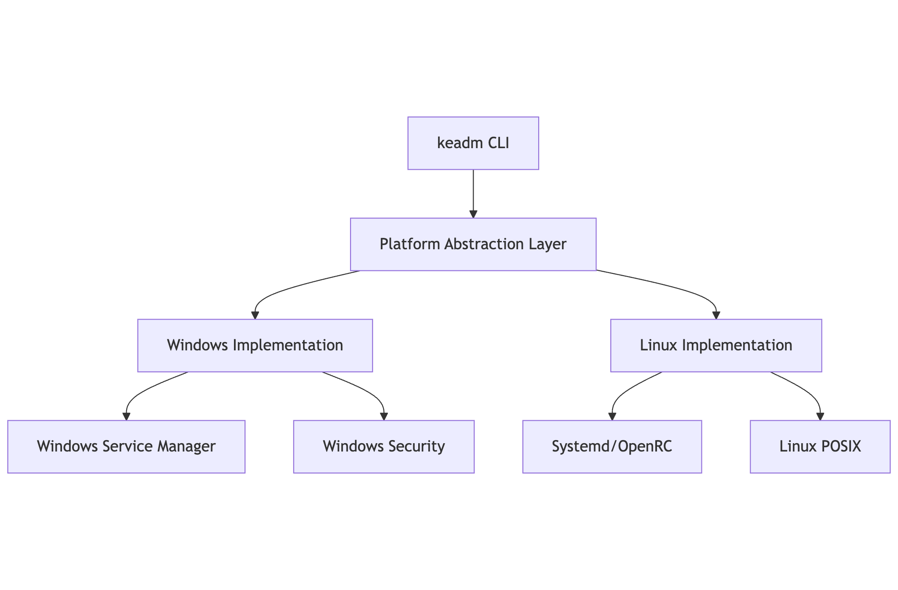
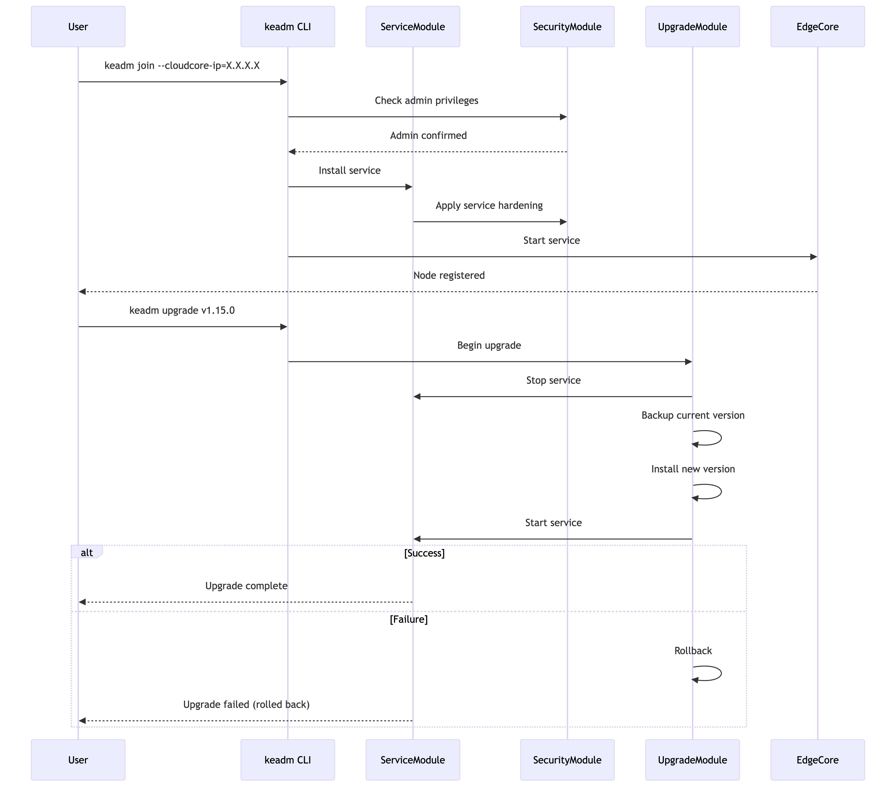

## Motivation

As Kubernetes and its container runtime improve their support for Windows nodes, KubeEdge also needs to run EdgeCore stably on the Windows platform. However, the current implementation of Keadm on Windows has limitations: EdgeCore requires manual installation, services are managed through external tools like NSSM, and the user experience is inconsistent with Linux. To simplify deployment and improve reliability, we need to enhance the Windows support in Keadm to automatically manage EdgeCore as a native Windows service.

## Goals

This project aims to enable Keadm to automatically manage EdgeCore services on Windows platforms, including:

- Automatically install and register EdgeCore as a system service on Windows nodes.

- Ensure that `keadm join`, `upgrade`, `backup`, `rollback`, and `reset` commands can be executed correctly on Windows platforms and the effects are consistent with Linux.

- Replace NSSM dependencies with native Windows Service Control Manager APIs.

- Improve Windows error handling and log output to simplify deployment and operations.

## Use Cases

| Scenario                    | User Action                                      | Expected Outcome                                                                 |
|----------------------------|--------------------------------------------------|----------------------------------------------------------------------------------|
| New Windows node onboarding | `keadm join --cloudcore-ip=X.X.X.X`             | EdgeCore service running; node registered to cloud                              |
| EdgeCore version upgrade    | `keadm upgrade --version v1.20.0`               | EdgeCore upgraded to v1.20.0; rollback to prior version if upgrade fails        |
| Node decommissioning        | `keadm reset`                                   | EdgeCore service stopped and deleted; all KubeEdge-related files removed        |
| EdgeCore configuration update | `keadm upgrade --config new_config.yaml`      | New configuration applied; EdgeCore service restarted with updated config       |

## Design overview




## Implementation Details

### Platform Abstraction Layer

**Objective:** Create a unified service management interface with platform-specific implementations using Go build tags.

**Implementation:**

```go
package extsystem

import "k8s.io/kubernetes/cmd/kubeadm/app/util/initsystem"

type ExtSystem interface {
	ServiceEnable(service string) error
	ServiceDisable(service string) error
	ServiceCreate(service, cmd string, envs map[string]string) error
	ServiceRemove(service string) error
	initsystem.InitSystem
}
```

### Windows Service Management Module

**Objective:** Replace nssm dependency with native Windows service APIs for robust lifecycle control.

**Implementation:**

```go
package extsystem

import (
	"os/exec"
	"k8s.io/klog/v2"
	"k8s.io/kubernetes/cmd/kubeadm/app/util/initsystem"
)

type WindowsInitSystem struct {
	initsystem.WindowsInitSystem
}

func (sysd WindowsInitSystem) ServiceEnable(service string) error {
	return exec.Command(sysd.EnableCommand(service)).Run()
}

func (sysd WindowsInitSystem) ServiceDisable(service string) error {
	return exec.Command("sc", "delete", service).Run()
}

func (sysd WindowsInitSystem) ServiceCreate(service string, cmd string, envs map[string]string) error {
	args := []string{"create", service, "binPath=", cmd, "start=", "auto"}
	
	for key, value := range envs {
		args = append(args, "env", key+"="+value)
	}
	
	return exec.Command("sc", args...).Run()
}

func (sysd WindowsInitSystem) ServiceRemove(service string) error {
	return exec.Command("sc", "delete", service).Run()
}

func GetExtSystem() (ExtSystem, error) {
	return &WindowsInitSystem{}, nil
}
```

**Service States:**

- **Installation:** Service registered with SCM as auto-start

- **Runtime:** Managed through standard service commands (start/stop/restart)

- **Recovery:** Automatic restart sequence on failures

#### Join Command Module

**Objective:** Automate EdgeCore installation and bootstrap secure connection to CloudCore.

The `keadm join` command will perform the following steps:
1. **Pre-requisite Checks:**
    - Verify administrator privileges
    - Confirm Windows version compatibility
    - Check network connectivity to CloudCore
2. **Directory Setup:**
    ```powershell
    New-Item -Path "C:\etc\kubeedge" -ItemType Directory -Force
    New-Item -Path "C:\var\lib\kubeedge" -ItemType Directory -Force
    Set-Acl -Path "C:\etc\kubeedge" -AclObject (Get-Acl -Path "C:\ProgramData")
    ```
3. **Service Installation:**
    - Copy edgecore binary to `C:\etc\kubeedge\bin\`
    - Generate default config if not provided
    - Register service with SCM
4. **Certificate Bootstrap:**
    - Establish secure connection to CloudCore
    - Store certificates in `C:\var\lib\kubeedge\certs`

**Implementation:**
```go
func join(opt *common.JoinOptions, step *common.Step) error {
	// Common logic for all platforms
	if err := common.ValidateJoinOptions(opt); err != nil {
		return err
	}
	
	// Platform-specific directory setup
	if err := createWindowsDirs(); err != nil {
		return err
	}
	
	// Reused image pulling logic
	if err := common.PullImages(opt); err != nil {
		return err
	}
	
	// Windows-specific service setup
	extSystem, err := extsystem.GetExtSystem()
	if err != nil {
		return fmt.Errorf("failed to get ext system: %v", err)
	}
	
	// Reused service creation logic with platform abstraction
	if err := common.CreateService(extSystem, constants.KubeEdgeBinaryName); err != nil {
		return err
	}
	
	return nil
}
```
#### Process Management Functions
**Objective:** Implement missing functions required for upgrade and reset operations.
```go
// util/common_windows.go

// runEdgeCore starts the EdgeCore service
func runEdgeCore() error {
	extSystem, err := extsystem.GetExtSystem()
	if err != nil {
		return err
	}
	return extSystem.ServiceStart(constants.EdgeCoreServiceName)
}

// KillKubeEdgeBinary stops the service and kills any remaining processes
func KillKubeEdgeBinary(proc string) error {
	extSystem, err := extsystem.GetExtSystem()
	if err != nil {
		return err
	}

	// Stop service first
	if err := extSystem.ServiceStop(constants.EdgeCoreServiceName); err != nil {
		klog.Warningf("Failed to stop service: %v", err)
	}

	// Force kill any remaining processes
	cmd := exec.Command("taskkill", "/F", "/IM", proc+".exe")
	if output, err := cmd.CombinedOutput(); err != nil {
		// Ignore "process not found" errors
		if !strings.Contains(string(output), "not found") {
			return fmt.Errorf("taskkill failed: %v, output: %s", err, string(output))
		}
	}
	return nil
}
```


### Build & Packaging Module

**Objective:** Automate Windows binary generation and installer creation

#### Prerequisites for Packaging

The Windows packaging targets require:
1. NSIS (Nullsoft Scriptable Install System):
    - Used for creating EXE installers
    - Install via Chocolatey: `choco install nsis`
2. WiX Toolset:
    - Used for creating MSI packages
    - Install via Chocolatey: `choco install wixtoolset`

**CI Setup:**
```yaml
# Sample GitHub Actions configuration
jobs:
  package-windows:
    runs-on: windows-latest
    steps:
    - name: Install dependencies
      run: |
        choco install nsis -y
        choco install wixtoolset -y
        
    - name: Build and package
      run: |
        make build-windows
        make package-windows
```

**Makefile Changes:**

```makefile
# Integrated with existing build system
build-all: build-linux build-windows

build-windows:
    @echo "Building Windows binaries..."
    GOOS=windows GOARCH=amd64 go build -ldflags "-s -w" -o bin/windows/keadm.exe ./cmd/keadm
    GOOS=windows GOARCH=amd64 go build -ldflags "-s -w" -o bin/windows/edgecore.exe ./cmd/edgecore

# Optional packaging targets (require CI setup)
package-windows: check-packaging-tools
    makensis -V4 \
        -DOUTPUT_DIR="dist" \
        -DVERSION="${VERSION}" \
        packaging/windows/installer.nsi
    heat dir bin/windows -gg -scom -sfrag -dr INSTALLDIR -cg EdgeFiles -out edgecore.wxs
    candle -dVersion=${VERSION} edgecore.wxs
    light -ext WixUIExtension -out dist/KubeEdge-${VERSION}.msi edgecore.wixobj

check-packaging-tools:
    @which makensis >/dev/null || (echo "NSIS required: https://nsis.sourceforge.io" ; exit 1)
    @which heat >/dev/null || (echo "WiX Toolset required: https://wixtoolset.org" ; exit 1)
```
**CI Integration:**

1. Binary Building:
    - Added to existing Linux build pipeline
    - Requires only Go toolchain
    - Produces raw Windows executables
2. Packaging:
    - Requires specialized Windows CI runner
    - Needs NSIS and WiX pre-installed
    - Triggered only on release tags


## Module Integration Flow



## Test Matrix

| Test Case                    | 	Verification Method                         |
|----------------------------|--------------------------------------------------|
| Service install/uninstall | Verify SCM registration             |
| Upgrade rollback    | Inject binary corruption               |
| Permission enforcement       | Non-admin execution attempts                                   |
| Network disruption     | Disable during cloudcore communication                            |
| Long-running stability | 72h continuous operation test   |

## Rollout Plan
1. Phase 1: Implement service abstraction layer
2. Phase 2: Add Windows service implementation
3. Phase 3: Integrate with keadm commands
4. Phase 4: Add CI builds for Windows binaries
5. Phase 5 (Optional): Set up dedicated packaging pipeline