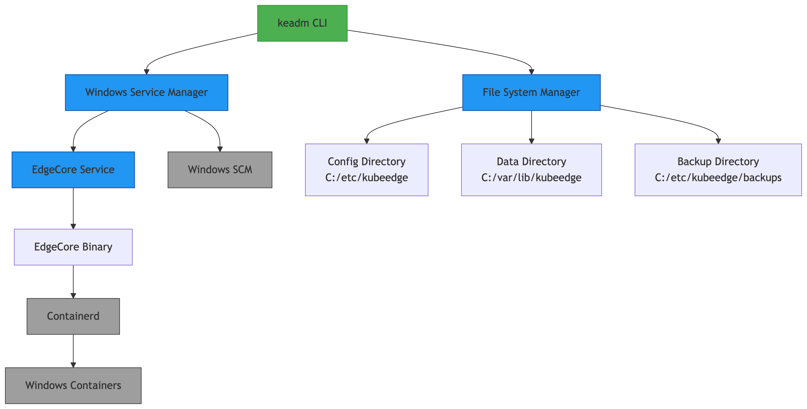
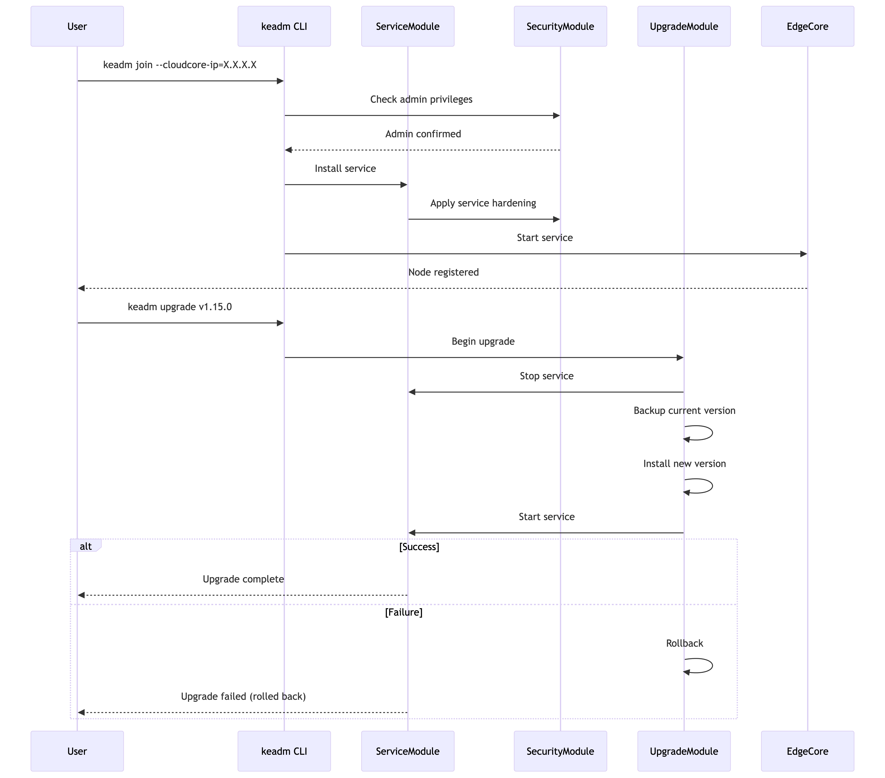

## Motivation

As Kubernetes and its container runtime improve their support for Windows nodes, KubeEdge also needs to run EdgeCore stably on the Windows platform. However, the current implementation of Keadm on Windows still has limitations: EdgeCore needs to be installed manually, and services are managed through external tools (such as NSSM), and the user experience is inconsistent with the Linux platform. In order to simplify the deployment process and improve reliability, it is urgent to improve the Windows part of Keadm so that it can automatically use Windows services to manage EdgeCore like Linux services.

## Goals

This project aims to enable Keadm to automatically manage EdgeCore services on Windows platforms, including:

- Automatically install and register EdgeCore as a system service on Windows nodes.

- Ensure that `keadm join`, `upgrade`, `backup`, `rollback`, and `reset` commands can be executed correctly on Windows platforms and the effects are consistent with Linux.

- Use native Windows service API to replace existing NSSM dependencies, improving stability and consistency.

- Improve error handling and log output on Windows platform to simplify deployment and operation and maintenance processes.

## Use Cases

| Scenario                    | User Action                                      | Expected Outcome                                                                 |
|----------------------------|--------------------------------------------------|----------------------------------------------------------------------------------|
| New Windows node onboarding | `keadm join --cloudcore-ip=X.X.X.X`             | EdgeCore service running; node registered to cloud                              |
| EdgeCore version upgrade    | `keadm upgrade --version v1.20.0`               | EdgeCore upgraded to v1.20.0; rollback to prior version if upgrade fails        |
| Node decommissioning        | `keadm reset`                                   | EdgeCore service stopped and deleted; all KubeEdge-related files removed        |
| Broken service recovery     | (Managed by systemd)                            | EdgeCore service auto-restarted with backoff: 60s, 120s, 300s upon failures     |
| EdgeCore configuration update | `keadm upgrade --config new_config.yaml`      | New configuration applied; EdgeCore service restarted with updated config       |
| Edge node backup for migration | `keadm backup --dir backup_path`            | Create a backup of EdgeCore configuration and certificates for migration        |

## Design overview



### Key Components:
1. **Service Controller:** Manages service lifecycle using ``windows/svc/mgr``.
2. **File Manager:** Handles versioned binaries and configs.
3. **Backup System:** Automatic version snapshots for rollback.
4. **Recovery Engine:** Configurable failure policies via SCM.


## Implementation Details

#### Windows Service Management Module

**Objective:** Replace nssm dependency with native Windows service APIs for robust lifecycle control.

We will use the `golang.org/x/sys/windows/svc/mgr` package to manage the EdgeCore service. This replaces the current `nssm` dependency with native Windows service APIs, ensuring better integration with Windows Service Control Manager (SCM).

**Implementation:**

```go
// ServiceController manages EdgeCore via Windows SCM
type ServiceController struct {
    name string
    mgr  *mgr.Mgr
}

func (sc *ServiceController) Install(binaryPath string) error {
    // Connect to SCM
    mgr, err := mgr.Connect()
    if err != nil { /* handle error */ }
    
    // Configure service parameters
    config := mgr.Config{
        DisplayName:     "KubeEdge EdgeCore",
        StartType:       mgr.StartAutomatic,
        BinaryPathName:  binaryPath,
        Description:     "Manages edge computing workloads",
        ServiceType:     windows.SERVICE_WIN32_OWN_PROCESS,
    }
    
    // Create service
    service, err := mgr.CreateService(sc.name, binaryPath, config)
    if err != nil { /* handle error */ }
    
    // Set failure recovery policy (restart 3x with increasing delays)
    recoveryActions := []mgr.RecoveryAction{
        {Type: mgr.ServiceRestart, Delay: 60000},
        {Type: mgr.ServiceRestart, Delay: 120000},
        {Type: mgr.ServiceRestart, Delay: 300000}}
    service.SetRecoveryActions(recoveryActions, 86400) // Reset counter after 24h
    
    // Set security descriptor (SYSTEM and Admins full control)
    sd, _ := windows.SecurityDescriptorFromString("D:P(A;;FA;;;SY)(A;;FA;;;BA)")
    service.SetServiceSidType(windows.SERVICE_SID_TYPE_UNRESTRICTED)
    service.SetSecurityDescriptor(sd)
}
```

**Service States:**

- **Installation:** Service registered with SCM as auto-start

- **Runtime:** Managed through standard service commands (start/stop/restart)

- **Recovery:** Automatic restart sequence on failures

#### Join Command Module

**Objective:** Automate EdgeCore installation and bootstrap secure connection to CloudCore.

The `keadm join` command will perform the following steps:
1. **Pre-requisite Checks:**
    - Verify administrator privileges
    - Confirm Windows version compatibility
    - Check network connectivity to CloudCore
2. **Directory Setup:**
    ```powershell
    New-Item -Path "C:\etc\kubeedge" -ItemType Directory -Force
    New-Item -Path "C:\var\lib\kubeedge" -ItemType Directory -Force
    Set-Acl -Path "C:\etc\kubeedge" -AclObject (Get-Acl -Path "C:\ProgramData")
    ```
3. **Service Installation:**
    - Copy edgecore binary to `C:\etc\kubeedge\bin\`
    - Generate default config if not provided
    - Register service with SCM
4. **Certificate Bootstrap:**
    - Establish secure connection to CloudCore
    - Store certificates in `C:\var\lib\kubeedge\certs`

**Implementation:**
```go
func runJoin(cmd *cobra.Command, args []string) {
    // Phase 1: Pre-flight checks
    if !isAdmin() { log.Fatal("Requires administrator privileges") }
    if !isWindowsVersionSupported() { /* handle error */ }
    
    // Phase 2: Filesystem setup
    createSecureDirectory("C:\\etc\\kubeedge\\conf")
    createSecureDirectory("C:\\var\\lib\\kubeedge\\certs")
    
    // Phase 3: EdgeCore deployment
    copyFile(edgecoreBinary, "C:\\etc\\kubeedge\\bin\\edgecore.exe")
    generateConfig("C:\\etc\\kubeedge\\conf\\edgecore.yaml")
    
    // Phase 4: Service registration
    serviceCtrl := NewServiceController("EdgeCore")
    serviceCtrl.Install("C:\\etc\\kubeedge\\bin\\edgecore.exe --config=C:\\etc\\kubeedge\\conf\\edgecore.yaml")
    
    // Phase 5: Certificate bootstrap
    certs, err := fetchCertsFromCloudCore(cloudcoreIP)
    storeCerts("C:\\var\\lib\\kubeedge\\certs", certs)
    
    // Phase 6: Service start & verification
    if err := serviceCtrl.Start(); err != nil { /* handle error */ }
    verifyEdgeCoreReady(120) // 120s timeout
}
```

#### Upgrade/Rollback Module

**Objective:** Provide atomic version upgrades with automatic failure rollback

The upgrade process implements transactional semantics to ensure reliability:
```go
// AtomicUpgrader manages version transitions
type AtomicUpgrader struct {
    BackupDir     string
    CurrentBinary string
}

func (au *AtomicUpgrader) Upgrade(newVersion string) error {
    // Step 1: Download new binary (with checksum verification)
    tempFile, err := downloadVerifiedBinary(newVersion)
    
    // Step 2: Stop service gracefully
    if err := service.Stop(); err != nil { /* handle error */ }
    
    // Step 3: Create versioned backup
    backupName := fmt.Sprintf("edgecore_%s.bak", currentVersion)
    backupPath := filepath.Join(au.BackupDir, backupName)
    if err := os.Rename(au.CurrentBinary, backupPath); err != nil { /* handle error */ }
    
    // Step 4: Atomic replacement
    if err := windows.MoveFileEx(
        syscall.StringToUTF16Ptr(tempFile),
        syscall.StringToUTF16Ptr(au.CurrentBinary),
        windows.MOVEFILE_REPLACE_EXISTING|windows.MOVEFILE_WRITE_THROUGH,
    ); err != nil { /* handle error */ }
    
    // Step 5: Start service with new version
    if err := service.Start(); err != nil {
        au.Rollback(backupPath) // Automatic rollback on failure
        return err
    }
    
    // Step 6: Update version metadata
    writeVersionFile(newVersion)
    return nil
}

func (au *AtomicUpgrader) Rollback(backupPath string) {
    // 1. Stop service if running
    service.Stop()
    
    // 2. Restore previous binary
    windows.MoveFileEx(
        syscall.StringToUTF16Ptr(backupPath),
        syscall.StringToUTF16Ptr(au.CurrentBinary),
        windows.MOVEFILE_REPLACE_EXISTING|windows.MOVEFILE_WRITE_THROUGH)
    
    // 3. Restart service
    service.Start()
}
```
**Version Management:**

- Maintain `version.txt` in `C:\etc\kubeedge`
- Backup directory structure:
    ```txt
    C:/etc/kubeedge/backups/
    ├── v1.14.0/
    │   ├── edgecore.exe
    │   └── edgecore.yaml
    └── v1.13.2/
    ```

#### Security Module

**Objective:** Enforce enterprise-grade security for service and file assets.

**Access Control:**
```go
func secureDirectories() {
    // Restrict to SYSTEM and Administrators
    sd, _ := windows.SecurityDescriptorFromString("D:P(A;;FA;;;SY)(A;;FA;;;BA)")
    paths := []string{"C:\\etc\\kubeedge", "C:\\var\\lib\\kubeedge"}
    for _, path := range paths {
        windows.SetNamedSecurityInfo(
            path, windows.SE_FILE_OBJECT,
            windows.DACL_SECURITY_INFORMATION, nil, nil, sd, nil)
    }
}
```
**Privilege Enforcement:**
```go
func requireAdmin() {
    if !isAdmin() {
        log.Fatal("Must run as Administrator")
    }
}

func isAdmin() bool {
    _, err := os.Open("\\\\.\\PHYSICALDRIVE0")
    return err == nil
}
```

**Implementation:**
```go
// SecurityEnforcer applies Windows security policies
type SecurityEnforcer struct {
    ServiceName string
}

func (se *SecurityEnforcer) ApplyDirectoryACL(path string) {
    // Set directory ownership to SYSTEM
    windows.SetNamedSecurityInfo(
        path, windows.SE_FILE_OBJECT,
        windows.OWNER_SECURITY_INFORMATION,
        windows.SID("S-1-5-18"), nil, nil, nil)
    
    // Configure DACL: SYSTEM/Admins full access, Users read-only
    dacl, _ := windows.ACLFromEntries([]windows.EXPLICIT_ACCESS{
        {
            AccessPermissions: windows.GENERIC_ALL,
            AccessMode:        windows.GRANT_ACCESS,
            Trustee: windows.TRUSTEE{
                TrusteeForm:  windows.TRUSTEE_IS_SID,
                TrusteeValue: windows.SID("S-1-5-18"), // SYSTEM
            },
        },
        {
            AccessPermissions: windows.GENERIC_READ | windows.GENERIC_EXECUTE,
            AccessMode:        windows.GRANT_ACCESS,
            Trustee: windows.TRUSTEE{
                TrusteeForm:  windows.TRUSTEE_IS_SID,
                TrusteeValue: windows.SID("S-1-5-32-545"), // Users
            },
        },
    }, nil)
    
    windows.SetNamedSecurityInfo(
        path, windows.SE_FILE_OBJECT,
        windows.DACL_SECURITY_INFORMATION, nil, nil, dacl, nil)
}

func (se *SecurityEnforcer) HardenService() {
    service, _ := mgr.OpenService(se.ServiceName)
    
    // Disallow service interaction with desktop
    service.Config(serviceType: windows.SERVICE_WIN32_OWN_PROCESS | 
        windows.SERVICE_INTERACTIVE_PROCESS)
    
    // Configure restricted service SID
    service.SetServiceSidType(windows.SERVICE_SID_TYPE_RESTRICTED)
}
```

#### Build & Packaging Module

**Objective:** Automate Windows binary generation and installer creation

**Makefile Changes:**

```makefile
# Makefile targets
build-windows:
    @echo "Building Windows binaries..."
    GOOS=windows GOARCH=amd64 go build -ldflags "-s -w" -o bin/windows/keadm.exe ./cmd/keadm
    GOOS=windows GOARCH=amd64 go build -ldflags "-s -w" -o bin/windows/edgecore.exe ./cmd/edgecore

package-installer:
    makensis -V4 \
        -DOUTPUT_DIR="dist" \
        -DVERSION="${VERSION}" \
        packaging/windows/installer.nsi

create-msi:
    heat dir bin/windows -gg -scom -sfrag -dr INSTALLDIR -cg EdgeFiles -out edgecore.wxs
    candle -dVersion=${VERSION} edgecore.wxs
    light -ext WixUIExtension -out KubeEdge-${VERSION}.msi edgecore.wixobj
```
**Installer Features:**

- Silent installation option for enterprise deployment
- Automatic PATH configuration
- Service registration with recovery policies
- Uninstall cleanup script


####  Configuration Management Module

**Objective:** Enable dynamic configuration updates without service interruption

**Hot Reload Procedure:**

1. Validate new configuration
2. Stop EdgeCore service
3. Atomic config file replacement
4. Restart service
5. Verify health check endpoint
```powershell
keadm upgrade --config edgecore-new.yaml
# Equivalent to:
Stop-Service EdgeCore
Copy-Item edgecore-new.yaml C:\etc\kubeedge\conf\ -Force
Start-Service EdgeCore
```

**Implementation:**

```go
type ConfigManager struct {
    ConfigPath    string
    ServiceName   string
}

func (cm *ConfigManager) HotReload(newConfig string) error {
    // Step 1: Validate new configuration
    if err := validateConfig(newConfig); err != nil { /* handle error */ }
    
    // Step 2: Create atomic replacement
    tempPath := cm.ConfigPath + ".tmp"
    if err := os.WriteFile(tempPath, []byte(newConfig), 0600); err != nil { /* handle error */ }
    
    // Step 3: Atomic swap
    if err := windows.MoveFileEx(
        syscall.StringToUTF16Ptr(tempPath),
        syscall.StringToUTF16Ptr(cm.ConfigPath),
        windows.MOVEFILE_REPLACE_EXISTING|windows.MOVEFILE_WRITE_THROUGH,
    ); err != nil { /* handle error */ }
    
    // Step 4: Signal EdgeCore to reload
    service, _ := mgr.OpenService(cm.ServiceName)
    status, _ := service.Query()
    if status.State == svc.Running {
        // Send custom control code for config reload
        service.Control(128) // Custom control code
    }
    
    return nil
}

// EdgeCore integration
func main() {
    // Register config reload handler
    signal.RegisterReloadHandler(func() {
        config := loadConfig(configPath)
        reconfigureComponents(config)
    })
}
```

## Module Integration Flow



## Test Matrix

| Test Case                    | 	Verification Method                         |
|----------------------------|--------------------------------------------------|
| Service install/uninstall | Verify SCM registration             |
| Upgrade rollback    | Inject binary corruption               |
| Permission enforcement       | Non-admin execution attempts                                   |
| Network disruption     | Disable during cloudcore communication                            |
| Long-running stability | 72h continuous operation test   