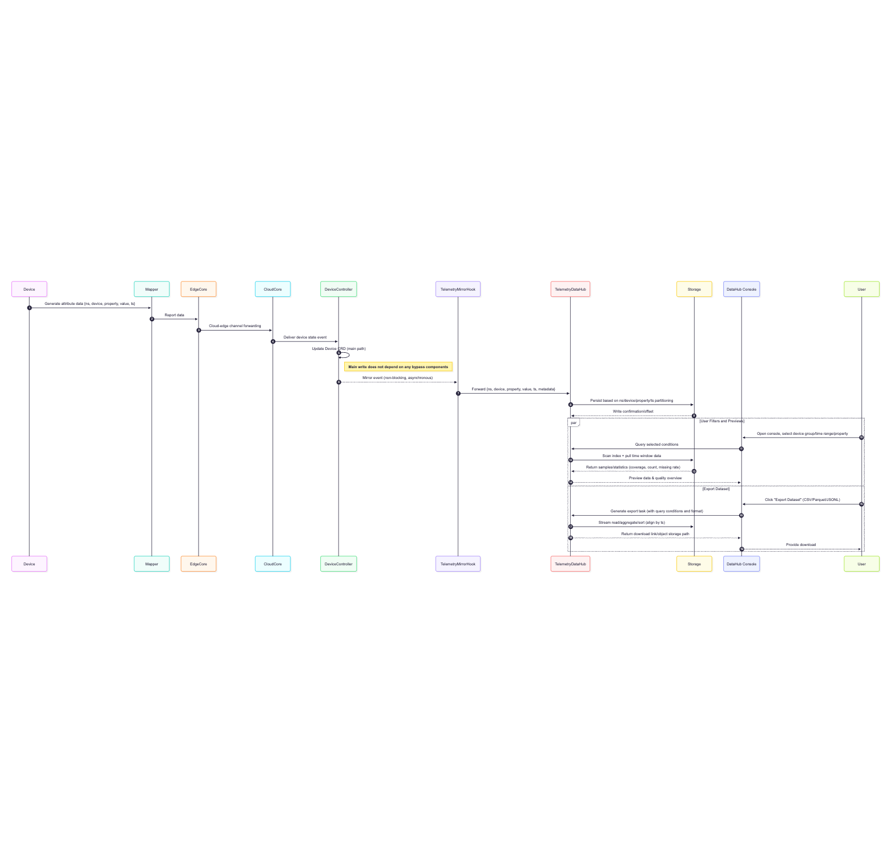
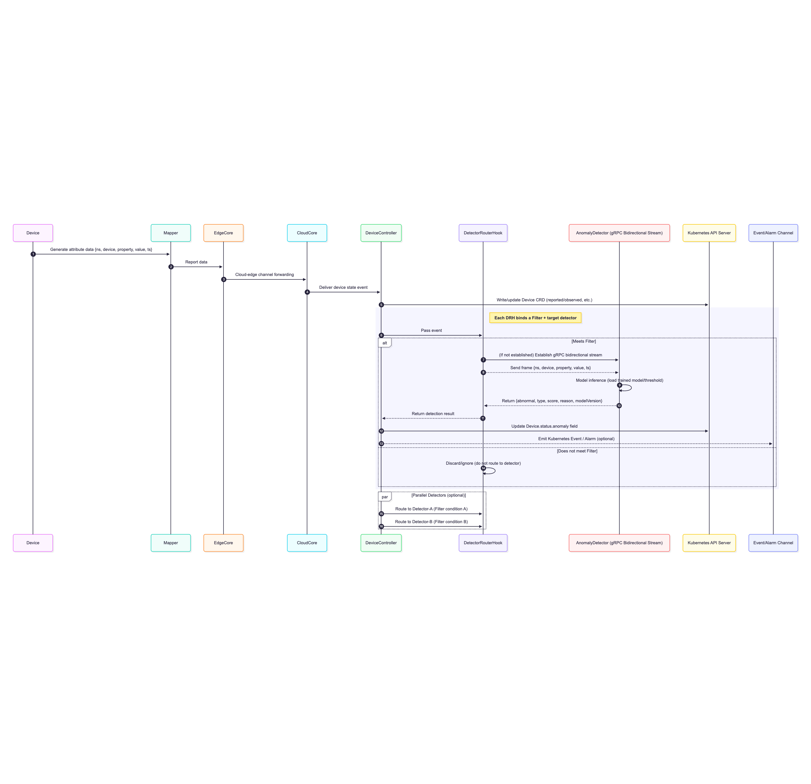

# KubeEdge: Device Anomaly Detection Framework

## 1. Introduction

### 1.1 Background and Problem Statement

KubeEdge, as an open-source IoT platform for cloud-edge collaboration, provides comprehensive device management capabilities. The device state is a critical basis for upper-layer applications to make decisions and controls. Currently, the platform collects attribute values from the device side through Mapper and updates the device resources (Device CRD) in the CloudCore’s DeviceController component to reflect the device's desired state (Desired State), observed desired state (Desired Observed State), and reported state (Reported State).

However, the device state reporting link may be affected by various factors, including but not limited to:

- **Limitations of Mapper implementation**: Mappers of different manufacturers or models may handle anomalies inconsistently, potentially missing key information.
- **Physical device faults**: Sensor damage, freezing, or drift in accuracy can lead to distorted reported values.
- **Network issues**: Delays, packet loss, or disconnections can cause incomplete or outdated data.
- **Security threats**: Malicious data injection or tampering can lead to incorrect decisions by upper-layer applications based on erroneous states.

When the device state displayed on the platform differs from the actual operating state of the device, applications that rely on these states may respond incorrectly, potentially leading to production safety risks.

### 1.2 Project Goals and Expected Value

This project aims to design and implement a **device state anomaly detection framework** for KubeEdge, enhancing the platform’s ability to ensure the credibility of device states without altering the existing data reporting process. The framework will have the following features:

- Data mirroring and dataset export: Bypass the collection of full reporting data at the DeviceController, allowing users to filter, download, and offline train models.
- Pluggable online detection: Supports routing reported data to corresponding detectors based on device groups, attributes, etc., for real-time anomaly detection.
- Multi-algorithm compatibility: Allows users to deploy different detection algorithms or models, adapting to various device types and scenarios.
- Traceable results: Detection results will be synchronized back to the device CRD state for use by operations, visualization, and alarm systems.

With this solution, the platform can build a "health monitoring safeguard" between device state collection and consumption, helping users identify device anomalies early, reduce operation and maintenance costs, and improve system stability and business security.

### 1.3 Scope and Non-scope

**Applicable Scope**: This framework is suitable for cloud-edge collaborative IoT scenarios running KubeEdge, including industrial IoT (IIoT), smart cities, energy management, etc.

**Non-scope**: This project does not involve modifying the internal collection logic of the Mapper, nor does it directly control or repair devices, but only provides anomaly detection and alarm functions.

## 2. Current Status Analysis

### 2.1 Device State Reporting Process

In the **KubeEdge** current architecture, the transmission process of device states from the device side to the cloud is divided into the following stages:

1. **Device Data Generation**  
   - Physical devices periodically generate property data (e.g., temperature, current, status codes, etc.).

2. **Mapper Data Collection and Packaging**  
   - The Mapper is responsible for connecting to the specific device, collecting property values, and packaging them into messages as follows:  
     ```
     {device name, namespace, property name, property value, timestamp}
     ```
   - Mappers typically target devices of specific types or manufacturers, and one Mapper can connect to multiple devices of the same type.

3. **EdgeCore Data Forwarding**  
   - The Mapper sends the collected data to the **EdgeCore** component, which manages the transmission of device messages.

4. **Cloud-Edge Channel Transmission**  
   - EdgeCore reports the device data to **CloudCore** through KubeEdge’s cloud-edge channel (based on **WebSocket/MQTT**).

5. **DeviceController Updates Device CRD**  
   - The **DeviceController** sub-component in **CloudCore** receives the device data and updates the **Device CRD** in the Kubernetes API Server, where the `status` field records the latest device state information.  
   - One CloudCore instance can connect to multiple EdgeCore instances, with each EdgeCore managing multiple Mappers, forming a hierarchical structure.

State type explanation:

- Desired State: The target state the application expects the device to reach.
- Desired Observed State: A record of how the desired state was executed, fed back from the device.
- Reported State: The actual reported value of the device's state.

### 2.2 Existing Problems and Pain Points

While the above process reports device states fully to the cloud, there are several issues during operation:

1. **Insufficient State Credibility**  
   - As the sole data collection source, the quality and robustness of the Mapper directly affect the accuracy of the state.  
   - Different device types may lack consistent anomaly handling capabilities, causing anomalies to be reported as "normal."

2. **Susceptibility to External Interference**  
   - Network delays, packet loss, or disconnections may cause state delays, omissions, or out-of-sequence issues.  
   - Cloud-edge channel reconnections may result in redundant historical data being reported.

3. **Lack of Anomaly Recognition and Early Warning Mechanism**  
   - The current platform does not actively detect discrepancies between "reported state" and "actual state," nor does it identify abnormal patterns such as jumps, drifts, or freezing in reported state values.  
   - Maintenance personnel can only rely on downstream application fault alarms or manual inspections, leading to delays.

4. **Limited Data Utilization**  
   - Once device data enters the Device CRD, the platform does not provide standardized batch export or analysis interfaces, making algorithm development and model training require additional data collection methods.  
   - The lack of tools for filtering by device group, properties, and time range reduces data reuse efficiency.

### 2.3 Constraints and Boundary Conditions

- **Do not affect the main write link**  
  Any newly added detection functionality must operate in a bypass manner and must not block the DeviceController from updating the Device CRD.

- **Compatibility with multiple detectors and algorithms**  
  The solution must support deploying multiple detectors for different business lines or device groups.

- **Security and Isolation**  
  Cloud-edge communication and detector calls must undergo identity authentication and encrypted transmission, with access control based on namespaces or labels.

## 3. Overall Solution Design

### 3.1 Design Principles

When designing the KubeEdge device anomaly detection framework, this solution follows the following principles:

1. **Non-intrusiveness**  
   - Does not modify the existing device state reporting link, and does not block the normal update of Device CRD by DeviceController.  
   - Detection and data collection modules work in a bypass manner, ensuring that anomalies or timeouts do not affect the main business process.

2. **Scalability**  
   - Supports the integration of various detection algorithms and models, including rules, statistical methods, machine learning, and deep learning models.  
   - Supports running multiple detector instances simultaneously, with different detectors serving different device groups.

3. **Decoupling and Modularity**  
   - Splits the data collection, storage, visualization, and online detection functionalities into independent components to reduce coupling.  
   - Each component can be independently deployed, upgraded, and scaled.

4. **Security and Isolation**  
   - Cloud-edge communication and detector calls use mTLS encryption and identity authentication.  
   - Supports access control based on namespaces, device labels, etc., to achieve multi-tenant isolation.

### 3.2 System Overall Architecture

The entire anomaly detection framework consists of two parallel workflows:

1. **Data Collection and Dataset Generation Workflow**
   - **TelemetryMirrorHook**: Deployed inside CloudCore’s DeviceController, responsible for mirroring all received `{namespace, device name, property name, property value, timestamp}` data and forwarding it to the data collection component.  
   - **TelemetryDataHub**: Receives mirrored data and persists it, supporting queries based on namespace, device, properties, etc.  
   - **DataHub Console**: Provides a visual interface for users to filter target device groups, time ranges, and properties, and download the selected dataset for offline model training and analysis.

2. **Online Detection and Anomaly Marking Workflow**
   - **DetectorRouterHook**: Deployed inside CloudCore’s DeviceController, supports configuring multiple instances, each bound to a filter condition (Filter) and a target detector (AnomalyDetector).  
   - **AnomalyDetector**: An independently deployed detection service that communicates with DeviceController via gRPC bidirectional streams, receives reported data that meets the filter conditions, performs real-time inference using built-in models, and returns detection results.  
   - **Result Writing and Alarm**: DeviceController updates the detection results to the corresponding `status.anomaly` field of the Device CRD and triggers a Kubernetes Event for integration with visualization and alarm systems.

The overall architecture of the anomaly detection framework is shown in the diagram below:


### 3.3 Data and Control Flow Description

#### Data Collection Flow (Offline Training Link)
1. **Device** → **Mapper** → **EdgeCore** → **CloudCore/DeviceController**  
2. **TelemetryMirrorHook** bypasses and mirrors data → **TelemetryDataHub** persists  
3. User queries and exports via **DataHub Console** → Offline model training → Model deployment to **AnomalyDetector**

Data collection flow is shown in the diagram below:



#### Online Detection Flow (Real-time Detection Link)
1. **Device** → **Mapper** → **EdgeCore** → **CloudCore/DeviceController**  
2. **DetectorRouterHook** matches the Filter and sends data to the target **AnomalyDetector**  
3. **AnomalyDetector** model inference → Returns anomaly results → **DeviceController** updates CRD and triggers events  

Online detection flow is shown in the diagram below:




## 4. Key Component Descriptions

This solution consists of multiple decoupled components, each with clear responsibilities and interfaces, making it easy to deploy, expand, and maintain.

### 4.1 TelemetryMirrorHook

**Location**: Deployed inside CloudCore’s DeviceController.

**Function**:  
- Non-blocking mirroring of all device state report events received by DeviceController.  
- Sends `{namespace, device name, property name, property value, timestamp, metadata}` to **TelemetryDataHub**.  
- Does not affect the main business link, even if the downstream DataHub is unavailable, it will not block the CRD update.

**Characteristics**:  
- **Bypass design**: Completely decoupled from the DeviceController’s state update logic.  
- **High throughput support**: Reduces impact on the DeviceController main thread by using asynchronous queues or batch sending.  
- **Fault tolerance**: Buffers and retries in case of network failures (short-term memory buffering, discarding long-term failures).

The configuration for TelemetryMirrorHook can be set in the `cloudcore` configuration file as shown below:

```yaml
deviceController:
  buffer:
    deviceEvent: 1
    deviceModelEvent: 1
    updateDeviceStatus: 1024
  enable: true
  load:
    updateDeviceStatusWorkers: 1

  # ===== New: Full Mirroring Hook Configuration =====
  telemetryMirrorHook:
    enable: true                       # Enable mirroring hook
    targetEndpoint: "http://datahub.kubeedge.svc.cluster.local:8080/ingest"
    batchSize: 100                      # Batch size
    flushInterval: 2s                   # Batch send interval
    retry:
      maxRetries: 3
      backoff: 1s                       # Retry interval
    tls:
      enable: false                     # Enable TLS
      caFile: ""
      certFile: ""
      keyFile: ""
    metadata:
      includeMapper: true               # Include Mapper/EdgeCore metadata
      includeUnit: true                 # Include unit information
```

### 4.2 TelemetryDataHub

**Location**: Independent cloud-side service, can be deployed separately from CloudCore.

**Function**:  
- Receives full mirrored data from **TelemetryMirrorHook**.  
- Indexes and persists data based on `{namespace, device name, property name, timestamp}`.  
- Provides query APIs and dataset export functionality, supporting multiple formats (CSV, Parquet, JSONLines).

**DataHub Console (Submodule)**:  
- Provides a web interface where users can filter data by namespace, label, device group, properties, time range, and download the selected dataset for offline model training and analysis.

**Characteristics**:  
- **Easily expandable storage**: Initially can use lightweight time-series databases or object storage, with future migration to distributed columnar storage.  
- **Pluggable output**: Supports pushing data to external data lakes or analytics platforms.

### 4.3 DetectorRouterHook

**Location**: Deployed inside CloudCore’s DeviceController, supports configuring multiple instances.

**Function**:  
- Matches reported data based on configured **Filter** conditions (namespace, device label, property name, etc.).  
- Sends matched data via **gRPC** bidirectional stream to the designated **AnomalyDetector** service for inference.  
- Supports connecting multiple **AnomalyDetector** instances, each serving a different device group.

**Characteristics**:  
- **Multi-path routing**: A single reported data can be routed to multiple detectors (satisfying multiple Filters).  
- **Dynamically configurable**: Filter conditions and target detectors can be updated at runtime (via ConfigMap or CRD).  
- **Degradation strategy**: When the detector times out or becomes unavailable, it defaults to pass-through and logs the event.

You can configure the related parameters for DetectorRouterHook in the `cloudcore` configuration file as shown below:

```yaml
deviceController:
  buffer:
    deviceEvent: 1
    deviceModelEvent: 1
    updateDeviceStatus: 1024
  enable: true
  load:
    updateDeviceStatusWorkers: 1

  # ===== New: Detector Router Hook Configuration =====
  detectorRouterHooks:
    - name: "temp-detector"              # Detector name
      enable: true
      filter:
        namespace: "factory-a"
        deviceLabels:
          model: "pump-x"
        properties:
          - "temp"
          - "pressure"
      detectorEndpoint: "grpc://detector-temp.kubeedge.svc.cluster.local:50051"
      timeout: 500ms                     # Detector inference timeout
      retry:
        maxRetries: 2
        backoff: 200ms
      tls:
        enable: true
        caFile: "/etc/kubeedge/certs/ca.crt"
        certFile: "/etc/kubeedge/certs/client.crt"
        keyFile: "/etc/kubeedge/certs/client.key"

    - name: "statuscode-detector"        # Another detector
      enable: true
      filter:
        namespace: "factory-b"
        properties:
          - "status_code"
      detectorEndpoint: "grpc://detector-status.kubeedge.svc.cluster.local:50051"
      timeout: 500ms
      retry:
        maxRetries: 2
        backoff: 200ms
      tls:
        enable: false
```

### 4.4 AnomalyDetector

**Location**: Independent cloud-side detection service, can be deployed in multiple instances.

**Function**:  
- Receives device state data from **DetectorRouterHook** via gRPC bidirectional streams.  
- Calls built-in detection algorithms or loaded models for real-time inference.  
- Returns `{anomaly mark, anomaly type, score, reason, model version}` to **DeviceController**.  
- Optionally writes detection results to its own database for statistics and analysis.

**Detector Console (Submodule)**:  
- Provides real-time detection results, including device state curves, anomaly point markers, and detection hit rate statistics.  
- Supports model version management and switching (with security controls).

**Characteristics**:  
- **Algorithm plug-in**: Supports interfaces for rules, statistics, machine learning, deep learning, and other algorithms.  
- **Model hot loading**: Supports switching models without interrupting services.  
- **Horizontal scaling**: Can scale according to load, supporting load balancing or device sharding.

### 4.5 Result Writing and Alarm Module

**Location**: Integrated within **DeviceController**.

**Function**:  
- Updates detection results to the corresponding `status.anomaly` field of the **Device CRD**, including the most recent detection state, score, type, and timestamp.  
- Triggers **Kubernetes Event**, for integration with existing alarm systems (e.g., Alertmanager, Webhook).

**Characteristics**:  
- **Traceable results**: Anomaly information is stored in CRD, which can be collected and displayed by Prometheus, Grafana, etc.  
- **Flexible alarms**: Alarm strategies can be based on Event or direct subscription to CRD state changes.

### 5. Conclusion

This technical solution addresses existing issues in KubeEdge’s device state management, such as **lack of credibility**, **lack of real-time anomaly detection**, and **low data utilization efficiency**, by proposing a **non-intrusive, scalable, decoupled, secure** device anomaly detection framework. The key features of the solution include:

#### Full data mirroring and visual export  
- **TelemetryMirrorHook** enables bypass collection of device state reporting data, without affecting the performance or stability of DeviceController’s main link.  
- **TelemetryDataHub** provides standardized data storage, filtering, and export capabilities, making offline model training and data analysis more convenient.

#### Pluggable real-time anomaly detection  
- **DetectorRouterHook** routes data under different device groups and conditions to corresponding **AnomalyDetector**, supporting multi-algorithm, multi-model parallel operation.  
- Detection results are written back to **Device CRD**, triggering alarms, thus enabling an end-to-end anomaly detection and response loop.

#### Security and maintainability  
- Full-link support for **mTLS** and **namespace/label-level** access control ensures isolation and security for multi-tenant and multi-business scenarios.  
- Decoupled component deployment, supporting independent scaling, reducing maintenance risks.

This design fully considers system stability and future scalability, introducing extendable anomaly detection capabilities while preserving the integrity of the existing **KubeEdge** architecture. Through this framework, the platform can not only identify potential device anomalies earlier, reducing fault detection time but also accumulate high-quality historical data, laying the groundwork for more complex causal analysis, predictive maintenance, and intelligent optimization in the future.
