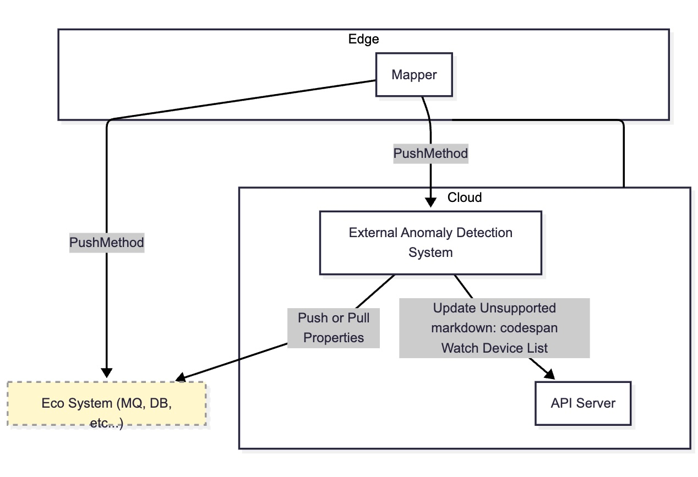

# KubeEdge: Device Anomaly Detection Framework

## 1. Introduction

### 1.1 Background and Problem Statement

KubeEdge, as an open-source IoT platform for cloud-edge collaboration, provides comprehensive device management capabilities. The device state is a critical basis for upper-layer applications to make decisions and controls. Currently, the platform collects attribute values from the device side through Mapper and updates the device resources (Device CRD) in the CloudCore’s DeviceController component to reflect the device's desired state (Desired State), observed desired state (Desired Observed State), and reported state (Reported State).

However, the device state reporting link may be affected by various factors, including but not limited to:

- **Limitations of Mapper implementation**: Mappers of different manufacturers or models may handle anomalies inconsistently, potentially missing key information.
- **Physical device faults**: Sensor damage, freezing, or drift in accuracy can lead to distorted reported values.
- **Network issues**: Delays, packet loss, or disconnections can cause incomplete or outdated data.
- **Security threats**: Malicious data injection or tampering can lead to incorrect decisions by upper-layer applications based on erroneous states.

When the device state displayed on the platform differs from the actual operating state of the device, applications that rely on these states may respond incorrectly, potentially leading to production safety risks.

### 1.2 Project Goals and Expected Value

This project aims to design and implement a **device state anomaly detection framework** for KubeEdge, enhancing the platform’s ability to ensure the credibility of device states without altering the existing data reporting process. The framework will have the following features:

- Data mirroring and dataset export: Bypass the collection of full reporting data at the DeviceController, allowing users to filter, download, and offline train models.
- Pluggable online detection: Supports routing reported data to corresponding detectors based on device groups, attributes, etc., for real-time anomaly detection.
- Multi-algorithm compatibility: Allows users to deploy different detection algorithms or models, adapting to various device types and scenarios.
- Traceable results: Detection results will be synchronized back to the device CRD state for use by operations, visualization, and alarm systems.

With this solution, the platform can build a "health monitoring safeguard" between device state collection and consumption, helping users identify device anomalies early, reduce operation and maintenance costs, and improve system stability and business security.

### 1.3 Scope and Non-scope

**Applicable Scope**: This framework is suitable for cloud-edge collaborative IoT scenarios running KubeEdge, including industrial IoT (IIoT), smart cities, energy management, etc.

**Non-scope**: This project does not involve modifying the internal collection logic of the Mapper, nor does it directly control or repair devices, but only provides anomaly detection and alarm functions.

## 2. Current Status Analysis

### 2.1 Device State Reporting Process

In the **KubeEdge** current architecture, the transmission process of device states from the device side to the cloud is divided into the following stages:

1. **Device Data Generation**  
   - Physical devices periodically generate property data (e.g., temperature, current, status codes, etc.).

2. **Mapper Data Collection and Packaging**  
   - The Mapper is responsible for connecting to the specific device, collecting property values, and packaging them into messages as follows:  
     ```
     {device name, namespace, property name, property value, timestamp}
     ```
   - Mappers typically target devices of specific types or manufacturers, and one Mapper can connect to multiple devices of the same type.

3. **EdgeCore Data Forwarding**  
   - The Mapper sends the collected data to the **EdgeCore** component, which manages the transmission of device messages.

4. **Cloud-Edge Channel Transmission**  
   - EdgeCore reports the device data to **CloudCore** through KubeEdge’s cloud-edge channel (based on **WebSocket/MQTT**).

5. **DeviceController Updates Device CRD**  
   - The **DeviceController** sub-component in **CloudCore** receives the device data and updates the **Device CRD** in the Kubernetes API Server, where the `status` field records the latest device state information.  
   - One CloudCore instance can connect to multiple EdgeCore instances, with each EdgeCore managing multiple Mappers, forming a hierarchical structure.

State type explanation:

- Desired State: The target state the application expects the device to reach.
- Desired Observed State: A record of how the desired state was executed, fed back from the device.
- Reported State: The actual reported value of the device's state.

### 2.2 Existing Problems and Pain Points

While the above process reports device states fully to the cloud, there are several issues during operation:

1. **Insufficient State Credibility**  
   - As the sole data collection source, the quality and robustness of the Mapper directly affect the accuracy of the state.  
   - Different device types may lack consistent anomaly handling capabilities, causing anomalies to be reported as "normal."

2. **Susceptibility to External Interference**  
   - Network delays, packet loss, or disconnections may cause state delays, omissions, or out-of-sequence issues.  
   - Cloud-edge channel reconnections may result in redundant historical data being reported.

3. **Lack of Anomaly Recognition and Early Warning Mechanism**  
   - The current platform does not actively detect discrepancies between "reported state" and "actual state," nor does it identify abnormal patterns such as jumps, drifts, or freezing in reported state values.  
   - Maintenance personnel can only rely on downstream application fault alarms or manual inspections, leading to delays.

4. **Limited Data Utilization**  
   - Once device data enters the Device CRD, the platform does not provide standardized batch export or analysis interfaces, making algorithm development and model training require additional data collection methods.  
   - The lack of tools for filtering by device group, properties, and time range reduces data reuse efficiency.

### 2.3 Constraints and Boundary Conditions

- **Do not affect the main write link**  
  Any newly added detection functionality must operate in a bypass manner and must not block the DeviceController from updating the Device CRD.

- **Compatibility with multiple detectors and algorithms**  
  The solution must support deploying multiple detectors for different business lines or device groups.

- **Security and Isolation**  
  Cloud-edge communication and detector calls must undergo identity authentication and encrypted transmission, with access control based on namespaces or labels.

## 3. Overall Solution Design

The overall anomaly detection workflow is illustrated in the following diagram:


<!--  -->

1. **Data Collection Phase**
   - Mapper runs on the edge side, responsible for collecting property data from devices (e.g., temperature, current, status, etc.).
   - Mapper pushes the collected property data in real-time via Push Properties Data to: External Anomaly Detection System (cloud-side anomaly detection system) or Eco System (e.g., message queues MQ, databases DB, third-party data storage, etc.).

2. **Anomaly Detection Phase (Cloud)**
   - External Anomaly Detection System receives property data from multiple sources (pushed by Mapper or pulled from Eco System).
   - The system utilizes algorithms or rules to analyze device properties and detect whether anomalies exist (e.g., excessive temperature, signal anomalies, data loss, etc.).

3. **Result Update Phase (Cloud and API Server)**
   
   Once an anomaly is detected, External Anomaly Detection System updates the detection results (e.g., anomaly indicators, confidence scores, timestamps, etc.) to the Kubernetes API Server:
   - Updates the `extensions` field in DeviceStatus CRD to record anomaly detection results.
   - In this way, users and upper-layer applications can query DeviceStatus CRD to obtain the latest device status and anomaly information.

## 4. Key Component Descriptions

This solution consists of multiple decoupled components, each with clear responsibilities and interfaces, making it easy to deploy, expand, and maintain.

### 4.1 DeviceStatus CRD

The device state (including Observed Desired State, Reported State, and future anomaly detection results) will be recorded in the CRD in the API Server. The existing Device CRD contains both Spec and Status sections. Considering that the Status section will contain more fields in the future and will be frequently modified by multiple components (such as DeviceController in CloudCore, anomaly detectors, etc.), we decided to split DeviceStatus into a separate new CRD to prevent frequent Status changes from causing `resourceVersion` to change too rapidly, which would affect operations on the Spec section. The structure of the new DeviceStatus CRD is as follows:

```yaml
apiVersion: devices.kubeedge.io/v1alpha2
kind: DeviceStatus
metadata:
  name: temperature-sensor # Same as Device CRD
  namespace: default # Same as Device CRD
spec:
  deviceRef:
    name: temperature-sensor-01 # Reference to Device CRD
    namespace: default # Reference to Device CRD
status:
  lastOnlineTime: '2025-10-26T08:00:00Z'
  twins:
    properties:
      - propertyName: temperature
        observedDesired:
          value: ''
        reported:
          metadata:
            timestamp: "1760944813469"
            type: string
         value: "22.5"
  # newly added field for extensible status data (i.e., anomaly detection results)
  extensions:
    anomaly-detector: # business name or detector name
      lastUpdated: '2025-10-26T08:05:00Z'
      data:
        anomalyScore: 0.02
        confidence: 0.98
    energy-monitor:
      lastUpdated: '2025-10-26T08:06:00Z'
      data:
        powerUsage: 132.5
        unit: W
    maintenance-system:
      lastUpdated: '2025-10-26T08:10:00Z'
      data:
        nextService: '2025-12-01'
        technician: 'auto-assign'
```

### 4.2 CloudCore Updates to DeviceStatus

Since the Device CRD has been split into Device CRD and DeviceStatus CRD, the code in CloudCore responsible for updating device status must also be modified accordingly. Specifically, the relevant logic in `cloud/pkg/devicecontroller/controller/upstream.go` needs to be modified. When StateUpdate and TwinUpdate messages are received, the original logic of updating Device CRD should be changed to update DeviceStatus CRD instead. If the corresponding DeviceStatus CRD does not exist, a new DeviceStatus CRD instance must be created first, and then updated. The specific workflow is as follows:

1. Receive StateUpdate or TwinUpdate messages.
2. Check if the corresponding DeviceStatus CRD exists.
   - If it exists, update the DeviceStatus CRD.
   - If it does not exist, create a new DeviceStatus CRD instance and perform initialization.
3. After completing the update, return the processing result.

### 4.3 Mapper PushMethod Extension

The PushMethod section in Device CRD supports configuring the method of device data push. After configuring PushMethod, Mapper can directly push device-generated data to external systems without going through the WebSocket channel between KubeEdge's CloudCore and EdgeCore. Currently, PushMethod supports various external storage systems such as TDEngine, InfluxDB2, MySQL, Redis, as well as multiple message transmission protocols including HTTP, MQTT, OTEL, etc. Anomaly detection models can run on the cloud side or the edge side. To reduce pressure on the CloudCore/EdgeCore channel, we plan to extend PushMethod to support Mapper directly pushing device data to anomaly detectors.

First, in the Device CRD, add AnomalyDetection-related configuration items to the PushMethod of each Property. The content of AnomalyDetection configuration items can be defined by users according to their needs, allowing them to configure how Mapper pushes device data to anomaly detectors.


Next, modify the PushMethodConfig class definition in Mapper by adding ADMethod-related fields to support parsing the AnomalyDetection configuration items in Device CRD.

```go
// PushMethodConfig is structure to store push config
type PushMethodConfig struct {
	MethodName   string          `json:"MethodName"`
	MethodConfig json.RawMessage `json:"MethodConfig"`
	DBMethod     DBMethodConfig  `json:"dbMethod,omitempty"`
	// New
	ADMethod     AnomalyDetectionConfig `json:"adMethod,omitempty"`
}

// DBMethodConfig is structure to store database config
type DBMethodConfig struct {
	DBMethodName string   `json:"dbMethodName"`
	DBConfig     DBConfig `json:"dbConfig"`
}

type DBConfig struct {
	Influxdb2ClientConfig json.RawMessage `json:"influxdb2ClientConfig"`
	Influxdb2DataConfig   json.RawMessage `json:"influxdb2DataConfig"`
	RedisClientConfig     json.RawMessage `json:"redisClientConfig"`
	TDEngineClientConfig  json.RawMessage `json:"TDEngineClientConfig"`
	MySQLClientConfig     json.RawMessage `json:"mysqlClientConfig"`
}

type AnomalyDetectionConfig struct {
	// Detailed structured can be defined by user
	// As long as it corresponds to the Anomaly Detection config defined in Device CRD PushMethod
}
```

Finally, users can implement the logic to push device data to anomaly detectors in the generated Mapper's `device/device.go` based on the AnomalyDetection configuration items. The specific implementation can be customized according to user requirements and the anomaly detector's interface.

Example code snippet from `device/device.go`:

```go
dataModel := common.NewDataModel(dev.Instance.Name, twin.Property.PropertyName, dev.Instance.Namespace, common.WithType(twin.ObservedDesired.Metadata.Type))
// handle push method
if twin.Property.PushMethod.MethodConfig != nil && twin.Property.PushMethod.MethodName != "" {
   pushHandler(ctx, &twin, dev.CustomizedClient, &visitorConfig, dataModel)
}
// handle database
if twin.Property.PushMethod.DBMethod.DBMethodName != "" {
   dbHandler(ctx, &twin, dev.CustomizedClient, &visitorConfig, dataModel)
   switch twin.Property.PushMethod.DBMethod.DBMethodName {
   // TODO add more database
   case "influx":
      dbInflux.DataHandler(ctx, &twin, dev.CustomizedClient, &visitorConfig, dataModel)
   case "redis":
      dbRedis.DataHandler(ctx, &twin, dev.CustomizedClient, &visitorConfig, dataModel)
   case "tdengine":
      dbTdengine.DataHandler(ctx, &twin, dev.CustomizedClient, &visitorConfig, dataModel)
   case "mysql":
      dbMysql.DataHandler(ctx, &twin, dev.CustomizedClient, &visitorConfig, dataModel)
   }
}

// New: handle anomaly detection method
adMethod.AnomalyDetectionHandler(ctx, &twin, dev.CustomizedClient, &visitorConfig, dataModel)
```

Example code snippet from `data/admethod/client.go`:

```go
func AnomalyDetectionHandler(ctx context.Context, twin *common.Twin, client *driver.CustomizedClient, visitorConfig *driver.VisitorConfig, dataModel *common.DataModel) {
	// User can implement their own logic to send the data to the anomaly detection system here.
}
```


### 4.4 Integration with External Anomaly Detectors

External anomaly detectors accept device data pushed by Mapper, perform real-time anomaly detection, and write the detection results back to DeviceStatus CRD or other systems. The data protocol between external anomaly detectors and Mapper, as well as the final result feedback mechanism, can be implemented by users themselves. This proposal plans to implement an example external anomaly detector for user reference and submit it to the `examples` directory. The communication interface between the example anomaly detector and Mapper is defined as follows:

```proto
syntax = "proto3";

package kubeedge.anomalydetector.v1;

option go_package = "github.com/kubeedge/edge-anomaly/api/v1;v1";

// ------------------------------------------------------------
// Message definitions
// ------------------------------------------------------------

// DevicePropertyData represents a single property update
// reported by a specific device through the Mapper.
// Each message carries basic identification info and a property value.
message DevicePropertyData {
  string device_name = 1;   // Device name (unique within the namespace)
  string namespace = 2;     // Kubernetes namespace of the device
  string property_name = 3; // Property name (e.g., temperature, humidity)
  string property_value = 4;// Property value (string format for flexibility)
  string timestamp = 5;     // Timestamp when the value was measured (ISO8601/RFC3339)
}

// AnomalyResponse is returned by the anomaly detector after
// processing each incoming property data message.
message AnomalyResponse {
  string status = 1;        // "ok" or an error/alert string
  string message = 2;       // Optional descriptive message
  string timestamp = 3;     // Timestamp when this response was generated
}

// ------------------------------------------------------------
// Service definition
// ------------------------------------------------------------

// AnomalyDetectionService provides a bidirectional streaming RPC
// between Mapper and the external anomaly detection system.
//
// - Mapper continuously streams DevicePropertyData messages
//   containing device metrics or sensor readings.
// - The anomaly detector consumes these messages and responds
//   with a simple acknowledgement (e.g., "ok") or an anomaly alert.
//
// This design allows real-time analysis and feedback while keeping
// the protocol lightweight and extensible.
service AnomalyDetectionService {
  rpc StreamDetect(stream DevicePropertyData) returns (stream AnomalyResponse);
}
```

## 5. Conclusion

This proposal introduces a device anomaly detection framework for KubeEdge to enhance the reliability and trustworthiness of device state data. The solution includes four key components:

1. **DeviceStatus CRD**: A new CRD separated from Device CRD to store device status and anomaly detection results in the `extensions` field, preventing frequent `resourceVersion` changes.

2. **CloudCore DeviceController Updates**: Modifies the logic in `cloud/pkg/devicecontroller/controller/upstream.go` to update DeviceStatus CRD instead of Device CRD when receiving StateUpdate and TwinUpdate messages, with automatic creation of DeviceStatus instances when they don't exist.

3. **Mapper PushMethod Extension**: Extends the existing PushMethod mechanism to allow Mappers to directly push device data to external anomaly detection systems, reducing pressure on the CloudCore/EdgeCore channel.

4. **External Anomaly Detector Integration**: Provides a reference implementation and gRPC interface definition for integrating external anomaly detection services that can analyze device data and update results back to DeviceStatus CRD.

The framework operates in a non-intrusive bypass manner, ensuring backward compatibility while enabling users to deploy custom anomaly detection algorithms for various device types and scenarios.

