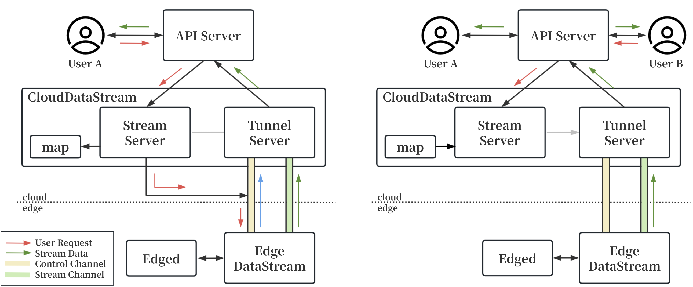

## Motivation

As edge intelligence applications such as visual recognition continue to grow, the need for real-time video streaming between cloud and edge is increasing. However, KubeEdge’s current communication modules (CloudStream and EdgeStream) only support discrete messages and do not meet the requirements of continuous video data transmission. To address this limitation, we propose a new DataStream module to enable native video streaming capabilities between cloudcore and edgecore.


## Goals

### New Cloud-Edge Streaming Mechanism
We propose to add two new modules: CloudDataStream (in cloudcore) and EdgeDataStream (in edgecore). These modules will be developed based on the Beehive framework and establish a stable video streaming tunnel from edge to cloud. Edge devices will continuously push video frame data via this tunnel, while the cloud module will manage stream routing and serve user requests.

### Stream Reuse Across Multiple Requests
To handle scenarios where multiple users request the same video stream, we will design a stream reuse mechanism. The edge node only needs to send a single copy of the video stream to the cloud, which will then distribute it to multiple clients, avoiding redundant connections and improving resource efficiency.

### Communication Continuity in Unstable Networks
Considering potential network instability at edge nodes, the DataStream module will include connection health checking and automatic reconnection strategies using heartbeat, keepalive, and exponential backoff retry mechanisms.


## Implementation Details

### Module Architecture
The project introduces two new modules following the structure and design patterns of existing cloudstream and edgestream:
```
├── cloud
│   ├── pkg
│   │   ├── clouddatastream
│   │   │   ├── apiserverconnection.go
│   │   │   ├── clouddatastream.go
│   │   │   ├── config
│   │   │   │   └── config.go
│   │   │   ├── containervideo_connection.go
│   │   │   ├── iptables
│   │   │   │   └── iptables.go
│   │   │   ├── session.go
│   │   │   ├── streamserver.go
│   │   │   └── tunnelserver.go
│   │   ├── cloudhub
│   │   ├── cloudstream
│   │   └── ...
│   └── ...
├── edge
│   ├── pkg
│   │   ├── edgedatastream
│   │   │   ├── config
│   │   │   │   └── config.go
│   │   │   ├── edgedatastream.go
│   │   │   └── tunnel.go
│   │   ├── edgehub
│   │   ├── edgestream
│   │   └── ...
│   └── ...
└── ...
```
- CloudDataStream: manages all video tunnels from edge nodes, receives video frames, and dispatches data to clients.
- EdgeDataStream: pulls video streams from local cameras (e.g., via FFmpeg) and sends them to the cloud.

To enable video streaming, the following configuration options will be added to cloudcore.yaml and edgecore.yaml:

```
cloudDataStream:
    enable: true
    streamPort: 10005
    tlsStreamCAFile: /etc/kubeedge/ca/streamCA.crt
    tlsStreamCertFile: /etc/kubeedge/certs/stream.crt
    tlsStreamPrivateKeyFile: /etc/kubeedge/certs/stream.key
    tlsTunnelCAFile: /etc/kubeedge/ca/rootCA.crt
    tlsTunnelCertFile: /etc/kubeedge/certs/server.crt
    tlsTunnelPrivateKeyFile: /etc/kubeedge/certs/server.key
    tunnelPort: 10006

edgeDataStream:
    enable: true
    handshakeTimeout: 30
    readDeadline: 15
    server: 10.192.48.202:10006
    tlsTunnelCAFile: /etc/kubeedge/ca/rootCA.crt
    tlsTunnelCertFile: /etc/kubeedge/certs/server.crt
    tlsTunnelPrivateKeyFile: /etc/kubeedge/certs/server.key
    writeDeadline: 15
```
These settings define essential ports, addresses, and TLS credentials to ensure secure and configurable cloud-edge communication for video streams.


### Stream Establishment and Reuse



There are two types of channels between the cloud and edge: a control channel and a video stream channel.
The control channel, similar to the one used in existing CloudStream/EdgeStream modules, is established during initial cloud-edge connection and used to transmit command messages(e.g., addVideo, removeVideo).

When a user requests a device's video stream via the cloud API server:

- A stream key (device + streamID) is generated to query existing sessions in **map**.

- If found, the user is attached as a new consumer via a writer callback.

- If not, the cloud sends an `addVideo` message to the edge node, which then establishes a WebSocket tunnel back to the cloud for video data transmission.

The video tunnel is separate from the control channel, avoiding interference and allowing for stream reuse across clients. All streams are edge-initiated, enhancing firewall/NAT compatibility.

In StreamServer, active sessions are maintained as follows:
```
type VideoSession struct {
  Session      *Session                 // Video tunnel session
  VideoConnID  uint64                   // Connection identifier
  StopChannels map[string]chan struct{} // Per-client stop signals
  sync.Mutex
}

type StreamServer struct {
  nextMessageID uint64
  container     *restful.Container
  tunnel        *TunnelServer
  sync.Mutex
  videoSessions map[string]*VideoSession // Active stream map
  upgrader      websocket.Upgrader
}
```

### Reconnection & Weak Network Optimization
The system monitors all WebSocket tunnels and supports:

- Automatic reconnection when the connection is lost, ensuring continuity without requiring manual intervention.
- Congestion adaptation, delaying writes if latency spikes to avoid buffer overflow and smooth bandwidth usage.


## Plan

1. Implement video pulling and stream forwarding
2. Add stream reuse and session management
3. Improve network resilience and flow control
4. Finalize testing and write documentation
