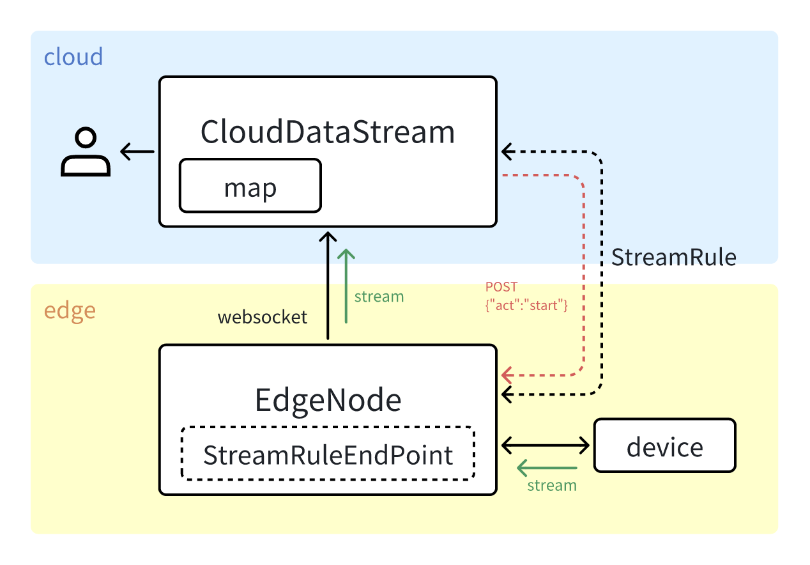

## Motivation

As edge intelligence applications such as visual recognition continue to grow, the need for real-time video streaming between cloud and edge is increasing. However, KubeEdge’s current communication modules (CloudStream and EdgeStream) only support discrete messages and do not meet the requirements of continuous video data transmission. To address this limitation, we propose introducing new StreamRule and StreamRuleEndpoint CRDs, along with a CloudDataStream module, to enable native, protocol-agnostic video streaming capabilities between cloudcore and edgecore.


## Goals

### New Cloud-Edge Streaming Mechanism
We propose a new cloud–edge streaming mechanism based on StreamRule and StreamRuleEndpoint CRDs. Once a StreamRule is deployed from the cloud to the edge, the edgecore immediately establishes a long-lived WebSocket connection to the cloudcore according to the rule. Video data transmission is then controlled via dedicated control messages—starting, pausing, or stopping the stream—rather than creating the connection only when a user request arrives. On the cloud side, a new module named CloudDataStream acts as the WebSocket server, handling the connection, processing and forwarding the video stream, and interacting with user requests.

### Stream Reuse Across Multiple Requests
In scenarios where multiple users request the same video stream, each stream’s url are stored in the associated StreamRuleEndPoint. When a request is made, only a single channel is need between the cloud and the edge for each stream, avoiding redundant transmission and resource waste. On the cloud side, CloudDataStream distributes the stream data to the respective users, eliminating the need to establish a new stream channel for every user request.

### Communication Continuity in Unstable Networks
Considering potential network instability at edge nodes, the streaming mechanism will include connection health checking and automatic reconnection strategies to ensure continuity of the video transmission.


## Implementation Details

### Module Architecture



#### Cloud Side
- CloudDataStream Module
A WebSocket server responsible for receiving video stream data from edge nodes over long-lived connections established when a StreamRule is deployed. It manages active sessions, tracks stream metadata, and forwards video frames to downstream consumers when requested.

- StreamRule Control
The cloud handles application control requests and translates them into control messages for the corresponding edge node. The WebSocket stream is already established upon rule deployment; the cloud functions purely as the control plane, instructing the edge to start, pause, or stop streaming without initiating new connections.

#### Edge Side
- Stream Execution on Edge Nodes
When a StreamRule is delivered to the corresponding edge node, the node immediately establishes a dedicated WebSocket channel to the CloudDataStream module.
This channel remains open and ready.
Later, when control messages (such as start or stop) are sent from the cloud, the edge interacts with the target device (e.g., pulling an RTSP feed) to acquire the video stream and transmits it to the cloud over the pre-established channel.

### CloudDataStream Module
To support WebSocket-based long connections and real-time video stream ingestion from edge nodes, we introduce a new cloud-side module named CloudDataStream. This module is essential for managing persistent connections and processing stream data, addressing limitations of the existing cloudhub or router modules, which lack protocol support for efficient stream handling.

#### 1. Purpose
CloudDataStream acts as a dedicated WebSocket server designed specifically for handling incoming video streams from edge nodes. Unlike control-oriented components like router, this module focuses on:
- Establishing and maintaining long-lived WebSocket connections from edge nodes.
- Receiving and handling video frame data transmitted via these connections.
- Managing multiple concurrent streams through a session map keyed by device ID or connection ID.
- Providing hooks for decoding, routing, or forwarding video streams to consumers.

This architecture enables real-time video delivery from edge to cloud over a single persistent channel per stream, eliminating redundancy and improving stability.

#### 2. Stream Management Model
Each edge-initiated stream corresponds to a WebSocket session on the cloud. The StreamServer maintains all active sessions in a map structure, allowing unified lifecycle and concurrency control:
```go
type VideoSession struct {
  Session      *Session                 // Represents the WebSocket tunnel
  VideoConnID  uint64                   // Unique ID for each stream
  StopChannels map[string]chan struct{} // One stop signal per downstream consumer
  sync.Mutex
}

type StreamServer struct {
  nextMessageID uint64
  container     *restful.Container
  tunnel        *TunnelServer           // Manages WebSocket upgrade and lifecycle
  sync.Mutex
  videoSessions map[string]*VideoSession // Active edge-origin stream registry
  upgrader      websocket.Upgrader
}
```

#### 3. Module Placement
The CloudDataStream module follows the design conventions of cloudstream and edgestream modules. Its current implementation resides in:
```
├── cloud
│   ├── pkg
│   │   ├── clouddatastream
│   │   │   ├── apiserverconnection.go
│   │   │   ├── clouddatastream.go         // Main entry
│   │   │   ├── config/
│   │   │   │   └── config.go
│   │   │   ├── containervideo_connection.go
│   │   │   ├── iptables/                  // Placeholder for future egress control
│   │   │   ├── session.go                 // Core session definitions
│   │   │   ├── streamserver.go            // WebSocket server logic
│   │   │   └── tunnelserver.go            // Handles edge-initiated upgrades
│   │   ├── cloudhub
│   │   ├── cloudstream
│   │   └── ...
│   └── ...
└── ...
```

### CRDs for Stream Control

To enable a more flexible and protocol-agnostic approach for data stream transmission (such as video, sensor data, or other real-time feeds) from edge to cloud, we propose introducing two new CRDs: **StreamRuleEndpoint** and **StreamRule**.

#### 1. StreamRuleEndpoint CRD
The StreamRuleEndpoint defines a specific stream source on the edge node.
It includes the protocol , a URL for the source, and optional properties for protocol-specific configurations.
This design allows future extension without being tied to a single streaming technology.
Example:
```YAML
apiVersion: streamrules.kubeedge.io/v1alpha1
kind: StreamRuleEndpoint
metadata:
  name: edge-video-001
spec:
  protocol: websocket
  url: "rtsp://<edge-device-ip>/stream"
  properties: {}
```
- protocol: Defines the communication method (initially websocket, but extendable).
- url: Points to the actual data source.
- properties: An open-ended key-value map for additional configuration.

#### 2. StreamRule CRD
The StreamRule defines how a specific stream source should be activated and exposed.
It binds one or more StreamRuleEndpoint resources to a target path, enabling flexible proxying or routing on the cloud side.
Example:
```YAML
apiVersion: streamrules.kubeedge.io/v1alpha1
kind: StreamRule
metadata:
  name: video-stream-rule-camera
spec:
  targets:
  - endpointRef: edge-video-001
    targetResource: { "node_name": "edge-node-1", "path": "/camera-001" }
  - endpointRef: edge-video-002
    targetResource: { "node_name": "edge-node-1", "path": "/camera-002" }
```
- nodeName: Specifies the edge node hosting the stream source.
- targets: Maps one or more endpoints to cloud-accessible paths.

Once a StreamRule is issued, the system will establish a dedicated edge-to-cloud channel for each target defined in the rule. Users can then access the corresponding resource via a URL such as: `/node/{edge-node}/{stream-rule}/{target-resource-path}`.

#### 3. Example: RTSP Video Stream Control
For an RTSP-based video stream, the cloud issues a StreamRule to define the edge resource and establish a dedicated channel. Control is managed through two message types:

- `start` – instructs the edge to begin video transmission and open the WebSocket data flow.
- `stop` – halts video transmission and closes the stream while keeping the channel ready for future use.

Upon receiving a `start` message, the edge retrieves video frames from the RTSP source (e.g., via ffmpeg or a custom RTSP client) and continuously transmits them to the cloud over the persistent WebSocket connection. A `stop` message from the cloud terminates the transmission without tearing down the channel, enabling low-latency restarts when needed.

### Reconnection & Weak Network Optimization
The system monitors all WebSocket tunnels and supports:

- Automatic reconnection when the connection is lost, ensuring continuity without requiring manual intervention.
- Congestion adaptation, delaying writes if latency spikes to avoid buffer overflow and smooth bandwidth usage.


## Plan

1. Introduce StreamRule and StreamRuleEndpoint CRDs to enable structured cloud-to-edge control messages and provide a framework for managing real-time data streams.
2. Implement CloudDataStream Module and corresponding edge streaming logic, where the cloud acts as a WebSocket server and the edge initiates long-lived connections to transmit RTSP-based video or other streaming data.
3. Address multi-client stream reuse and weak network conditions, improving reliability, resource efficiency, and user experience.
4. Finalize testing and write documentation.
