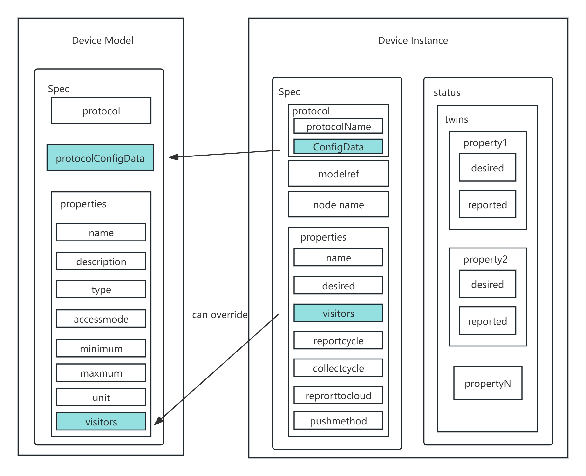
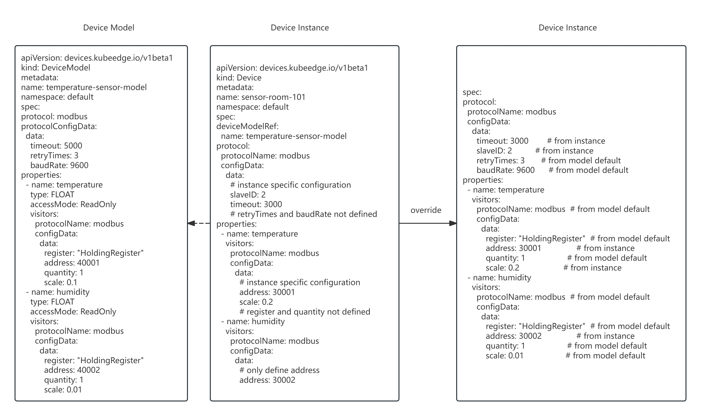

## Motivation

Currently, KubeEdge's definition of the device model is relatively simplistic, with limited practical effectiveness, and its design is prone to confusing users. In traditional IoT, devices are typically designed with a three-tier structure: thing model, product, and device instance. Due to historical reasons, the cost of splitting the model into three independent objects is high, and the significance of fine-grained abstraction is limited. Therefore, we propose defining the model as the concept of "real device product" (i.e., a combination of the thing model and the product), which is used to describe the specifications, connection protocols, attribute acquisition methods, etc., of a type of device product. In this way, device instances can share these configurations, and only need to be configured with different connection addresses for different devices. This design can realize a certain degree of reuse of configuration information and make the positioning more clear.


## Goals

1. Merge the device model with the product concept to create a "Device Product" model.
2. Extract some fields from the existing device instance into the device model to establish default instance configurations.
3. Device instances share this model configuration, requiring only the configuration of different connection addresses.
4. Reduce the cost of model separation and improve configuration reusability.

## Proposal Design

### New Field

To establish default configurations in the device model, we will add fields that can be overridden at the device instance level. Specifically:

- A `protocolConfigData` field will be added to `DeviceModelSpec` to define default protocol configurations.
- A `visitors` field will be added to `ModelProperty` to define default access methods for properties.

```go
Visitors *VisitorConfig `json:"visitors,omitempty"`

ProtocolConfigData *CustomizedValue `json:"protocolConfigData,omitempty"`
```

### Relationship between Device Instance and Model

A device instance will reference the device model and share its specifications, connection protocol, property access methods, and other configurations. A device instance only needs to configure its unique attributes; all other configurations are inherited from the model. At the same time, it can also override the default configurations according to requirements.





### DMI Compatibility Improvement

DMI (Device Mapper Interface) is the interface through which devices interact with the system and needs to be compatible with the new device model.  
The DMI compatibility design will be implemented by modifying the `dealMetaDeviceOperation` function in the file `edge\pkg\devicetwin\dtmanager\dmiworker.go`. The main purpose is to override the fields of the received `device_instance`.

1.Trigger Timing of Field Override
- Inserting device instance
- Updating device instance

2.Field Override Logic
- Obtain the device model
- Store the fields of the device instance in a temporary variable tmp
- Assign all fields of the device model to the corresponding fields of the device instance
- Reassign the fields from tmp back to the fields of the device instance


The following are an example of the deivce instance override.
