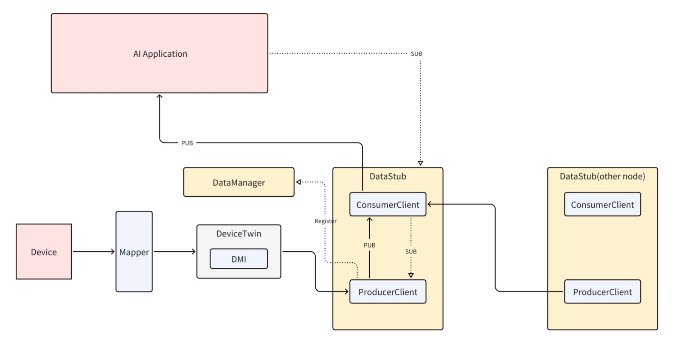
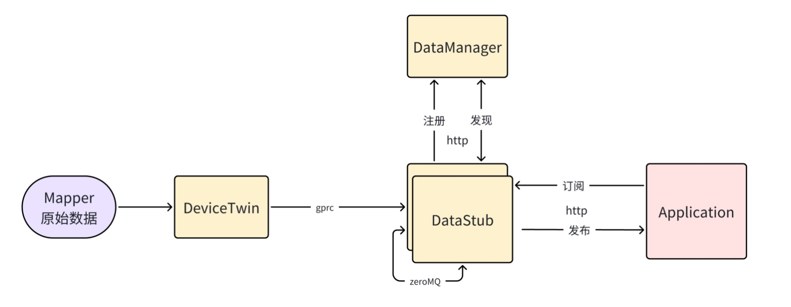

---

title: Thematic Device Data Publish/Subscribe Framework Based on KubeEdge
status: implementable
authors:
  - "@Dirtybear-lam"
approvers:
creation-date: 2025-07-10
last-updated: 2025-07-10

---

## Motivation

In industrial IoT scenarios, devices (sensors, cameras, PLCs, etc.) continuously generate heterogeneous data—temperature, vibration, images, energy metrics, and more. Downstream AI analytics (predictive maintenance, process optimization) and fine-grained operations (fault alerting, energy monitoring) have divergent requirements:

- **High-priority events** (device anomalies, faults) demand sub-second delivery.  
- **Low-priority attributes** (periodic metrics, status reports) can be batched with relaxed latency.  

We aim to provide a unified, **topic-based** pub/sub layer that separates priorities (RT vs. BT), hides multi-protocol complexity, and integrates **directly with edge mappers on the data plane** to achieve low-latency, high-reliability delivery and elastic scaling. (KubeEdge DeviceTwin remains optional for control-plane/shadow workflows but is not required on the data path.)

---

## Goals

1. **Hierarchical Topic Model**  
   Define layered topics such as `sensor/temperature` and `camera/objectDetected`, and (optionally) tag each message as **Real-Time (RT)** or **Batch (BT)** to enable differentiated forwarding.

2. **Dynamic Subscription & Routing**  
   - **RT** messages: immediately published to subscribers over ZeroMQ PUB/SUB.  
   - **BT** messages: buffered for future batch delivery (planned).  
   - Per **`device:topic`** dynamic PUB socket allocation at the edge; edge-cloud collaborative routing to pre-filter at the edge and aggregate in the cloud.

3. **Unified Ingest & Subscribe APIs**  
   - **Mapper ingest**: gRPC `PushDeviceData` (preferred) and optional HTTP `POST /ingest`.  
   - **Application subscribe**: HTTP `POST /subscribe` with a long-lived, chunked streaming response.

4. **Lightweight Discovery & Direct Edge Integration**  
   Producers self-register via `POST /register`, and consumers discover publishers by topic using `GET /get_producer?topic=...`. The data path integrates **directly with mappers** (DeviceTwin optional for control-plane/shadow, not required on the data path).

---

## Implementation Details

### Project Structure
<pre>
├── datastub-producer
│   ├── producer.go            # Mapper ingest (gRPC PushDeviceData / optional HTTP /ingest) → ZeroMQ PUB per device:topic; register to DataManager
│   ├── config.json            # cloud_registry_url, ingest_grpc_addr (and/or ingest_http_addr)
│   ├── daemonset.yaml         # (optional) Kubernetes DaemonSet spec
│   └── Dockerfile             # Build image
├── datastub-server
│   ├── manager
│   │   ├── main.go            # DataManager HTTP server
│   │   ├── register.go        # POST /register (producer registration)
│   │   └── get_producer.go    # GET /get_producer?topic=<topic> (lookup publisher address for the topic)
│   └── stub
│       ├── consumer_client.go # ZeroMQ SUB → per-request channel; stream to client
│       ├── api.go             # POST /subscribe { "topic": "..." } (long-lived, chunked response)
│       └── health.go          # /healthz endpoint
└── datastub-consumer
    └── example.go             # Sample client: call /subscribe and read streaming JSON
</pre>

  


- **DataManager** (`datastub-server/manager`):  
  - Provides lightweight discovery: producers **register** via `POST /register` with `{ id, address, topics }`.  
  - Consumers **lookup** a publisher by topic via `GET /get_producer?topic=<topic>` and receive the ZeroMQ address.

- **ProducerClient** (`datastub-producer/producer.go`):  
  - Launches a **TCP gRPC** server (`PushDeviceData`) to receive data **directly from Mapper** (optionally also exposes HTTP `/ingest`).  
  - On the first encounter of a new **`device:topic`**, allocates a TCP port, creates & binds a ZeroMQ **PUB** socket, then **registers** `{ id, address, topics }` with DataManager via `POST /register`.  
  - For each incoming device message, formats `topic + " " + payload` and calls `publisher.Send()` to instantly publish over the PUB socket.

- **ConsumerClient** (`datastub-server/stub/consumer_client.go`):  
  - Exposes `POST /subscribe` (body: `{ "topic": "..." }`) and keeps the HTTP connection open.  
  - Queries DataManager’s `GET /get_producer?topic=...`, issues a ZeroMQ **SUB** to that address; in a background goroutine, `Recv()` messages and pushes serialized JSON into a per-request channel.  
  - In `handleSubscribeRequest`, continuously reads from that channel and uses `w.Write(data)` plus `w.(http.Flusher).Flush()` to stream JSON chunks back to the client (HTTP **chunked** response).

## Mapper Integration (pushMethod)

DataStub accepts **direct ingest** from mappers via mapper-framework’s `pushMethod`.

- Supported values:
  - `datastub_grpc` — send via gRPC `PushDeviceData` (preferred)
  - `datastub_http` — send via HTTP `POST /ingest` (optional if enabled)

- Example (mapper config):
  ```yaml

  datastub:
  grpcTarget: edge-ip:18080                   
  httpEndpoint: http://edge-ip:18081/ingest  

  properties:
    - name: sensor/temperature
      onChange: true
      pushMethod: datastub_grpc   # or datastub_http
      qos: RT                     # optional, RT/BT

  events:
    - name: machineFault
      pushMethod: datastub_http
      qos: RT

### gRPC request (example)

```proto
message PushDeviceDataRequest {
  message Device   { string name = 1; }
  message Property { string name = 1; string value = 2; }
  Device   device   = 1;   // e.g., "machine-1"
  Property property = 2;   // name: topic (property/event), value: JSON/text payload
}


### Configuration Example (`config.yaml`)

```yaml
datastub:
  producer:
    ingest:
      grpcAddr: "0.0.0.0:18080"   
      httpAddr: ""                
    registry:
      url: "http://<manager-host>:8000"   
    zmq:
      pubPortStart: 5556          

  consumer:
    httpPort: 8090                
    registry:
      url: "http://<manager-host>:8000"   

topics:
  - name: "sensor/temperature"
    qos: "RT"
  - name: "power/usage"
    qos: "BT"


### DataFlow
Mapper → DataStub Producer (gRPC/HTTP ingest) → ZeroMQ PUB (per device:topic)
                                               ↓
                                     ConsumerClient (ZeroMQ SUB)
                                               ↓
                           HTTP streaming (chunked) → Application client
1. Startup & Registration
	Producer starts ingest service. On first `device:topic`, allocates a PUB port and `POST /register` to DataManager with `{id, address, topics}`.
2. Message Ingestion
	Mapper (pushMethod = `datastub_grpc` | `datastub_http`) calls gRPC `PushDeviceData` (or HTTP `/ingest`) with `{device, topic, payload}`; Producer publishes `topic + " " + payload` on the PUB socket.
3. Priority Routing
	RT: immediately publish to subscribers.
	BT: buffer in memory for periodic batch dispatch (planned).
4. Subscription & Delivery
	Applications `POST /subscribe {"topic":"<topic>"}` to Consumer; Consumer calls `GET /get_producer?topic=<topic>`, issues ZeroMQ SUB, and streams JSON chunks back over the same HTTP connection.


### Plan
PoC 
	Implement Producer gRPC ingest end-to-end (< 100 ms latency)
	Dynamic PUB creation per `device:topic` + DataManager `/register`
	Implement Consumer `/subscribe` streaming delivery
Integration & Testing 
	Validate throughput ≥ 2,000 msgs/sec/node
	Fault-injection (restart Producer/DataManager), multi-subscriber tests
Kubernetes Deployment 
	DaemonSet & Service YAML, optional Helm chart
	Prometheus/Grafana monitoring, liveness/readiness probes
Enhancements 
	Add BT batch-dispatch mechanism
	Extend protocol support (Modbus, CoAP)
	Harden security (TLS, RBAC) and retry/backoff

