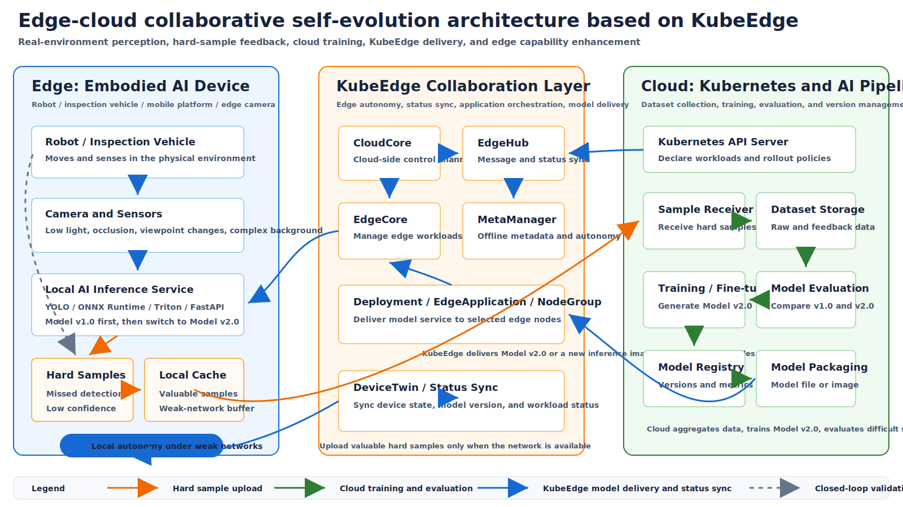

# Edge-Cloud Collaborative Framework for Embodied AI Applications

- [Edge-Cloud Collaborative Framework for Embodied AI Applications](#edge-cloud-collaborative-framework-for-embodied-ai-applications)
  - [1. Summary](#1-summary)
  - [2. Motivation](#2-motivation)
    - [2.1 Problem Statement](#21-problem-statement)
    - [2.2 Goals](#22-goals)
    - [2.3 Non-goals](#23-non-goals)
  - [3. Use Case](#3-use-case)
  - [4. Architecture](#4-architecture)
  - [5. Workflow](#5-workflow)
    - [5.1 Run Model v1.0 on the Edge](#51-run-model-v10-on-the-edge)
    - [5.2 Collect Hard Samples on the Edge](#52-collect-hard-samples-on-the-edge)
    - [5.3 Train or Fine-tune Model v2.0 in the Cloud](#53-train-or-fine-tune-model-v20-in-the-cloud)
    - [5.4 Distribute Model v2.0 to Edge Nodes](#54-distribute-model-v20-to-edge-nodes)
    - [5.5 Validate Model v2.0 on the Edge](#55-validate-model-v20-on-the-edge)
  - [6. KubeEdge Integration](#6-kubeedge-integration)
  - [7. Demo Plan](#7-demo-plan)
  - [8. Expected Deliverables](#8-expected-deliverables)
  - [9. Expected Value](#9-expected-value)

## 1. Summary

This proposal describes a small but complete edge-cloud collaborative practice for embodied AI applications based on KubeEdge. The target scenario is an edge robot, inspection vehicle, camera, or edge server that runs a visual recognition model locally. When the edge model fails to detect objects or produces low-confidence results under difficult conditions such as low light, occlusion, viewpoint changes, or complex backgrounds, the edge node records these hard samples and uploads only valuable samples to the cloud.

The cloud side then organizes the uploaded data, performs labeling or data cleaning if needed, trains or fine-tunes a new model version, evaluates it against the previous version, and uses KubeEdge to distribute the updated model or inference service back to selected edge nodes.

The intended workflow is:

```text
Edge inference -> Hard sample collection -> Cloud upload -> Cloud training and evaluation -> KubeEdge distribution -> Edge validation
```

The focus of this proposal is not to build a complex new computer vision algorithm. Instead, it aims to demonstrate how KubeEdge can support continuous model improvement for real edge AI applications through edge autonomy, cloud-edge data feedback, model version delivery, and multi-node management.

## 2. Motivation

### 2.1 Problem Statement

In real edge AI scenarios, models are rarely deployed once and then kept unchanged forever. A model trained under clean or well-lit conditions may work well in the initial environment but perform poorly when the physical environment changes. For example, an inspection vehicle may recognize desks, chairs, devices, or obstacles in bright indoor scenes, but fail under low light, occlusion, unusual camera angles, or noisy backgrounds.

If every problem must be discovered manually, followed by manual data collection, retraining, and SSH-based replacement on each edge device, the process becomes slow and difficult to scale. This is especially problematic when many robots, cameras, or edge nodes are deployed in different environments.

KubeEdge already provides edge node management, cloud-edge communication, edge autonomy, application delivery, and edge status synchronization. These capabilities can be used to build a practical closed loop for edge AI model evolution.

### 2.2 Goals

- Run visual inference locally on edge nodes to avoid cloud dependency for each frame.
- Detect and record valuable hard samples on the edge, such as no-detection images, low-confidence images, low-light images, occluded images, or manually confirmed failures.
- Upload only selected samples and metadata to the cloud when the network is available.
- Train or fine-tune a new model version in the cloud and evaluate whether it improves difficult scenarios.
- Distribute the new model file or the new inference service image to selected edge nodes through KubeEdge.
- Keep the edge inference service available during weak or intermittent network conditions.
- Provide a reproducible demo and documentation for KubeEdge-based embodied AI model update practices.

### 2.3 Non-goals

- This proposal does not aim to design a new computer vision model architecture.
- This proposal does not require changing the core inference framework. YOLO, ONNX Runtime, Triton, FastAPI, or Flask can be used depending on the demo environment.
- This proposal does not require uploading all raw visual data to the cloud.
- This proposal does not initially introduce a new KubeEdge CRD. Model version and sample status can first be represented by labels, annotations, ConfigMaps, application metadata, or demo service records.
- This proposal does not replace existing Kubernetes rollout mechanisms. KubeEdge is used to manage edge application distribution and synchronization.

## 3. Use Case

The minimal use case is an edge camera or inspection vehicle that performs object detection locally.

1. Model v1.0 is deployed to the edge node and works in normal bright scenes.
2. The edge node receives image frames from a camera, a recorded video stream, or a local image dataset.
3. Under low light, occlusion, viewpoint changes, or complex backgrounds, the model produces no detection or low-confidence results.
4. The edge node stores these hard samples locally together with metadata such as model version, timestamp, confidence score, scene type, and failure reason.
5. When the network is available, the edge node uploads selected samples to the cloud.
6. The cloud trains or fine-tunes model v2.0 and evaluates it against model v1.0.
7. KubeEdge distributes model v2.0 or a new inference service image to the target edge node.
8. The edge node validates whether model v2.0 improves detection on the previous hard samples.

## 4. Architecture



## 5. Workflow

### 5.1 Run Model v1.0 on the Edge

The first step is to deploy model v1.0 on an edge node. The inference service can be implemented using YOLO, ONNX Runtime, Triton, or a lightweight HTTP service built with FastAPI or Flask.

Model v1.0 is first validated on normal bright images to ensure that the basic inference path works. Then the same service is tested with difficult images, including low-light, occluded, unusual-angle, and complex-background samples.

### 5.2 Collect Hard Samples on the Edge

The edge service should not upload all frames to the cloud. Instead, it records only valuable hard samples, including:

- Images with no detected target.
- Images whose maximum confidence is lower than a configured threshold.
- Images from low-light, occluded, or viewpoint-changed scenes.
- Images later confirmed by a human as problematic.

Each sample should include lightweight metadata:

- model name and version;
- edge node name;
- timestamp;
- confidence score;
- failure reason;
- optional scene tag;
- upload status.

When the cloud-edge network is unavailable, the samples stay in a local cache. After the connection is restored, the edge service uploads selected samples to the cloud.

### 5.3 Train or Fine-tune Model v2.0 in the Cloud

After receiving hard samples, the cloud side organizes the data. The data processing stage may include cleaning, deduplication, manual confirmation, and labeling.

The cloud training pipeline then trains or fine-tunes model v2.0. After training, model v2.0 is evaluated against model v1.0 using both normal and difficult test sets. The new model should be promoted only when it improves difficult scenarios without causing unacceptable regression in normal scenarios.

The cloud side records model metadata, including:

- model name;
- model version;
- training data source;
- evaluation metrics;
- target scenario;
- target edge nodes or node groups.

### 5.4 Distribute Model v2.0 to Edge Nodes

There are two possible distribution modes:

1. **Model file update**: Store the model file in a model registry or object storage service. The edge inference service downloads the new model file and switches versions.
2. **Inference image update**: Package the model and inference service together into a new container image. Use Deployment, EdgeApplication, or NodeGroup to roll out the new image to selected edge nodes.

The second mode better demonstrates KubeEdge application management. The cloud can manage edge inference services similarly to Kubernetes workloads and distribute the updated model service to selected edge nodes without manually logging in to each device.

### 5.5 Validate Model v2.0 on the Edge

After model v2.0 is delivered to the edge node, the same difficult samples are tested again. If model v2.0 detects targets that model v1.0 missed, or improves confidence in difficult scenes, the closed-loop workflow is considered effective.

The edge node should also report the current model version, inference service status, and sample upload status so that the cloud can observe whether the update has been completed successfully.

## 6. KubeEdge Integration

This proposal uses KubeEdge capabilities in the following ways:

- **Edge node management**: Robots, cameras, Jetson devices, or edge servers can be joined as edge nodes and managed from the cloud.
- **Edge application delivery**: Inference services can be deployed to selected edge nodes through Kubernetes Deployment, EdgeApplication, or NodeGroup.
- **Edge autonomy**: The edge inference service continues running when the cloud-edge network is unstable. Local cache and MetaManager help support weak-network scenarios.
- **Model update**: The cloud can distribute a new model file or a new inference service image to edge nodes through KubeEdge-managed workloads.
- **Status synchronization**: Node status, workload status, current model version, and sample upload status can be synchronized or exposed for later observability.

## 7. Demo Plan

The first demo should be minimal and reproducible:

1. Prepare one bright image set and one low-light or difficult image set.
2. Deploy model v1.0 on an edge node.
3. Validate that model v1.0 works on bright images.
4. Use difficult images to trigger no-detection or low-confidence results.
5. Store hard samples on the edge node.
6. Upload selected hard samples to the cloud.
7. Train or fine-tune model v2.0 in the cloud.
8. Package model v2.0 as a model file or inference image.
9. Use KubeEdge to deliver model v2.0 to the edge node.
10. Switch the edge inference service to model v2.0.
11. Retest the difficult images and compare model v1.0 and model v2.0 results.

If physical hardware is available, the demo can use an inspection vehicle, a camera, or a Jetson device. If hardware is unstable or unavailable, the first version can simulate camera input with an edge node and an image stream.

## 8. Expected Deliverables

- A KubeEdge-based edge visual recognition demo.
- YAML files and documentation for deploying model v1.0 on the edge.
- A small edge service for hard sample collection and upload.
- A cloud-side sample receiver and data organization workflow.
- A cloud-side training or fine-tuning workflow for model v2.0.
- A model v2.0 packaging and distribution workflow.
- Example YAML files for distributing a model file or inference service through KubeEdge.
- Architecture and workflow diagrams.
- Evaluation results comparing model v1.0 and model v2.0 in normal and difficult environments.
- Reproduction documentation that allows other users to run the demo step by step.

## 9. Expected Value

This project demonstrates how KubeEdge can support real embodied AI scenarios beyond simple model deployment. Edge devices perform local inference and discover valuable failure cases. The cloud organizes the feedback data and trains a new model version. KubeEdge connects the cloud and edge sides, distributes the new model, keeps the edge workload running under weak networks, and provides a unified management plane for multiple edge devices.

The final result can serve as a reproducible reference case showing how KubeEdge helps edge AI applications evolve from "deploying a model once" to "continuously improving the model through edge-cloud collaboration."
