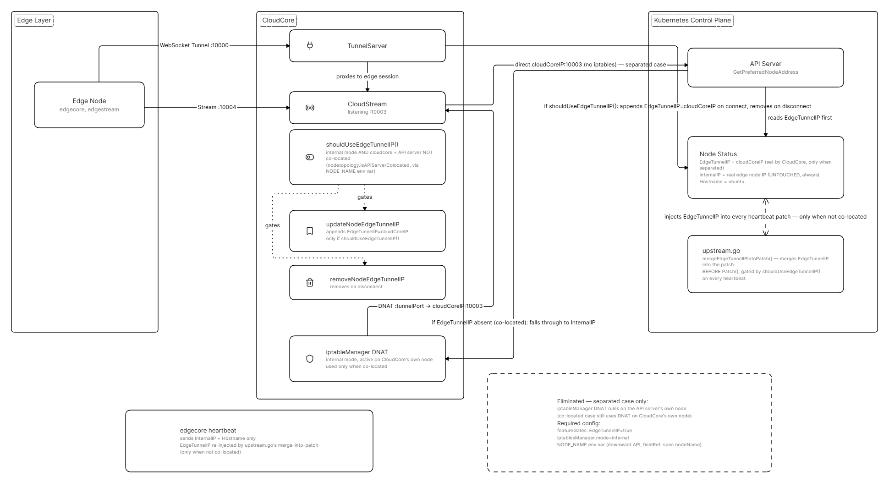
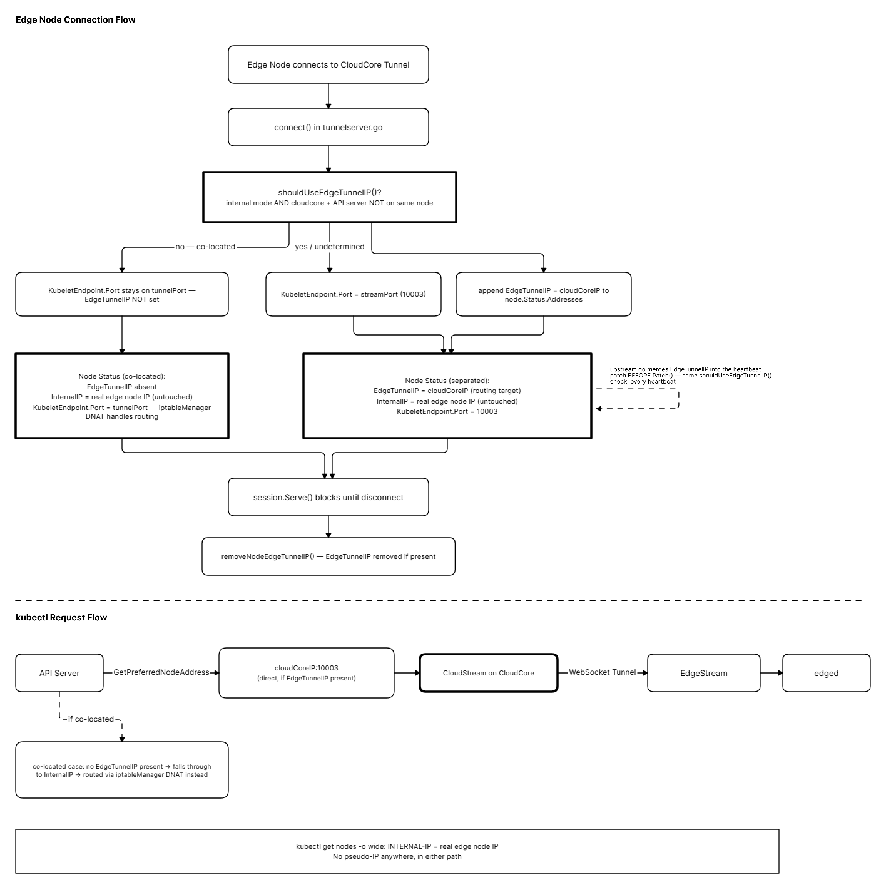

* [Abstract](#1-abstract)
* [Motivation](#2-motivation)
* [Goals](#3-goals)
* [Non-Goals](#4-non-goals)
* [Problem Statement](#5-problem-statement)
* [Proposed Solution](#6-proposed-solution)
  * [Overview](#61-overview)
  * [Component Design](#62-component-design)
  * [Request Flow](#63-request-flow)
  * [Configuration](#64-configuration)
  * [High Availability CloudCore Compatibility](#65-high-availability-cloudcore-compatibility)
  * [Risk Assessment](#66-risk-assessment)
* [Alternatives Considered](#7-alternatives-considered)
* [Test Plan](#8-test-plan)

# EdgeTunnelIP Address Type for iptables-Free API Server Redirection

## 1. Abstract

Currently `cloudstream` relies on `iptableManager` to intercept API server
kubelet requests via DNAT rules. This requires root-level network privileges
and fails on eBPF-based CNIs like Cilium. All previous alternative approaches
either modified `InternalIP` creating a pseudo-IP visible in
`kubectl get nodes -o wide`, or required kube-apiserver flag changes that
are not possible on managed Kubernetes distributions.

This proposal introduces a new `EdgeTunnelIP` node address type. When an
edge node connects to CloudCore, CloudCore appends an `EdgeTunnelIP` address
containing the CloudCore IP to the node's status addresses. Operators
configure kube-apiserver with
`--kubelet-preferred-address-types=EdgeTunnelIP,InternalIP,ExternalIP,Hostname`.
The API server finds `EdgeTunnelIP` first and routes directly to CloudCore.
`InternalIP` is completely untouched — the real edge node IP is always
visible in `kubectl get nodes -o wide` with no pseudo-IP anywhere.

`NodeAddressType` in Kubernetes is a plain string type explicitly designed
for extension by cloud providers. No upstream Kubernetes changes are required.

## 2. Motivation

`kubectl logs`, `kubectl exec`, and `kubectl top` on edge pods require the
API server to route streaming requests through CloudCore's `cloudstream`
component. All previous approaches to eliminate the iptables dependency
required modifying `InternalIP` to cloudCoreIP, creating a pseudo-IP that
misleads operators and tooling. The `EdgeTunnelIP` approach solves the routing
problem without touching `InternalIP`, preserving the semantic correctness
of all standard node address fields.

## 3. Goals

- Introduce `EdgeTunnelIP` custom node address type carrying cloudCoreIP,
  enabling the API server to route kubelet requests directly to CloudCore
- Keep `InternalIP` completely untouched — real edge node IP always visible
- Work in all deployment topologies: external DaemonSet mode, internal mode
  co-located, internal mode separated nodes, Cilium environments
- Gate the feature behind `FeatureGates` in cloudcore config for safe rollout
- Preserve full backward compatibility — existing deployments unchanged
- Zero additional Kubernetes objects per edge node
- Make iptableManager fail gracefully instead of calling `os.Exit`

## 4. Non-Goals

- Modifying the Kubernetes upstream NodeAddressType enum (not required,
  NodeAddressType is a plain extensible string type)
- Replacing the WebSocket tunnel between cloudcore and edgecore
- Modifying edgestream or edged components
- Implementing eBPF-based packet steering (future direction)

## 5. Problem Statement

### 5.1 Current Architecture

When a user runs `kubectl logs` or `kubectl exec` on an edge pod, the API
server calls `GetPreferredNodeAddress` which iterates through
`--kubelet-preferred-address-types` in order and returns the address of the
first matching type found on the node. It does NOT fall back on connection
failure — it simply finds the first matching type and uses that address.

The default order is `InternalIP,ExternalIP,Hostname`. Every edge node has
`InternalIP` set to its real IP address. The API server always uses the real
edge node IP, which is unreachable directly from the cloud. iptableManager
intercepts this traffic via DNAT.

### 5.2 Problems with iptableManager

**Root-level network privileges required:**
iptables manipulation requires `NET_ADMIN`/`NET_RAW` capabilities.

**Breaks on eBPF-based CNIs:**
Cilium bypasses the iptables stack. DNAT rules never apply.

**Internal mode + separated nodes:**
In internal mode, DNAT rules only exist on cloudcore's node. If cloudcore
and the API server run on different nodes, the redirect never fires.

**Hard process exit on failure:**
`os.Exit(1)` kills cloudcore when iptables manipulation fails.

### 5.3 Why Previous Approaches Failed

All previous alternatives modified `InternalIP` to carry cloudCoreIP. This
was rejected by the community because `InternalIP` should carry the real edge
node IP. The `EdgeTunnelIP` approach is the first design that routes correctly
without touching `InternalIP`.

### 5.4 The EdgeTunnelIP Insight

`NodeAddressType` in Kubernetes is defined as:

```go
type NodeAddressType string
// These are built-in addresses type of node.
// A cloud provider may set a type not listed here.
```

It is an extensible plain string type with no validation restricting it to
built-in values. KubeEdge can introduce `EdgeTunnelIP` as its own constant
without any upstream Kubernetes changes.

`GetPreferredNodeAddress` iterates address types in the configured order:

```go
func GetPreferredNodeAddress(node *v1.Node,
    preferredAddressTypes []v1.NodeAddressType) (string, error) {
    for _, addressType := range preferredAddressTypes {
        for _, address := range node.Status.Addresses {
            if address.Type == addressType {
                return address.Address, nil
            }
        }
    }
    return "", &NoMatchError{addresses: node.Status.Addresses}
}
```

If `EdgeTunnelIP` appears first in `--kubelet-preferred-address-types` and
the node has an `EdgeTunnelIP` address, the API server uses that address.
`InternalIP` is never consulted. No DNAT interception needed.

## 6. Proposed Solution

### 6.1 Overview



`EdgeTunnelIP` is only needed when `iptableManager` DNAT cannot reach the
API server's node — i.e. `iptableManager` running in **internal** mode
with cloudcore and the API server on **different** nodes. In external
DaemonSet mode the DNAT rule already exists on every non-edge node
(including the API server's), and in internal mode with cloudcore and the
API server co-located the local DNAT rule already covers it — in both
cases adding `EdgeTunnelIP` would be redundant. When same-node placement
cannot be determined, CloudCore conservatively assumes the nodes are
separated (a redundant `EdgeTunnelIP` is harmless; a missing one silently
breaks `kubectl exec`/`logs`/`attach`).

When an edge node connects to CloudCore:

1. CloudCore determines whether it and the API server are on the same
   node (see [6.2.8 Same-Node Detection](#8-same-node-detection-shoulduseedgetunnelip)). This
   decision, combined with the `iptableManager` mode, decides whether
   `EdgeTunnelIP` is used at all for this connection.
2. If the same-node check says "not co-located" (or is undetermined),
   CloudCore appends `EdgeTunnelIP = cloudCoreIP` to the node's
   `status.addresses` and sets `KubeletEndpoint.Port` to `streamPort`
   (10003). If it says "co-located", neither happens — the existing
   `iptableManager` DNAT path handles routing instead, and
   `KubeletEndpoint.Port` keeps using the negotiated tunnel port.
   `InternalIP` is never touched either way.
3. On every edgecore heartbeat, `upstream.go` merges `EdgeTunnelIP` into
   the incoming strategic-merge patch *before* calling `Patch()`, using
   the same same-node decision as step 1. This avoids the window a
   patch-then-`UpdateStatus()` approach would leave open, and ensures the
   co-located case does not have `EdgeTunnelIP` re-injected on the next
   heartbeat.
4. When the edge node disconnects, CloudCore removes the `EdgeTunnelIP`
   address from node status.
5. The feature is gated behind `FeatureGates["EdgeTunnelIP"]` in cloudcore
   config for safe rollout, in addition to the same-node/mode check above.
6. `iptableManager` `os.Exit(1)` is replaced with graceful error log and
   return.

With these changes the full request path becomes:
kubectl logs/exec

→ API Server calls GetPreferredNodeAddress

→ Finds EdgeTunnelIP first (cloudCoreIP)

→ Sends directly to cloudCoreIP:10003

→ CloudStream receives request (no iptables)

→ Proxied through WebSocket tunnel

→ EdgeStream → edged

→ Response returns via same path

`InternalIP` carries real edge node IP throughout. No pseudo-IP.

### 6.2 Component Design

#### 1. EdgeTunnelIP Constant

Define in `common/constants/default.go`:

```go
// NodeEdgeTunnelIP is a custom node address type used by KubeEdge to
// carry the CloudCore IP for API server kubelet request routing.
// NodeAddressType is an extensible string type in Kubernetes — cloud
// providers may define custom types not listed in core/v1 constants.
const NodeEdgeTunnelIP corev1.NodeAddressType = "EdgeTunnelIP"
```

#### 2. updateNodeEdgeTunnelIP (new in tunnelserver.go)

Called from `connect()` when the `EdgeTunnelIP` feature gate is enabled
**and** `shouldUseEdgeTunnelIP()` returns true (see
[6.2.8 Same-Node Detection](#8-same-node-detection-shoulduseedgetunnelip) — internal mode and
cloudcore/API server not determined to be co-located). Appends
`EdgeTunnelIP = cloudCoreIP` to `node.Status.Addresses`. Reads
`constants.EdgeMappingCloudKey` annotation as the sole source of the
CloudCore IP — there is no `TunnelServer.cloudCoreIP` field and no
fallback; if the annotation is empty, the update is skipped and a warning
is logged. Checks whether `EdgeTunnelIP` already exists with the correct
value before updating to avoid unnecessary API calls. Uses
`wait.PollUntilContextTimeout` to retry.

```go
func (s *TunnelServer) updateNodeEdgeTunnelIP(nodeName string) error {
    // appends EdgeTunnelIP = cloudCoreIP to node.Status.Addresses
    // does not modify InternalIP or any other address type
}
```

#### 3. removeNodeEdgeTunnelIP (new in tunnelserver.go)

Called after `session.Serve()` returns in `connect()` — the natural
disconnect hook. Removes all `EdgeTunnelIP` addresses from the node's
`status.addresses`. Treats not-found as success.

```go
func (s *TunnelServer) removeNodeEdgeTunnelIP(nodeName string) error {
    // removes EdgeTunnelIP entries from node.Status.Addresses
    // does not touch InternalIP or any other address type
}
```

#### 4. updateNodeKubeletEndpoint (modified)

Sets `KubeletEndpoint.Port = s.streamPort` (10003) only when the
`EdgeTunnelIP` feature gate is enabled **and** `shouldUseEdgeTunnelIP()`
returns true, so the API server uses the correct CloudStream port after
routing via `EdgeTunnelIP`. When `shouldUseEdgeTunnelIP()` returns false
(co-located case), the port switch is skipped and `KubeletEndpoint.Port`
keeps whatever the existing `iptableManager` tunnel-port negotiation sets
it to — gating on the raw feature gate alone would have broken the
co-located case once same-node detection could genuinely return false.

#### 5. EdgeTunnelIP handling in upstream.go's patchNode()

`edgecore` no longer drives node status through the deprecated
`updateNodeStatus()`/full-status-overwrite path — the active heartbeat
path is `patchNode()`, which applies a strategic-merge patch via
`Patch()`. Since edgecore's patch never includes `EdgeTunnelIP`, sending
it unmodified would silently drop CloudCore's `EdgeTunnelIP` entry on
every heartbeat, and patching first then re-adding it via a separate
`UpdateStatus()` call would leave a window where the address is briefly
absent.

The fix merges `EdgeTunnelIP` into the patch bytes themselves, *before*
`Patch()` is called, so there is no such window:

```go
func (uc *UpstreamController) patchNode(...) {
    patchBytes, err := uc.mergeEdgeTunnelIPIntoPatch(nodeName, patchBytes)
    // ...
    _, err = uc.kubeClient.CoreV1().Nodes().Patch(
        ctx, nodeName, patchtypes.StrategicMergePatchType, patchBytes, ...)
}

func (uc *UpstreamController) mergeEdgeTunnelIPIntoPatch(
    nodeName string, patchBytes []byte) ([]byte, error) {
    // only when uc.shouldUseEdgeTunnelIP() is true:
    // reads the cloudcore annotation off the current Node, unmarshals
    // patchBytes, adds/replaces EdgeTunnelIP under status.addresses,
    // re-marshals and returns the enriched patch
}
```

`shouldUseEdgeTunnelIP()` here is a method on `UpstreamController`,
gated on `uc.iptablesMgrMode` and backed by the same
[same-node detection](#8-same-node-detection-shoulduseedgetunnelip) tunnelserver.go's `connect()`
uses — both call sites share one implementation so they cannot silently
diverge on whether a given deployment counts as co-located.

#### 6. FeatureGate

Uses the existing `FeatureGates map[string]bool` in cloudcore v1alpha1
config types. When `FeatureGates["EdgeTunnelIP"] = true` **and**
`shouldUseEdgeTunnelIP()` is also true for the given deployment, CloudCore
activates `updateNodeEdgeTunnelIP` and the `KubeletEndpoint.Port` switch on
edge node connect, and `removeNodeEdgeTunnelIP` on disconnect. The feature
gate alone is necessary but not sufficient — it exists for safe rollout,
while `shouldUseEdgeTunnelIP()` decides whether this particular topology
needs the feature at all.

When the feature gate is false (default), behavior is completely unchanged
from the current release — iptableManager runs as before.

#### 7. iptableManager graceful degradation

Replace `os.Exit(1)` in `iptables/iptables.go` with:

```go
klog.Errorf("iptables unavailable: %v", err)
return
```

CloudCore remains operational when iptables is unavailable.

#### 8. Same-Node Detection (shouldUseEdgeTunnelIP)

`EdgeTunnelIP` is only activated when both of these hold:

1. `iptableManager` is running in **internal** mode (in external DaemonSet
   mode the DNAT rule already exists on every non-edge node, so
   `EdgeTunnelIP` is never needed).
2. CloudCore and the API server are **not** determined to be on the same
   node.

The same-node check lives in `cloud/pkg/common/nodetopology`, shared by
both `cloudstream.TunnelServer` (at connect time) and
`edgecontroller.UpstreamController` (on every heartbeat patch), so there
is exactly one implementation instead of two that can silently disagree:

```go
func IsAPIServerColocated(ctx context.Context, kubeClient kubernetes.Interface,
    nodeName string) (sameNode bool, determined bool) {
    // compares cloudcore's own Node (identified via the NODE_NAME
    // downward-API env var) against the address(es) backing the
    // well-known default/kubernetes Endpoints object
}
```

- CloudCore's node is identified via a `NODE_NAME` env var populated by
  the downward API (`fieldRef: spec.nodeName`) in the Helm chart's
  CloudCore Deployment — required for this check to ever resolve in a
  real deployment.
- The API server's address(es) come from the `default/kubernetes`
  Endpoints object, which also naturally handles HA control planes (all
  replica IPs must match cloudcore's node to count as co-located) and
  managed control planes (the API server isn't a cluster Node at all, so
  it never matches — correctly treated as separated).
- If placement cannot be determined (e.g. `NODE_NAME` unset, or cloudcore
  itself isn't running as a pod), the check conservatively reports
  "not co-located" — a redundant `EdgeTunnelIP` is harmless, a missing
  one silently breaks `kubectl exec`/`logs`/`attach`.
- Both call sites cache the decision (`sync.Once`) since node placement
  cannot change without a process restart.

### 6.3 Request Flow



`connect()` only takes the `EdgeTunnelIP` branch shown above when
`iptableManager` is in internal mode and cloudcore/API server are not
determined to be co-located (see
[6.2.8 Same-Node Detection](#8-same-node-detection-shoulduseedgetunnelip)); when co-located, the
connection flow skips straight to `session.Serve()` without setting
`EdgeTunnelIP`, and routing falls through to the existing `iptableManager`
DNAT path instead.

### 6.4 Configuration

**Feature disabled (default, backward compatible):**

```yaml
modules:
  cloudStream:
    enable: true
featureGates:
  EdgeTunnelIP: false
```

**Feature enabled:**

```yaml
modules:
  cloudHub:
    advertiseAddress:
    - <cloudCoreIP>
  cloudStream:
    enable: true
    streamPort: 10003
featureGates:
  EdgeTunnelIP: true
```

Operator must also configure kube-apiserver:
--kubelet-preferred-address-types=EdgeTunnelIP,InternalIP,ExternalIP,Hostname

For kubeadm clusters this is set in `ClusterConfiguration`:

```yaml
apiServer:
  extraArgs:
    kubelet-preferred-address-types: "EdgeTunnelIP,InternalIP,ExternalIP,Hostname"
```

For managed Kubernetes distributions that expose kube-apiserver as a
static pod (e.g. via `kind`), this flag is set by editing
`/etc/kubernetes/manifests/kube-apiserver.yaml` directly on the
control-plane node — the kubelet's static-pod watcher picks up the change
and restarts the API server automatically. This is a one-time,
per-cluster prerequisite; nothing in this proposal automates or documents
it as part of chart installation.

**`NODE_NAME` environment variable (CloudCore pod only):** required for
[same-node detection](#8-same-node-detection-shoulduseedgetunnelip) to ever resolve when CloudCore
runs in-cluster. Populated via the downward API:

```yaml
env:
- name: NODE_NAME
  valueFrom:
    fieldRef:
      fieldPath: spec.nodeName
```

Without it, `shouldUseEdgeTunnelIP()` always falls back to its
undetermined→"not co-located" default — harmless (a redundant
`EdgeTunnelIP` still works), but it means the co-located exclusion this
proposal is meant to provide never actually activates.

### 6.5 High Availability CloudCore Compatibility

In HA deployments multiple CloudCore instances run simultaneously. The
existing `cloudcore` annotation (`constants.EdgeMappingCloudKey`) set by
CloudHub `UpdateAnnotation` on every connection records which CloudCore
instance manages each edge node.

`updateNodeEdgeTunnelIP` reads this annotation as the authoritative CloudCore
IP for the `EdgeTunnelIP` address. In HA:

1. Edge node connects to CloudCore-1. `updateNodeEdgeTunnelIP` sets
   `EdgeTunnelIP = cloudCore1-IP`.

2. On failover, edge node reconnects to CloudCore-2. `UpdateAnnotation`
   updates annotation to cloudCore2-IP. CloudCore-2 calls
   `updateNodeEdgeTunnelIP` setting `EdgeTunnelIP = cloudCore2-IP`.
   `upstream.go`'s `mergeEdgeTunnelIPIntoPatch` reads the same updated
   annotation and keeps injecting the current value into every
   subsequent heartbeat patch.

3. `EdgeTunnelIP` address type is unique — only one entry per node.
   `updateNodeEdgeTunnelIP` replaces any existing `EdgeTunnelIP` value
   rather than appending a duplicate.

### 6.6 Risk Assessment

**InternalIP completely untouched:**
`InternalIP` is never read, written, or reconciled by this proposal.
`kubectl get nodes -o wide` always shows the real edge node IP.

**Backward compatibility:**
Feature gate defaults to false. All existing deployments are completely
unaffected until operators explicitly enable the feature and update the
kube-apiserver flag.

**upstream.go merge-into-patch:**
`mergeEdgeTunnelIPIntoPatch` only acts on addresses with type
`EdgeTunnelIP`, only when `shouldUseEdgeTunnelIP()` is true, and is a
no-op when the feature gate is disabled (since no `EdgeTunnelIP`
addresses will exist). Because it merges into the patch bytes before
`Patch()` rather than patching then correcting afterward, there is no
window where a heartbeat can observe `EdgeTunnelIP` missing.

**Same-node detection accuracy:**
`shouldUseEdgeTunnelIP()` shares one implementation
(`nodetopology.IsAPIServerColocated`) between the connect-time and
heartbeat-time decisions, so they cannot diverge. On managed control
planes (API server isn't a cluster Node) it always resolves to "not
co-located" — safe, since a spurious `EdgeTunnelIP` is harmless. In HA,
all API server replica IPs must match cloudcore's node for "co-located"
to apply, so a partial match is correctly treated as separated.

**Managed Kubernetes compatibility:**
Setting `--kubelet-preferred-address-types` requires kube-apiserver access.
This is a documented operator prerequisite. On managed Kubernetes (EKS, GKE,
AKS) this flag may not be configurable — document that the feature requires
kube-apiserver configuration access and is not available on all managed
offerings without additional support.

**os.Exit removal:**
Prevents cloudcore process death when iptables is unavailable in Cilium
environments where the feature gate has not been enabled yet.

## 7. Alternatives Considered

### 7.1 InternalIP = cloudCoreIP

Setting InternalIP directly to cloudCoreIP was implemented and tested.
Rejected by community: InternalIP should carry the real edge node IP.

### 7.2 ExternalIP = cloudCoreIP

Setting ExternalIP to cloudCoreIP requires `ExternalIP` to appear before
`InternalIP` in `--kubelet-preferred-address-types`. Since `GetPreferredNodeAddress`
picks the first matching type by presence not reachability, and InternalIP
always exists on edge nodes, ExternalIP is only used if listed first in the
flag. This requires the same kube-apiserver flag change as `EdgeTunnelIP`.
`EdgeTunnelIP` is semantically cleaner — it explicitly communicates its
purpose rather than overloading the existing `ExternalIP` field which has
different semantics in non-edge Kubernetes contexts.

### 7.3 Per-node Service and Endpoints

Creating a Kubernetes Service per edge node. Rejected: does not scale to
tens of thousands of edge nodes.

### 7.4 cloudcore Service ClusterIP

Setting InternalIP to cloudcore Service ClusterIP. Rejected: still a
pseudo-IP, InternalIP should not be modified.

### 7.5 eBPF-based packet steering

Rejected: kernel version constraints on edge devices, zero existing eBPF
infrastructure in KubeEdge. Future direction.

### 7.6 Tunnel port fix (KubeletEndpoint.Port = tunnelPort)

Setting KubeletEndpoint.Port to the negotiated tunnel port so iptableManager
DNAT fires correctly. Works in external DaemonSet mode but fails in internal
mode with separated cloudcore and API server nodes. Does not work on Cilium.

## 8. Test Plan

### Unit Tests

- `TestUpdateNodeEdgeTunnelIP` — appends correctly, already correct skips
  update, reads annotation IP, empty annotation is skipped with a warning
  (no fallback field), nil client, node not found
- `TestRemoveNodeEdgeTunnelIP` — removes EdgeTunnelIP only, leaves
  InternalIP and other types untouched, not found is success, nil client
- `TestUpdateNodeKubeletEndpoint_EdgeTunnelIPEnabled` — port = streamPort
  when feature gate enabled AND shouldUseEdgeTunnelIP() is true; port
  stays on the tunnel-port path when shouldUseEdgeTunnelIP() is false
  (co-located)
- `TestEdgeTunnelIPPreservation` — simulates edgecore's heartbeat patch,
  verifies EdgeTunnelIP is merged into the patch before Patch() is called,
  InternalIP unchanged
- `TestFeatureGateDisabled` — when gate=false, connect() does not call
  updateNodeEdgeTunnelIP, node addresses unchanged
- `TestShouldUseEdgeTunnelIP` (tunnelserver.go) /
  `TestUpstreamShouldUseEdgeTunnelIP` (upstream.go) — external-mode
  (always false), undetermined-placement fallback (true), colocated
  (false), separated (true), decision-is-cached — one test suite per call
  site, exercising the same shared `nodetopology.IsAPIServerColocated`
  logic
- `TestIsAPIServerColocated` (nodetopology package) — own-node-not-found,
  endpoints-not-found, HA-partial-match, HA-full-match, empty-node-name
- `TestMergeEdgeTunnelIPIntoPatch` — no annotation leaves the patch
  unchanged, annotation present injects EdgeTunnelIP into the patch JSON

### Integration Tests

- `kubectl get nodes -o wide` INTERNAL-IP shows real edge node IP
- EdgeTunnelIP address present in node.Status.Addresses on connect
- EdgeTunnelIP address removed from node.Status.Addresses on disconnect
- EdgeTunnelIP survives 90 seconds of edgecore heartbeat cycles
- InternalIP unchanged throughout all heartbeat cycles
- `kubectl logs` and `kubectl exec` succeed when kube-apiserver configured
  with EdgeTunnelIP first in preferred address types
- Feature gate disabled: no EdgeTunnelIP address set, iptableManager
  runs unchanged
- HA failover: EdgeTunnelIP updates to new CloudCore IP on reconnect
- Internal mode + co-located: EdgeTunnelIP never set, KubeletEndpoint.Port
  stays on the negotiated tunnel port, iptableManager DNAT handles routing
- Internal mode + separated: EdgeTunnelIP set and survives heartbeats,
  KubeletEndpoint.Port = streamPort
- External DaemonSet mode: EdgeTunnelIP never set regardless of node
  placement

### e2e Tests

Run against a 2-node kind cluster (CloudCore deployed via the Helm chart
so `NODE_NAME` is populated) with the kube-apiserver
`--kubelet-preferred-address-types` flag configured, covering both
placements:

- Deploy edge pod with EdgeTunnelIP feature gate enabled
- Confirm `kubectl get nodes -o wide` INTERNAL-IP = real edge node IP in
  both placements
- Separated (CloudCore and API server on different nodes): confirm
  EdgeTunnelIP = cloudCoreIP in node.Status.Addresses, `kubectl logs`/
  `kubectl exec` succeed through CloudStream, and no DNAT rule fires on
  the API server's own node
- Co-located (CloudCore and API server on the same node): confirm
  EdgeTunnelIP is correctly absent, `kubectl logs`/`kubectl exec` succeed
  through the existing `iptableManager` DNAT path instead
- Confirm EdgeTunnelIP removed after edge node disconnect (separated
  case), and stays absent across reconnects (co-located case)
- Confirm EdgeTunnelIP (or its absence) survives multiple edgecore
  heartbeat cycles without flapping
- Confirm no Service or Endpoints objects created
- Confirm cloudcore continues running when iptables fails (os.Exit removed)
