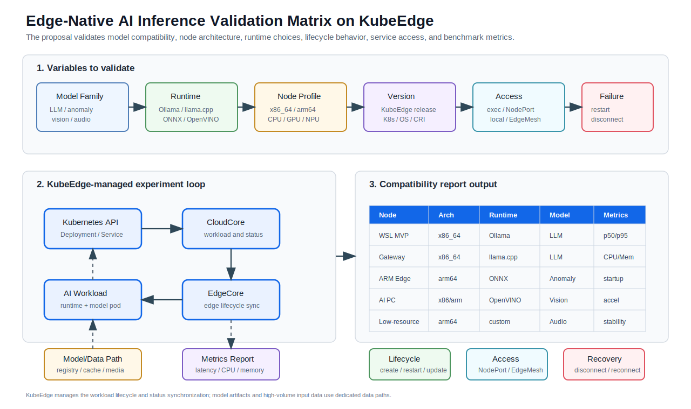

# Edge-Native AI Model Inference Validation on KubeEdge

## Summary

This proposal describes a validation plan and reference practice for running
lightweight AI inference workloads on KubeEdge edge nodes.

The proposal is motivated by the LFX mentorship topic
[KubeEdge-Based Deployment and Practice of Small-Parameter Large Language Models for Edge Intelligent Inference](https://github.com/kubeedge/kubeedge/issues/6756).
The first working MVP uses small-parameter LLMs, but the main objective is not
limited to one runtime or one model family. The core objective is to build a
KubeEdge-based validation matrix that answers:

- which lightweight model types can run on KubeEdge-managed edge nodes;
- which model runtimes are practical under different resource constraints;
- how the result changes across CPU-only, GPU/NPU-capable, x86_64, arm64, and
  other edge node architectures;
- how different KubeEdge versions and edge node environments affect workload
  delivery, service access, lifecycle management, and recovery;
- what benchmark data and reproducible manifests can be provided to KubeEdge
  users and contributors.

The current LLM MVP is treated as the first data point in this validation
matrix. The expected outcome is a reusable compatibility and benchmark
reference for edge-native AI inference on KubeEdge.

## Motivation

AI inference is moving from cloud-only deployment to edge environments. Edge
nodes may be deployed in factories, AI PCs, gateways, vehicles, cameras, or
industrial control sites. These environments differ significantly in CPU
architecture, accelerator availability, memory size, disk capacity, network
quality, and operating system distribution.

For KubeEdge, the important question is not only whether one model can be
started on one edge node. A useful community result should show how KubeEdge
behaves across a broader set of model and node combinations:

- small LLMs for local question answering, summarization, and operation
  assistants;
- anomaly detection models for device state, sensor data, or predictive
  maintenance;
- vision models for camera-side object detection, safety inspection, and
  defect detection;
- audio models for equipment sound fault detection or speech-related edge
  tasks;
- lightweight multimodal workloads where text, image, audio, or sensor data are
  combined at the edge.

KubeEdge can provide the cloud-edge management layer for these workloads:
workload delivery, node selection, lifecycle operations, status synchronization,
service access, and edge autonomy under unstable networks. The model runtime
and data plane can vary, but the validation framework should make the KubeEdge
management behavior measurable and reproducible.

## Problem Statement

There is no systematic compatibility reference for lightweight AI model
inference on KubeEdge edge nodes. Current examples often validate one scenario,
one node type, or one runtime. This makes it difficult to answer practical
questions such as:

- Can the same inference workload be deployed on x86_64 and arm64 edge nodes?
- How does a CPU-only node compare with a GPU/NPU-capable edge node?
- Which runtime is suitable for a small LLM, anomaly detector, vision model, or
  audio model?
- How should model files be cached so Pod recreation does not repeatedly
  download large artifacts?
- Which service exposure method is suitable for local edge applications?
- How does the workload behave when EdgeCore restarts or the edge node
  disconnects from the cloud?
- Which KubeEdge versions and edge node environments should be covered before
  the result is useful to the community?

This proposal focuses on turning these questions into a validation matrix and
benchmark practice.

## Goals

- Validate lightweight AI inference workloads on KubeEdge-managed edge nodes
  across multiple model families.
- Compare multiple model runtimes, including Ollama, llama.cpp, ONNX Runtime,
  OpenVINO, PyTorch Runtime, and custom inference services where applicable.
- Validate edge nodes with different CPU architectures, such as x86_64 and
  arm64.
- Validate different node resource profiles, such as CPU-only nodes,
  GPU/NPU-capable nodes, AI PCs, and resource-constrained gateways.
- Record KubeEdge version, Kubernetes version, OS, container runtime, CPU
  architecture, accelerator availability, and hardware resource limits for each
  validation run.
- Validate KubeEdge workload lifecycle operations, including create, delete,
  restart, rollout, recovery, and status synchronization.
- Validate service access methods, including `kubectl exec` smoke tests,
  ClusterIP, NodePort, edge-local access, and EdgeMesh where applicable.
- Define a benchmark checklist for startup time, model pull time, model load
  time, inference latency, p50/p95 latency, CPU, memory, disk usage, and
  runtime stability.
- Produce reproducible manifests, commands, benchmark tables, troubleshooting
  notes, and a compatibility report.

## Non-goals

- Train a new LLM or a new AI model.
- Rank model answer quality as the primary objective.
- Build a full RAG, agent, or model training platform.
- Treat Ollama as the only supported runtime. Ollama is only the initial LLM
  runtime used by the MVP.
- Use the KubeEdge CloudCore/EdgeCore control channel to transfer large model
  files, video streams, or high-volume audio data.
- Treat WSL as a final production edge environment. WSL is only the first
  reproducible MVP environment.
- Introduce new KubeEdge APIs or CRDs in the first validation stage.

## Related Work

- [#6756](https://github.com/kubeedge/kubeedge/issues/6756): small-parameter
  large language model deployment and practice for edge intelligent inference.
- [#6428](https://github.com/kubeedge/kubeedge/issues/6428): small language
  model deployment and collaboration with enterprise AI platforms.
- [#6757](https://github.com/kubeedge/kubeedge/issues/6757): AI PC integration
  into KubeEdge for edge intelligent workload orchestration.
- [#6878](https://github.com/kubeedge/kubeedge/pull/6878): proposal for an
  embodied AI edge-cloud collaboration framework.
- [Device Anomaly Detection Framework](../../sig-device-iot/6312-device-anomaly-detection-framework/README.md):
  anomaly detection workflow for KubeEdge device data.
- [Implementing equipment fault detection scenarios based on deep learning](../../sig-device-iot/sound-equipment-fault-detection.md):
  audio fault detection on KubeEdge edge nodes.

## Current MVP as the First Validation Data Point

An initial MVP has been completed to validate the smallest working path from
KubeEdge edge node onboarding to local model inference. This MVP is not the
final scope of the proposal. It is the first row in the larger compatibility
matrix.

### MVP Environment

| Item                  | Value                           |
| --------------------- | ------------------------------- |
| Cloud side            | Kubernetes + KubeEdge CloudCore |
| Edge side             | WSL Ubuntu + KubeEdge EdgeCore  |
| Edge node             | `wsl-llm-edge`                  |
| CPU architecture      | x86_64                          |
| Container runtime     | containerd                      |
| Current model runtime | Ollama                          |
| Accelerator           | No GPU/NPU                      |

### Verified Items

| Item                           | Result       |
| ------------------------------ | ------------ |
| EdgeCore joins CloudCore       | Passed       |
| Edge node status               | `Ready`      |
| Edge node role                 | `agent,edge` |
| Minimal `pause` Pod delivery   | Passed       |
| Pod create/delete lifecycle    | Passed       |
| Ollama Deployment on edge node | Passed       |
| Model pull and load            | Passed       |
| Local inference on edge node   | Passed       |

### Initial LLM Test Results

The following models were pulled and executed inside the KubeEdge-managed
Ollama Pod on `wsl-llm-edge`.

| Model            | Type | Size | Runtime | Node profile | Result  | Single-run latency |
| ---------------- | ---- | ---- | ------- | ------------ | ------- | ------------------ |
| `smollm2:135m`   | LLM  | 135M | Ollama  | x86_64 CPU   | Success | 5.351s             |
| `qwen2.5:0.5b`   | LLM  | 0.5B | Ollama  | x86_64 CPU   | Success | 2.599s             |
| `tinyllama:1.1b` | LLM  | 1.1B | Ollama  | x86_64 CPU   | Success | 3.724s             |

These numbers are preliminary single-run observations. They show that small
LLMs can run on a CPU-only KubeEdge edge node, but they are not yet a strict
benchmark. The next step is to repeat the tests with fixed prompts, separate
cold start and warm inference, and collect p50/p95 latency together with CPU,
memory, and disk usage.

## Proposed Validation Framework

The proposal should not only repeat the known KubeEdge cloud-edge control flow.
Instead, it defines a validation framework where KubeEdge is the management
plane and the experiment matrix varies the model family, runtime, node
architecture, node resource profile, and KubeEdge version.



### Validation Dimensions

| Dimension          | Examples                                                                 |
| ------------------ | ------------------------------------------------------------------------ |
| Model family       | LLM, anomaly detection, vision, audio, image classification, multimodal   |
| Runtime            | Ollama, llama.cpp, ONNX Runtime, OpenVINO, PyTorch, custom service        |
| CPU architecture   | x86_64, arm64                                                            |
| Resource profile   | CPU-only, GPU/NPU-capable, AI PC, low-memory gateway                     |
| KubeEdge version   | current development branch and selected stable releases where practical  |
| Access method      | `kubectl exec`, ClusterIP, NodePort, edge-local access, EdgeMesh          |
| Reliability case   | Pod restart, Deployment rollout, EdgeCore restart, disconnect/reconnect   |
| Benchmark category | startup, model pull/load, latency, p50/p95, CPU, memory, disk, stability |

## Design Details

### 1. Model Compatibility Matrix

The validation should cover more than LLMs. A suggested initial matrix is:

| Model family       | Candidate workload                         | Runtime options                  | Key metrics                                      |
| ------------------ | ------------------------------------------ | -------------------------------- | ------------------------------------------------ |
| Lightweight LLM    | local Q&A, summarization, operation helper | Ollama, llama.cpp, vLLM          | load time, latency, memory, prompt stability     |
| Anomaly detection  | sensor anomaly, device state anomaly       | ONNX Runtime, PyTorch, custom    | input delay, event latency, CPU, memory          |
| Vision/image       | object detection, defect detection         | ONNX Runtime, OpenVINO, PyTorch  | frame latency, throughput, accelerator usage     |
| Audio inference    | equipment sound fault detection            | ONNX Runtime, PyTorch, custom    | sample window, inference latency, event accuracy |
| Multimodal service | text + image/audio/sensor fusion           | custom service, PyTorch, ONNX    | end-to-end latency, memory, data path pressure   |

### 2. Node Compatibility Matrix

The validation should record the node environment explicitly. This makes the
result useful to users who need to choose hardware.

| Node profile       | Architecture | Accelerator | Purpose                                      |
| ------------------ | ------------ | ----------- | -------------------------------------------- |
| WSL MVP node       | x86_64       | none        | reproducible first validation                |
| Linux edge gateway | x86_64       | none        | CPU-only baseline                            |
| ARM edge device    | arm64        | optional    | architecture compatibility validation        |
| AI PC              | x86_64/arm64 | GPU/NPU     | accelerator-aware workload validation        |
| Low-resource node  | x86_64/arm64 | none        | minimum CPU, memory, and disk boundary tests |

Each validation record should include:

- KubeEdge version;
- Kubernetes version;
- OS distribution and kernel;
- CPU architecture;
- CPU core count;
- memory and disk capacity;
- accelerator type if any;
- container runtime;
- model runtime image and version.

### 3. Runtime Options

The MVP uses Ollama because it simplifies LLM model pull, local model
management, and inference invocation. Direct model deployment is also valid and
should be compared.

| Runtime option  | Best-fit workload                 | Notes                                          |
| --------------- | --------------------------------- | ---------------------------------------------- |
| Ollama          | MVP small LLM validation          | fast setup, useful for early comparison        |
| llama.cpp       | CPU-friendly LLM inference        | suitable for constrained CPU edge devices      |
| vLLM            | LLM serving on accelerator nodes  | more suitable for GPU or high-throughput cases |
| ONNX Runtime    | anomaly, vision, audio, image     | good for lightweight edge inference            |
| OpenVINO        | vision/audio on Intel edge nodes  | useful for AI PC and CPU/NPU acceleration      |
| PyTorch Runtime | custom AI workloads               | flexible, but image and memory may be larger   |
| Custom service  | production-specific inference API | most controllable, more engineering effort     |

The key point is that KubeEdge should manage the workload consistently,
regardless of the model runtime.

### 4. Workload Delivery

The first stage uses native Kubernetes resources:

- `Namespace` for the validation environment;
- `Deployment` for model runtime services;
- `Service` for access validation;
- `nodeSelector`, `nodeName`, labels, or taints/tolerations to place workloads
  on selected edge nodes;
- `ConfigMap` or environment variables for lightweight runtime configuration;
- `hostPath` or local PV for model cache validation.

This keeps the proposal compatible with the current KubeEdge architecture and
avoids adding new APIs before the basic compatibility matrix is validated.

### 5. Model and Data Delivery Boundary

Large model files, video streams, and audio streams should not be transferred
through the CloudCore/EdgeCore control channel. They should use proper data
paths, such as:

- model registry or object storage;
- container image layers;
- local persistent volumes;
- edge-local cache;
- HTTPS, MQTT, or message queue channels for high-volume data;
- device data reporting paths where applicable.

KubeEdge should focus on workload management and status synchronization, while
large model artifacts and high-volume input data use dedicated data paths.

### 6. Lifecycle and Reliability Validation

The validation will cover:

- Pod creation and deletion;
- Deployment rollout and image update;
- model runtime restart;
- EdgeCore restart;
- edge node disconnection;
- network recovery and status synchronization;
- model cache persistence after Pod recreation.

### 7. Observability and Benchmarking

The benchmark should record both KubeEdge workload behavior and model runtime
behavior.

| Category           | Metrics                                                            |
| ------------------ | ------------------------------------------------------------------ |
| Workload lifecycle | Pod start time, deletion time, restart time, rollout behavior      |
| Model lifecycle    | model pull time, model load time, cache hit/miss                   |
| Inference latency  | single-run latency, average latency, p50, p95                      |
| Resource usage     | CPU, memory, disk usage, accelerator usage where applicable        |
| Reliability        | behavior under EdgeCore restart, node disconnect, network recovery |
| Service access     | request success rate and latency for each access method            |
| Compatibility      | runtime support, image availability, architecture-specific issues  |

## Validation Scenarios

### Scenario 1: Lightweight LLM Compatibility

Validate several small LLMs on different node profiles.

Initial models:

- `smollm2:135m`;
- `qwen2.5:0.5b`;
- `tinyllama:1.1b`.

Possible follow-up models can include other small-parameter LLMs that support
CPU or edge-friendly runtime execution. The purpose is to compare runtime
support, startup cost, resource usage, and stability, not to rank answer
quality.

### Scenario 2: Anomaly Detection

Validate whether KubeEdge can manage anomaly detection workloads for industrial
or IoT data.

Example tasks:

- device state anomaly detection;
- sensor drift or freeze detection;
- predictive maintenance;
- abnormal sound detection.

This scenario is closely related to KubeEdge device management, DeviceTwin,
Mapper, and data reporting workflows. It can provide a stronger KubeEdge
community connection than a pure LLM demo.

### Scenario 3: Vision or Image Inference

Validate vision workloads as edge AI services.

Example tasks:

- object detection;
- safety helmet detection;
- defect detection;
- intrusion detection.

Video streams should use a dedicated data path and should not be sent through
the KubeEdge control channel.

### Scenario 4: Audio Inference

Validate audio models on edge nodes.

Example tasks:

- equipment sound fault detection;
- speech recognition;
- environmental sound classification.

This can reuse the experience from the existing KubeEdge equipment fault
detection proposal and extend it with node compatibility, workload lifecycle,
and benchmark measurements.

## Demo and Validation Plan

1. Prepare a KubeEdge cloud-edge environment.
2. Record KubeEdge, Kubernetes, OS, container runtime, architecture, and
   hardware information.
3. Join the first x86_64 CPU-only edge node and verify that the node is
   `Ready`.
4. Deploy a minimal Pod to verify workload delivery.
5. Deploy the first LLM runtime, initially Ollama, to the edge node.
6. Pull and run multiple lightweight LLMs.
7. Record model list, Pod status, node status, inference latency, and resource
   usage.
8. Repeat the same workflow on additional node profiles, such as Linux x86_64,
   arm64, and accelerator-capable nodes where available.
9. Add runtime comparison, such as llama.cpp or ONNX Runtime.
10. Add anomaly detection, vision, audio, or image inference workloads.
11. Add Service access validation.
12. Add model cache persistence validation.
13. Add Pod restart, Deployment update, and EdgeCore restart tests.
14. Add weak-network tests with edge disconnect and reconnect.
15. Publish the compatibility matrix and benchmark report.

Example evidence commands:

```bash
kubectl get node wsl-llm-edge -o wide
kubectl -n edge-llm-demo get pod -l app=ollama-edge -o wide
kubectl -n edge-llm-demo exec deploy/ollama-edge -- ollama list
time kubectl -n edge-llm-demo exec deploy/ollama-edge -- \
  ollama run qwen2.5:0.5b "Explain edge inference in one sentence."
```

## Compatibility Matrix Template

The final report should include tables similar to the following.

| Node | Arch | Runtime | Model family | Model | Result | p50 | p95 | CPU | Memory | Notes |
| ---- | ---- | ------- | ------------ | ----- | ------ | --- | --- | --- | ------ | ----- |
| WSL  | x86_64 | Ollama | LLM | `qwen2.5:0.5b` | Pass | TBD | TBD | TBD | TBD | MVP |
| Linux gateway | x86_64 | llama.cpp | LLM | TBD | TBD | TBD | TBD | TBD | TBD | TBD |
| ARM device | arm64 | ONNX Runtime | anomaly | TBD | TBD | TBD | TBD | TBD | TBD | TBD |
| AI PC | x86_64/arm64 | OpenVINO | vision/audio | TBD | TBD | TBD | TBD | TBD | TBD | TBD |

## Open Questions

| Question                 | Description                                                                                                       |
| ------------------------ | ----------------------------------------------------------------------------------------------------------------- |
| Node coverage            | Which x86_64, arm64, AI PC, GPU/NPU, and low-resource nodes should be covered first?                              |
| Version coverage         | Which KubeEdge and Kubernetes versions should be included in the compatibility report?                            |
| Benchmark rigor          | Current latency values are single-run observations. Multi-run p50/p95 data is required.                           |
| Model persistence        | Pod recreation should not always trigger model download. hostPath, local PV, or cache strategies need validation. |
| Service exposure         | NodePort, local edge access, and EdgeMesh need comparison.                                                        |
| Weak network behavior    | The system must be tested under disconnection, reconnection, and CloudCore/EdgeCore status resync.                |
| Runtime selection        | Ollama is suitable for MVP, but llama.cpp, ONNX Runtime, OpenVINO, and custom runtimes should be compared.        |
| Data plane boundary      | Large model files, video streams, and audio streams need dedicated data paths.                                    |
| Resource boundary        | The minimum CPU, memory, and disk requirements for each model family need to be measured.                         |

## Expected Deliverables

- A reproducible KubeEdge edge AI inference demo.
- A compatibility matrix for model family, runtime, node architecture, resource
  profile, and KubeEdge version.
- Deployment manifests for LLM, anomaly detection, vision/image, and audio
  validation workloads where practical.
- A guide for joining edge nodes and validating workload delivery across
  different architectures.
- Model pull, model load, and inference test commands.
- Benchmark tables for latency, startup time, CPU, memory, disk usage, and
  accelerator usage where applicable.
- Validation records for lifecycle operations and weak-network behavior.
- Service exposure validation notes for `kubectl exec`, ClusterIP, NodePort,
  edge-local access, and EdgeMesh.
- Troubleshooting notes for token expiration, edge node `NotReady`, image pull
  failure, model cache miss, architecture-specific image issues, and unstable
  tunnel/network conditions.
- Follow-up documentation, examples, website content, or proposal PRs when
  useful.

## Roadmap

| Phase   | Work                                                                                      |
| ------- | ----------------------------------------------------------------------------------------- |
| Phase 1 | Prepare KubeEdge cloud-edge environment and record baseline version/hardware information  |
| Phase 2 | Validate x86_64 CPU-only lightweight LLM inference using the current MVP workflow          |
| Phase 3 | Add multi-run benchmark data, including startup, model load, p50/p95, CPU, memory, disk   |
| Phase 4 | Add additional node profiles, especially Linux x86_64 and arm64                           |
| Phase 5 | Compare runtime options such as Ollama, llama.cpp, ONNX Runtime, and OpenVINO             |
| Phase 6 | Extend validation to anomaly detection, vision/image, audio, and multimodal workloads     |
| Phase 7 | Validate Service exposure, lifecycle operations, model persistence, and weak-network cases |
| Phase 8 | Publish compatibility matrix, benchmark report, manifests, and troubleshooting notes      |

## Expected Value

This proposal can provide KubeEdge users and contributors with a practical
reference for edge-native AI inference workloads:

- which lightweight model families can be deployed through KubeEdge;
- which runtime is suitable for each model family and node type;
- how x86_64, arm64, CPU-only, GPU/NPU-capable, and low-resource nodes behave;
- how KubeEdge manages AI workloads using existing Kubernetes resources;
- how edge inference services can be exposed and accessed;
- how model runtime behavior can be measured on edge nodes;
- how weak-network and lifecycle scenarios affect edge AI services;
- where model/data plane boundaries should be drawn for large artifacts and
  high-volume media data.

The current LLM MVP is the first concrete scenario. The broader contribution is
a compatibility-driven KubeEdge validation framework for edge AI workload
deployment, management, and benchmarking.
