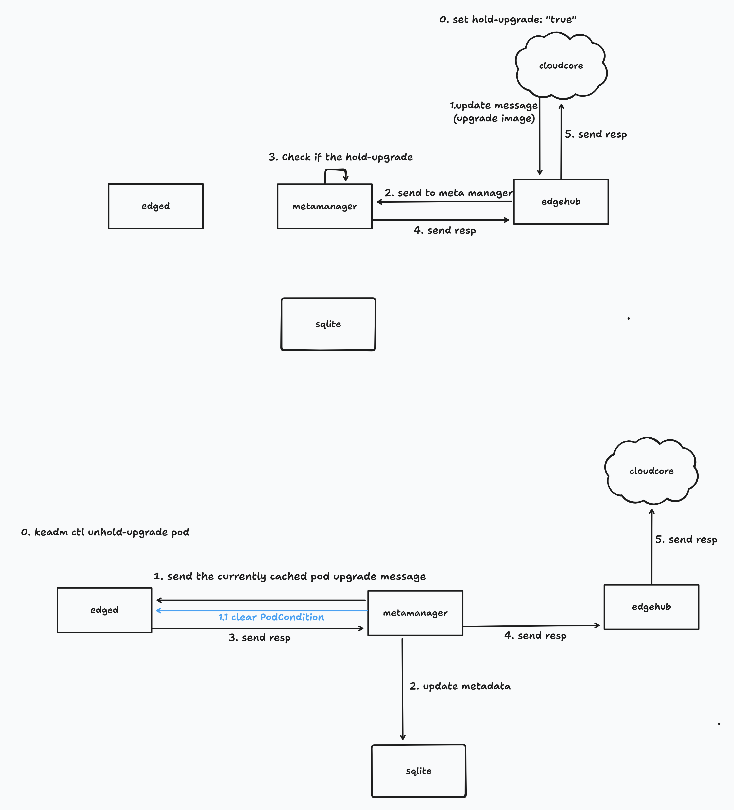

# Edge Resource Upgrade Control

- [Edge Resource Upgrade Control](#edge-resource-upgrade-control)
  - [Motivation / Background](#motivation--background)
  - [Use cases](#use-cases)
  - [Proposal Design](#proposal-design)
    - [Cloud Side](#cloud-side)
    - [Edge Side](#edge-side)
    - [MetaServer/MetaService API](#metaservermetaservice-api)
    - [`keadm ctl` Extension](#keadm-ctl-extension)
    - [Testing](#testing)
  - [Consideration](#consideration)
  - [Additional Note](#additional-note)

## Motivation / Background

For the use cases such as drones, robotics/robots and autonomous cars, the edge system application should be able to hold/release the lock for the resources (Pods, ConfigMap, Deployment and so on) updated at edge, so that the resources cannot be updated or upgraded unless it confirms the device status.
The user application (likely system application running in the host system where `edgecore` runs) can confirm and control the resource update timing to release the lock.
For example, when the drone is on the ground and only in the updating state, `edged` redeploys the pods and deployments with requesting to `containerd`.
The same requirement for robotics/robots, only when the system application determines that it is safe to update the application pods or any other resources, it can do so accordingly.
Otherwise, `edged` sends the request to `containerd` to recreate the resource such as pods and deployments once queued to `MetaManager` via `CloudCore(EdgeController)`.
Usually this would not be the problem for the use cases such as sensing data collection or completely stateless application, this is not going to be any problems because it can update the resources anytime requested by Kubernetes.
Probably just temporarily sensing data can be lost, but it does not really matter for those use cases.
The sensing data will be coming once the new application pods are deployed and started.

This sounds pretty much for common use case at edge application lifecycle management.
This feature enables us to control the update timing to confirm and release the lock once the device is ready to be updated at edge itself.

## Use cases

- Robotics / Robots
  An automatic resource update in the middle of the operation or actuation could interrupt motion, possibly causing actuator lock-up or crash, production halt, safety hazard to nearby human operators.
  Robot system signals when the actuators are idle and in safe pose, only then does `edged` apply the updated container to ensure updates occur during defined maintenance windows or pause states.

- Autonomous Car / AMR / AGV
  If a resource update restarts the perception or control module mid-navigation, vehicle may stop unexpectedly, possibly causing risk of collision or failure to navigate, loss of customer trust and service reliability.
  The local system inside the vehicle controls when it is parked or charging, it toggles the flag or sends a signal to enable the resource update only when the car system is ready to do so.
  This ensures zero disruption to the driving session.

- Drone / Aerospace
  If the update hits mid-flight, the pod restart disconnects the telemetry stream or flight control interface.
  This could possibly trigger emergency landing or flyaway condition, the worst case is crash down on the ground.
  Edge device onboard drone (e.g. PX4 companion computer) knows flight state always, then signals when landed or in safe altitude hold mode.
  Resource updates only can be applied to post-flight or during downtime.

## Proposal Design

We can use annotations like `edge.kubeedge.io/hold-upgrade: "true"` on Deployments, StatefulSets, DaemonSets, etc., to indicate that their Pod updates should be held at the edge unless the edge system or application releases the lock.
It propagates this state via a new PodCondition (e.g. `HoldUpgrade`) so the cloud knows that the update is deferred.
Add a new MetaServer API and `keadm ctl command` (`keadm ctl unhold-upgrade pod <pod>` and `keadm ctl unhold-upgrade node`) to release the oold and allow the update to apply.

Below is the Hold Upgrade logic diagram we are concerned with. 

For the normal version of the diagram, see [here](https://kubeedge.io/assets/images/meta-update-816c9e626d823c7cb36eaeda971be81e.png).



### Cloud Side

On the cloud side, users can apply the annotation `edge.kubeedge.io/hold-upgrade: "true"` to resources such as `Deployments`, `StatefulSets`, or `DaemonSets`. These updates are propagated as usual through CloudCore to the corresponding edge nodes.

> Note: CloudCore does not perform any additional logic or message interception for this feature. It simply relays resource updates downstream to the edge.

### Edge Side

When a resource is marked with the annotation `edge.kubeedge.io/hold-upgrade: "true"`, the MetaManager module on the edge intercepts and handles the update message before it reaches edged.

**0. How Resources Are Held**

At the edge, the hold logic is based on a key observation:

> A Pod upgrade is always implemented as the creation of a new Pod to replace the old one.

Therefore, the new Pod (with Pending status) is intercepted at the edge node before it can be launched. The logic works as follows:

    - The MetaManager receives the new Pod update message from CloudCore.
    - If the Pod has edge.kubeedge.io/hold-upgrade: "true", it is treated as a holdable upgrade.
    - Instead of letting this pod proceed to runtime, the edge node stores this Pod in an internal queue and skips execution.

This logic isolates edge resource upgrades, allowing fine-grained lifecycle control at the device level.

**1. Hold Logic**

When edged receives a Pod from MetaManager, it checks the following:

```go
func (e *edged) handlePod(..) {
  ...
    case model.UpdateOperation:
			hold, err := e.holdUpgrade(&pod)
			if err != nil {
				return err
			}

			if hold {
				return nil
			}
      ...
}

func (e *edged) holdUpgrade(pod *v1.Pod) (bool, error) {
	if pod.Annotations["edge.kubeedge.io/hold-upgrade"] != "true" {
		return false, nil
	}

	if pod.Status.Phase != v1.PodPending {
		return false, nil
	}

	v := kubelettypes.PodUpdate{
		Op:     kubelettypes.UPDATE,
		Pods:   []*v1.Pod{pod},
		Source: kubelettypes.ApiserverSource,
	}

	key := fmt.Sprintf("%s/%s", pod.Namespace, pod.Name)
	e.heldPodUpdates[key] = append(e.heldPodUpdates[key], v)
  ...
}
```

- If the condition is met, the Pod update is stored in memory (heldPodUpdates) and not passed to the runtime.
- This ensures the new Pod will not start running until the upgrade is explicitly confirmed.


Additionally, a new Pod condition is injected:

```yaml
status:
  conditions:
    - type: HeldUpgrade
      status: "True"
      reason: UpdateHoldActive
      message: Pod upgrade is currently held at the edge.
```

- This condition notifies cloud that the update is intentionally being held.
- edged sends a new Pod status update (with the HeldUpgrade condition) to cloudcore.

**2. Recovery on Edge Restart**

When the edge node restarts, edged reconnects to the metaserver and retrieves the last known Pod states.

To ensure upgrade continuity:

    If a Pod has the annotation edge.kubeedge.io/hold-upgrade=true and its phase is still Pending, it is treated as a recoverable upgrade.

    edged recognizes such pods as previously-held upgrades and restores their hold status.

    These Pods are automatically added back to the heldPodUpdates queue.

This ensures that the hold behavior persists across restarts, and the Pod will remain paused until a manual unhold command is issued.

Sample code path for recovery:

```go
func (e *edged) handlePodListFromMetaManager(content []byte, updatesChan chan<- interface{}) (err error) {
    ....
		if filterPodByNodeName(&pod, e.nodeName) {
			if pod.Annotations["edge.kubeedge.io/hold-upgrade"] == "true" && pod.Status.Phase == v1.PodPending {
				key := fmt.Sprintf("%s/%s", pod.Namespace, pod.Name)
				e.heldPodUpdates[key] = append(e.heldPodUpdates[key], kubelettypes.PodUpdate{Op: kubelettypes.SET, Pods: []*v1.Pod{&pod}, Source: kubelettypes.ApiserverSource})
				continue
			}
```

This recovery logic prevents unexpected resource upgrades due to edge system restarts or reboots.

**3. Unhold and Resume Upgrade**

The syncPod goroutine in edged listens for an UnholdPodUpgrade message from MetaManager:
```go
func (e *edged) syncPod(podCfg *config.PodConfig) {
  ...
  case model.UnholdPodUpgrade:
      key := string(content)
      if updates, exists := e.heldPodUpdates[key]; exists {
          for _, update := range updates {
              rawUpdateChan <- update
          }
          delete(e.heldPodUpdates, key)
      }
```

- On receiving the unhold message, all cached updates for the Pod are re-sent to the runtime via rawUpdateChan.
- The Pod upgrade process resumes as normal.


### MetaServer/MetaService API

It needs to extend KubeEdge metaserver with new endpoints, clears the hold annotation and resumes upgrades, and likewise for node-level holds.

### `keadm ctl` Extension

We can add the subcommand to `keadm ctl` as following.

```bash
keadm ctl unhold-upgrade pod <pod-name>   ### release the specific pod upgrade only
keadm ctl unhold-upgrade node   ### release the node wide upgrade, all help-upgrade pods are restarted
```

These commands internally call on newly developed MetaServer handlers via MetaService APIs described above to send the unhold signal.

### Testing

- Corresponding test should be added align with `kubeedge/edge/pkg/metamanager/metaserver/handlerfactory/extend_confirm_upgrade_test.go`.

## Consideration

- What kinds of resource need to be managed and controlled by this new feature?
  Currently Pod, Deployments, StatefulSets, DaemonSets are in scope, but what about ConfigMaps and Secrets?
  Those are likely to be bound to the workloads, and it does not automatically rebound the configuration to the workloads unless the workloads are restarted and redeployed.
  So I would suggest that ConfigMaps and Secrets are out of scope for this feature at this moment.

  | Resource           | Control Required | Description / Reason                                                               |
  | ------------------ | ---------------- | ---------------------------------------------------------------------------------- |
  | **Pods**           | ✅ Yes            | Primary unit of runtime workload. Restart affects running application.             |
  | **Deployments**    | ✅ Yes            | Controls rollout strategy. Might recreate Pods if spec changes.                    |
  | **StatefulSets**   | ✅ Yes            | Stateful services (like databases); restart or scale could be dangerous.           |
  | **DaemonSets**     | ✅ Yes            | Often used in edge use-cases for agents, telemetry, etc.                           |
  | **ConfigMaps**     | ⚠️ *Maybe*        | Apps *mount* or *env-inject* values; updates have no effect unless pod restarts.   |
  | **Secrets**        | ⚠️ *Maybe*        | Same behavior as ConfigMaps — no automatic propagation into running Pods.          |
  | **CRDs / Volumes** | ❓ Maybe          | Depending on use case. Might not require gating, but may be referenced indirectly. |

## Additional Note

- N.A
