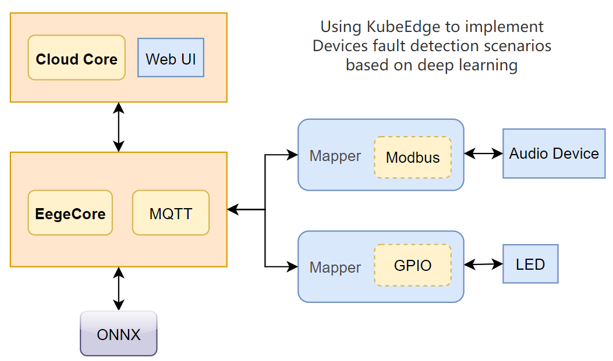
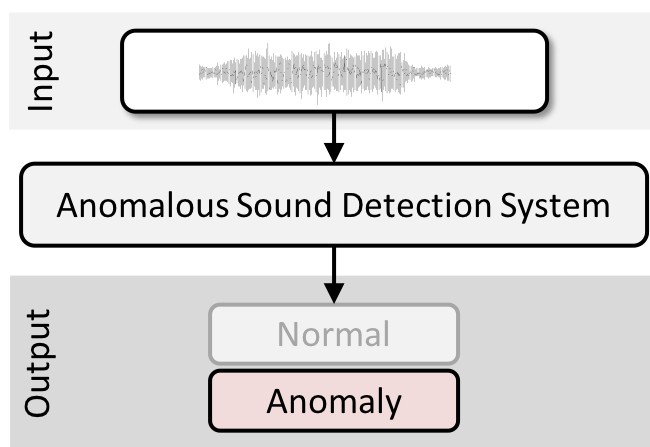
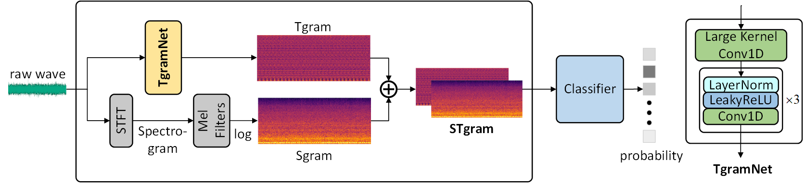
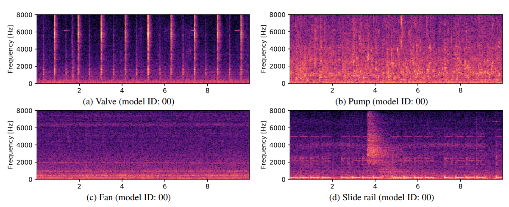

# Implementing equipment fault detection scenarios based on deep learning
## Application Scenario
For the production and manufacturing process, sound detection of cutting tools, stamping equipment, etc., the years of listening experience of veteran engineers can be transferred to the algorithm model, equipment operation failures can be discovered in time, and the efficiency of equipment inspection and maintenance can be improved. <br>
- When KubeEdge is used to deploy the fault detection model to the edge node, the resource consumption of the model application does not exceed 4 CPU cores and 8 GB of memory.
- Run the model application and collect sound signals by simulating modbus devices. The model can identify device faults, control the light bulb, and record videos.
- Connect terminal devices to the platform for management (optional)

## Design overview


The above figure is the design block diagram of this system. The cloud monitors the status of the entire system and sends the fault detection model application to the edge node. The edge runs the audio fault detection model based on PyTorch.
- By simulating the ModBus protocol, the data collected by the audio device is transmitted to the edge node.
- The edge node runs the ONNX model, reasoning and logical judgment.
- According to the logical judgment result, the LED light is controlled by simulating GPIO.
- The web UI runs on the cloud and displays the status of the detection equipment in real time.

## Prerequisites
Golang 1.20+ <br>
KubeEdge 1.15+ <br>

## 1 Modbus mapper
reference: https://release-1-17.docs.kubeedge.io/docs/developer/mappers <br>
KubeEdge uses Device Controller, Device Twin and Mapper to control the devices. The Device Controller is on the cloud side, it uses CRD to define and control devices. The Device Twin is on the edge side, it stores the value/status from the Mapper and transfers the messages with Device Controller and Mapper. Meanwhile, DMI in the Device Twin is used for registing mapper and transfer Device Instance and Device Model to user Mapper. <br>
1. Modbus mapper receives information about audio devices, no modification is required in actual applications. <br>
2. Use go program to simulate audio devices, push sound information to modbus client, and replace with actual microphone devices in actual applications. <br>
- modbus-microphone-device-instance.yaml
- modbus-microphone-device-model.yaml
- modbus-mapper-deployment.yaml
- simulation-microphone-deployment.yaml

```shell
# Create CRD
kubectl create -f modbus-microphone-device-instance.yaml
kubectl create -f modbus-microphone-device-model.yaml
# Deploy pods
kubectl apply -f modbus-mapper-deployment.yaml
kubectl apply -f simulation-microphone-deployment.yaml
```


## 2 Contral Pod
### Input and Output
reference: https://release-1-17.docs.kubeedge.io/docs/developer/message_topics <br>
1. "$hw/events/node/+/membership/get"
2. "$hw/events/device/+/state/update"
3. "$hw/events/device/+/twin/+"
4. "$hw/events/upload/#"
5. "SYS/dis/upload_records"
6. "$ke/events/+/device/data/update"
```shell
# Deploy the pod corresponding to the audio fault detection model
kubectl apply -f fault-detection-deployment.yaml
```

### Simple Equipment Fault Detection Model
Anomalous sound detection (ASD) is the task to identify whether the sound emitted from a target machine is normal or anomalous.. Automatically detecting mechanical failure is an essential technology in the fourth industrial revolution, including artificial intelligence (AI)-based factory automation. Prompt detection of machine anomaly by observing its sounds may be useful for machine condition monitoring.

The main challenge of this task is to detect unknown anomalous sounds under the condition that only normal sound samples have been provided as training data. In real-world factories, actual anomalous sounds rarely occur and are highly diverse. Therefore, exhaustive patterns of anomalous sounds are impossible to deliberately make and/or collect. This means we have to detect unknown anomalous sounds that were not observed in the given training data. This point is one of the major differences in premise between ASD for industrial equipment and the past supervised DCASE tasks for detecting defined anomalous sounds such as gunshots or a baby crying.



This task cannot be solved as a simple classification problem, even though the simplified task description shown in Fig. 1 seems to be a two-class classification problem. Please refer to the "Task setup and rules" section for the details of the task.

```shell
class SimpleFaultDetectionModelExample(torch.nn.Module):
    def __init__(self):
        super(SimpleFaultDetectionModelExample, self).__init__()
        self.conv1 = torch.nn.Conv1d(in_channels=1, out_channels=16, kernel_size=3, stride=1, padding=1)
        self.pool = torch.nn.MaxPool1d(kernel_size=2, stride=2, padding=0)
        self.fc1 = torch.nn.Linear(16 * 8000, 128)  # Assume the sampling rate is 16000 and process 1 second of audio data
        self.fc2 = nn.Linear(128, 1)

    def forward(self, x):
        x = self.pool(torch.nn.functional.relu(self.conv1(x)))
        x = x.view(-1, 16 * 8000)
        x = torch.nn.functional.relu(self.fc1(x))
        x = torch.sigmoid(self.fc2(x))  # Use sigmoid to output probability
        return x
```

### Anomalous Sound Detection Using Spectral-Temporal Information Fusion
link: https://github.com/liuyoude/STgram-MFN
<br><br>

<br><br>
This paper proposes a spectral-temporal fusion based self-supervised method to model the feature of the normal sound, which improves the stability and performance consistency in detection of anomalous sounds from individual machines, even of the same type. Experiments on the DCASE 2020 Challenge Task 2 dataset show that the proposed method achieved 81.39%, 83.48%, 98.22% and 98.83% in terms of the minimum AUC (worst-case detection performance amongst individuals) in four types of real machines (fan, pump, slider and valve), respectively, giving 31.79%, 17.78%, 10.42% and 21.13% improvement compared to the state-of-the-art method, i.e., Glow_Aff. Moreover, the proposed method has improved AUC (average performance of individuals) for all the types of machines in the dataset.

### MIMII dataset
In this paper, a new industrial machine sound dataset is proposed, named the Faulty Industrial Machine Investigation and Inspection Sound Dataset (MIMII dataset). The normal sounds of different types of industrial machines (i.e., valves, pumps, fans, and slides) are recorded, along with various abnormal sounds (e.g., contamination, leakage, rotational imbalance, and rail damage) to simulate real-world scenarios. The purpose of releasing the MIMII dataset is to assist the machine learning and signal processing communities in developing automated facility maintenance.



Factory machinery is prone to failure or breakdown, resulting in significant expenses for companies. Hence, there is a rising interest in machine monitoring using different sensors, including microphones. In the scientific community, the emergence of public datasets has led to advancements in the acoustic detection and classification of scenes and events, but there are no public datasets that focus on the sound of industrial machines under normal and anomalous operating conditions in real factory environments. This paper presents a new dataset of industrial machine sounds, referred to as the sound dataset for malfunctioning industrial machine investigation and inspection (MIMII dataset). Normal sounds were recorded for different types of industrial machines (i.e., valves, pumps, fans, and slide rails), and to resemble a real-life scenario, various anomalous sounds were recorded (e.g., contamination, leakage, rotating unbalance, and rail damage). The purpose of releasing the MIMII dataset is to assist the machine-learning and signal-processing community with their development of automated facility maintenance.

### Result on MIMII dataset
trained model weights file for loading can be get in https://zenodo.org/record/7194640#.Y0t1WXZBxD8

| Machine Type  | AUC(%) | pAUC(%) | mAUC(%) |
|---------------|--------|---------|---------|
| Fan           | 94.04  | 88.97   | 81.39   |
| Pump          | 91.94  | 81.75   | 83.48   |
| Slider        | 99.55  | 97.61   | 98.22   |
| Valve         | 99.64  | 98.44   | 98.83   |
| ToyCar        | 94.44  | 87.68   | 83.07   |
| ToyConveyor   | 74.57  | 63.60   | 64.16   |
| **Average**   | 92.36  | 86.34   | 84.86   |


## 3 LED mapper
reference: https://github.com/kubeedge/examples/tree/master/led-raspberrypi <br>
LED mapper has been implemented, just need to change the GPIO controlled LED device into a simulated LED go program. <br>
The master node can view the status of the LED, red represents a fault, green represents normal, and of course, the real-time data stream of the analog audio device can also be viewed. <br>

```shell
# Create CRD
kubectl create -f led-device-instance.yaml
kubectl create -f led-device-model.yaml
# Deploy pods
kubectl apply -f led-mapper-deployment.yaml
kubectl apply -f simulation-led-deployment.yaml
```

## 4 Web UI
reference: https://github.com/kubeedge/examples/tree/master/kubeedge-counter-demo <br>
The Web UI can display the operating status of all connected devices in real time, including normal operation and fault conditions. When a device detects an abnormality, the Web UI will update the status immediately and prompt the user to perform relevant operations.

## Road map
### Process building stage (July 1-July 30)
- Implement the deployment of LED Mapper
- Implement the deployment of Modbus Mapper
- Implement the deployment of simple logic judgment applications
- Implement the deployment of Web UI
### Core function stage (August 1-August 30)
- Implement the deployment of sound detection model
- Write the corresponding experimental description document
### Advanced function stage (September 1-September 30)
- Improve the accuracy of defect detection
- Try real machine deployment
