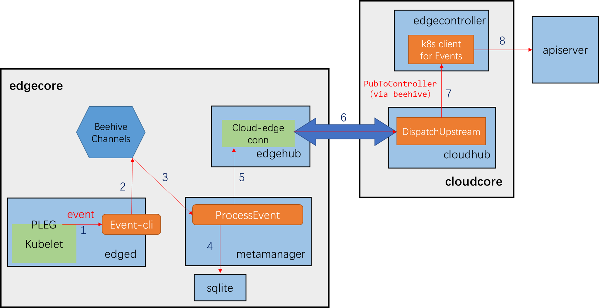

---
title: Support edge nodes report events
authors:
- "@llmmqq8023"
- "@pen9u1nlee"
approvers: 
    
creation-date: 2024-07-12
last-updated: 2024-07-17
status: implementable

---

## Introduction

Kubernetes (k8s) Event is a report of an event occured somewhere in the k8s cluster. It generally denotes some state change in the system. Some examples of k8s events are as follows: 
1. A pod is allocated to a specific node. 
2. A node failed to pull a specific image since image registry is not accessible. 
3. A Pod is evicted by a node because of insuffucient node resource.   
K8s events are generated by various components such as Kubelet, Scheduler, controllers and so on. 

These events are then reported to k8s ApiServer and consequently stored in etcd database. One can use commands like `kubectl get events` or `kubectl describe pod <pod_name>` to obtain events stored in etcd from client. 

<a href=https://kubernetes.io/docs/reference/kubernetes-api/cluster-resources/event-v1/>K8s events should be treated as informative, best-effort, supplemental data</a>. Thus, in cloud-edge cooperative computing architectures like KubeEdge (KE), edge nodes can normally run without reporting events that occur. Consequently, the observability of edge cluster is limited to logs of edge components. Due to the potential unstability of the cloud-edge connection (e.g. satellite environment), edge event reporting is showing more importance for cloud-edge cluster visibility. Therefore, the edge event reporting functionality will be implemented through this project to improve the effect of cloud-edge cluster maintainence. 

## Preliminaries

Native kubelet generates an eventClient equipped with the event REST API for transmission:

```go
// kubernetes/cmd/kubelet/app/server.go

func run(ctx context.Context, s *options.KubeletServer, kubeDeps *kubelet.Dependencies, featureGate featuregate.FeatureGate) (err error) {
	
	......

	// if in standalone mode, indicate as much by setting all clients to nil
	switch {
	case standaloneMode:
		kubeDeps.KubeClient = nil
		kubeDeps.EventClient = nil
		kubeDeps.HeartbeatClient = nil
		klog.InfoS("Standalone mode, no API client")

	case kubeDeps.KubeClient == nil, kubeDeps.EventClient == nil, kubeDeps.HeartbeatClient == nil:
		clientConfig, onHeartbeatFailure, err := buildKubeletClientConfig(ctx, s, kubeDeps.TracerProvider, nodeName)
		
		......

		// make a separate client for events
		eventClientConfig := *clientConfig
		eventClientConfig.QPS = float32(s.EventRecordQPS)
		eventClientConfig.Burst = int(s.EventBurst)
		kubeDeps.EventClient, err = v1core.NewForConfig(&eventClientConfig)
		if err != nil {
			return fmt.Errorf("failed to initialize kubelet event client: %w", err)
		}

		......

	}

	......

	if err := RunKubelet(s, kubeDeps, s.RunOnce); err != nil {
		return err
	}
	
	......

	return nil
}
```

However, a pruned Kubelet is wrapped in edgecore called Edged and the eventClient is pruned:

```go
// kubeedge/edge/pkg/edged/edged.go

// MakeKubeClientBridge make kubeclient bridge to replace kubeclient with metaclient
func MakeKubeClientBridge(kubeletDeps *kubelet.Dependencies) {
	client := kubebridge.NewSimpleClientset(metaclient.New())

	kubeletDeps.KubeClient = client
	kubeletDeps.EventClient = nil
	kubeletDeps.HeartbeatClient = client
}
```

and consequently edge events cannot be reported to the cloud:

```go
// kubeedge/vendor/k8s.io/kubernetes/cmd/kubelet/app/server.go

// makeEventRecorder sets up kubeDeps.Recorder if it's nil. It's a no-op otherwise.
func makeEventRecorder(kubeDeps *kubelet.Dependencies, nodeName types.NodeName) {
	if kubeDeps.Recorder != nil {
		return
	}
	eventBroadcaster := record.NewBroadcaster()
	kubeDeps.Recorder = eventBroadcaster.NewRecorder(legacyscheme.Scheme, v1.EventSource{Component: componentKubelet, Host: string(nodeName)})
	eventBroadcaster.StartStructuredLogging(3)
	if kubeDeps.EventClient != nil {
		klog.V(4).InfoS("Sending events to api server")
		eventBroadcaster.StartRecordingToSink(&v1core.EventSinkImpl{Interface: kubeDeps.EventClient.Events("")})
	} else {
		klog.InfoS("No api server defined - no events will be sent to API server")
	}
}
```

the startup log of edgecore also demonstrate this:

```
May 23 12:00:06 ******* edgecore[5232]: I0523 12:00:06.670534    5232 server.go:419] "No api server defined - no events will be sent to API server"
```
In this section, pod events reporting is selected as an example of demonstrating event reporting implementation. As a reference of the event reporting implementation, the pod patching scheme in kubeedge is briefly introduced as an example. 

A `PodsBridge`, which implements client-go PodInterface API, is built in edged to allow updating pod status to the cloud through metaclient - the client side of metamanager. 

```go
func (c *PodsBridge) Patch(ctx context.Context, name string, pt types.PatchType, data []byte, opts metav1.PatchOptions, subresources ...string) (result *corev1.Pod, err error) {
	klog.V(3).Infof("patching message: %v", string(data))
	return c.MetaClient.Pods(c.ns).Patch(name, data)
}
```

In metaclient, `Patch` request will be rewritten into beehive message and then sent to metaserver. 

```go
func (c *pods) Patch(name string, patchBytes []byte) (*corev1.Pod, error) {
	resource := fmt.Sprintf("%s/%s/%s", c.namespace, model.ResourceTypePodPatch, name)

	// FIXME: cleanup this code when the static pod mqtt broker no longer needs to be compatible
	if name == constants.DefaultMosquittoContainerName {
		return handleMqttMeta()
	}

	podMsg := message.BuildMsg(modules.MetaGroup, "", modules.EdgedModuleName, resource, model.PatchOperation, string(patchBytes))
	resp, err := c.send.SendSync(podMsg)
	if err != nil {
		return nil, fmt.Errorf("update pod failed, err: %v", err)
	}

	content, err := resp.GetContentData()
	if err != nil {
		return nil, fmt.Errorf("parse message to pod failed, err: %v", err)
	}

	return handlePodResp(resource, content)
}
```

Metaserver shall grab and process any beehive messages received. 

```go
func (m *metaManager) process(message model.Message) {
	operation := message.GetOperation()

	switch operation {
	case model.InsertOperation:
		m.processInsert(message)
	case model.UpdateOperation:
		m.processUpdate(message)
	case model.PatchOperation:
		m.processPatch(message)
	case model.DeleteOperation:
		m.processDelete(message)
	case model.QueryOperation:
		m.processQuery(message)
	case model.ResponseOperation:
		m.processResponse(message)
	case constants.CSIOperationTypeCreateVolume,
		constants.CSIOperationTypeDeleteVolume,
		constants.CSIOperationTypeControllerPublishVolume,
		constants.CSIOperationTypeControllerUnpublishVolume:
		m.processVolume(message)
	case constants.MigrationInfoOperationTypeUpdate:
		m.processPatchMigrationInfo(message)
	default:
		klog.Errorf("metamanager not supported operation: %v", operation)
	}
}
```

The `Patch` request will be relayed to the cloud through edgehub:

```go
func (m *metaManager) processPatch(message model.Message) {
	if err := m.handleMessage(&message); err != nil {
		feedbackError(err, message)
		return
	}
	sendToCloud(&message)
}
```

In cloudcore, cloudhub receives the `Patch` message from the edge, and the message will be published to edgecontroller through beehive in a callback function in viaduct. 

In edgecontroller, there are many channels for message dispatching, and there is a loop for dispatching messages into specific channels:

```go
// Start UpstreamController
func (uc *UpstreamController) Start() error {
	klog.Info("start upstream controller")

	go uc.dispatchMessage()
	......
	for i := 0; i < int(uc.config.Load.PatchPodWorkers); i++ {
		go uc.patchPod()
	}
	......
	return nil
}

func (uc *UpstreamController) dispatchMessage() {
	for {
		select {
		case <-beehiveContext.Done():
			klog.Info("stop dispatchMessage")
			return
		default:
		}
		msg, err := uc.messageLayer.Receive()
		if err != nil {
			klog.Warningf("receive message failed, %s", err)
			continue
		}
        ......

		switch resourceType {
		......
		case model.ResourceTypePodPatch:
			uc.patchPodChan <- msg
		......
		default:
			klog.Errorf("message: %s, resource type: %s unsupported", msg.GetID(), resourceType)
		}
	}
}
```

Finally, a real client-go patchpod API is called in the `patchPod` handler. 

## Methodology

The project plan is very similar to the `patchPod` procedure elaborated in Preliminaries. Below is the (expected) information flow chart of edge events, where PLEG is taken as an example. 



Items marked red are the information flow of events. Items marked orange are components to be edited. The specific procedures are:
1. Pod Lifecycle Event Generator (PLEG), which is deployed in Kubelet, generates an event, and then the EventBridge API implemented in metaclient is called to report this event to the cloud. 
2. Metaclient wraps this event into beehive message and puts it into the specific beehive channel. 
3. Metamanager grabs the event message and give it to processEvent handler. 
4. The event is stored in the edge (optional). 
5. ProcessEvent handler in metamanager sends this message to the cloud via edgehub. 
6. The message is transmitted through cloud-edge connection (via websocket/quic). A handler in cloudhub receives the event message. 
7. The message is put into the specific beehive channel, waiting for edgecontroller (through func `PubToController`). Edgecontroller grabs the message and put it into eventschan. 
8. A handler picks the message and send it to Kube-apiserver through client-go API.

Besides, considering users' adaptability to new functions and resource saving when network conditions are limited, it's necessary to add a switch for event reporting. Users can select whether to report events by changing the config field `reportEvent` in the edgecore configuration to `true` or `false`.