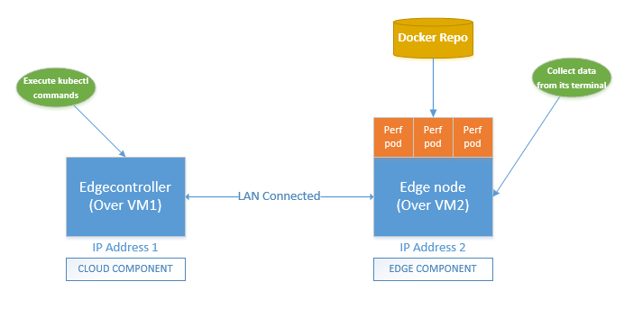

# Measuring memory footprint of EdgeCore

## Why measuring memory footprint

- This platform is also tagged for a light weighted edge computing deployment
- To be able to be deployed over devices with less resources (for example, 256MB RAM)
- It is required to know by deploying as many as possible pods, it showcases as much as less possible memory footprint

## KPI's measured

- %CPU
- %Memory
- Resident Set Size (RSS)

## How to test

After deployment and provisioning of KubeEdge cloud and edge components in 2 VM's (supported and tested over Ubuntu 16.04) respectively, start deploying pods from 0 to 100 in steps of 5. Keep capturing above KPI's using standard linux `ps` commands, after each step.

### Test setup

  

*Fig 1: KubeEdge Test Setup*

### Creating a setup

#### Requirements

- Host machine's or VM's resource requirements can mirror the edge device of your choice
- Resources used for above setup are 4 CPU, 8GB RAM and 200 GB Disk space. OS is Ubuntu 16.04.
- Docker image used to deploy the pods in edge, needs to be created. The steps are:
    1. Go to github.com/kubeedge/kubeedge/edge/hack/memfootprint-test/
    2. Using the Dockerfile available here and create docker image (`perftestimg:v1`).
    3. Execute the docker command `sudo docker build --tag "perftestimg:v1" .`, to get the image.

#### Installation

* For KubeEdge Cloud and Edge:

    Please follow steps mentioned in KubeEdge README.md

* For docker image:

- Deploy docker registry to either edge on any VM or host which is reachable to edge. Follow the steps mentioned here: https://docs.docker.com/registry/deploying/
- Create `perftestimg:v1` docker image on the above mentioned host
- Then push this image to docker registry using `docker tag` and `docker push` commands (Refer: Same docker registry url mentioned above)
  [Use this image's metadata in pod deployment yaml]

### Steps

1. Check edge node is connected to cloud. In cloud console/terminal, execute the below command

```
root@ubuntu:~/edge/pod_yamls# kubectl get nodes
NAME                                   STATUS     ROLES    AGE     VERSION
192.168.20.31                          Unknown    <none>   11s
ubuntu                                 NotReady   master   5m22s   v1.14.0
```

2. On cloud, modify deployment yaml (github.com/kubeedge/kubeedge/edge/hack/memfootprint-test/perftestimg.yaml), set the image name and set spec.replica as 5
3. Execute `sudo kubectl create -f ./perftestimg.yaml` to deploy the first of 5 pods in edge node
4. Execute `sudo kubectl get pods | grep Running | wc` to check if all the pods come to Running state. Once all pods come to running state, go to edge VM
5. On Edge console, execute `ps -aux | grep edge_core`. The output shall be something like:

```
USER        PID %CPU %MEM    VSZ   RSS TTY      STAT START   TIME COMMAND
root     102452  1.0  0.5 871704 42784 pts/0    Sl+  17:56   0:00 ./edge_core
root     102779  0.0  0.0  14224   936 pts/2    S+   17:56   0:00 grep --color=auto edge
```

6. Collect %CPU, %MEM and RSS from respective columns and record
7. Repeat step 2 and this time increase the replica by 5
8. This time execute `sudo kubectl apply -f <PATH>/perftestimg.yaml`
9. Repeat steps from **4 to 6**.
10. Now **repeat steps from 7 to 9**, till the replica count reaches 100