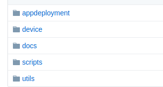
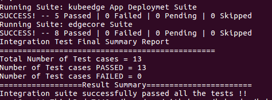

# Integration test Framework features and it's use cases

- [Background](#Background)
    - [Integration test framework features](#Integration-test-framework-features)
    - [Folder Structure](#Folder-structure-of-Integration-tests)    
    - [Sample Testcase](#Sample-Testcase)
    - [Configurations](#Configurations)
    - [Run Tests](#Run-Tests)
    - [Test Logs](#Integration-test-logs)
    - [Test Report](#Test-Report)
    - [References](#References)

## Background
Kubeedge integration tests are designed based on the **Gomega** and **Ginkgo** framework.
Framework provides an environment for the automation test scripts to be executed. With the use of framework, users can efficiently work with the automation test scripts, including development, execution, logging and reporting.

## Integration test framework features
 - A comprehensive test runner
 - Built-in support for testing asynchronicity
 - Modular and easy to customize.
 - Easy Integration of test features, priorities, test cases.
 - Logging and Reporting.
 - Scalable to add more features.

## Folder structure of Integration tests



   - **appdeployment:** appdeployment folder consists of tests related to application deployment on kubeedge node.
   - **device:** device folder consists of tests related to Device which are binded on kubeedge node.
   - **docs:** docs related to integration tests
   - **scripts:** scripts folder consists of compile, run, and CI scripts to run local env or travis-CI env
   - **utils:** utils will have all the common functions declared in it which will be used by other test modules.

## Sample Testcase

```bash
It("TC_TEST_EBUS_7: change the device status to unknown from eventbus", func() {
    var message DeviceUpdate
    message.State = "unknown"
    body, err := json.Marshal(message)
    if err != nil {
    	common.Failf("Marshal failed %v", err)
    }
    if Token_client = Client.Publish(dtcommon.DeviceETPrefix+DeviceID+dtcommon.DeviceETStateUpdateSuffix, 0, false, body); Token_client.Wait() && Token_client.Error() != nil {
   	common.Failf("client.Publish() Error is %s", Token_client.Error())
    }else {
    	common.InfoV6("client.Publish Success !!")
    }
    Expect(Token_client.Error()).NotTo(HaveOccurred())
    Eventually(func() string {
    deviceState := GetDeviceStateFromDB(DeviceID)
    common.InfoV2("DeviceID= %s, DeviceState= %s", DeviceID, deviceState)
    return deviceState
    }, "60s", "2s").Should(Equal("unknown"), "Device state is not unknown within specified time")
    Client.Disconnect(1)
})		
```
## Configurations
##### Modify the test configurations accordingly in the below mentioned file
```bash
PATH: $GOPATH/src/github.com/kubeedge/kubeedge/test/integration/scripts/fast_test
cat >config.json<<END
{
        "mqttEndpoint":"tcp://$MQTT_SERVER:1884",
        "testManager": "http://127.0.0.1:12345",
        "edgedEndpoint": "http://127.0.0.1:10255",
        "image_url": ["nginx:latest", "redis:latest"]
}

mqttEndpoint : Specify mqttEndpoint accordingly to Run the integration tests on internal or External MQTT server.
testManager: testManager will listen and serve the request on http://127.0.0.1:12345
edgedEndpoint: edgedEndpoint will listen and serve the request on http://127.0.0.1:10255  
image_url: Specify the docker Image Name/Image URL's for application deployments on edge node.
```
## Run Tests
##### Choice of running integration test suite

* Integration test scripts are written in a way that user can run all test suites together or run individual test suites or only failed test case.

**Run all test suites:**
```shell 
    cd $GOPATH/src/github.com/kubeedge/kubeedge
    
    1. bash -x test/integration/scripts/compile.sh
    2. bash test/integration/scripts/fast_test
    
    Above 2 commands will ensure you run all the tests.
```

**Run Individual Test Suite:**
```shell 
    cd $GOPATH/src/github.com/kubeedge/kubeedge
    
    Ex:
    1. bash -x test/integration/scripts/compile.sh <device>
    2. bash test/integration/scripts/fast_test <device>    
    #or     
    1. bash -x test/integration/scripts/compile.sh <appdeployment>
    2. bash test/integration/scripts/fast_test <appdeployment>           
```

**Run Failed Test:**
```shell 
    cd $GOPATH/src/github.com/kubeedge/kubeedge
    
    Ex:   
    bash test/integration/scripts/fast_test <device> -ginkgo.focus="Failed test case ID/Name"   
```
## Test Logs
##### Integration test logs

* Path : tmp/testcase.log

## Test Report


## References
* See [Ginkgo](https://github.com/onsi/ginkgo) and [Gomega](https://github.com/onsi/gomega) for detailed info on framework usage.