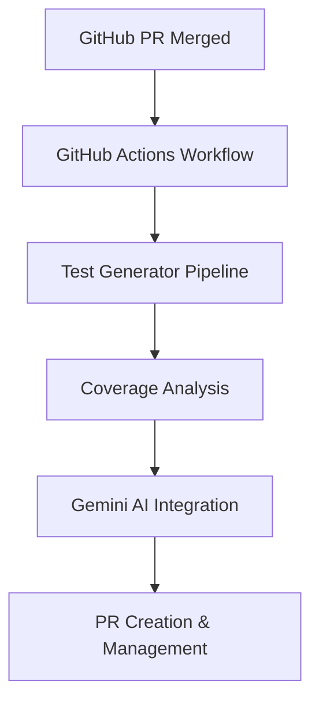
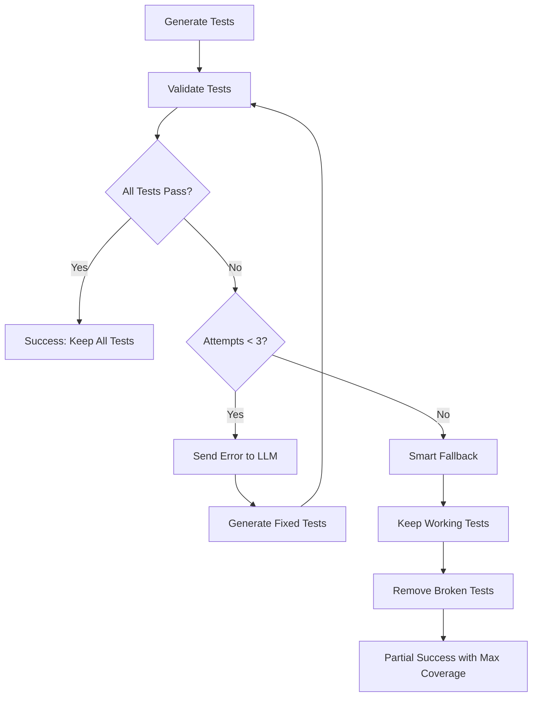

# KubeEdge Auto Test Generator

A comprehensive AI-powered system for automatically generating  unit tests for the KubeEdge edge computing platform.

## 📋 Table of Contents

- [Project Overview](#project-overview)
- [System Architecture](#system-architecture)
- [Core Components](#core-components)
- [Features](#features)
- [Workflow Integration](#workflow-integration)
- [Configuration](#configuration)
- [Development Setup](#development-setup)
- [Usage](#usage)
- [Future Enhancements](#future-enhancements)

## 🎯 Project Overview

The KubeEdge Auto Test Generator is an intelligent GitHub workflow that automatically generates comprehensive unit tests for Go files in the KubeEdge repository. It leverages AI (Gemini 1.5 Flash) to analyze code patterns and create high-quality test files following KubeEdge's specific testing conventions.

### Project Goals

- **Automated Test Generation**: Reduce manual effort in writing unit tests
- **Coverage Improvement**: Target files with low test coverage (<40%)
- **KubeEdge Standards**: Follow project-specific testing patterns and frameworks
- **CI/CD Integration**: Seamless integration with KubeEdge's development workflow
- **Quality Assurance**: Generate compilable, comprehensive test code

## 🏗️ System Architecture

### High-Level Architecture



### Component Architecture

```
scripts/test-generator/
├── main.go                    # Main orchestrator
├── coverage-analyzer.go       # Coverage analysis engine
├── test-generator.go          # AI-powered test generation
├── test-validator.go          # Test validation and compilation
├── pr-creator.go             # GitHub PR automation
├── template-loader.go        # Test template management
├── utils.go                  # Utility functions
├── config/
│   └── kubeedge-patterns.json # Component-specific patterns
├── templates/
│   ├── standard-template.txt  # Standard Go test template
│   ├── gomonkey-template.txt  # GoMonkey mocking template
│   └── ginkgo-template.txt    # Ginkgo BDD template
└── .github/workflows/
    └── auto-test-generator.yml # GitHub Actions workflow
```

## 🔧 Core Components

### 1. Coverage Analyzer (`coverage-analyzer.go`)

**Purpose**: Analyzes code coverage and identifies files needing tests

**Key Features**:
- Coverage parsing with multiple format support
- Configurable coverage thresholds (default: 40%)
- AST-based function extraction and complexity analysis
- Smart function filtering (excludes main, init, test functions)

**Testing Commands**:
```bash
# Test coverage analysis
go test -coverprofile=coverage.out ./...
go tool cover -func=coverage.out

# Analyze specific package
go test -coverprofile=coverage.out ./cloud/pkg/common/monitor/
```

**Capabilities**:
- ✅ KubeEdge-specific coverage analysis
- ✅ AST-based function extraction
- ✅ Complexity assessment
- ✅ Existing test detection

### 2. Test Generator (`test-generator.go`)

**Purpose**: AI-powered test code generation using Gemini 1.5 Flash

**Key Features**:
- Gemini 1.5 Flash integration with optimized parameters
- Component-aware test generation (cloud/edge/keadm/pkg)
- Multiple test types: Standard Go tests, GoMonkey mocking, Ginkgo BDD
- Smart prompting with error recovery

**AI Configuration**:
- Temperature: 0.3 (consistent code generation)
- TopK: 40, TopP: 0.95
- Timeout: 2 minutes per generation

**Component-Specific Generation**:
- **Cloud Components**: Kubernetes client mocking, controller testing
- **Edge Components**: Beego ORM integration, edge-specific patterns
- **Keadm Components**: CLI testing, command execution mocking
- **Pkg Components**: Utility function testing with appropriate mocking

### 3. Test Validator (`test-validator.go`)

**Purpose**: Validates generated tests for compilation and coverage improvement

**Key Features**:
- Compilation verification with `go test -c`
- Coverage measurement using `go test -coverprofile`
- Baseline vs. improved coverage comparison
- Test execution validation

**Testing Commands**:
```bash
# Validate test compilation
go test -c ./path/to/package

# Run tests with coverage
go test -coverprofile=coverage.out ./path/to/package

# Check coverage improvement
go tool cover -func=coverage.out | grep total
```

### 4. PR Creator (`pr-creator.go`)

**Purpose**: GitHub automation for test PR creation and management

**Key Features**:
- Automated PR creation with rich metadata
- Smart branch naming with timestamps
- Comprehensive PR descriptions with review checklists
- GitHub API integration with rate limit handling

**PR Content Structure**:
```markdown
## 🤖 Auto-Generated Unit Tests
- Coverage Information (before/after percentages)
- Generated Test Features
- Testing Framework Details
- Review Checklist
- Next Steps
```

### 5. Template Loader (`template-loader.go`)

**Purpose**: Test template management and rendering

**Template Types**:
- **Standard Go Testing**: Table-driven tests with testify assertions
- **GoMonkey Mocking**: GoMonkey v2 patterns for external function mocking
- **Ginkgo BDD**: Behavior-driven development for integration tests

**Embedded Templates**: Fallback hardcoded templates ensure reliability

## ✨ Features

### Current Features

#### 1. AI Integration
- **Gemini 1.5 Flash**: Advanced code generation with 2400+ character capacity
- **Intelligent Prompting**: Context-aware prompts with KubeEdge specifics
- **Error Recovery**: Retry mechanisms with failure context
- **Quality Optimization**: Temperature and parameter tuning

#### 2. Coverage Detection
- **Threshold-Based Analysis**: Configurable coverage thresholds (40-50%)
- **Multiple Coverage Sources**: `coverage.out` parsing and live analysis
- **Smart Function Detection**: AST-based function extraction
- **Existing Test Awareness**: Identifies already tested functions

#### 3. KubeEdge Integration
- **Component Awareness**: Different patterns for cloud/edge/keadm/pkg
- **Framework Compliance**: gomonkey v2, testify, Ginkgo support
- **Dependency Management**: Uses root KubeEdge module dependencies
- **Testing Standards**: Follows established KubeEdge conventions

#### 4. GitHub Automation
- **PR Management**: Creates PRs for generated tests
- **Rich Metadata**: Comprehensive PR descriptions with checklists
- **Label Automation**: Auto-applies relevant labels and reviewers
- **Rate Limit Handling**: GitHub API rate limit monitoring

#### 5. Reliability Features
- **Retry Logic**: Configurable retry attempts (default: 3)
- **Comprehensive Logging**: Detailed execution tracking
- **Artifact Management**: Log uploads and coverage reports
- **Graceful Degradation**: Continues processing despite individual failures

## 🔄 Workflow Integration

### GitHub Actions Trigger

The system integrates with GitHub Actions through `.github/workflows/auto-test-generator.yml`:

**Trigger Conditions**:
```yaml
on:
  pull_request_target:
    types: [closed]
    paths-ignore:
      - "**.md"
      - "docs/**"
      - "**/OWNERS"
      - "**/MAINTAINERS"
      - "vendor/**"
      - "hack/**"
      - "**/*_test.go"
```

**Conditional Execution**:
- ✅ Only merged PRs (`github.event.pull_request.merged == true`)
- ✅ Specific repository filter
- ✅ Go files only (excludes `_test.go` files)

**Process Flow**:
1. Developer merges PR with Go code changes
2. GitHub Actions workflow triggers automatically
3. Test Generator Pipeline analyzes changed files
4. Coverage Analysis identifies low-coverage files
5. Gemini AI generates comprehensive unit tests
6. PR Creation creates automated test PRs

## ⚙️ Configuration

### Environment Variables

```bash
# Required
GEMINI_API_KEY=your_gemini_api_key_here
GITHUB_TOKEN=your_github_token_here

# Optional
COVERAGE_THRESHOLD=40.0
MAX_RETRIES=3
```

### Configuration Structure

**Command Line Options**:
- `coverage-threshold`: Coverage threshold percentage (default: 40.0)
- `max-retries`: Maximum retry attempts (default: 3)
- `gemini-api-key`: Gemini API key for test generation
- `changed-files`: Comma-separated list of files to process
- `working-dir`: Working directory (default: current)
- `debug`: Enable debug logging
- `create-pr`: Create GitHub PR with generated tests
- `github-token`: GitHub token for PR creation
- `repo-owner`: GitHub repository owner
- `repo-name`: GitHub repository name

### KubeEdge Patterns Configuration

```json
{
  "components": {
    "keadm": {
      "patterns": ["exec.Command", "os.Stat", "os.ReadFile", "os.WriteFile"],
      "imports": ["os", "os/exec", "github.com/agiledragon/gomonkey/v2"]
    },
    "cloud": {
      "patterns": ["client.Get", "client.Create", "kubernetes.NewForConfig"],
      "imports": ["context", "k8s.io/client-go/kubernetes", "github.com/agiledragon/gomonkey/v2"]
    },
    "edge": {
      "patterns": ["orm.RegisterDriver", "orm.NewOrmUsingDB"],
      "imports": ["context", "github.com/beego/beego/v2/client/orm", "github.com/agiledragon/gomonkey/v2"]
    }
  },
  "testing": {
    "frameworks": ["standard", "gomonkey", "ginkgo"],
    "default_framework": "gomonkey",
    "coverage_threshold": 40.0
  }
}
```

## 🛠️ Development Setup

### Prerequisites

- Go 1.23+
- Git
- GitHub CLI (optional)
- Gemini API access

### Local Development Setup

```bash
# Clone repository
git clone https://github.com/kubeedge/kubeedge.git
cd kubeedge/scripts/test-generator

# Set up environment
cp .env.example .env
# Add your GEMINI_API_KEY and GITHUB_TOKEN

# Install dependencies
go mod tidy

# Validate setup
go run . -help
```

### Testing & Validation

```bash
# Run unit tests for the generator
go test ./scripts/test-generator/...

# Validate with sample files
go run . -changed-files="pkg/sample/test.go" -debug=true

# Test specific KubeEdge components
go run . -changed-files="cloud/pkg/common/monitor/monitor.go" -coverage-threshold=30.0

# Test with multiple files
go run . -changed-files="cloud/pkg/monitor/monitor.go,edge/pkg/edged/edged.go" -debug=true

# Validate generated tests compile
cd path/to/generated/tests && go test -c

# Check coverage improvement
go test -coverprofile=before.out ./target/package/
# Generate tests...
go test -coverprofile=after.out ./target/package/
go tool cover -func=before.out | grep total
go tool cover -func=after.out | grep total

# Test GitHub integration (requires tokens)
go run . -create-pr -github-token="$GITHUB_TOKEN" -repo-owner="kubeedge" -repo-name="kubeedge"

# Debug mode with verbose logging
go run . -debug=true -changed-files="your-file.go" 2>&1 | tee debug.log
```

## 📖 Usage

### Command Line Interface

```bash
# Basic usage
go run . -changed-files="file1.go,file2.go" -gemini-api-key="your-key"

# With all options
go run . \
  -changed-files="cloud/pkg/monitor/monitor.go" \
  -coverage-threshold=40.0 \
  -max-retries=3 \
  -gemini-api-key="your-api-key" \
  -debug=true \
  -create-pr \
  -github-token="your-github-token" \
  -repo-owner="kubeedge" \
  -repo-name="kubeedge"
```

### GitHub Actions Integration

The system automatically runs when:
1. A PR with Go file changes is merged
2. Files are in target directories (`cloud/`, `edge/`, `keadm/`, `pkg/`)
3. Coverage is below the threshold (40%)

### Manual Workflow Trigger

```bash
# Trigger for specific files
gh workflow run auto-test-generator.yml \
  -f changed_files="cloud/pkg/common/monitor/monitor.go" \
  -f coverage_threshold="40.0"
```

## 🚀 Future Enhancements

### Phase 0: Intelligent Feedback Loop (Priority Implementation)

#### Current Problem

The KubeEdge Auto Test Generator currently works on an **all-or-nothing basis**:

```
Generate Tests → Validate → Success (keep all) OR Failure (discard all)
```

**Real Example from Recent Test**:
- File: `pkg/math/math.go`
- ✅ **Compilation**: SUCCESS  
- ✅ **Coverage**: 98.3% (excellent!)
- ❌ **One Test Failed**: `TestCalculateStatistics` had wrong expected value (expected 1, got 5)
- **Current Result**: Complete failure - all tests discarded, 0% coverage retained

**Problem**: We're throwing away 98.3% coverage because of one fixable test logic error.

#### Proposed Solution: Intelligent Feedback Loop

Instead of giving up after first failure, create a feedback loop with iterative improvement:



#### Implementation Strategy

**Step 1: Enhanced Validation with Detailed Error Reporting**
- Track individual test results and error types
- Classify errors as Logic, Compilation, or Runtime issues
- Generate fix hints for common problems

**Step 2: Feedback Loop Implementation**
- Implement retry mechanism (max 3 attempts)
- Send detailed error feedback to LLM
- Update test files with corrected versions

**Step 3: Smart Fallback - Partial Success Extraction**
- Parse test files to identify working vs broken tests
- Create cleaned test files with only working tests
- Preserve maximum possible coverage

**Testing Commands**:
```bash
# Test the feedback loop locally
go run . -changed-files="pkg/math/math.go" -max-retries=3 -debug=true

# Validate smart fallback
go test -v ./pkg/math/ 2>&1 | grep FAIL

# Check coverage preservation
go test -coverprofile=coverage.out ./pkg/math/
go tool cover -func=coverage.out
```

#### Example Scenarios

**Scenario 1: Logic Error (Quick Fix)**
```
Attempt 1: 98.3% coverage, 1 test fails with "expected 1, got 5"
Attempt 2: LLM fixes test logic → 98.3% coverage, all pass ✅
Result: Complete success in 2 attempts
```

**Scenario 2: Multiple Issues (Iterative Improvement)**
```
Attempt 1: 80% coverage, 3 tests fail
Attempt 2: 85% coverage, 2 tests fail  
Attempt 3: 90% coverage, 1 test fails
Final: Remove 1 failing test, keep 90% coverage ✅
```

**Scenario 3: Unfixable Issues (Maximum Value Extraction)**
```
All 3 attempts fail with compilation errors
Smart Fallback: Keep 95% of working tests
Result: 75% coverage instead of 0% ✅
```

#### LLM Feedback Prompt Enhancement

The system sends detailed feedback to the LLM including:
- Current test file content
- Specific validation errors
- Compilation issues and line numbers
- Expected vs actual results for failed assertions
- Requirements for fixing only the failing tests while preserving working ones

#### Expected Improvements

**Coverage Retention Rate**:
- Current: ~30% (all-or-nothing)
- With Feedback Loop: ~85% (estimated)
- With Smart Fallback: ~95% (maximum possible)

**Success Rate Improvement**:
- Current: 60% complete success
- Target: 90% complete or partial success

**Quality Metrics**:
- Reduced manual intervention by ~70%
- Improved test maintainability
- Better error reporting for developers

### Phase 1: Multi-LLM Support & E2E Integration

#### 1. Free LLM Models Integration
- **DeepSeek Integration**: Primary free alternative to Gemini
- **Ollama Support**: Local LLM deployment for privacy-sensitive environments
- **Hugging Face Transformers**: Access to open-source code generation models
- **Model Fallback Chain**: Automatic failover between available free models

#### 2. E2E Test Generation
- **Ginkgo BDD Framework**: Generate comprehensive e2e tests
- **Component Integration Tests**: Test interactions between cloud and edge
- **API Endpoint Testing**: Generate tests for KubeEdge API endpoints
- **Scenario-Based Testing**: Create realistic edge computing test scenarios

### Phase 2: Quality & Validation Improvements

#### 1. Test Quality Metrics
- **Coverage-Guided Generation**: Target specific uncovered lines
- **Test Effectiveness Scoring**: Measure bug-catching capability
- **Automated Test Execution**: Run tests before PR creation

#### 2. Smart Learning System
- **Pattern Recognition**: Learn from successful merged test PRs
- **Feedback Integration**: Improve based on PR review comments
- **Component-Specific Learning**: Adapt patterns for different components

### Phase 3: Developer Experience Enhancement

#### 1. Review Process Optimization
- **Test Quality Scoring**: Provide quality metrics in PR descriptions
- **Diff Highlighting**: Show exactly which lines/functions are tested
- **Review Guidelines**: Generate specific review checklists

#### 2. Integration Improvements
- **Batch Processing**: Handle multiple files efficiently
- **Smart PR Grouping**: Group related test files logically
- **Conflict Resolution**: Handle merge conflicts in generated tests


## Conclusion

The KubeEdge Auto Test Generator represents a significant advancement in automated software testing for edge computing platforms. By combining AI-powered code generation with deep integration into the KubeEdge development workflow.