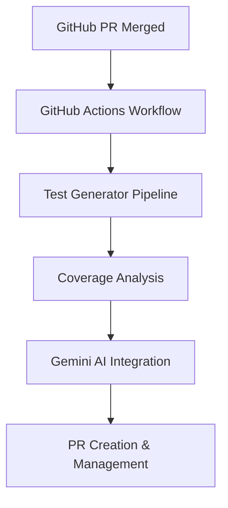

# KubeEdge Auto Test Generator

An AI-powered system for automatically generating unit tests for the KubeEdge edge computing platform, using Google Gemini 1.5 Flash to improve code coverage and reduce manual testing effort.

## 📋 Table of Contents

- [Project Overview](#project-overview)
- [System Architecture](#system-architecture)
- [Core Components](#core-components)
- [Features](#features)
- [Workflow Integration](#workflow-integration)
- [Configuration](#configuration)
- [Development Setup](#development-setup)
- [Usage](#usage)
- [Future Enhancements](#future-enhancements)

## 🎯 Project Overview

The KubeEdge Auto Test Generator automatically creates unit tests for Go files with low test coverage in the KubeEdge repository. It triggers on merged PRs, analyzes coverage, and uses Google Gemini AI to generate comprehensive test files.

### Project Goals

- **Automated Test Generation**: Generate unit tests for files with coverage < 40%
- **Coverage Improvement**: Increase test coverage across KubeEdge components
- **CI/CD Integration**: Seamless GitHub Actions workflow integration
- **Quality Assurance**: Generate compilable, validated test code
- **Smart Cleanup**: Automatically remove failing tests, keep passing ones

## 🏗️ System Architecture

### High-Level Architecture



### Component Architecture

```
scripts/test-generator/
├── main.go                    # Main orchestrator and CLI
├── test-generator.go          # Gemini AI test generation
├── test-validator.go          # Coverage analysis and validation
├── pr-creator.go             # GitHub PR automation
├── utils.go                  # Utility functions
├── docs/                     # Documentation
│   └── LLM-based Auto Generation of Unit and E2E Tests.md
├── logs/                     # Generated during execution
├── results/                  # Generated during execution
└── ../../.github/workflows/
    └── auto-test-generator.yml # GitHub Actions workflow
```

## 🔧 Core Components

### 1. Main Orchestrator (`main.go`)

**Purpose**: CLI interface and workflow orchestration

**Key Features**:
- Command-line argument parsing with comprehensive flags
- File processing pipeline coordination  
- Coverage threshold filtering (default: 40%)
- PR creation workflow management
- Debug logging and workflow output generation

**Command Line Options**:
```bash
--coverage-threshold=40.0    # Coverage threshold percentage
--max-retries=3             # Maximum retry attempts
--gemini-api-key=""         # Gemini API key
--changed-files=""          # Comma-separated list of files
--working-dir="."           # Working directory
--debug=false               # Enable debug logging
--create-pr=false           # Create GitHub PR
--github-token=""           # GitHub token for PR creation
--repo-owner=""             # GitHub repository owner
--repo-name=""              # GitHub repository name
```

### 2. Test Generator (`test-generator.go`)

**Purpose**: Google Gemini AI integration for test code generation

**Key Features**:
- Gemini 1.5 Flash API integration
- Whole-file analysis approach (simplified from function-level)
- Intelligent test framework selection (Standard Go testing, GoMonkey mocking)
- Retry logic with improved prompting on failures
- Context-aware generation for KubeEdge components

**Generation Process**:
1. Read entire source file content
2. Send to Gemini with KubeEdge-specific prompts
3. Generate comprehensive test file
4. Handle API errors and retries
5. Return generated test content

### 3. Test Validator (`test-validator.go`)

**Purpose**: Coverage analysis, compilation validation, and test execution

**Key Features**:
- Git-based modified file detection
- Coverage calculation using `go test -coverprofile`
- Test compilation verification
- Before/after coverage comparison
- Smart cleanup of failing tests

**Validation Process**:
```bash
# Coverage analysis
go test -coverprofile=coverage.out ./package
go tool cover -func=coverage.out

# Compilation check  
go test -c ./package

# Test execution
go test ./package
```

### 4. PR Creator (`pr-creator.go`)

**Purpose**: GitHub PR automation and management

**Key Features**:
- GitHub API integration for PR creation
- Smart branch naming with timestamps
- Rich PR descriptions with coverage tables
- Commit management for generated test files
- Integration with GitHub CLI (`gh` commands)

**PR Creation Process**:
1. Create new branch with timestamp
2. Add generated test files to git
3. Create detailed commit message
4. Push branch to remote
5. Create PR with comprehensive description

## ✨ Features

### Current Features

#### 1. AI Integration
- **Google Gemini 1.5 Flash**: High-quality code generation for Go test files
- **Simplified Approach**: Whole-file analysis instead of function-by-function
- **Smart Test Framework Selection**: Automatically chooses between standard Go testing and GoMonkey mocking
- **Context-Aware Generation**: KubeEdge-specific patterns and conventions
- **Retry Logic**: Up to 3 attempts with improved prompting on failures

#### 2. Coverage Analysis
- **Threshold-Based Filtering**: Configurable coverage threshold (default: 40%)
- **Git Integration**: Automatic detection of modified files from git diff
- **Live Coverage Calculation**: Real-time coverage analysis using `go test -coverprofile`
- **Target Directory Filtering**: Focuses on core KubeEdge components (`cloud/`, `edge/`, `keadm/`, `pkg/`)

#### 3. Test Validation
- **Compilation Verification**: Ensures generated tests compile successfully
- **Execution Validation**: Runs tests to verify they pass
- **Coverage Improvement**: Measures before/after coverage gains
- **Smart Cleanup**: Automatically removes failing tests, keeps passing ones
- **Code Formatting**: Uses `goimports` for proper import management

#### 4. GitHub Workflow Integration
- **Automated Triggers**: Runs on merged PRs with Go file changes
- **PR Creation**: Creates detailed PRs with generated tests
- **Rich Descriptions**: Coverage tables, generation details, review checklists
- **Branch Management**: Smart branch naming with timestamps
- **Artifact Upload**: Logs and results preserved for debugging

#### 5. Developer Experience
- **CLI Interface**: Comprehensive command-line tool for local testing
- **Debug Mode**: Verbose logging for troubleshooting
- **Flexible Configuration**: Environment variables and command-line flags
- **Manual Override**: Specify exact files to process
- **No-PR Mode**: Generate tests locally without creating PRs

## 🔄 Workflow Integration

### GitHub Actions Trigger

The system integrates with GitHub Actions through `.github/workflows/auto-test-generator.yml`:

**Trigger Conditions**:
```yaml
on:
  pull_request_target:
    types: [closed]
    paths-ignore:
      - "**.md"
      - "docs/**"
      - "**/OWNERS"
      - "**/MAINTAINERS"
      - "vendor/**"
      - "hack/**"
      - "**/*_test.go"
```

**Conditional Execution**:
- ✅ Only merged PRs (`github.event.pull_request.merged == true`)
- ✅ Specific repository filter
- ✅ Go files only (excludes `_test.go` files)

**Process Flow**:
1. Developer merges PR with Go code changes in target directories
2. GitHub Actions workflow triggers automatically  
3. Changed files are filtered (only core KubeEdge components)
4. Coverage analysis identifies files with coverage < 40%
5. Gemini AI generates unit tests for each low-coverage file
6. Tests are validated (compilation + execution + coverage improvement)
7. Successful tests are committed and PR is created automatically

## ⚙️ Configuration

### Environment Variables

```bash
# Required
GEMINI_API_KEY=your_gemini_api_key_here
GITHUB_TOKEN=your_github_token_here

# Optional
COVERAGE_THRESHOLD=40.0
MAX_RETRIES=3
```

### Workflow Configuration

**GitHub Actions Environment Variables**:
- `COVERAGE_THRESHOLD`: 40.0 (configurable in workflow)
- `MAX_RETRIES`: 3 (configurable in workflow)

**GitHub Secrets Required**:
- `GEMINI_API_KEY`: Google Gemini API key for test generation
- `GITHUB_TOKEN`: Automatically provided by GitHub Actions

**Target Directories**: 
- `cloud/` - Cloud-side KubeEdge components
- `edge/` - Edge-side KubeEdge components  
- `keadm/` - KubeEdge administration tools
- `pkg/` - Shared packages and utilities

## 🛠️ Development Setup

### Prerequisites

- Go 1.22+ (as specified in GitHub Actions)
- Git
- Google Gemini API access
- GitHub CLI (for PR creation)

### Local Development Setup

```bash
# Navigate to test generator directory
cd kubeedge/scripts/test-generator

# Set up environment variables
export GEMINI_API_KEY="your-gemini-api-key"
export GITHUB_TOKEN="your-github-token"  # Optional, for PR creation

# Validate setup
go run . --help
```

### Local Testing Commands

```bash
# Test without PR creation (recommended for development)
cd scripts/test-generator && go run . \
  --coverage-threshold=40.0 \
  --max-retries=3 \
  --debug=true \
  --working-dir="../../"

# Test specific files
go run . \
  --changed-files="pkg/example/file.go,cloud/pkg/controller/manager.go" \
  --debug=true \
  --working-dir="../../"

# Validate generated tests
cd ../../ && go test -c ./path/to/package
cd ../../ && go test -coverprofile=coverage.out ./path/to/package

# Test with PR creation (requires GitHub tokens)
go run . \
  --create-pr \
  --github-token="$GITHUB_TOKEN" \
  --repo-owner="your-fork" \
  --repo-name="kubeedge" \
  --debug=true \
  --working-dir="../../"
```

## 📖 Usage

### Automatic GitHub Actions Usage

The system runs automatically when:
1. **PR Merged**: A PR with Go file changes is merged to the main branch
2. **Target Directories**: Files are in `cloud/`, `edge/`, `keadm/`, or `pkg/` directories  
3. **Low Coverage**: Files have test coverage below 40%
4. **File Types**: Only `.go` files (excluding `_test.go` files)

**What happens automatically**:
1. Analyzes merged PR files for coverage
2. Generates unit tests for low-coverage files using Gemini AI
3. Validates generated tests (compilation + execution)
4. Creates PR with successful tests
5. Uploads logs and artifacts for review

### Manual Local Testing

```bash
# Basic local testing (no PR creation)
cd scripts/test-generator
export GEMINI_API_KEY="your-api-key"
go run . --debug=true --working-dir="../../"

# Test specific files manually
go run . \
  --changed-files="cloud/pkg/controller/manager.go,pkg/util/helper.go" \
  --debug=true \
  --working-dir="../../"

# Test with custom coverage threshold
go run . \
  --coverage-threshold=30.0 \
  --debug=true \
  --working-dir="../../"
```

### Generated PR Structure

When tests are successfully generated, the system creates a PR with:
- **Title**: `🤖 Auto-generated unit tests for PR #<number>`
- **Coverage Table**: Before/after coverage percentages
- **Validation Status**: Compilation and execution results
- **Generation Details**: LLM provider, approach, timing
- **Review Checklist**: Next steps for maintainers

## 🚀 Future Enhancements

### Phase 1: Enhanced Test Generation

#### 1. Smart Cleanup Implementation
**Current Status**: Basic implementation exists - automatically removes failing tests, keeps passing ones
**Proposed Improvements**:
- **Individual Test Extraction**: Parse test files to identify and preserve working test functions
- **Feedback Loop**: Send compilation/execution errors back to Gemini for iterative fixes
- **Partial Success Metrics**: Report coverage improvements even when some tests fail

#### 2. Test Quality Improvements
- **Coverage-Guided Generation**: Target specific uncovered code lines/branches
- **Edge Case Detection**: Generate tests for error handling and boundary conditions
- **Dependency Mocking**: Smarter detection of external dependencies requiring mocks
- **Test Organization**: Better test structure with setup/teardown patterns

### Phase 2: Multi-LLM Support

#### 1. Alternative LLM Providers
- **DeepSeek Integration**: Free alternative with good Go code generation
- **Claude Integration**: High-quality code generation for complex scenarios
- **Local LLM Support**: Ollama integration for offline/private environments
- **Fallback Chain**: Automatic failover between available LLM providers

#### 2. Model Optimization
- **Provider Selection**: Choose optimal LLM based on file complexity/size
- **Cost Optimization**: Balance between quality and API costs
- **Rate Limit Handling**: Smart request distribution across providers

### Phase 3: E2E Test Generation

#### 1. Integration Test Support
- **Ginkgo BDD Framework**: Generate behavior-driven development tests
- **Component Integration**: Tests for cloud-edge communication
- **API Endpoint Testing**: REST API and gRPC endpoint validation
- **Container/Pod Testing**: Kubernetes resource integration tests

#### 2. Scenario-Based Testing
- **Edge Computing Scenarios**: Device management, connectivity loss, failover
- **Performance Testing**: Load testing for edge-cloud synchronization
- **Security Testing**: Authentication, authorization, and encryption tests

### Phase 4: Developer Experience

#### 1. Enhanced Workflow Integration
- **Manual Triggers**: GitHub workflow dispatch for specific components
- **Selective Generation**: Target specific packages or modules
- **Batch Processing**: Handle multiple related files efficiently
- **Conflict Resolution**: Handle merge conflicts in generated tests

#### 2. Quality Metrics & Reporting
- **Test Effectiveness Scoring**: Measure bug detection capability
- **Coverage Heat Maps**: Visual representation of test coverage improvements
- **Success Rate Tracking**: Monitor generation success rates over time
- **Review Guidelines**: Generate component-specific review checklists


*The KubeEdge Auto Test Generator is an ongoing project focused on improving software quality through intelligent automation while maintaining the high standards of the KubeEdge edge computing platform.*