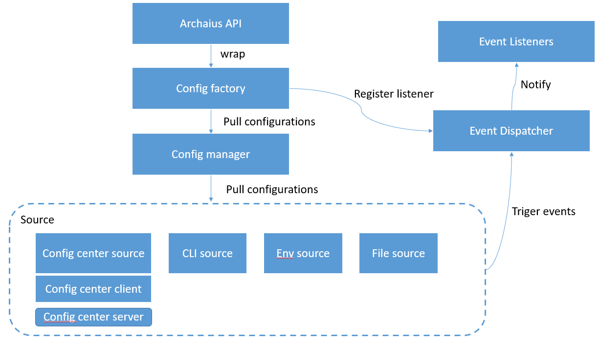

### go-archaius
[](https://travis-ci.org/go-chassis/go-archaius)



This is a light weight configuration management framework 
which helps to manage configurations in distributed system

The main objective of go archaius is to pull and sync the configuration from config-sources 

### Why use go-archaius
it is hard to manage configurations in a distributed system. 
archaius is able to put all configuration in distributed system together and manage them.
To make it simple to get the exact config you want in distributed system.
It also keeps watching configuration changes, and fire change event if value changes. 
so that you can easily implement a service 
which has hot-reconfiguration features. 
when you need to change configurations, your service has zero-down time.

### Conceptions 
#### Sources
Go-archaius can manage multiple sources at the same time.
Each source can holds same or different key value pairs. go-archaius keeps all 
the sources marked with their precedence, and merge key value based on precedence. 
in case if two sources have same key then key with higher precedence will be selected, 
and you can use archaius API to get its value

Here is the precedence list:

0: Config Center Source - use [config client](https://github.com/go-chassis/go-cc-client) to pull remote config server data into local

0: Test Source - it can be used in UT or AT scenario 

1: Memory Source - after process start, you can set key value in runtime.

2: Command Line Source - read the command lines arguments, 
while starting the process.

3: Environment Variable Source - read configuration in Environment variable.

4: Files Source - read files content and convert it into key values
based on the FileHandler you define

#### Dimension
It only works if you enable Config Center Source, as remote config server, 
it could has a lot of same key but value is different. so we use dimension to 
identify kv. by default you can not get other dimension kv, 
but after you enable config center source, you can get kv in other dimension by archaius API

#### Event management
You can register event listener by key(exactly match or pattern match) to watch value change.

#### File Handler
It works in File source, it decide how to convert your file to key value pairs. 
check [FileHandler](./sources/file-source/file_handler.go), 
currently we have 2 file handler implementation

#### archaius API
developer usually only use API to interact with archaius, check [API](archaius.go)

### Example: Manage local configurations 
Complete [example](https://github.com/go-chassis/go-archaius/tree/master/examples/file)

### Example: Manage key value change events
Complete [example](https://github.com/go-chassis/go-archaius/tree/master/examples/event)

### Example: Manage runtime configurations by remote config server
import a config client implementation
```go
import _ "github.com/go-chassis/go-cc-client/configcenter"
```
give config client to init config center source
```go
	ci := archaius.ConfigCenterInfo{
	//input your config center source config
	}
	//create config client 
	cc,_:=ccclient.NewClient("config_center",ccclient.Options{
    		ServerURI:"the address of config server endpoint",
    	})
	//manage local and remote key value at same time
	err = archaius.Init(
		archaius.WithRequiredFiles([]string{filename1}),
		archaius.WithOptionalFiles([]string{filename2}),
		archaius.WithConfigCenterSource(ci, cc),
	)
```

To check config server that archaius supports, 
access https://github.com/go-chassis/go-cc-client
