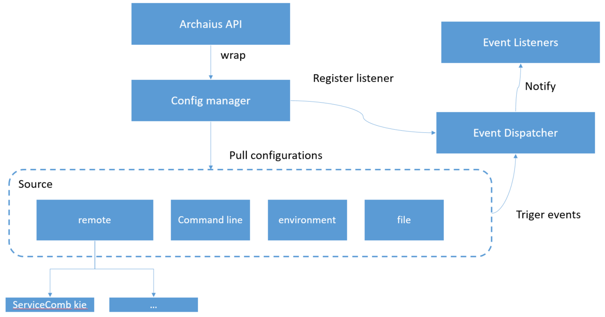

### go-archaius
[](https://travis-ci.org/go-chassis/go-archaius)
[](https://coveralls.io/github/go-chassis/go-archaius)


This is a light weight configuration management framework 
which helps to manage configurations in distributed system

The main objective of go archaius is to pull and sync the configuration from multiple sources 

### Why use go-archaius
it is hard to manage configurations in a distributed system. 
archaius is able to put all configuration in distributed system together and manage them.
To make it simple to get the exact config you want in distributed system.
It also keeps watching configuration changes, and fire change event if value changes. 
so that you can easily implement a service 
which has hot-reconfiguration features. 
when you need to change configurations, your service has zero-down time.

### Conceptions 
#### Sources
Go-archaius can manage multiple sources at the same time.
Each source can holds same or different key value pairs. go-archaius keeps all 
the sources marked with their precedence, and merge key value based on precedence. 
in case if two sources have same key then key with higher precedence will be selected, 
and you can use archaius API to get its value

Here is the precedence list:

0: remote source - use [config client](https://github.com/go-chassis/go-chassis-config) to pull remote config server data into local

1: Memory source - after process start, you can set key value in runtime.

2: Command Line source - read the command lines arguments, while starting the process.

3: Environment Variable source - read configuration in Environment variable.

4: Files source - read files content and convert it into key values based on the FileHandler you define

#### Dimension
It only works if you enable remote source, as remote server, 
it could has a lot of same key but value is different. so we use dimension to 
identify kv.  you can also get kv in other dimension by add new dimension

#### Event management
You can register event listener by key(exactly match or pattern match) to watch value change.

#### File Handler
It works in File source, it decide how to convert your file to key value pairs. 
check [FileHandler](source/util/file_handler.go), 
currently we have 2 file handler implementation

#### archaius API
developer usually only use API to interact with archaius, check [API](archaius.go).

To init archaius 
```go
archaius.Init()
```
when you init archaius you can decide what kind of source should be enable, 
required file slice was given, archaius checks file existing and add them into file source, if not exist, init fails, 
below example also enables env and mem sources.
```go
	err := archaius.Init(
		archaius.WithRequiredFiles([]string{filename1}),
		archaius.WithOptionalFiles([]string{filename2}),
		archaius.WithENVSource(),
		archaius.WithMemorySource())
```

### Put value into archaius
Notice, key value will be only put into memory source, it could be overwritten by remote config
```go
archaius.Set("interval", 30)
archaius.Set("ttl", "30s")
archaius.Set("enable", false)
```

### Read config files
if you have a yaml config
```yaml
some:
  config: 1
ttl: 30s
```
after adding file
```go
archaius.AddFile("/etc/component/xxx.yaml")
```

you can get value 

```go
ttl := archaius.GetString("ttl", "60s")
i := archaius.GetInt("some.config", "")
```

by default archaius only support yaml files, but you can extend file handler to handle file in other format,
for example we only consider file name as a key, content is the value.
```go
archaius.AddFile("xxx.txt", archaius.WithFileHandler(util.FileHandler(util.UseFileNameAsKeyContentAsValue))
```

you can get value 
```go
v := archaius.GetString("/etc/component/xxx.txt", "")
```

### Enable remote source
import a config client implementation
```go
import _ "github.com/go-chassis/go-chassis-config/servicecomb"
```
set config client to init config center source
```go
	ci := archaius.RemoteInfo{
	//input your remote source config
	}
	//create config client 
	cc,_:=ccclient.NewClient("servicecomb-kie",ccclient.Options{
    		ServerURI:"the address of config server endpoint",
    	})
	//manage local and remote key value at same time
	err = archaius.Init(
		archaius.WithRequiredFiles([]string{filename1}),
		archaius.WithOptionalFiles([]string{filename2}),
		archaius.WithRemoteSource(ci, cc),
	)
```

To check config server that archaius supports, 
access https://github.com/go-chassis/go-chassis-config

### Example: Manage local configurations 
Complete [example](https://github.com/go-chassis/go-archaius/tree/master/examples/file)

### Example: Manage key value change events
Complete [example](https://github.com/go-chassis/go-archaius/tree/master/examples/event)

